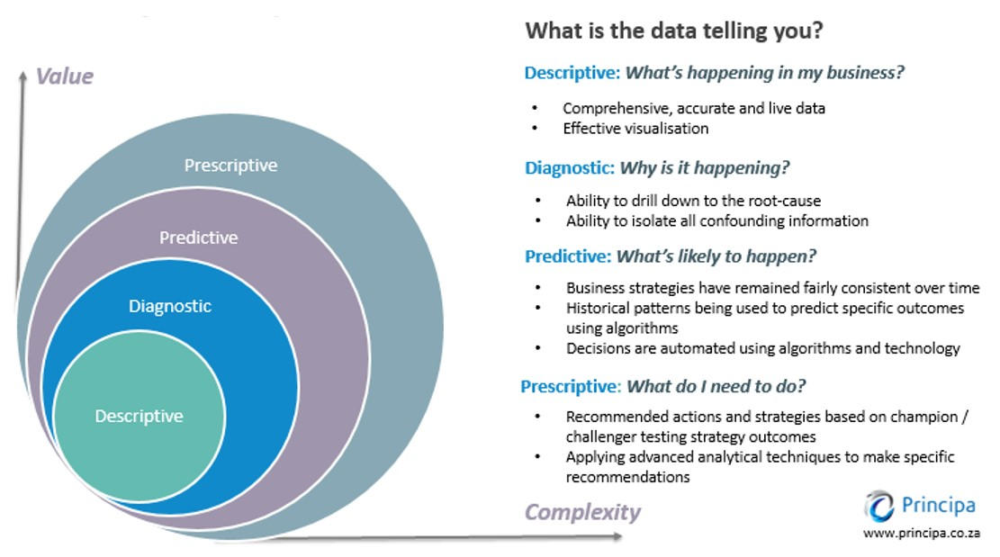
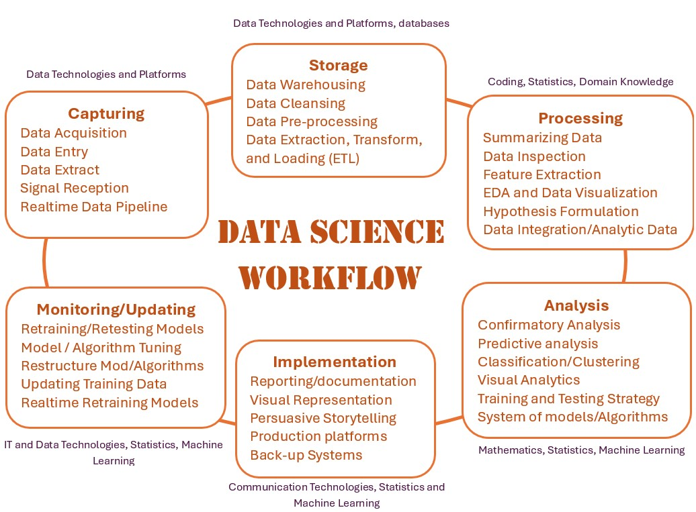

```{=html}

<style type="text/css">

/* Cascading Style Sheets (CSS) is a stylesheet language used to describe the presentation of a document written in HTML or XML. it is a simple mechanism for adding style (e.g., fonts, colors, spacing) to Web documents. */

h1.title {  /* Title - font specifications of the report title */
  font-size: 24px;
  color: DarkRed;
  text-align: center;
  font-weight: bold;
  font-family: "Gill Sans", sans-serif;
}
h4.author { /* Header 4 - font specifications for authors  */
  font-size: 20px;
  font-family: system-ui;
  color: DarkRed;
  text-align: center;
}
h4.date { /* Header 4 - font specifications for the date  */
  font-size: 18px;
  font-family: system-ui;
  color: DarkBlue;
  font-weight: bold;
  text-align: center;
}
h1 { /* Header 1 - font specifications for level 1 section title  */
    font-size: 20px;
    font-weight: bold;
    font-family: system-ui;
    color: navy;
    text-align: left;
}
h2 { /* Header 2 - font specifications for level 2 section title */
    font-size: 18px;
    font-family: "Times New Roman", Times, serif;
    font-weight: bold;
    color: navy;
    text-align: left;
}

h3 { /* Header 3 - font specifications of level 3 section title  */
    font-size: 16px;
    font-family: "Times New Roman", Times, serif;
    font-weight: bold;
    color: navy;
    text-align: left;
}

h4 { /* Header 4 - font specifications of level 4 section title  */
    font-size: 18px;
    font-family: "Times New Roman", Times, serif;
    color: darkred;
    text-align: left;
}

body { background-color:white; }

.highlightme { background-color:yellow; }

p { background-color:white; }

</style>
```


```{r setup, include=FALSE}
options(repos = list(CRAN="http://cran.rstudio.com/"))
# code chunk specifies whether the R code, warnings, and output 
# will be included in the output files.
if (!require("knitr")) {
   install.packages("knitr")
   library(knitr)
}

knitr::opts_chunk$set(echo = TRUE,       
                      warning = FALSE,   
                      result = TRUE,   
                      message = FALSE,
                      comment = NA)
```


\

# Introduction

This note outlines the relatively new interdisciplinary field of **data science** which combines mathematics and statistics, computer science, data and communication technologies, and domain knowledge.  


**What Is Data Science?** <https://aws.amazon.com/what-is/data-science/#:~:text=Data%20science%20is%20an%20umbrella,%2C%20mathematics%2C%20and%20statistical%20analysis.>

Data science is a multidisciplinary field that combines principles and practices from the fields of mathematics, statistics, computer science, and computer engineering to analyze large amounts of data. The data in data science projects could be text, audio, video, image, etc. Data science projects address questions like what happened, why it happened, what will happen, and what can be done with the results.


**History of Data Science**


While the term data science is not new, the meanings and connotations have changed over time. The word first appeared in the ’60s as an alternative name for statistics.

* **1990s and early 2000s**: We can clearly see that data science has emerged as a recognized and specialized field. Several data science academic journals began to circulate, and data science proponents like Jeff Wu and William S. Cleveland continued to help develop and expound upon the necessity and potential of data science.

* **2005**: Big data enters the scene. New data technologies Hadoop, Sparks, Cassandra, etc are capable of processing **big data**. 

* **2014**: Due to the increasing importance of data, and organizations’ interest in finding patterns and making better business decisions, demand for data scientists began to see dramatic growth in different parts of the world.

* **2015**: Machine learning, deep learning, and Artificial Intelligence (AI) officially enter the realm of data science. These technologies have driven innovations over the past decade 

* **2018**: New regulations in the field are perhaps one of the biggest aspects of the evolution of data science.

* **2020s**: We are seeing additional breakthroughs in AI, machine learning, and an ever-more-increasing demand for qualified professionals.


**Data Science Role Outlook**: The US Labor Statistics recently released a job outlook in data science and statistics.
<https://www.bls.gov/ooh/math/data-scientists.htm#:~:text=Data%20scientists%20typically%20do%20the,and%20update%20algorithms%20and%20models>


# What Can Data Science Do? 

\

## What Can Data Science Do?

Data Science is a powerful field that can provide valuable insights and drive decision-making across numerous industries. Here are some of the things that data science can do:

* **Identify Patterns and Trends** 

Using statistical techniques to find patterns and trends in datasets. This can help uncover insights that were previously hidden.

* **Forecast Outcomes**

By creating algorithms and data models, data scientists can predict future outcomes based on historical data.

* **Improve Data Quality** 

Using machine learning techniques to improve the quality of data or product offerings.

* **Guide Decision Making**

The insights derived from data science can be used to guide decision-making and strategic planning in an organization.

* **Communicate Recommendations** 

Data scientists and statisticians play a crucial role in communicating their findings to other teams and senior staff. This helps the organization to make informed decisions.


* **Stay on Top of Innovations** 

Data scientists and statisticians need to stay updated with the latest innovations in the field of data science.

* **Deploy Data Tools** 

Using data tools such as Python, R, SAS, or SQL for data analysis.

\

## Types of Analyses in Data Science 


```{r fig.align='center', out.width="80%"}

```


**1. Descriptive analysis**

Descriptive analysis examines data to gain insights into what happened or what is happening in the data environment. The primary tools used in *descriptive analysis* are EDA and basic statistical charts. It is characterized by data visualizations such as pie charts, bar charts, line graphs, tables, or generated narratives. 

**Example**: A flight booking service may record data like the number of tickets booked each day. Descriptive analysis will reveal booking spikes, booking slumps, and high-performing months for this service.


**2. Diagnostic analysis**

Diagnostic analysis is a deep-dive or detailed data examination to understand why something happened. It is characterized by techniques such as drill-down, data discovery, data mining, and correlations. Multiple data operations and transformations may be performed on a given data set to discover unique patterns in each of these techniques.


**Example**: The flight service might drill down on a particularly high-performing month to better understand the booking spike. This may lead to the discovery that many customers visit a particular city to attend a monthly sporting event.

**3. Predictive analysis**

Predictive analysis uses historical data to make accurate forecasts about data patterns that may occur in the future. It is characterized by techniques such as machine learning, forecasting, pattern matching, and predictive modeling. In each of these techniques, computers are trained to reverse engineer causality connections in the data.

**Example**: The flight service team might use data science to predict flight booking patterns for the coming year at the start of each year. The computer program or algorithm may look at past data and predict booking spikes for certain destinations in May. Having anticipated their customer’s future travel requirements, the company could start targeted advertising for those cities in February.


**4. Prescriptive analysis**

Prescriptive analytics takes predictive data to the next level. It not only predicts what is likely to happen but also suggests an optimum response to that outcome. It can analyze the potential implications of different choices and recommend the best course of action. It uses visual analytics, simulation, complex event processing, neural networks, and recommendation engines from machine learning.         


**Example**: Prescriptive analysis could look at historical marketing campaigns to maximize the advantage of the upcoming booking spike. A data scientist could project booking outcomes for different levels of marketing spend on various marketing channels. These data forecasts would give the flight booking company greater confidence in their marketing decisions.


\  


## Data Science Process

A business problem typically initiates the data science process. A data scientist will work with business stakeholders to understand what business needs. 


```{r fig.align='center', out.width="80%"}

```

\

Once the problem has been defined, the data scientist may solve it using the OSEMN data science process:

* **Capturing**

Data can be pre-existing, newly acquired, or a data repository downloadable from the internet. Data scientists can extract data from internal or external databases, company CRM software, web server logs, and social media or purchase it from trusted third-party sources.

* **Storage and ETL**

Data scrubbing, or data cleaning, is the process of standardizing the data according to a predetermined format. It includes handling missing data, fixing data errors, and removing any data outliers. Some examples of data scrubbing are:· 

Changing all date values to a common standard format.·  

Fixing spelling mistakes or additional spaces.·  
Fixing mathematical inaccuracies or removing commas from large numbers.

* **Data Processing and EDA**

Data exploration is preliminary data analysis that is used for planning further data modeling strategies. Data scientists gain an initial understanding of the data using descriptive statistics and data visualization tools. Then they explore the data to identify interesting patterns that can be studied or actioned.      

* **Modeling and**

Software and machine learning algorithms are used to gain deeper insights, predict outcomes, and prescribe the best course of action. Machine learning techniques like association, classification, and clustering are applied to the training data set. The model might be tested against predetermined test data to assess result accuracy. The data model can be fine-tuned many times to improve result outcomes. 

* **Reporting and Deployment**

Data scientists work together with analysts and businesses to convert data insights into action. They make diagrams, graphs, and charts to represent trends and predictions. Data summarization helps stakeholders understand and implement results effectively.


* **Monitoring and Updating**


## Technical Tools for Data Science


Data science professionals use computing systems to follow the data science process. The top techniques used by data scientists are:

* **Classification**

Classification is the sorting of data into specific groups or categories. Computers are trained to identify and sort data. Known data sets are used to build decision algorithms in a computer that quickly processes and categorizes the data. For example:·  

Sort products as popular or not popular·  
Sort insurance applications as high risk or low risk·  
Sort social media comments into positive, negative, or neutral.
Data science professionals use computing systems to follow the data science process. 

* **Regression**

Regression is the method of finding a relationship between two seemingly unrelated data points. The connection is usually modeled around a mathematical formula and represented as a graph or curve. When the value of one data point is known, regression is used to predict the other data point. For example:·  

The rate of spread of air-borne diseases.· 
 The relationship between customer satisfaction and the number of employees.·  
The relationship between the number of fire stations and the number of injuries due to fire in a particular location. 

* **Clustering**

Clustering is the method of grouping closely related data together to look for patterns and anomalies. Clustering is different from sorting because the data cannot be accurately classified into fixed categories. Hence the data is grouped into most likely relationships. New patterns and relationships can be discovered with clustering. For example: ·  

Group customers with similar purchase behavior for improved customer service.·  
Group network traffic to identify daily usage patterns and identify a network attack faster.  
Cluster articles into multiple different news categories and use this information to find fake news content.
The basic principle behind data science techniques

\

## What Data Science Cannot Do?

While data science is a powerful tool, it does have its limitations. Here are some things that data science cannot do:

* **Replace Subject Matter Experts**: Data science can provide insights and help make informed decisions, but it cannot replace the expertise and judgment of subject matter experts.

* **Guarantee 100% Accuracy**: Predictive models in data science are based on probabilities and are therefore not always 100% accurate.

* **Eliminate Bias**: If the data used in data science is biased, the results will also be biased. Data scientists can try to minimize bias, but it cannot be completely eliminated.

* **Replace Data Preparation**: Data science cannot bypass the data preparation stage. Raw data often needs to be cleaned and transformed before it can be used for analysis.

* **Automate Data Collection**: While data science can analyze and draw insights from data, it cannot automate the process of data collection.

* **Solve All Problems**: Data science is a tool that can help solve many problems, but not all. Some problems may require other approaches or tools.

* **Work Without Clear Goals**: Data science is most effective when there are clear goals and questions to answer. Without these, it can be difficult to extract meaningful insights from the data.

* **Ensure Ethical Use of Data**: Data science itself cannot ensure the ethical use of data. This is the responsibility of the data scientists and the organization they work for.

* **Function Without Infrastructure**: Data science requires a certain level of infrastructure, including data storage and processing capabilities.

* **Replace Human Intuition and Creativity**: While data science can provide valuable insights, it cannot replace human intuition and creativity.


\

# Technologies for Data Science

\

## Computing Technologies

Data science practitioners work with complex technologies such as:

* **ML Tools**: Machine learning models and related software are used for predictive and prescriptive analysis.

* **Cloud computing**: Cloud technologies have given the flexibility and processing power required for advanced data analytics.

* **Internet of things**: IoT refers to various devices that can automatically connect to the Internet. These devices collect data for data science initiatives. They generate massive data which can be used for data mining and data extraction.

* **High-Performance computing**: Quantum computers can perform complex calculations at high speed. Skilled data scientists use them for building complex quantitative algorithms.


\

## Data Science Communication Technologies

Data Science Communication involves the use of various technologies to effectively communicate data insights. Here are some key technologies used in this field:

* **Data Visualization Tools**

Tools like Tableau, Matplotlib in Python, and rich graphical libraries in R are used to create visual representations of data, making it easier to identify patterns, trends, and insights. Some powerful emerging interactive technologies are also available due to the recent development of various software programs such as `plotly` and `RShiny`. These interactive technologies make visualization and analytics easier to extract hidden information from data through analytics.  

* **Computational Notebooks**

RMarkdown/R Notebook and Jupyter Notebook are widely used for data science communication. They allow for the creation of documents that combine live code (such as Python or R) with visualizations and narrative texts.

* **Markdown and LaTeX**: 

Markdown is used for formatting text, while LaTeX is used for creating high-quality technical and scientific documentation. Both can be used in RMarkdown/R Notebook and Jupyter Notebook to create well-structured, readable documents. RMarkdown is also a powerful web development tool to generate web-based reports with both static and interactive visual content.

* **GitHub - Version Control and Collaboration** 

GitHub is a platform for version control and collaboration. It allows data scientists to work together and share their code and notebooks. It is also convenient to host static web pages 

* **Presentation Software and technologies**

Tools like our old friends Microsoft PowerPoint or Google Slides are often used to present data science findings to non-technical stakeholders. 

* **Platforms for Technical Communication**

There are several key elements of technical communication that require integrating different platforms to accomplish effective technical communication.

**Clarity and Conciseness**: Technical communication aims to make complex information clear and easily understandable for the target audience. This involves using straightforward language, avoiding unnecessary jargon, and organizing information logically to convey information efficiently.

**Purpose**: Technical communication serves various purposes, such as informing, instructing, persuading, or documenting. The purpose guides the structure and content of the communication.

**Document Design**: Effective technical communication often involves thoughtful document design. This includes the use of headings, lists, graphics, and other visual elements to enhance comprehension and make the information more accessible.

**Medium Selection**: Technical communication can take various forms, including written documents, presentations, videos, and interactive content. Choosing the appropriate medium for the message and audience is crucial.

Platforms like Slack or Microsoft Teams are used for real-time communication within a data science team. Other platforms such as GitHub, Anaconda, RStudio, SAS Viya, etc. are    


* **Data Science Platforms**

A data science platform is a software solution that enables data scientists to effectively plan strategies, discover actionable insights from interpreting data, and communicate their insights across the entire organization—all within a single environment. They also allow for collaborative data science work and include features for sharing and presenting data science results. Popular platforms include AWS Sage Maker, Microsoft Azure ML, Anaconda, etc. 

\

# Fields Related to Data Science

Data science is an all-encompassing term for other data-related roles and fields. We look at briefly these areas. In addition, we also point out some of the challenges and some ML-specific tools.

\

## Data Science and Related Areas

We have mentioned that data science as an emerging multidisciplinary field is built on four pillars: Mathematics and Statistics, Computational Science (databases and programming), interactive technologies and strategies for communication, and domain knowledge. We next briefly describe the relationship between data science and the related fields. 

* *data science and data analytics*

While the terms may be used interchangeably, data analytics is a subset of data science. Data science is an umbrella term for all aspects of data processing—from the collection to modeling to insights. On the other hand, data analytics is mainly concerned with statistics, mathematics, and statistical analysis. It focuses on only data analysis, while data science is related to the bigger picture around organizational data. In most workplaces, data scientists and data analysts work together towards common business goals. A data analyst may spend more time on routine analysis, providing regular reports. A data scientist may design the way data is stored, manipulated, and analyzed. Simply put, a data analyst makes sense out of existing data, whereas a data scientist creates new methods and tools to process data for use by analysts.

* *data science and business analytics*

While there is an overlap between data science and business analytics, the key difference is the use of technology in each field. Data scientists work more closely with data technology than business analysts. Business analysts bridge the gap between business and IT. They define business cases, collect information from stakeholders, or validate solutions. Data scientists, on the other hand, use technology to work with business data. They may write programs, apply machine learning techniques to create models and develop new algorithms. Data scientists not only understand the problem but can also build a tool that provides solutions to the problem. It’s not unusual to find business analysts and data scientists working on the same team. Business analysts take the output from data scientists and use it to tell a story that the broader business can understand.

* *data science and data engineering*

Data engineers build and maintain the systems that allow data scientists to access and interpret data. They work more closely with underlying technology than a data scientist. The role generally involves creating data models, building data pipelines, and overseeing extract, transform, and load (ETL). Depending on the organization's setup and size, the data engineer may also manage related infrastructure like big-data storage, streaming, and processing platforms like Amazon S3.Data scientists use the data that data engineers have processed to build and train predictive models. Data scientists may then hand over the results to the analysts for further decision-making.

* *data science and machine learning*

Machine learning is the science of training machines to analyze and learn from data the way humans do. It is one of the methods used in data science projects to gain automated insights from data. Machine learning engineers specialize in computing, algorithms, and coding skills specific to machine learning methods. Data scientists might use machine learning methods as a tool or work closely with other machine learning engineers to process data.

* *data science and statistics*

Statistics is a mathematically-based field that seeks to collect and interpret quantitative data. In contrast, data science is a multidisciplinary field that uses scientific methods, processes, and systems to extract knowledge from data in various forms. Data scientists use methods from many disciplines, including statistics. However, the fields differ in their processes and the problems they study.  


## Data Science Tools on AWS

AWS has a range of tools to support data scientists around the globe:

### *Data storage*

For data warehousing, **Amazon Redshift** can run complex queries against structured or unstructured data. Analysts and data scientists can use AWS Glue to manage and search for data. AWS Glue automatically creates a unified catalog of all data in the data lake, with metadata attached to make it discoverable.

### *Machine learning*

**Amazon SageMaker** is a fully-managed machine learning service that runs on the **Amazon Elastic Compute Cloud (EC2)**. It allows users to organize data, build, train, and deploy machine learning models, and scale operations.

### *Analytics*

**Amazon Athena** is an interactive query service that makes it easy to analyze data in **Amazon S3** or Glacier. It is fast, serverless, and works using standard SQL queries.

**Amazon Elastic MapReduce (EMR)** processes big data using servers like Spark and Hadoop.

**Amazon Kinesis** allows aggregation and processing of streaming data in real time. It uses website clickstreams, application logs, and telemetry data from IoT devices. 
 
**Amazon OpenSearch** allows search, analysis, and visualization of petabytes of data.


## Data Science challenges


* *Multiple data sources*

Different types of apps and tools generate data in various formats. Data scientists have to clean and prepare data to make it consistent. This can be tedious and time-consuming.

* *Understanding the business problem*

Data scientists have to work with multiple stakeholders and business managers to define the problem to be solved. This can be challenging—especially in large companies with multiple teams that have varying requirements.

* *Elimination of bias*

Machine learning tools are not completely accurate, and some uncertainty or bias can exist as a result. Biases are imbalances in the training data or prediction behavior of the model across different groups, such as age or income bracket. For instance, if the tool is trained primarily on data from middle-aged individuals, it may be less accurate when making predictions involving younger and older people. The field of machine learning provides an opportunity to address biases by detecting them and measuring them in the data and model.
