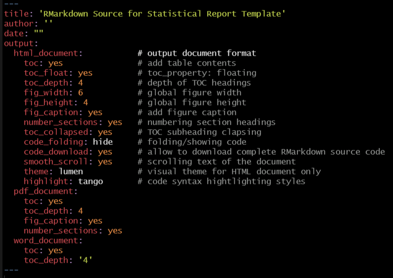
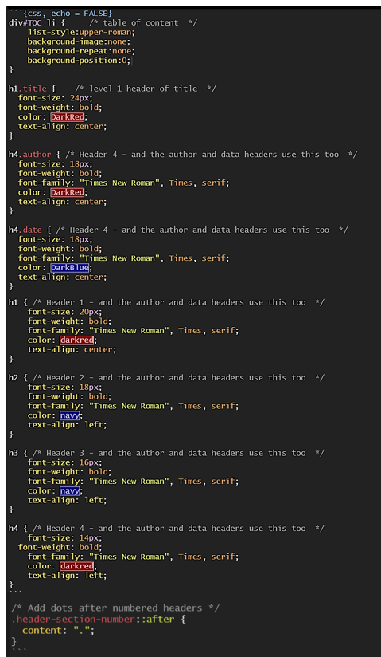
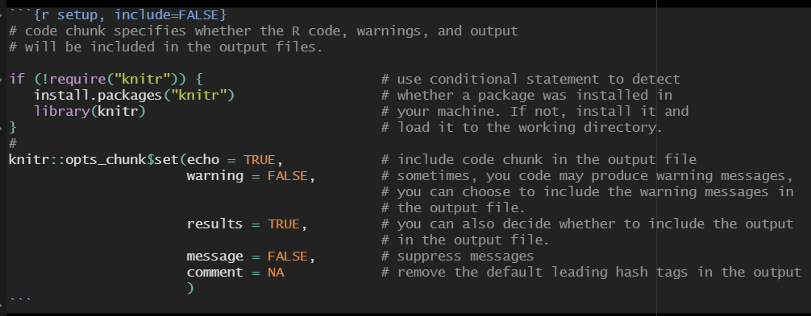
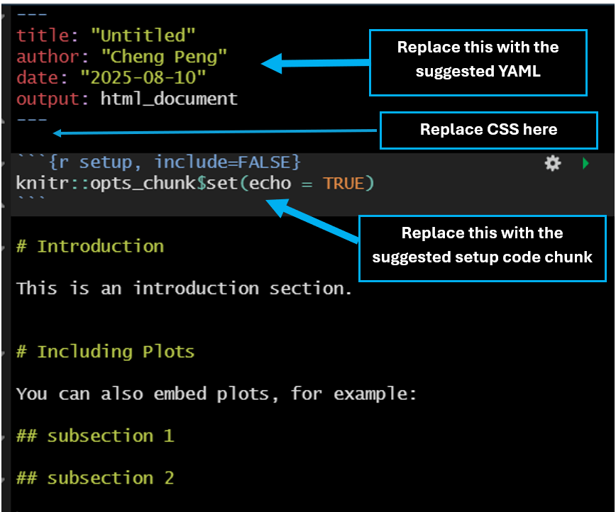

```{css, echo = FALSE}
div#TOC li {     /* table of content  */
    list-style:upper-roman;
    background-image:none;
    background-repeat:none;
    background-position:0;
}

h1.title {    /* level 1 header of title  */
  font-size: 24px;
  font-weight: bold;
  color: DarkRed;
  text-align: center;
}

h4.author { /* Header 4 - and the author and data headers use this too  */
  font-size: 18px;
  font-weight: bold;
  font-family: "Times New Roman", Times, serif;
  color: DarkRed;
  text-align: center;
}

h4.date { /* Header 4 - and the author and data headers use this too  */
  font-size: 18px;
  font-weight: bold;
  font-family: "Times New Roman", Times, serif;
  color: DarkBlue;
  text-align: center;
}

h1 { /* Header 1 - and the author and data headers use this too  */
    font-size: 20px;
    font-weight: bold;
    font-family: "Times New Roman", Times, serif;
    color: darkred;
    text-align: center;
}

h2 { /* Header 2 - and the author and data headers use this too  */
    font-size: 18px;
    font-weight: bold;
    font-family: "Times New Roman", Times, serif;
    color: navy;
    text-align: left;
}

h3 { /* Header 3 - and the author and data headers use this too  */
    font-size: 16px;
    font-weight: bold;
    font-family: "Times New Roman", Times, serif;
    color: navy;
    text-align: left;
}

h4 { /* Header 4 - and the author and data headers use this too  */
    font-size: 14px;
  font-weight: bold;
    font-family: "Times New Roman", Times, serif;
    color: darkred;
    text-align: left;
}

/* Add dots after numbered headers */
.header-section-number::after {
  content: ".";
}
```

```{r setup, include=FALSE}
# code chunk specifies whether the R code, warnings, and output 
# will be included in the output files.

if (!require("knitr")) {                      # use conditional statement to detect
   install.packages("knitr")                  # whether a package was installed in
   library(knitr)                             # your machine. If not, install it and
}                                             # load it to the working directory.
#
knitr::opts_chunk$set(echo = TRUE,            # include code chunk in the output file
                      warning = FALSE,        # sometimes, you code may produce warning messages,
                                              # you can choose to include the warning messages in
                                              # the output file. 
                      results = TRUE,         # you can also decide whether to include the output
                                              # in the output file.
                      message = FALSE,        # suppress messages 
                      comment = NA            # remove the default leading hash tags in the output
                      )   
```


Throughout the semester, we will use a custom format for reporting analysis results instead of the default RMarkdown template. This short note explains the source code of the suggested version of the analytic report. The template source has three components:

# YAML Header

In RMarkdown, the **YAML header** (also called the YAML metadata block) is a section at the top of an **.Rmd** file that defines document settings, such as output format, title, author, and other customization options. It uses YAML (YAML **Ain't** Markup Language) syntax, enclosed between **---** lines.


```{r echo = FALSE, fig.align='center', out.width="80%"}

```

# CSS

**CSS (Cascading Style Sheets)**- is a stylesheet language used to control the presentation and layout of web pages. It works alongside HTML (which defines structure) and JavaScript (which adds interactivity) to create visually appealing and responsive websites.


```{r echo = FALSE, fig.align='center', out.width="70%"}

```


# RMarkdown Setup Code Chunk

The RMarkdown setup code chunk is a special R code block used to configure global settings for your entire RMarkdown document. It typically appears at the beginning of your document (after the YAML header).

* **Set Default Options for All Chunks**: Controls how code/output behaves throughout the document using knitr::opts_chunk$set().

* **Load Required Packages**: Preload libraries so they're available for all subsequent chunks.

* **Define Variables/Functions**:  Initialize objects or helper functions used across the document.

* **Configure Rendering Behavior**: Adjust caching, figure formats, or error handling globally.


```{r echo = FALSE, fig.align='center', out.width="90%"}

```


# Complete Template Source

After opening an R Markdown document, you should delete the default simple YAML and the initial setup code chunk. Then, copy and paste all three components mentioned above (YAML, CSS, and the setup chunk). Whenever you use a new package, include it in the setup code chunk using the suggested conditional statement.


```{r echo = FALSE, fig.align='center', out.width="60%"}

```


