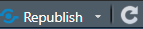

```{css, echo = FALSE}
div#TOC li {     /* table of content  */
    list-style:upper-roman;
    background-image:none;
    background-repeat:none;
    background-position:0;
}

h1.title {    /* level 1 header of title  */
  font-size: 24px;
  font-weight: bold;
  color: DarkRed;
  text-align: center;
}

h4.author { /* Header 4 - and the author and data headers use this too  */
  font-size: 18px;
  font-weight: bold;
  font-family: "Times New Roman", Times, serif;
  color: DarkRed;
  text-align: center;
}

h4.date { /* Header 4 - and the author and data headers use this too  */
  font-size: 18px;
  font-weight: bold;
  font-family: "Times New Roman", Times, serif;
  color: DarkBlue;
  text-align: center;
}

h1 { /* Header 1 - and the author and data headers use this too  */
    font-size: 20px;
    font-weight: bold;
    font-family: "Times New Roman", Times, serif;
    color: darkred;
    text-align: center;
}

h2 { /* Header 2 - and the author and data headers use this too  */
    font-size: 18px;
    font-weight: bold;
    font-family: "Times New Roman", Times, serif;
    color: navy;
    text-align: left;
}

h3 { /* Header 3 - and the author and data headers use this too  */
    font-size: 16px;
    font-weight: bold;
    font-family: "Times New Roman", Times, serif;
    color: navy;
    text-align: left;
}

h4 { /* Header 4 - and the author and data headers use this too  */
    font-size: 14px;
  font-weight: bold;
    font-family: "Times New Roman", Times, serif;
    color: darkred;
    text-align: left;
}

/* Add dots after numbered headers */
.header-section-number::after {
  content: ".";
}
```

```{r setup, include=FALSE}
# code chunk specifies whether the R code, warnings, and output 
# will be included in the output files.

if (!require("knitr")) {                      # use conditional statement to detect
   install.packages("knitr")                  # whether a package was installed in
   library(knitr)                             # your machine. If not, install it and
}                                             # load it to the working directory.
#
knitr::opts_chunk$set(echo = TRUE,            # include code chunk in the output file
                      warning = FALSE,        # sometimes, you code may produce warning messages,
                                              # you can choose to include the warning messages in
                                              # the output file. 
                      results = TRUE,         # you can also decide whether to include the output
                                              # in the output file.
                      message = FALSE,        # suppress messages 
                      comment = NA            # remove the default leading hash tags in the output
                      )   
```

\

\

# Assignment Preparation

All assignments must be prepared in R Markdown. The dataset used for your project must be read directly from a URL in RMarkdown so that I can run your source file on my machine without making any modifications. If your dataset is not available on a website, you may upload the file to your GitHub repository and read it directly from there. We will outline the steps to configure your GitHub repository and locate the correct URL for your dataset in a subsequent section.

A well-structured statistical or data science report ensures clarity, reproducibility, and actionable insights. Below is a standard structure, adaptable based on the audience (technical vs. non-technical) and project scope

* **Introduction**
  + **Problem statement**: What question(s) are you addressing?
  + **Objectives**: Goals of the analysis (e.g., prediction, inference, exploration).
  + **Background**: Context (industry, prior work, why the problem matters).
  + **Data source(s)**: How/where was data collected?

* **Data Description**
  + **Dataset overview**: Size (rows, columns), variables, time range.
  + **Variables**: List with descriptions (include units, measurement scales).
  + **Data collection methods**: Sampling, biases, limitations.
  + **Ethical considerations**: Privacy, anonymization, biases.

* **Data Processing**
  + Handling missing values, outliers, and duplicates.
  + Transformations, scaling, etc.

* **Exploratory Data Analysis (EDA)**
  + Visualizations (distributions, correlations, trends).
  + Summary statistics.

* **Modeling approach**
  + Algorithms chosen (e.g., linear regression, random forest) and why.
  + Validation strategy (train-test split, cross-validation).
  + Performance metrics (e.g., RMSE, accuracy, AUC-ROC).

* **Results**
  + Key findings: Supported by visuals (tables, graphs).
  + Model performance: Metrics compared to benchmarks/baselines.
  + Statistical significance: p-values, confidence intervals (if applicable).
  + Limitations: Assumptions, caveats, or unexpected results.

* **Discussion**
  + Interpretation: What do the results mean in context?
  + Comparison to expectations: Hypotheses confirmed/rejected?
  + Broader implications: Business, scientific, or policy recommendations.
  + Failures/unanswered questions: What didn’t work? Why?

* **Conclusion & Recommendations**
  + Summary: Reiterate key takeaways.

* **References**
  + Citations for papers (if any).


# Assignment Submission

First of all, all assignments must be submitted to the D2L dropbox. Please don't send your report via email. To submit your report to D2L dropbox, go to D2L to submit your work: **Assessment => Assignments**.

* Two required files
  + **upload** the RMarkdown source file to Dropbox, and
  + **Copy the URL** of your published report and **paste it into the D2L dropbox** as <font color = "red">**\color{red}required for all assignments throughout the semester**.</font> 


# Publishing Report on RPubs


* Steps for publishing your HTML format report on RPubs
  + **Register an RPubs account** (<https://rpubs.com/>)
  + **Stay singed in** to your account
  + **Knit you RMarkdown report** to HTML format
  + **Click the RPubs publish icon**  on the top-right of your HTML document.
  + Select **RPubs**
  + Click **Publish**
  + **Add a title** of your report in the **title** field (this helps others find your report via search)
  + (Optional but recommended) **Add a brief description** summarizing your report.
  + **Enter a descriptive filename** to complete your report’s URL.
  + Click **Continue**
  + Your report will now be published in **RPubs**
  + **Copy the URL** of your published report and **paste it into the D2L dropbox** as <font color = "red">**\color{red}required for all assignments throughout the semester**.</font>
  
  
# Publishing Report on GitHub Repository


The following is a step-by-step guide to setting up a GitHub repository for a webpage and finding its accessible URL

* **Sign in to your GitHub account** 
  + Use my GitHub account `pengdsci` as an example.

* **Create a <font color = "red">New Repository</font>**
  + Click the `+` icon in the top-right corner and select **New repository**.
  + Name your repository: for example, `STA888`.
  + Choose Public (Private repos require a paid plan for GitHub Pages).
  + Check: Add a README file (optional but recommended).
  + Click Create repository.
  

* **Upload Data and Report Files**
  + To upload your first file to the repository, 
    - Go to **Quick setup**, click `uploading an existing file`
    - Drag and drop your files for batch uploading
  + To upload subsequent files
    - Click `+` next to the green button **<>Code** and select `Upload files`
    - Drag and drop the files you want to upload.

* **Create a Folder with a Repository**: Creating folders and sub-folders within a repository helps organize different types of files, such as images, data, and notes. To create a folder in a repository:
  + Click `+` next to the green button **<>Code** and select `Create new files`
  + In the `Name your file...` field, enter your folder name followed by **/** (e.g., `project/`) and hit **Enter**.
  + Add a keyword describing the folder’s purpose (e.g., `project-files`) in the field `Name your file...`
  + Click the green button labeled with **Commit change...** to finalize the folder creation.
  + Repeat these steps to create additional folders or sub-folders as needed.

* **Enable/Configure GitHub Pages**
  + Go to your repository’s **Settings** tab.
  + In the left sidebar, click **Pages**.
  + Under **Build and deployment**
    - Branch: click `None` drop down, select  **main** 
    - Folder: select the default `/ (root)`.
  + Click Save.

* **Find Your Accessible URL of the Repository**: 
  + Wait a few moments after you save the configurations in the above step, refresh the page, and you will see the URL of your repository under **GitHub Pages**: 
    - Your site is live at <font color = "blue">https://pengdsci.github.io/STA888/</font>.
  + If your repository has a file named `index.html`, this file will be displayed when visiting the URL. Otherwise, you will see a **404 error page**. This does not mean that you **set up** the page incorrectly. It simply means that you don’t have an HTML file named `index.html` in your repository.
  
  
* Once your repository is enabled/configured, you can locate the URLs of specific files. For illustration, we assume the repository is named **STA888** and your GitHub account is **pengdsci**.
  + **Example 1**: If a PDF file named `guidelines.pdf` is in the repository **STA888**, its URL would be:
<font color="blue">**https://pengdsci.github.io/STA888/guidelines.pdf**</font>.<font color="red">[this is only a hypothetical URL].</font>
  + **Example 2**: If an HTML report named `report01.html` is in a folder called `project`, its URL would be:
<font color="blue">**https://pengdsci.github.io/STA888/project/report01.html**</font>. <font color="red">[this is only a hypothetical URL].</font>
  + If you have created subfolders or nested subfolders, you can use the same pattern to locate the URL of a file within any specific folder or subfolder.

<ul>
<font color="red">Best Practices for Folder Structure</font>: Create a directory on your machine using the same **repository name** and **mirror** the folder structure from your GitHub repository. This will simplify future updates and new file creation.
</ul>  
  
  

  
  
  
  
  
  
  
  
  
  
  
  


