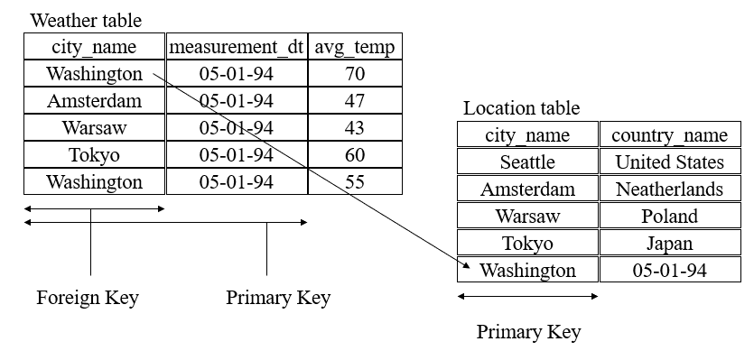
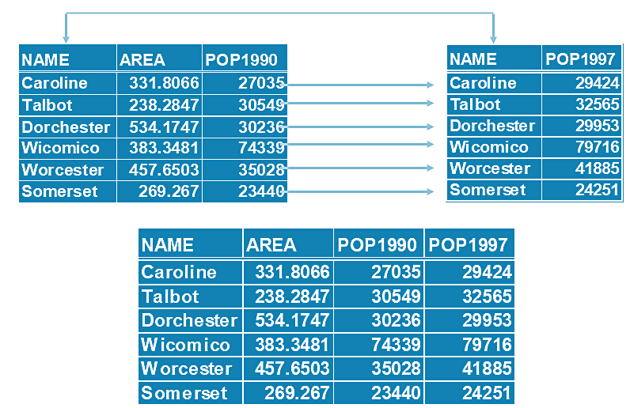
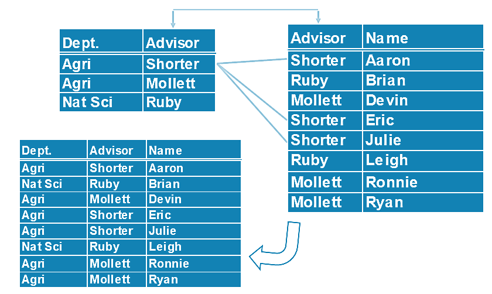
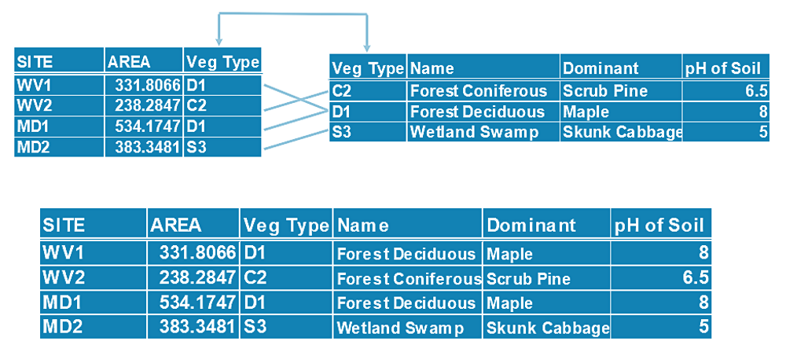

```{r setup, include=FALSE}
options(htmltools.dir.version = FALSE)
if (!require("knitr")) {
   install.packages("knitr")
   library(knitr)
}
if (!require("pander")) {
   install.packages("pander")
   library(pander)
}
if (!require("plotly")) {
   install.packages("plotly")
   library(plotly)
}
if (!require("ggplot2")) {
   install.packages("ggplot2")
   library(ggplot2)
}
knitr::opts_chunk$set(
                  fig.width=3, 
                  fig.height=3, 
                  fig.retina=12,
                  out.width = "100%",
                  cache = FALSE,
                  echo = TRUE,
                  message = FALSE, 
                  warning = FALSE,
                  hiline = TRUE
                  )
```


```{r xaringan-themer, include=FALSE, warning=FALSE}
library(xaringanthemer)
  style_duo_accent(primary_color = "#1F4257",
          secondary_color = "#380F2A",
          # fonts
          header_font_google = google_font("Martel"),
          text_font_google = google_font("Lato"),
          code_font_google = google_font("Fira Mono"))
```

class:inverse4, top

<h1 align="center"> Outlines</h1>
<BR>

<table>
<tr><td style = "font-size: 26px">

<li> Why we need database</li><br>
<li> Database Concept</li><br>
<li> Types of database models</li><br>
<li> Relational database</li>


</td><tr>
</table>
---


name: whyDB 
class: inverse1 center middle 

<h2 align = "center" style = "font-variant: small-caps;">Why Do We Need Databases? </h2>

---


name: DBMS

<h2 align = "center" style = "font-variant: small-caps;">Database Management System</h2>
<hr>
<BR>

* **Database Management System (DBMS)**: A collection of data (database) and programs to access that data. 


* **The goal of DBMS**: TO store, retrieve, and display information. 


* **Key characteristics of DBMS**:

  + performance, 
  + store large volume of database, 
  + share data (access), 
  + provide security (authorization), 
  + remove redundancy (normalization), and 
  + provide concurrent access (different users at the same time). 
---


name: why-database

<h2 align = "center" style = "font-variant: small-caps;">Why we need database?</h2>
<hr>
<br>

Without databases, there will be no 

* **Google Maps and GPS**: These services depend on vast amounts of geographical data stored in databases to provide accurate directions and location information.

* **Social Media Platforms**: Sites like Facebook, Twitter, and Instagram use databases to store user profiles, posts, and interactions.

* **E-commerce Websites**: Online stores like Amazon use databases to manage product inventories, customer orders, and transaction histories.

* **Banking Systems**: Databases are essential for tracking account balances, transactions, and financial records.

* **Healthcare Systems**: Patient records, treatment histories, and medical research data are all stored in databases.

---


name: DataAbstraction


<h2 align = "center" style = "font-variant: small-caps;">Data Abstraction</h2>
<br>

* **Physical level**: Describe how the data are actually stored (words or bytes)

* **Conceptual level**: Describe what data are actually stored in the database (Structure). It gives a Schematic representation of phenomena 

* **View level**: Describe only a part of the entire database. Many users of the database may be concerned with a subset of information. The system may provide many views for the same database

---


name:dataModels

<h2 align = "center" style = "font-variant: small-caps;">Data Models </h2>
<br>

Different data models define different databases. The common data models are

* **Object oriented model**

* **Hierarchical model**

* **Network model**

* **Relational model**

We will only focus on **relational database** defined based on relational data model.

---


name: relationalDatabase

<h2 align = "center" style = "font-variant: small-caps;">Reasons to use  Relational Model </h2>
<br>


* **Independence of the physical data storage and logical database structure**. Results users do not need to understand the underlying physical layout of the data to access data from a logical structure, such as a table

* **Variable and easy access to all data**. Results in access to data are not predefined as in hierarchical databases in which users must understand and navigate through the hierarchy to retrieve data

* **Flexible in database design**. i.e complex objects are expressed as simple tables and relationships

* *Applying relational design methods reduces data redundancy (Normalization) and storage requirements*

---


name: RDBMS1

<h2 align = "center" style = "font-variant: small-caps;">Relational Database Management System (RDBMS) </h2>
<br>

* **Aspects of an RDBMS**

  + **Structures**: Well defined objects
  + **Operations**: Clearly defined actions
  + **Integrity Rules**: Rules that control which operations are allowed on the data and structures of the database


* **Components of a Relational Database**

  + **Table**: collection of rows all containing the same columns
  + **Row**: Horizontal components of a table. Consists of values for each column. Each row is equivalent to a record
  + **Column**: Vertical component of a table. Each column in the record is often referred to as a field

---


name: RDBMS2

<h2 align = "center" style = "font-variant: small-caps;">Relational Database Management System (RDBMS) </h2>


* **Relational Database Rules**
  + Each column in a table **must be unique**
  + The order of the rows in a table **is not meaningful**
  + The order of the columns in a table **is not meaningful**
  + All data in a column **must be the same type**
  + Every table has a **primary key**, each column in the primary key **must have a value**. 


* **Primary Key and Foreign Key**

  + Relational database use **primary keys** and **foreign keys** to allow mapping of information from one table to another 
  
  + A **foreign key** is a column or group of columns in a table whose value matches those of the **primary key** of another table
  
  + Values in the **primary key** column must be unique e.g. social security number (SSN) 

  + **Referential Integrity** refers to the integrity of the reference from the primary key in one table to a foreign key in another table.

---


class: Key-example

<h2 align = "center" style = "font-variant: small-caps;">Primary and Foreign Key: Example</h2>

```{r echo = FALSE, fig.align='center', out.width="80%", fig.cap="Illustration of primary and foreign keys by example"}

```

---


name: RelBetweenTables 
class: inverse1 center middle 

<h2 align = "center" style = "font-variant: small-caps;">Relationships between Tables </h2>

---


class: 1TO1-Example

<h2 align = "center" style = "font-variant: small-caps;">1-1 Relationship Between Tables: Example</h2>

```{r echo = FALSE, fig.align='center', out.width="60%", fig.cap="One-to-one relationship between two tables: Example"}

```


---
class: 1TOM-Example

<h2 align = "center" style = "font-variant: small-caps;">1-M Relationship Between Tables: Example</h2>

```{r echo = FALSE, fig.align='center', out.width="60%", fig.cap="One-to-many relationship between two tables: Example"}

```


---
class: MTO1-Example

<h2 align = "center" style = "font-variant: small-caps;">M-1 Relationship Between Tables: Example</h2>

```{r echo = FALSE, fig.align='center', out.width="80%", fig.cap="Many-to-one relationship between two tables: Example"}

```


---
class: inverse1 center middle 


## Query Language


---
class: MTO1-Example

<h2 align = "center" style = "font-variant: small-caps;">Query Language</h2>


**Query Language**

* **QL** is the language in which a user requests information from the database. Examples of QL are relational algebra (procedural) and tuple relational calculus (non-procedural)

* The most common query languages are **Structured Query Language (SQL)**, Query By Example (QBE), and Quel
SQL has gained wide acceptance in commercial products


**Structured Query Language (SQL)**


* **SQL** is the standard relational database language

* **SQL** includes commands not only restricted to query but to other functions such as defining relations, deleting relations, creating indices, and modifying relation scheme, access right, integrity, and transaction control

* The basic structure of an SQL expression consists of three clauses: **SELECT**, **FROM**, and **WHERE**

---


name: SQLDataTypes

<h2 align = "center" style = "font-variant: small-caps;">Field Types</h2>


* **INTEGERS** e.g. number of population, age

* **REAL (DECIMAL)** e.g. income, salary

* **CHARACTER**  e.g. names, description 

* **DATES**    e.g. date of flood

* **IMAGES (Multimedia)** e.g. image of the flood (.tif) 

* **SOUND** e.g. Sound of thunder (.wav)

* **MOVIE** e.g. recording film (.avi, .mov) 
---


name: SQLStructure

<h2 align = "center" style = "font-variant: small-caps;">Query Syntax</h2>


**A typical SQL query has the form**		

```
    SELECT A1, A2, ..., An				
    FROM r1, r2, ..., rm			  	
    WHERE P						
```    
    
* Each $A_i$ represents an attribute and each ri a relation. 
* P is a predicate (selection). The list of attributes 
* $A_1, \cdots, A_n$ can be replaced by (*) to select all attributes

The result of an SQL query is a relation (table)


**Keyword “DISTINCT”**

Used after `SELECT` to force the elimination of duplicates. For example, find all customer names having a balance equal to $6000	

```
	SELECT DISTINCT customer-name			   
	FROM AccCust				  
	WHERE balance = 6000
```		       

SQL supports union, intersect, and minus 

---


name: BasicJoins 
class: inverse1 center middle 

<h2 align = "center" style = "font-variant: small-caps;">Basic SQL Joins </h2>

---


name: innerJoin

<h2 align = "center" style = "font-variant: small-caps;">Inner Join</h2>
<hr>


```{r echo=FALSE, fig.align ="center",  out.width = '80%'}
  knitr::include_graphics("img/innerJoin_3.gif")
```
---


name: leftJoin

<h2 align = "center" style = "font-variant: small-caps;">Left Join</h2>
<hr>


```{r echo=FALSE, fig.align ="center",  out.width = '80%'}
  knitr::include_graphics("img/leftJoin_1.gif")
```
---


name: rightJoin


<h2 align = "center" style = "font-variant: small-caps;">Right Join</h2>
<hr>


```{r echo=FALSE, fig.align ="center",  out.width = '80%'}
  knitr::include_graphics("img/rightJoin_3.gif")
```
---


name: fullJoin

<h2 align = "center" style = "font-variant: small-caps;">Full/Outer Join</h2>
<hr>


```{r echo=FALSE, fig.align ="center",  out.width = '80%'}
  knitr::include_graphics("img/fullOuter_1.gif")
```
---


