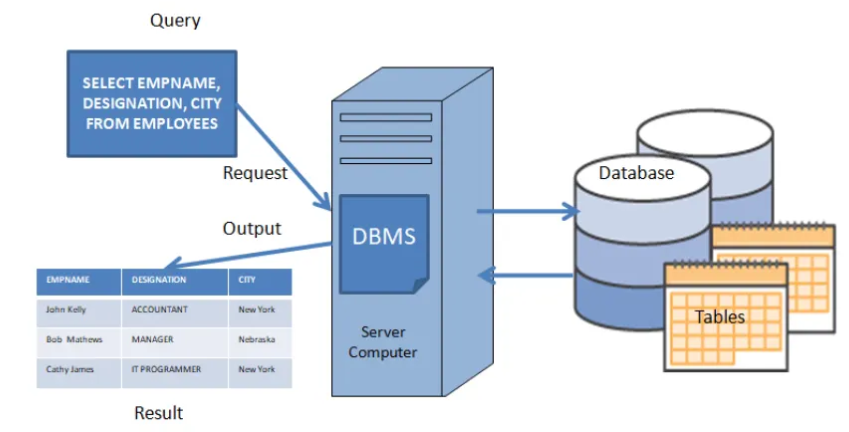

```{r setup, include=FALSE}
options(htmltools.dir.version = FALSE)
if (!require("knitr")) {
   install.packages("knitr")
   library(knitr)
}
if (!require("pander")) {
   install.packages("pander")
   library(pander)
}
if (!require("plotly")) {
   install.packages("plotly")
   library(plotly)
}
if (!require("ggplot2")) {
   install.packages("ggplot2")
   library(ggplot2)
}
knitr::opts_chunk$set(
                  fig.width=3, 
                  fig.height=3, 
                  fig.retina=12,
                  out.width = "100%",
                  cache = FALSE,
                  echo = TRUE,
                  message = FALSE, 
                  warning = FALSE,
                  hiline = TRUE
                  )
```


```{r xaringan-themer, include=FALSE, warning=FALSE}
library(xaringanthemer)
  style_duo_accent(primary_color = "#1F4257",
          secondary_color = "#380F2A",
          # fonts
          header_font_google = google_font("Martel"),
          text_font_google = google_font("Lato"),
          code_font_google = google_font("Fira Mono"))
```

class:inverse4, top

<h1 align="center"> Outlines</h1>
<BR>

<table>
<tr><td style = "font-size: 26px">

<li> Database vs Database Management System</li>
<li> Why we need database</li>
<li> A Glance at Database Design</li>
<li> Relational Database Management Systems</li>
<li> Relationships between Relational Tables</li>
<li> Query Language</li>
<li> Basic SQL Joins</li>


</td><tr>
</table>

---


name: DB-DBMS
class: inverse1 center middle 

<h2 align = "center" style = "font-variant: small-caps;">Database vs Database Management System </h2>

---

name: DB

<h2 align = "center" style = "font-variant: small-caps;">What Is Database?</h2>
<hr>

A **database** is an organized, persistent, and structured collection of related data, typically stored electronically in a computer system. It is designed to be efficiently accessed, managed, updated, controlled, and retrieved.

```{r echo = FALSE, fig.align='center', out.width= "30%"}

```

---

name:DB-DBMS

<h2 align = "center" style = "font-variant: small-caps;">Database Management System</h2>
<hr>


The database itself is managed by a software system called a **Database Management System (DBMS)**, which acts as an intermediary between the database, the users, and the application programs.

```{r echo = FALSE, fig.align='center', out.width= "70%"}

```

---


name: whyDB 
class: inverse1 center middle 

<h2 align = "center" style = "font-variant: small-caps;">Why Do We Need Databases? </h2>

---


name: DBMS


<h2 align = "center" style = "font-variant: small-caps;">Why we need database?</h2>
<hr>

.pull-left[

* **To Manage Large Amounts of Data Efficiently**: Databases are designed to handle massive volumes of data efficiently.

* **To Ensure Data Accuracy and Integrity (ACID)**: Databases enforce rules and constraints (e.g., data types, unique values) to prevent invalid data entry.

* **To Avoid Data Redundancy and Inconsistency**: A central database stores each piece of data once to eliminates duplicate copies (redundancy).

* **To Enable Concurrent Access Safely**: Databases allow multiple users or applications to access and modify data at the same time without interfering with each other or causing data loss.
]
.pull-right[

* **To Provide Robust Security and Access Control**: Databases offer fine-grained security features. 

* **To Support Powerful Querying and Complex Analysis**: Using a language like SQL, you can ask complex questions and combine data from different sources easily.

* **To Ensure Data Persistence and Reliability**: Databases are built to be durable. Once data is saved, it is protected from system failures and remains permanent until intentionally deleted.

* **To Separate Data from Applications (Data Independence)**: The data is stored separately from the application logic. 
]

---


name: DB-Design 
class: inverse1 center middle 

<h2 align = "center" style = "font-variant: small-caps;">A Glance at Database Design </h2>

---


name: DataAbstraction


<h2 align = "center" style = "font-variant: small-caps;">Data Abstraction</h2>
<hr>

.pull-left[
<br><br>
* **Physical level**: Describe how the data are actually stored (words or bytes)

* **Conceptual level**: Describe what data are actually stored in the database (Structure). It gives a Schematic representation of phenomena 

* **View level**: Describe only a part of the entire database. Many users of the database may be concerned with a subset of information. The system may provide many views for the same database
]

.pull-right[

```{r echo = FALSE, fig.align='center', out.width= "99%"}

```

]
---


name:dataModels

<h2 align = "center" style = "font-variant: small-caps;">Data Models </h2>
<hr>

.pull-left[

A data model's framework is a structured set of components that work together to provide a complete blueprint for data. 

It's not just about structure; it's about meaning, rules, and operations.

The core framework can be broken down into three fundamental components, which are then applied across different levels of abstraction, as shown in the flowchart.

A data model is the essential blueprint used in the design of a database. It acts as a guide and a plan, ensuring the final database is structured correctly, efficiently, and in a way that accurately represents the real-world system it's meant to support.

]

.pull-right[

```{r echo = FALSE, fig.align='center', out.width= "70%"}

```
]
---

name:dataModelTypes

<h2 align = "center" style = "font-variant: small-caps;">Types of Data Models </h2>
<hr>

Different data models define different databases. The common data models are

.pull-left[ 
* **Hierarchical model**:  A collection of records connected through parent-child relationships. Each parent record can have multiple children, but each child has exactly one parent. This forms a tree structure.

* **Network model**:  A collection of records (nodes) connected by links (edges). A record can have multiple parent and child records, forming a graph or network.
]

.pull-right[
* **Relational model**: Data is organized in tables (relations) with rows (tuples) and columns (attributes). All data is represented as values in tables. This model revolutionized database technology by focusing on logical representation rather than physical storage.

* **Object oriented model**:  Data is stored as objects, just like in object-oriented programming. Objects are instances of classes, which have attributes (data) and methods (behavior).
]

We will only focus on **relational database** defined based on relational data model.

---


name: relationalDatabase

<h2 align = "center" style = "font-variant: small-caps;">Reasons to use  Relational Model </h2>
<hr>

.pull-left[
* **Data Integrity**: Guarantees accuracy and consistency through ACID (Autpmicity, Consistency, Isolation, and Dureability) compliance and built-in constraints, ensuring data is always valid and reliable.

* **SQL & Powerful Querying**: The standardized SQL language allows for expressive, ad-hoc, and complex queries to retrieve and manipulate data efficiently.

* **Reduced Redundancy**: Normalization eliminates data duplication by storing information in one place and referencing it, which conserves storage and prevents update anomalies.

]
.pull-right[

* **Logical Data Independence**: The logical design (tables, columns) is separate from the physical storage. This allows changes to how data is stored without affecting how applications access it.

* **Flexibility & Ad-Hoc Analysis**: The simple tabular structure and powerful SQL engine enable easy exploration and reporting of data for business intelligence without predefined access paths.

* **Maturity & Ecosystem**: A proven, decades-old technology with robust vendor support, sophisticated management tools, strong security features, and a vast global talent pool.

]
---


name: DB-DBMS
class: inverse1 center middle 

<h2 align = "center" style = "font-variant: small-caps;">Relational Database Management Systems </h2>

---


name: RDBMS1

<h2 align = "center" style = "font-variant: small-caps;">Special Aspects of RDBMS </h2>
 <hr>

* **Physical Data Independence**: The ability to change how the data is physically stored (e.g., on disk) without needing to change the application code that accesses it.

* **Logical Data Independence**: The ability to change the logical structure of the database (e.g., adding a new table or column) without disrupting existing applications that don't need that new data.

* **Declarative Querying (SQL)**: The user (or application) declares what data they want using a high-level language (SQL), not how to get it. 

* **Set-Based Processing**: Operations work on entire sets of rows at a time (e.g., `UPDATE all customers SET status = 'active' WHERE country = 'US'`).

* **The Relational Model (Based on Mathematical Set Theory)**: All data is represented as simple tuples (rows) grouped into relations (tables). There are no physical pointers or hierarchical paths linking the data. Relationships between tables are represented by data values (foreign keys), not storage structures.
---


name: RDBMS1

<h2 align = "center" style = "font-variant: small-caps;">Key Components of RDBMS </h2>
 <hr>
 <br>
 
The following five components work together seamlessly to provide the structured, reliable, and high-performance environment that defines an RDBMS.
<br><br>

| **Component** |	**Analogy** | **Primary Function**|
|:-----------------|:---------------------------|:-----------------------------|
|Relational Engine	|The Brain	|Processes commands and optimizes performance.|
|Storage Engine	|The Filing Clerk	|Manages physical storage and guarantees ACID.|
|Database Schema|	The Blueprint|	Defines structure and enforces data rules.|
|SQL	|The Language	|The universal interface for all communication.|
|Index|	The Book's Index|	Dramatically speeds up data retrieval.|


---


name: RDBMS2

<h2 align = "center" style = "font-variant: small-caps;">The Essential Rules of Relational Tables </h2>
<hr>

|	**Rule** | **Description**	| **Purpose**|
|:---------------|:-------------------------------------|:---------------------|
| Unique Primary Key	| Every row must be uniquely identifiable.	| Uniqueness and relationships.| 
| Atomic Columns (1NF)| 	Cells contain single, indivisible values.| 	Data integrity and accurate querying.| 
| Non-Redundant Data	| Data is stored in one place and referenced.	| Prevents inconsistencies and saves space.| 
| Foreign Key | Relationships	Tables are linked by values, not pointers.	| Creates logical, flexible connections.| 
| Same Domain Values	| All values in a column are of the same type.	| Ensures consistency and valid operations.| 
| No Order Dependency	| The order of rows and columns is not meaningful.	| Data is accessed by content, not location.| 
| Single Entity per Table	| A table represents one "thing" or concept.	| Clear design and minimizes redundancy.| 

---


name: RelBetweenTables 
class: inverse1 center middle 

<h2 align = "center" style = "font-variant: small-caps;">Relationships between Relational Tables </h2>

---


class: Key-example

<h2 align = "center" style = "font-variant: small-caps;">Primary and Foreign Key: Example</h2>
<hr>

```{r echo = FALSE, fig.align='center', out.width="80%", fig.cap="Illustration of primary and foreign keys by example"}
include_graphics("img/1to1.png")
```

---


class: 1TO1-Example

<h2 align = "center" style = "font-variant: small-caps;">1-1 Relationship Between Tables: Example</h2>
<hr>

```{r echo = FALSE, fig.align='center', out.width="60%", fig.cap="One-to-one relationship between two tables: Example"}

```


---
class: 1TOM-Example

<h2 align = "center" style = "font-variant: small-caps;">1-M Relationship Between Tables: Example</h2>
<hr>

```{r echo = FALSE, fig.align='center', out.width="60%", fig.cap="One-to-many relationship between two tables: Example"}
include_graphics("img/1toM-example.png")
```


---
class: MTO1-Example

<h2 align = "center" style = "font-variant: small-caps;">M-1 Relationship Between Tables: Example</h2>
<hr>

```{r echo = FALSE, fig.align='center', out.width="80%", fig.cap="Many-to-one relationship between two tables: Example"}

```


---
class: inverse1 center middle 


## Query Language


---
class: MTO1-Example

<h2 align = "center" style = "font-variant: small-caps;">Query Language</h2>
<hr>

**Query Language**

* **QL** is the language in which a user requests information from the database. Examples of QL are relational algebra (procedural) and tuple relational calculus (non-procedural)

* The most common query languages are **Structured Query Language (SQL)**, Query By Example (QBE), and Quel
SQL has gained wide acceptance in commercial products


**Structured Query Language (SQL)**


* **SQL** is the standard relational database language

* **SQL** includes commands not only restricted to query but to other functions such as defining relations, deleting relations, creating indices, and modifying relation scheme, access right, integrity, and transaction control

* The basic structure of an SQL expression consists of three clauses: **SELECT**, **FROM**, and **WHERE**

---


class: SQL-Classification

<h2 align = "center" style = "font-variant: small-caps;">Fundamental Classification of SQL Commands</h2>
<hr>
SQL commands are categorized based on their primary function in managing databases.

* **DQL (Data Query Language)** retrieves data from databases. No modification of data; It often combines with clauses like WHERE, JOIN, GROUP BY.

* **DDL (Data Definition Language)** defines or modifies the structure of database objects (e.g., tables, schemas). It requires explicit COMMIT or ROLLBACK for permanent changes.

* **DML (Data Manipulation Language)** manipulates data within tables (insert, update, delete). It requires explicit COMMIT or ROLLBACK for permanent changes.

* **DCL (Data Control Language)** controls access to data (permissions and security). It manages roles and permissions.

* **TCL (Transaction Control Language)** manages transactions (ensure data consistency). Ir ensures ACID properties (Atomicity, Consistency, Isolation, Durability).

---


name: SQLStructure

<h2 align = "center" style = "font-variant: small-caps;">Query Syntax</h2>
<hr>

```{r echo=FALSE, fig.align ="center",  out.width = '90%'}
  
```

---


class: ExecuationOrder

<h2 align = "center" style = "font-variant: small-caps;">Order of SQL Execution</h2>
<hr>

Understanding the logical order of execution (the "thought process" of the database engine) is crucial for writing correct and efficient SQL queries.


| Order| 	Clause |	Purpose |
|:---|:-----------------------------:|:-----------------------------------|
| 1	| FROM| 	Identifies and loads the base table(s). If there are joins, they happen here.| 
| 2	| WHERE| 	Filters rows from the source table(s) based on a condition.| 
| 3	| GROUP BY| 	Groups the filtered rows into buckets based on identical values in specified columns.| 
| 4	| HAVING| 	Filters the created groups based on a condition (works on aggregated data).| 
| 5	| SELECT| 	Projects (selects) the final columns and calculates any expressions or aggregates.| 
| 6	| DISTINCT| 	Removes duplicate rows from the final result set.| 
| 7	| ORDER BY| 	Sorts the final result set.| 
| 8	| LIMIT / OFFSET| 	Restricts the number of rows returned.| 

---


name: SQLDataTypes

<h2 align = "center" style = "font-variant: small-caps;">A SQL Example</h2>
<hr>

```{r echo = FALSE, fig.align='center', out.width="99%"}
include_graphics("img/SQL.png")
```


---


name: SQLDataTypes

<h2 align = "center" style = "font-variant: small-caps;">Field Types</h2>
<hr>

* **INTEGERS** e.g. number of population, age

* **REAL (DECIMAL)** e.g. income, salary

* **CHARACTER**  e.g. names, description 

* **DATES**    e.g. date of flood

* **IMAGES (Multimedia)** e.g. image of the flood (.tif) 

* **SOUND** e.g. Sound of thunder (.wav)

* **MOVIE** e.g. recording film (.avi, .mov) 
---


name: BasicJoins 
class: inverse1 center middle 

<h2 align = "center" style = "font-variant: small-caps;">Basic SQL Joins </h2>

---


name: innerJoin

<h2 align = "center" style = "font-variant: small-caps;">Inner Join</h2>
<hr>


```{r echo=FALSE, fig.align ="center",  out.width = '80%'}
  knitr::include_graphics("img/innerJoin_3.gif")
```
---


name: leftJoin

<h2 align = "center" style = "font-variant: small-caps;">Left Join</h2>
<hr>


```{r echo=FALSE, fig.align ="center",  out.width = '80%'}
  knitr::include_graphics("img/leftJoin_1.gif")
```
---


name: rightJoin


<h2 align = "center" style = "font-variant: small-caps;">Right Join</h2>
<hr>


```{r echo=FALSE, fig.align ="center",  out.width = '80%'}
  knitr::include_graphics("img/rightJoin_3.gif")
```
---


name: fullJoin

<h2 align = "center" style = "font-variant: small-caps;">Full/Outer Join</h2>
<hr>


```{r echo=FALSE, fig.align ="center",  out.width = '80%'}
  knitr::include_graphics("img/fullOuter_1.gif")
```
---

name: fullJoin

<h2 align = "center" style = "font-variant: small-caps;">Summary of SQL Joins</h2>
<hr>


```{r echo=FALSE, fig.align ="center",  out.width = '70%'}
  
```
---


name: ThankyouPage 
class: inverse1 center middle 

<h2 align = "center" style = "font-variant: small-caps;"><b>Thank You</b> </h2>


