<style type="text/css">

/* Table of content - navigation */
div#TOC li {
    list-style:none;
    background-color:lightgray;
    background-image:none;
    background-repeat:none;
    background-position:0;
    font-family: Arial, Helvetica, sans-serif;
    color: #780c0c;
}


/* Title fonts */
h1.title {
  font-size: 24px;
  color: darkblue;
  text-align: center;
  font-weight: bold;
  font-family: Arial, Helvetica, sans-serif;
  font-variant-caps: normal;
}
h4.author { 
  font-size: 18px;
  font-family: Arial, Helvetica, sans-serif;
  font-weight: bold;
  color: navy;
  text-align: center;
}
h4.date { 
  font-size: 18px;
  font-family: Arial, Helvetica, sans-serif;
  font-weight: bold;
  color: darkblue;
  text-align: center;
}

/* Section headers */
h1 {
    font-size: 22px;
    font-weight: bold;
    font-family: "Times New Roman", Times, serif;
    color: darkred;
    text-align: left;
}

h2 {
    font-size: 20px;
    font-weight: bold;
    font-family: "Times New Roman", Times, serif;
    color: navy;
    text-align: left;
}

h3 { 
    font-size: 18px;
    font-weight: bold;
    font-family: "Times New Roman", Times, serif;
    color: navy;
    text-align: left;
}

h4 {
    font-size: 16px;
    font-weight: bold;
    font-family: "Times New Roman", Times, serif;
    color: darkred;
    text-align: left;
}

/* Decoration of hyperlinks  */

/* unvisited link */
a:link {
  color: green;
}

/* visited link */
a:visited {
  color: purple;
}

/* mouse over link */
a:hover {
  color: red;
}

/* selected link */
a:active {
  color: yellow;
}
</style>


```{r setup, include=FALSE}
options(repos = list(CRAN="http://cran.rstudio.com/"))
# code chunk specifies whether the R code, warnings, and output 
# will be included in the output files.
if (!require("knitr")) {
   install.packages("knitr")
   library(knitr)
}

knitr::opts_chunk$set(echo = TRUE,       
                      warning = FALSE,   
                      result = TRUE,   
                      message = FALSE,
                      comment = NA)
```


\


# Introduction

The logical process for solving statistics problems follows the basic steps 


```{r fig.align='center', out.height="35%", out.width="70%", fig.cap="Statistical problem solving process"}
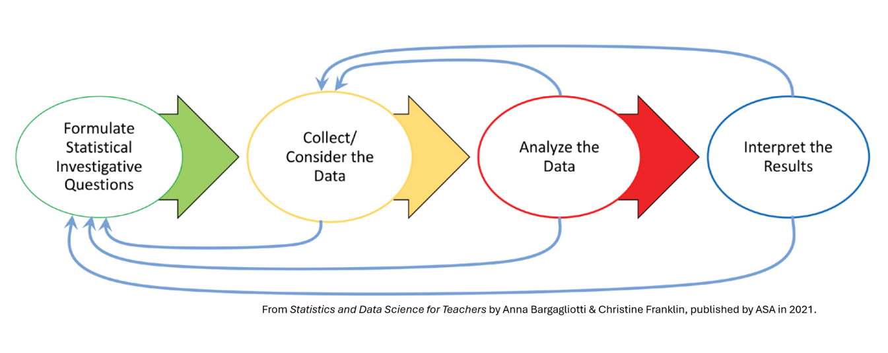
```

In teaching statistics courses, the reasoning process used in course projects is

* Learn a new method/model

* Find **pre-processed data sets** or collect **data based on the design of experiment**.

* formulate questions based on the information in the data sets that can be addressed by the new methods/models and previously learned methods/models. **These methods / models are based on i.i.d. data and certain distributional assumptions** such as normal, binomial, snd Poisson distributions.

* Perform the analysis

* Report the results and make recommendations.


In the real world data science process which usually deals with complex data that could be large in size, complex in terms of data types, and data generation process, projects start with a vague business question such as *Why our sales are declining in the Northeast region*, *how to reduce fraud loss*, etc.

```{r fig.align='center', out.height="60%", out.width="80%", fig.cap= "Data science problem solving process"}
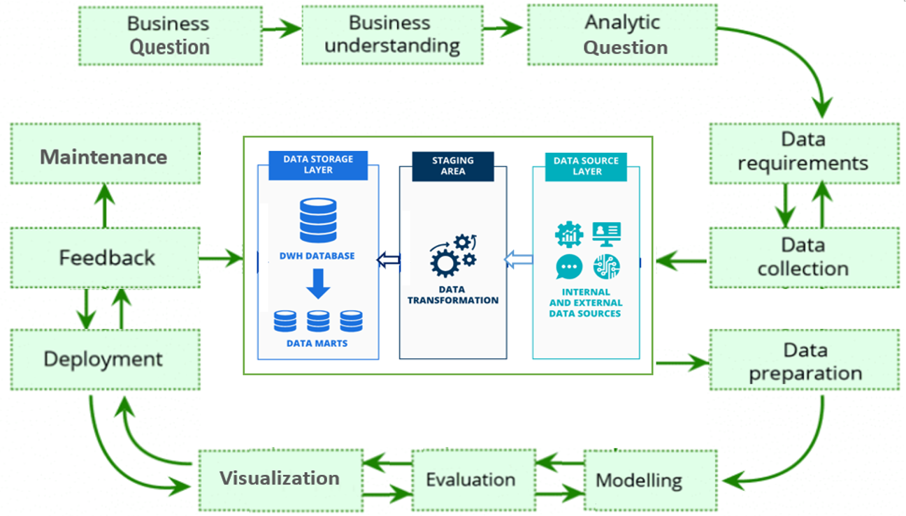
```

That is real-world projects start with a vague business question question with no data! We need to gain a clear business understanding of the problem to formulate clear business problems and then convert the **clear business problem** to **an analytic problem**. With the clear analytic problem and analytic background of the members of the project team, data scientists and data scientists will gather relevant information to perform analysis. 

The nature of industry data used in data science projects is different from that used in classical projects: large size, most likely non-i.i.d, machine-generated, non-experimental design generated, etc. These types of data are not appropriate for classical modeling. Moreover, the data is generated from different sources in different formats and stored in places (on-premise, cloud, or hybrid). This requires basic knowledge of organizational data infrastructure and architecture. This note outlines the idea of organizational data acquisition and integration.


# Data Architecture and Data Infrastructure

Data Infrastructure is the digital infrastructure built to manage, store, and process data. This includes databases, data warehouses, servers, hardware and software, network equipment, and data centers. It's the foundation upon which data management strategy is built. 

## Data Architecture

A data architecture describes how data is managed-from collection through transformation, distribution, and consumption. It sets the blueprint for data and the way it flows through data storage systems.  Data Lake -> Data Warehouse -> Data Mart

```{r fig.align='center', out.height="60%", out.width="80%", fig.cap= "A demonstration of a simple data architecture"}
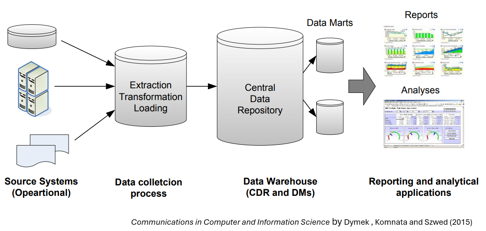
```

Three components of data architecture are data lake, data warehouse, data mart:

**Data Lake**: holds an original copy of data produced in the business. Data processing from the original should be minimal if any; otherwise, in case some data processing turns out to be wrong in the end, it will not be possible to fix the error retrospectively.

**Data Warehouse**: holds data processed and structured by a managed data model, reflecting the global (not specific) direction of the final use of the data. In many cases, the data is in tabular format.

**Data Mart**: holds a part and/or aggregated data set for the use of a particular business function, e.g. specific business unit or specific geographical area. A typical example is when we prepare the summary of KPIs for a specific business line followed by visualization in a BI tool. Especially, preparing this kind of separate and independent component after the warehouse is worthwhile when the user wants the data mart **regularly and frequently updated**. On the contrary, this portion can be skipped in cases where the user only wants some set of data for ad hoc analysis done only once.


The following table shows who creates/maintains and uses these components in the architecture.


```{r fig.align='center', out.height="80%", out.width="100%", fig.cap= "Summary of data architecture components"}
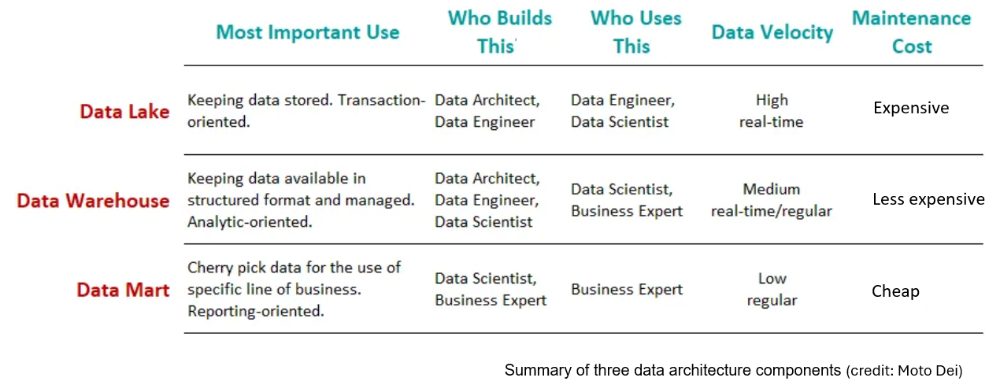
```


## Purpose of Data Infrastructure

Different companies with different uses and goals need different technological approaches and tools. Companies invest in data infrastructure in several areas.

**Data collection**: companies can set up many data collection systems themselves or collaborate with a data company.

**Data storage**: with the explosion of the volume of data generated and stored, companies need sophisticated but accessible systems and tools. They include a data warehouse, data lake, distributed/cloud-based storage system, company server, and computer hard disk.

**Data Analytics**: Companies use programming languages and platforms to turn data into insights. Data analysis involves three main basic steps: 1) data preparation (data integration), 2) model building and insights extraction, and 3) implementation and implementation.


**Data Communications**: Tools for more effective communications.


The following figure summarizes these key elements.


```{r fig.align='center', out.height="80%", out.width="100%", fig.cap= "Elements of data architecture"}
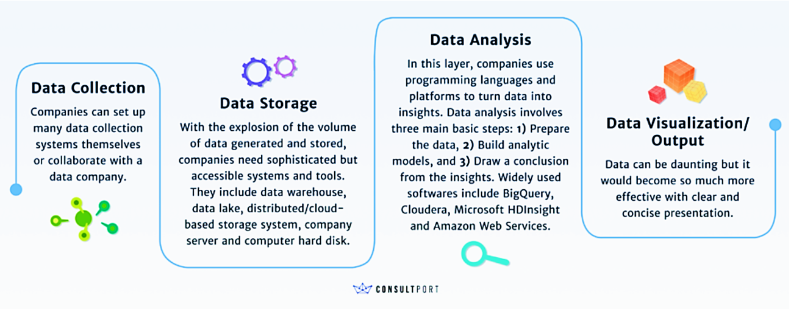
```


## Types of Data Infrastructure

The types of Data Infrastructure can be broadly categorized in the following ways:

```{r fig.align='center', out.height="40%", out.width="80%", fig.cap= "Types of data infrastructure"}
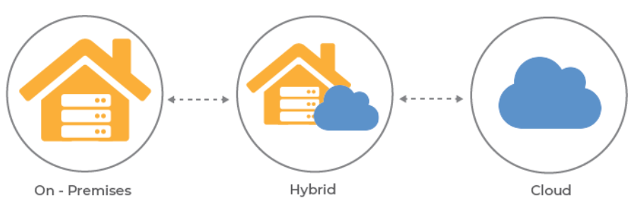
```


**Traditional Infrastructure**: This refers to a standard IT infrastructure that uses in-house servers, storage systems, and network devices to collect, store, process, and manage data. This kind of infrastructure requires significant resources and technical expertise to manage.

**Cloud Infrastructure**: Cloud-based data infrastructure uses cloud storage and computing resources provided by third-party cloud service providers. It offers scalability, cost-effectiveness, and convenience, eliminating the need to maintain onsite server rooms and IT staff. Examples include Amazon Web Services, Microsoft Azure, and Google Cloud Platform. 
 
**Hybrid Infrastructure**: Hybrid data infrastructure combines the elements of both traditional and cloud infrastructures. Some data may be stored on-premises for speed and security considerations, while others may be stored in the cloud for cost-effectiveness and scalability.
Converged Infrastructure: Converged data infrastructure pre-packages multiple IT components into a single, optimized solution. This type includes storage, servers, networking, and software provisioned and managed as a single entity.

**Hyper-Converged Infrastructure** This is an evolution of converged infrastructure wherein all components are software-defined, with tight integration between technologies, offering even greater simplification and cost savings.

**Edge Infrastructure**: Edge data infrastructure processes data closer to its source, reducing latency and transmission costs. With the rise of Internet of Things (IoT) devices, edge computing has become increasingly important. 


## Aspects of Data Infrastructure

Data infrastructure has several fundamental aspects supporting data collection, storage, processing, distribution, and usage. The main aspects of data infrastructure include:


**Physical Infrastructure**: This comprises hardware components like servers, computers, routers, and physical storage devices. It can also include data centers and the physical facilities that house the hardware.


**Software Infrastructure**: This includes databases, data warehouses, extraction, transformation, and loading (ETL) tools, data analytics software, and other applications and platforms that facilitate data management, processing, and analysis.
Network Infrastructure: This involves the telecommunication networks (LAN, WAN, Internet) that enable data transfer within and between systems, servers, and storage devices.


**Cloud Storage**: With technological advancements, more companies are moving their data infrastructure to the cloud. Cloud storage provides a flexible and scalable solution that can be expanded or contracted based on storage needs. 
Data Processing Frameworks: These are software libraries or engines that enable large-scale data processing. Examples include Hadoop, Apache Spark, etc.


**Security Infrastructure**: Security measures are essential to protect data from unauthorized access, breaches, or cyber-attacks. These measures can include firewalls, encryption software, and user-access controls.


**Data Governance**: This involves the policies, processes, and practices to control, manage, and ensure the quality and privacy of data and compliance with regulations such as GDPR.


**Data Architecture**: This is the design or blueprint of the data infrastructure. It describes how an organization collects, stores, transforms, processes, and consumes data. 


# Data Integration

Data integration refers to the process of bringing together data from multiple sources across an organization to provide a complete, accurate, and up-to-date dataset for data analysis and other applications and business processes. It includes data replication, ingestion, and transformation to combine different types of data into standardized formats to be stored in a target repository such as a data warehouse, data lake, or data mart.


```{r fig.align='center', out.height="40%", out.width="80%", fig.cap= "Data integration approaches"}
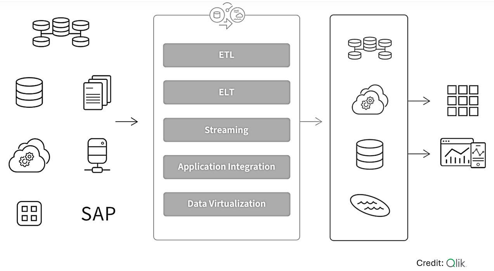
```


## Major Data Integration Techniques


**ETL**

An ETL pipeline is a traditional type of data pipeline that converts raw data to match the target system via three steps: extract, transform, and load. Data is transformed in a staging area before it is loaded into the target repository (typically a data warehouse). This allows for fast and accurate data analysis in the target system and is most appropriate for small data sets that require complex transformations.

```{r fig.align='center', out.height="40%", out.width="60%", fig.cap= "Data integration approache: ETL"}
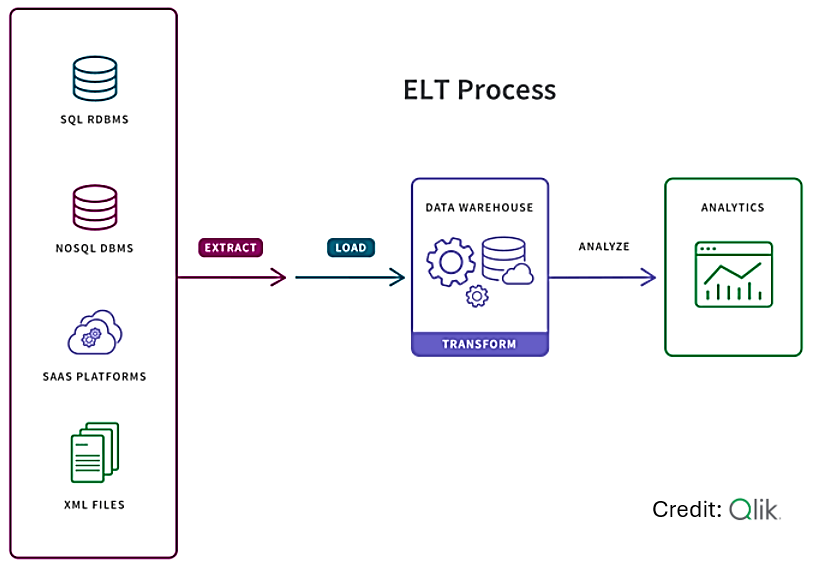
```

**ELT**

In the more modern ELT pipeline, the data is immediately loaded and then transformed within the target system, typically a cloud-based data lake, data warehouse, or data lake. This approach is more appropriate when data sets are large and timeliness is important since loading is often quicker.

```{r fig.align='center', out.height="40%", out.width="60%", fig.cap= "Data integration approache: ELT"}
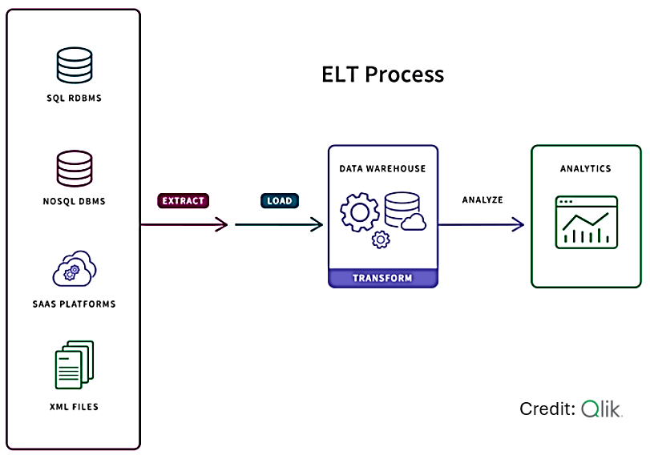
```


**Data Streaming**

Instead of loading data into a new repository in batches, streaming data integration moves data continuously in real time from source to target. Modern data integration (DI) platforms can deliver analytics-ready data into streaming and cloud platforms, data warehouses, and data lakes.


```{r fig.align='center', out.height="60%", out.width="80%", fig.cap= "Data integration approache: Streaming"}
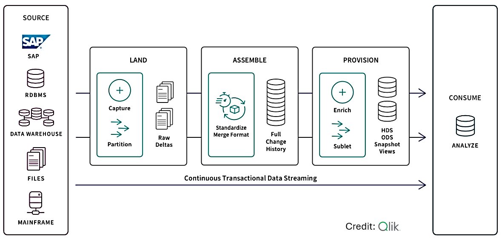
```

**Application Integration**

Application integration (API) allows separate applications to work together by moving and syncing data between them. The most typical use case is to support operational needs such as ensuring that your HR system has the same data as your finance system. Therefore, the application integration must provide consistency between the data sets. Also, these various applications usually have unique APIs for giving and taking data so SaaS application automation tools can help you create and maintain native API integration efficiently and at scale.

```{r fig.align='center', out.height="60%", out.width="80%", fig.cap= "Data integration approache: API"}
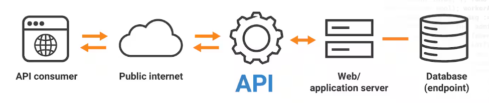
```


In the next sections, we describe ETL and ETL tools briefly.


## ETL

**ETL** stands for Extract, Transform, Load. It is a process used in data integration to extract data from various sources, transform the data to meet specific business requirements and load the transformed data into a target system, such as a data warehouse or a database. Data in these systems can be used to perform business analysis and generate business Intelligence (BI) reports.

The extraction phase involves retrieving data from various sources, such as databases, flat files, web services, or cloud-based applications. The transformation phase involves cleaning, enriching, aggregating, or otherwise modifying the data to meet the needs of the target system. Finally, the load phase involves writing the transformed data to the target system.

With the increasing adoption of big data technologies, such as Hadoop and Spark, ETL processes have become more complex and require more advanced tools and technologies. ETL workflows in big data often involve processing data in parallel across multiple nodes in a distributed environment, which requires specialized tools that can handle data partitioning, data shuffling, and fault tolerance.

There are many ETL pipelines and task automation tools available, ranging from open-source solutions to commercial products. Some of the most common ETL tools include

**Apache Airflow**: is an open-source platform for programmatically authoring, scheduling, and monitoring workflows. It provides a way to create, execute, and manage complex data pipelines that integrate data from multiple sources and systems. Airflow uses Python scripts to define tasks and dependencies in a workflow, which are organized into a directed acyclic graph (DAG) where each step would represent a specific data engineering task.


**Microsoft SQL Server Integration Services (SSIS)**: SSIS is a data integration and ETL platform introduced with SQL Server 2005 and is used for on-premises SQL Server deployments. In 2015, Azure Data Factory (ADF) was introduced as a cloud-based no-code data integration service to meet the increasing demand for cloud-based data processing.


**Google Cloud Dataflow**: Google Cloud Dataflow is a fully managed, cloud-based data processing service for batch and streaming data. It is built on Apache Beam, an open-source unified programming model for defining and executing data processing pipelines. With Cloud Dataflow, users can develop and execute data processing pipelines in a fully managed and optimized environment, without the need for infrastructure management.


**AWS Glue**: AWS Glue is a fully managed, serverless ETL (Extract, Transform, Load) service provided by Amazon Web Services (AWS). It is designed to make it easy for users to extract data from a variety of sources, transform it, and then load data into data stores for analysis. AWS Glue automates the process of building ETL workflows, including data schema discovery, data transformation, and job scheduling.


# SQL and Relational Database

SQL (Structured Query Language) is a domain-specific language that is used to manage and manipulate data within relational database management systems (RDBMS). It is designed to be declarative, meaning that users specify what they want the database to do, rather than how to do it.

SQL plays a crucial role in ETL processes. It enables data analysts and developers to extract data from various sources, transform and manipulate it to fit the target system's schema, and then load it into the destination database or data warehouse, giving way for various advanced use cases such as Machine learning and AI applications.

SQL's ability to handle complex data transformations and queries makes it an essential tool for ETL operations.


## SQL Syntax

Several standard SQL commands can be used to interact with a database. Here are some of the most common ones:

**SELECT**: retrieve data from a table or view

**INSERT**: insert data into a table

**UPDATE**: update existing data in a table

**DELETE**: delete data from a table

**CREATE**: create a new table, view, or other database object

**ALTER**: modify an existing table, view, or other database object

**DROP**: delete an existing table, view, or other database object

**TRUNCATE**: delete all data from a table, but keep the structure intact

These commands are often combined in various ways to create more complex SQL statements, such as JOINs, subqueries, and aggregate functions.


## Basics of Relational Database

A relational database (RDB) is a way of structuring information in tables, rows, and columns. An RDB can establish links—or relationships–between information by joining tables, which makes it easy to understand and gain insights into the relationship between various data points. 

Think of the relational database as a collection of spreadsheet files that help businesses organize, manage, and relate data. In the relational database model, each “spreadsheet” is a table that stores information, represented as columns (attributes) and rows (records or tuples). 

**Attributes (columns)** specify a data type

**Record (or row)** contains the value of that specific data type

**Primary key**  All tables in a relational database have an attribute known as the *primary key* is a **unique identifier of a row**.

**foreign key** Each row can be used to create a relationship **between different tables** using a *foreign key* — a reference to a primary key of another existing table.


The following figure shows the basic structure of a relational database.

```{r fig.align='center', out.height="70%", out.width="70%", fig.cap= "Data integration approache: API"}
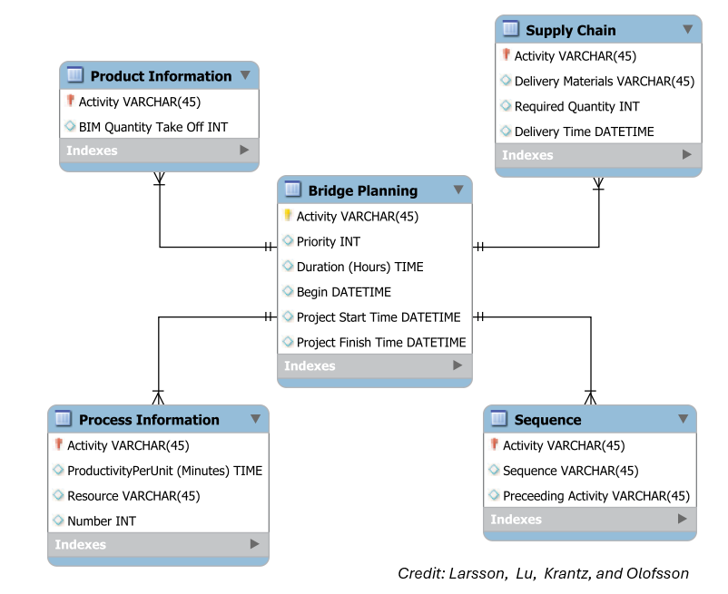
```


