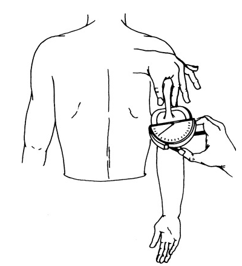
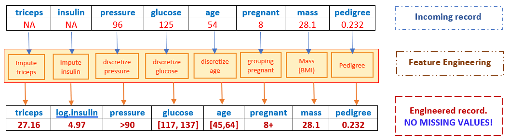
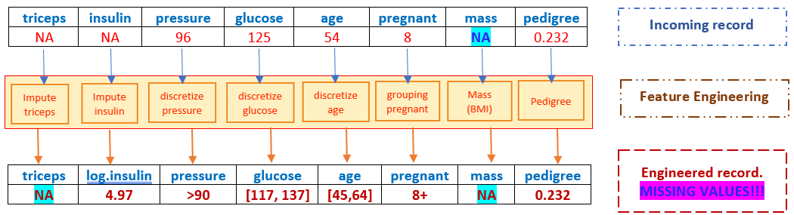

```{=html}

<style type="text/css">

/* Cascading Style Sheets (CSS) is a stylesheet language used to describe the presentation of a document written in HTML or XML. it is a simple mechanism for adding style (e.g., fonts, colors, spacing) to Web documents. */

h1.title {  /* Title - font specifications of the report title */
  font-size: 24px;
  font-weight: bold;
  color: DarkRed;
  text-align: center;
  font-family: "Gill Sans", sans-serif;
}
h4.author { /* Header 4 - font specifications for authors  */
  font-size: 20px;
  font-family: system-ui;
  color: DarkRed;
  text-align: center;
  font-weight: bold;
}
h4.date { /* Header 4 - font specifications for the date  */
  font-size: 18px;
  font-family: system-ui;
  color: DarkBlue;
  text-align: center;
}
h1 { /* Header 1 - font specifications for level 1 section title  */
    font-size: 22px;
    font-family: "Times New Roman", Times, serif;
    color: navy;
    text-align: center;
    font-weight: bold;
}
h2 { /* Header 2 - font specifications for level 2 section title */
    font-size: 20px;
    font-family: "Times New Roman", Times, serif;
    color: navy;
    text-align: left;
    font-weight: bold;
}

h3 { /* Header 3 - font specifications of level 3 section title  */
    font-size: 18px;
    font-family: "Times New Roman", Times, serif;
    color: navy;
    text-align: left;
}

h4 { /* Header 4 - font specifications of level 4 section title  */
    font-size: 18px;
    font-family: "Times New Roman", Times, serif;
    color: darkred;
    text-align: left;
}

body { background-color:white; }

.highlightme { background-color:yellow; }

p { background-color:white; }

</style>
```

```{r setup, include=FALSE}
# code chunk specifies whether the R code, warnings, and output 
# will be included in the output files.
if (!require("knitr")) {
   install.packages("knitr")
   library(knitr)
}
if (!require("tidyverse")) {
   install.packages("tidyverse")
library(tidyverse)
}
if (!require("GGally")) {
   install.packages("GGally")
library(GGally)
}
knitr::opts_chunk$set(echo = TRUE,       # include code chunk in the output file
                      warnings = FALSE,  # sometimes, you code may produce warning messages,
                                         # you can choose to include the warning messages in
                                         # the output file. 
                      results = TRUE,    # you can also decide whether to include the output
                                         # in the output file.
                      message = FALSE,
                      comment = NA
                      )  
```


\

# Introduction

Exploratory Data Analysis (EDA) is a critical process in data science that involves summarizing the main characteristics of a data set, often with visual methods. The primary purposes of EDA are

**Understanding Data Structure**: EDA helps you understand the underlying structure of the data, including its distribution, patterns, and anomalies.

**Identifying Relationships**: It allows you to identify relationships between variables, which can inform feature selection and engineering.

**Detecting Outliers**: EDA helps in detecting outliers or unusual observations that might affect the performance of your models.

**Checking Assumptions**: It is used to check the assumptions required for statistical tests and models.

With the identified patterns through EDA, we can select appropriate techniques to extract more hidden information to improve the performance of the subsequent modeling and related analysis.

In this case study, we use a publicly avaiable data set as an example to perform exploratory data analysis and detect patterns of the data


# Description of the Data 

A population of women who were at least 21 years old, of Pima Indian heritage, and living near Phoenix, Arizona, was tested for diabetes according to World Health Organization criteria. The data were collected by the US National Institute of Diabetes and Digestive and Kidney. The objective of the data set is to diagnostically predict whether or not a patient has diabetes, based on certain diagnostic measurements included in the data set. Several constraints were placed on the selection of these instances from a larger database. 

There are two versions of the data available in the public domain. This case study uses the version that contains the missing values. The total number of records in this data set is 768. The data set consists of 9 variables including the response variable with the name `diabetes`. Predictor variables include the number of pregnancies the patient has had, their BMI, insulin level, age, and so on. A detailed description of the variables is given below

`pregnant`: Number of times pregnant

`glucose`: Plasma glucose concentration 2 hours in an oral glucose tolerance test

`pressure`: Diastolic blood pressure (mm Hg)

`triceps`: Triceps skin fold thickness (mm)

`insulin`: 2-Hour serum insulin (mu U/ml)

`mass`: Body mass index (weight in kg/(height in m)^2)

`pedigree`: Diabetes pedigree function

`age`: Age (years)

`diabetes`: outcome class variable ('neg' or 'pos')

A copy of this publicly available data is stored at <https://pengdsci.github.io/datasets/PimaDiabetes/PimaIndiansDiabetes2.csv>.

```{r}
PimaDiabetes = read.csv("https://pengdsci.github.io/datasets/PimaDiabetes/PimaIndiansDiabetes2.csv")[, -1]
summary(PimaDiabetes)
```


## Handling Missing Value

The above summary table indicates that feature variables `glucose`, `pressure`, `triceps`, `insulin`, and `mass` have missing values. `insulin` has nearly 50% missing values. `triceps` has 227 missing values. The other three variables have a very low percentage of missing values. 


## Missing Value vs No Value

Missing value means that the information is available but not collected while no value means that the value does not exist. 

Replacing the missing values with proxy values (imputation) or deleting them from the data are the ways of handling missing values. Most software programs *automatically delete all records with missing components* from the data before modeling if the missing value issue is not handled. 

`no-value` should be never imputed in the data processing. The ways of handling `no value` is to either drop all records with `no value` components or the feature variables that have `no values`. The former will change the study population and the latter will lead to a loss of information. 

\

## Glucose Tolerance (`glucose`) vs 2-Hour Serum Insulin (`insulin`)

Both `fasting insulin test` and `glucose tolerance test` are used in diabetes diagnosis, therefore, variables `glucose` and `insulin` are correlated. Since nearly 50% of patients did not do the insulin test. Therefore, we can use `glucose` to impute the missing values in `insulin`. We first look at the correlation between the two variables based on the complete data.

```{r fig.align='center', fig.width=7, fig.height=5}
par(mfrow = c(1,2))
plot(PimaDiabetes$glucose, PimaDiabetes$insulin, xlab = "Glucose Level", ylab = "Insulin Level")
plot(PimaDiabetes$glucose, log(PimaDiabetes$insulin), xlab = "Glucose Level", ylab = "log Insulin Level")
```


The scatter plot shows that the logarithm of the insulin level and the glucose level are highly linearly correlated. We can use this relationship to impute the logarithm of insulin level based on the no-missing glucose level. Since we will use this data set to build predictive models, the logarithm of insulin will be used directly in the subsequent models and algorithms.

```{r}
impute.insulin.lm = lm(log(insulin[-446]) ~ glucose[-446], data = PimaDiabetes)
summary(impute.insulin.lm)
```


```{r fig.align='center', fig.width=7, fig.height=7}
par(mfrow = c(2,2))
plot(impute.insulin.lm)
```

Next, we use the following linear regression to impute the missing values in `insulin`.

```{r}
glucose = PimaDiabetes$glucose
impute.log.insulin = log(PimaDiabetes$insulin)
n=length(impute.log.insulin)
for (i in 1:n){
  if (is.na(impute.log.insulin[i]) == TRUE && is.na(glucose[i]) == FALSE) impute.log.insulin[i] = sum(coef(impute.insulin.lm)*c(1,glucose[i])) + sample(resid(impute.insulin.lm),1)
}
```


Visual comparison of the distribution between the original `insulin` and the imputed `insulin`.

```{r fig.align='center', fig.width=7, fig.height=5}
den.orig.insulin = density(na.omit(log(PimaDiabetes$insulin)))
den.impute.insulin = density(na.omit(impute.log.insulin))
plot(den.impute.insulin, xlab="log insulin", main = "density curve of log of original and imputed insulin",
     col = "red")
lines(den.orig.insulin, col = "blue")
legend("topright", c("original log insulin", "inputed log insulin"), col = c("blue", "red"), lty = rep(1,2), cex = 0.9, bty = "n")
```

The above density curves show that distributions of the imputed log insulin and original log insulin levels are close to each other. 


```{r}
PimaDiabetes$impute.log.insulin = impute.log.insulin
```


\

## Triceps Skinfold Thickness (`triceps`) vs Body Mass Index (`mass`)

Clinical variables `triceps` (triceps skin-fold thickness, see the following figure to see how it is measured) and `mass` (body mass index) are clinically correlated. 

```{r echo=FALSE, fig.align='center', out.width = "30%", fig.cap="Figure 1. Measurement of triceps skinfold using a Lange caliper. With the subject's arm in a relaxed position, the skinfold is picked with thumb and index fingers at the midpoint of the arm."}

```

`triceps` has nearly 30% missing values and `mass` has a few missing values. We can use the information in `mass` to impute the missing values in triceps - single imputation with a linear regression model. To perform imputation,

1. fit a linear regression model with `triceps` being the response and `mass` as the predictor.

2. use the above-fitted regression to predict `triceps` on non-missing `mass`.

3. impute the missing value in `triceps` with the *predicted* `triceps`.

Note that in R, records with missing components will be automatically deleted in the modeling process.

```{r}
impute.lm = lm(triceps[-580] ~ mass[-580], data = PimaDiabetes)
summary(impute.lm)
```
```{r fig.align='center', fig.width=7, fig.height=7}
par(mfrow = c(2,2))
plot(impute.lm)
```


The above-fitted regression line will be used to **impute** the missing values in `triceps` in the following.

```{r}
mass = PimaDiabetes$mass
impute.triceps = PimaDiabetes$triceps
n=length(impute.triceps)
for (i in 1:n){
  if (is.na(impute.triceps[i]) == TRUE && is.na(mass[i]) == FALSE) impute.triceps[i] = sum(coef(impute.lm)*c(1,mass[i])) + sample(resid(impute.lm),1)
}
```


```{r}
PimaDiabetes$impute.triceps = impute.triceps
```

Next, we check whether the missing values in `triceps` were appropriately imputed.  

We look at the density curves of `impute.triceps` and the original `triceps` to see the performance of the imputation and whether a discretization is needed.

```{r fig.align='center', fig.width=6, fig.height=6}
den.tri = density(na.omit(PimaDiabetes$triceps))
den.imput.tri = density(na.omit(PimaDiabetes$impute.triceps))
plot(den.imput.tri, col = "red", xlab = "triceps", ylab = "density", main = "original triceps vs imputed triceps")
lines(den.tri, col = "blue")
legend("topright", c("Inputed Triceps", "Original Triceps"), col=c("red", "blue"), lty =rep(1,2), bty="n", cex = 0.8)
```

The above density curves indicate that 

* The two distributions are almost identical, and 

* both distributions are almost symmetric (except for one outlier in the original data).


Since the missing values in `triceps` were appropriately imputed, we next add the `impute.triceps` to the original data frame and drop the original `triceps`.


To close this imputation section, we reorganized the data set by dropping the original variables and keeping the imputed variables. At the same time, we also delete all records with missing components.

```{r}
PimaDiabetes = na.omit(PimaDiabetes[, c("pregnant", "glucose", "pressure", "mass" , "pedigree" , "age" ,"impute.log.insulin", "impute.triceps", "diabetes")])
```

\

# Assess Distributions

This subsection focuses on the potential discretization of continuous variables and grouping sparse categories of category variables based on their distribution.


## Discretizing Continuous Variables

The above pairwise scatter plot shows that `glucose`, `pressure`(diastolic reading),  and `age` are usually discretized in the clinical study. We will use the clinical standards and practices to discretize these variables 

According to Medical News Today (https://www.medicalnewstoday.com/articles/a1c-chart-diabetes-numbers#a-1-c-chart). The glucose levels $< 117$, $[117, 137]$, $>137$ indicate normal, pre-diabetes, and diabetes.  


According to the National Diabetes Statistics Report (
<https://www.cdc.gov/media/releases/2017/p0718-diabetes-report.html#:~:text=Rates%20of%20diagnosed%20diabetes%20increased,older%2C%2025%20percent%20had%20diabetes>), rates of diagnosed diabetes increased with age. Among adults ages 18-44, 4 percent had diabetes. Among those ages 45-64 years, 17 percent had diabetes. And among those ages 65 years and older, 25 percent had diabetes.


According to The Seventh Report of the Joint National Committee on Prevention, Detection, Evaluation, and Treatment of High Blood Pressure (2003 Guideline, <https://www.nhlbi.nih.gov/files/docs/guidelines/express.pdf>), The normal diastolic pressure is less than 80 mm Hg, at risk diastolic reading is between 80 mm Hg and 90 mm Hg, abnormal (hypertension) diastolic reading is higher than 90 mm Hg.

We will discretize these three variables for future models and algorithms.


```{r}
PimaDiabetes$grp.glucose <- ifelse(PimaDiabetes$glucose < 117, '(0, 117)',
               ifelse(PimaDiabetes$glucose > 137, '> 137', '[117,137]'))

PimaDiabetes$grp.diastolic <- ifelse(PimaDiabetes$pressure < 80, '(0, 80)',
               ifelse(PimaDiabetes$pressure > 90, '> 90', '[80,90]'))

PimaDiabetes$grp.age <- ifelse(PimaDiabetes$age <= 44, '[21, 44]',
               ifelse(PimaDiabetes$age >= 65, '65+', '[45, 64]'))
```

\

## Grouping Sparse Categories

The number of times pregnant `pregnant` is a discrete numerical variable. We could also consider it as an ordinal categorical variable.

```{r fig.align='center', fig.width=6, fig.height=4}
pregnancy = table(PimaDiabetes$pregnant)
barplot(pregnancy, main = "Distribution of pregnacies", xlab = "Pregnant Times")
```

There are a few sparse categories in the variable, so we decided to group this variable into the following:
0, 1, 2, 3-4, 5-7, 8+.


```{r}
PimaDiabetes$grp.pregnant <- ifelse(PimaDiabetes$pregnant == 0, '0',
                                ifelse(PimaDiabetes$pregnant == 1, '1', 
                                   ifelse(PimaDiabetes$pregnant == 2, '2',
                                      ifelse((PimaDiabetes$pregnant == 3 | PimaDiabetes$pregnant == 4), '3-4',
                                         ifelse((PimaDiabetes$pregnant == 5 | PimaDiabetes$pregnant == 6 | PimaDiabetes$pregnant == 7), '5-7', 
                                            ifelse(PimaDiabetes$pregnant >= 8, '8+', "NA"))))))
                                        
```

As the last step, we only keep those variables to be used in the subsequent modeling.

```{r}
var.names = c("mass", "pedigree", "impute.log.insulin", "impute.triceps", "grp.glucose", "grp.diastolic", "grp.age", "grp.pregnant", "diabetes") 
PimaDiabetes = PimaDiabetes[, var.names]
```

## Save Analytic Dataset

The final analytic data should be saved as permanent data for subsequent analysis and modeling and the saved data set to the GitHub data repository for easy access in the future.

```{r}
write.csv(PimaDiabetes, "C:\\Users\\75CPENG\\OneDrive - West Chester University of PA\\Desktop\\cpeng\\WCU-Teaching\\2023Summer\\STA551\\w03\\AnalyticPimaDiabetes.csv")
```

The above csv file is also uploaded to the GitHub data repository at <https://pengdsci.github.io/STA551/w03/AnalyticPimaDiabetes.csv>.


# Pairwise Association

Depending on the types of variables, there are three different combinations of two variables: two numeric variables, two categorical variables, one numeric variable, and one categorical variable. We will assess the association between two variables graphically based on the above three scenarios.


## Two Numeric Variables

The best visual tool for assessing pairwise linear association between two numeric variables is a pair-wise scatter plot. The pair-wise scatter plot and its variants are available in several different R packages.

```{r fig.align='center', fig.width=8, fig.height=8}
ggpairs(PimaDiabetes,                  # Data frame
        columns = 1:4,         # Columns
        aes(color = diabetes,  # Color by group (cat. variable)
            alpha = 0.5))      # Transparency
```


The off-diagonal plots and numbers indicate the correlation between the pair-wise numeric variables. As expected, triceps and mass are significantly correlated. Other paired variables have weak correlations.


The main diagonal stacked density curves show the potential difference in the distribution of the underlying numeric variable in diabetes and diabetes-free groups. This means that the stacked density curves show the relation between numeric and categorical variables. These stacked density curves are not completely overlapped indicating some correlation between each of these numeric variables and the binary response variable.

Because of the above interpretation between numeric variables and the binary response variable, we will not open a new subsection to illustrate the relationship between a numeric variable and a categorical variable.  


\

## Two Categorical Variables

Mosaic plots are convenient to show whether two categorical variables are dependent. In EDA, we are primarily interested in whether the response (binary in this case) is independent of categorical variables. Those categorical variables that are independent of the response variable should be excluded from any of the subsequent models and algorithms.


```{r fig.align='center', fig.width=6, fig.height=8}
par(mfrow = c(2,2))
mosaicplot(grp.glucose ~ diabetes, data=PimaDiabetes,col=c("Blue","Red"), main="glucose vs diabetes")
mosaicplot(grp.diastolic ~ diabetes, data=PimaDiabetes,col=c("Blue","Red"), main="diastolic vs diabetes")
mosaicplot(grp.age ~ diabetes, data=PimaDiabetes,col=c("Blue","Red"), main="age vs diabetes")
mosaicplot(grp.pregnant ~ diabetes, data=PimaDiabetes,col=c("Blue","Red"), main="pregnant vs diabetes")
```

The top two mosaic plots demonstrate the positive association between `glucose` levels and `diastolic` readings. The bottom two mosaic plots also show that diabetes is not independent of `age` and `pregnant` times because the proportion of diabetes cases in individual categories is not identical.

\

# Concluding Remarks

```{r echo = FALSE, fig.align='center', out.width="40%"}

```

\

We **begin** with records that may have missing values and **end** up with an engineered record to be fed into models and algorithms! 

```{r echo = FALSE, fig.align='center', out.width="95%"}

```

However, if the incoming record has a missing value in mass, the resulting engineered record cannot be fed to the candidate models and algorithms since it has a missing value (most programs will automatically delete this record), hence, there will be no predicted value for the response!

```{r echo = FALSE, fig.align='center', out.width="95%"}

```


Therefore, we need a replacement imputation before any model-based imputation. This is practically important since it will prevent the potential failure of the dynamic prediction system!

