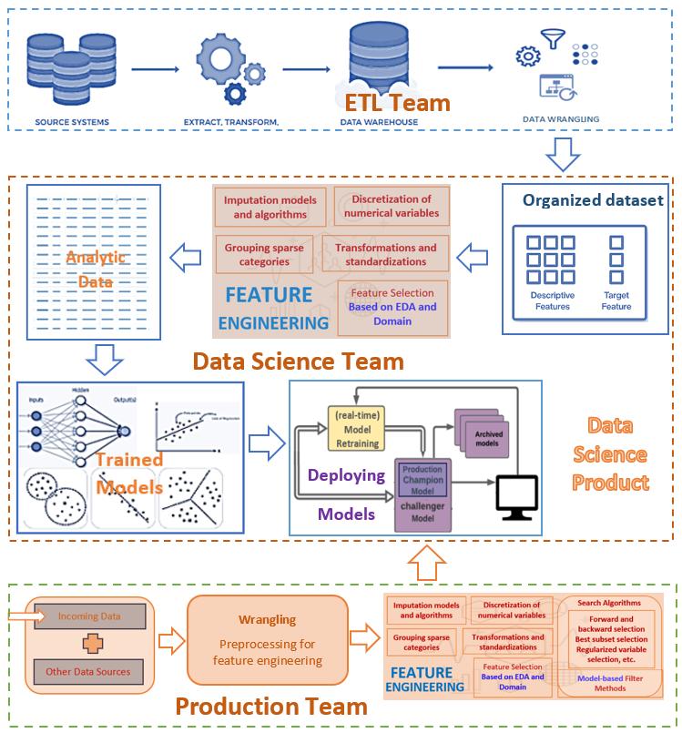
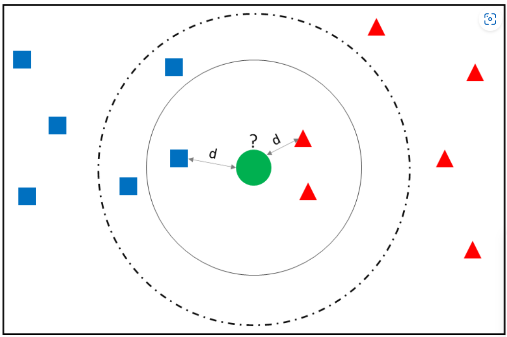
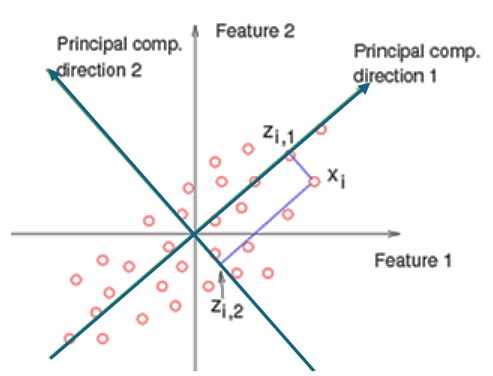
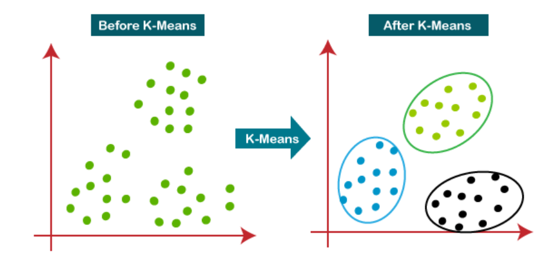
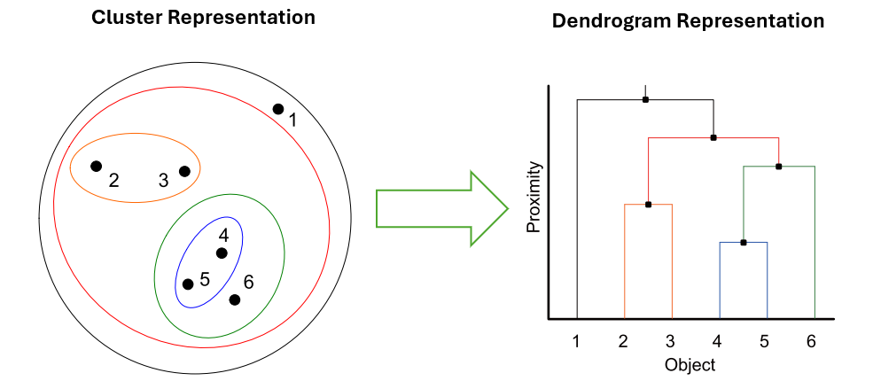
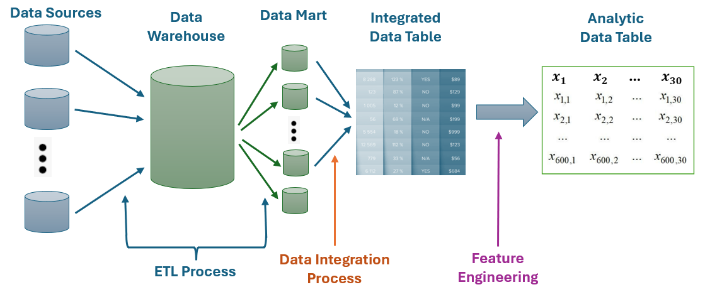
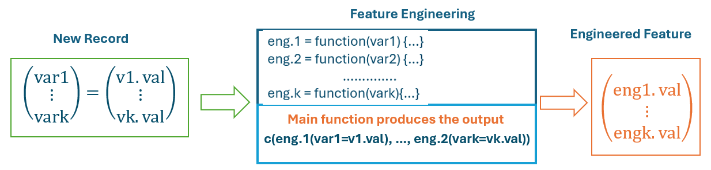
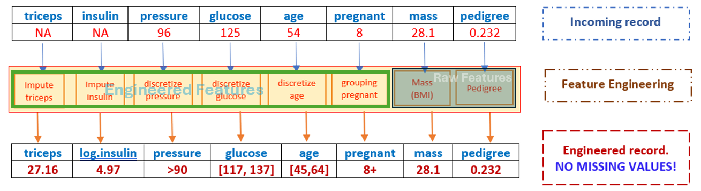
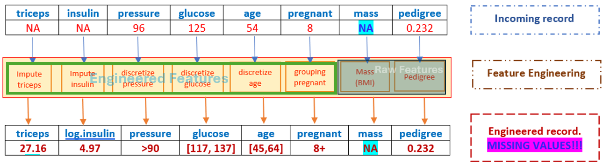

```{=html}

<style type="text/css">

/* Cascading Style Sheets (CSS) is a stylesheet language used to describe the presentation of a document written in HTML or XML. it is a simple mechanism for adding style (e.g., fonts, colors, spacing) to Web documents. */

h1.title {  /* Title - font specifications of the report title */
  font-size: 24px;
  font-weight: bold;
  color: DarkRed;
  text-align: center;
  font-family: "Gill Sans", sans-serif;
}
h4.author { /* Header 4 - font specifications for authors  */
  font-size: 20px;
  font-family: system-ui;
  color: DarkRed;
  text-align: center;
  font-weight: bold;
}
h4.date { /* Header 4 - font specifications for the date  */
  font-size: 18px;
  font-family: system-ui;
  color: DarkBlue;
  text-align: center;
  font-weight: bold;
}
h1 { /* Header 1 - font specifications for level 1 section title  */
    font-size: 22px;
    font-family: "Times New Roman", Times, serif;
    color: navy;
    text-align: center;
    font-weight: bold;
}
h2 { /* Header 2 - font specifications for level 2 section title */
    font-size: 20px;
    font-family: "Times New Roman", Times, serif;
    color: navy;
    text-align: left;
    font-weight: bold;
}

h3 { /* Header 3 - font specifications of level 3 section title  */
    font-size: 18px;
    font-family: "Times New Roman", Times, serif;
    color: navy;
    text-align: left;
}

h4 { /* Header 4 - font specifications of level 4 section title  */
    font-size: 18px;
    font-family: "Times New Roman", Times, serif;
    color: darkred;
    text-align: left;
}

body { background-color:white; }

.highlightme { background-color:yellow; }

p { background-color:white; }

</style>
```

```{r setup, include=FALSE}
# code chunk specifies whether the R code, warnings, and output 
# will be included in the output files.
if (!require("knitr")) {
   install.packages("knitr")
   library(knitr)
}
if (!require("tidyverse")) {
   install.packages("tidyverse")
   library(tidyverse)
}
if (!require("ggplot2")) {
   install.packages("ggplot2")
   library(ggplot2)
}  
if (!require("factoextra")) {
   install.packages("factoextra")
   library(factoextra)
}
if (!require("cluster")) {
   install.packages("cluster")
   library(cluster)
}
if (!require("lubridate")) {
   install.packages("lubridate")
   library(lubridate)
}
if (!require("stringr")) {
   install.packages("stringr")
   library(stringr)
}

knitr::opts_chunk$set(echo = TRUE,       # include code chunk in the output file
                      warnings = FALSE,  # sometimes, you code may produce warning messages,
                                         # you can choose to include the warning messages in
                                         # the output file. 
                      results = TRUE,    # you can also decide whether to include the output
                                         # in the output file.
                      message = FALSE,
                      comment = NA
                      )  
```


\newpage

# Introduction

Recall the following workflow of the data science project.

```{r echo = FALSE, fig.align='center', out.width="70%", fig.cap="Data Science Process"}

```


**Feature engineering** is constructing new input features from the existing raw data to better represent the underlying problem to predictive models, resulting in improved model accuracy on unseen data. As part of the machine learning pipeline, feature engineering comes after data collection, cleaning, and EDA, but before model training and evaluation.

In the previous note, we introduced EDA with visual aids to extract patterns such as distribution, clusters, association, missing values, etc. These patterns can be used as bases to create features to improve the performance of the subsequent modeling and analyses.

In this note, we will explore some techniques that are used to engineer impactful features. Properly applying these techniques enables machine learning algorithms to learn more robust patterns, avoid over-fitting, and enhance predictive accuracy. The key steps in feature engineering include

* **Data Exploration and Understanding**: Explore and understand the dataset, including the types of features and their distributions. Understanding the shape of the data is key.

* **Handling Missing Data**: Address missing values through imputation or removal of instances or features with missing data. There are many algorithmic approaches to handling missing data.

* **Variable Encoding**: Convert categorical variables into a numerical format suitable for machine learning algorithms using methods.

* **Feature Scaling**: Standardize or normalize numerical features to ensure they are on a similar scale, improving model performance.

* **Feature Creation**: Generate new features by combining existing ones to capture relationships between variables.

* **Handling Outliers**: Identify and address outliers in the data through techniques like trimming or transforming the data.

* **Normalization**: Normalize features to bring them to a common scale, important for algorithms sensitive to feature magnitudes.

* **Binning or Discretization**: Convert continuous features into discrete bins to capture specific patterns in certain ranges.

* **Text Data Processing**: If dealing with text data, perform tasks such as tokenization, stemming, and removing stop words.

* **Time Series Features**: Extract relevant time-based features such as lag features or rolling statistics for time series data.

* **Vector Features**: Vector features are commonly used for training in machine learning. In machine learning, data is represented in the form of features, and these features are often organized into vectors. 

* **Feature Selection**: Identify and select the most relevant features to improve model interpretability and efficiency using techniques like univariate feature selection or recursive feature elimination.

* **Feature Extraction**: Feature extraction aims to reduce data complexity (often known as “data dimensionality”) while retaining as much relevant information as possible. This helps to improve the performance and efficiency of machine learning algorithms and simplify the analysis process. Feature extraction may involve the creation of new features (“feature engineering”) and data manipulation to separate and simplify the use of meaningful features from irrelevant ones. Create new features or reduce dimensionality using techniques such as *Principal Component Analysis (PCA)*. 

* **Cross-validation**: selecting features before cross-validation can introduce significant bias. Evaluate the impact of feature engineering on model performance using cross-validation techniques.


<font color = "red">*\color{red}Feature engineering is often an iterative process; evaluate, refine, and repeat as needed to achieve optimal results. These steps may vary based on the nature of the data and the machine learning task, but collectively, they contribute to creating a robust and effective feature set for model training.*</font>

Some of the above tasks are initiated from exploratory data analysis while others can be initiated from modeling. In the next few sections, we will discuss each of the above feature engineering tasks with some examples. A case study with EDA and feature engineering with some illustrative examples.


# EDA-based Feature Engineering 

We have introduced EDA to identify patterns such as distribution, relationships, missing values, etc. When building models and implementing algorithms, we need to assess the assumption based on which the models and algorithms were developed. For example, extremely skewed or multi-modal predictor variables may cause inaccurate prediction, sparse categorical variables (some categories have extremely small counts) cause unstable prediction, etc. We need to use various techniques to create new features to improve the performance of modeling. 

## Handling Missing Values

Imputing missing values is a crucial step in data pre-processing, especially for machine learning and statistical analysis. There are many imputation methods. Here are some common methods for handling missing data:

### Simple Imputation

**Mean/Median/Mode Imputation**: Replace missing values with the mean, median, or mode of the column. This is straightforward but can introduce bias.

**Constant Value Imputation**: Replace missing values with a constant value, such as 0 or -1.

The above two methods are simple to implement but perform poorly 

### Model-based Imputation

**K-Nearest Neighbors (KNN) Imputation**: Use the values from the nearest neighbors to impute missing data. This method can capture local patterns in the data. The following figure explains how KNN imputation works.


```{r echo = FALSE, fig.align='center', out.width="40%", fig.cap="K-nearest neighborhood imputation"}

```

The idea is to replace the missing components with the corresponding components of the **nearest point**. In the above figure. the orange point has at least one missing component, and the red triangle is the nearest point. We replace the missing component(s) of the orange point should be replaced with the corresponding non-missing component(s) in the **red triangle point** based on the KNN imputation method. 


**Multivariate Imputation by Chained Equations (MICE)**: Iteratively imputes missing values by modeling each feature with missing values as a function of other features. We will not discuss the technical development of this method. The R library **mice** can be used to implement MICE imputation.


### Regression Imputation

**Regression Imputation**: Uses regression models to estimate replacements for missing values based on correlations with other features. This method assumes that there is one or more variables that are correlated. The process of regression imputation involves the following steps:

**Step 1**: The first step in regression imputation is to identify the variables with missing data. Once these variables have been identified, they can be used as the dependent variables in the regression model. 

**Step 2**: The next step is to identify the variables that can be used as independent variables in the regression model. These variables should be strongly correlated with the dependent variable and should not have missing values themselves.

**Step 3**: Fit a regression model Once the variables have been identified, a regression model can be fit using the available data. The regression model can be any appropriate regression model, such as linear regression or logistic regression.

**Step 4**: Use the regression model to impute missing values Finally, the regression model can be used to predict the missing values. The predicted values can be substituted for the missing values in the data set.


## Discretization

Discretization is a technique in feature engineering where continuous variables are converted into discrete intervals or categories. This can simplify the feature space and sometimes improve model performance, especially for algorithms that handle categorical data better. Here are some common methods of discretization.


### Equal Width Binning

Equal width binning divides the range of the variable into intervals of equal width. The following toy example demonstrates this method.

```{r}
# Sample data
data <- data.frame(value = c(1.1, 2.3, 3.5, 4.7, 5.9))

# Equal width binning
data$bin <- cut(data$value, breaks = 3, labels = c("Low", "Medium", "High"))
print(data)
```


### Equal Frequency Binning

Equal frequency binning divides the data into intervals that contain approximately the same number of observations. This method is sometimes used to develop a chi-squared test for the goodness-of-fit test. The following is a simple example with R code.

```{r}
# Sample data
data <- data.frame(value = c(1.1, 2.3, 3.5, 4.7, 5.9))

# Equal frequency binning
data$bin <- cut(data$value, breaks = quantile(data$value, probs = seq(0, 1, by = 1/3)), 
                include.lowest = TRUE, include.highest = TRUE, labels = c("Low", "Medium", "High"))
print(data)
```

### Other Binning Methods

**Unequal Width Binning**: In some applications, unequal binning is used based on practical considerations. For example, in clinical studies, age is usually discretized based on clinical considerations.

**Algorithm-based Discretization** - there are several machine learning algorithms such as k-mean and decision trees can also be used for discretizing continuous variables.


## Variable transformation

Feature transformation is a key part of feature engineering in machine learning. Depending on the models and algorithms to be used and the patterns observed in EDA, it involves different transformations to convert raw data into a format that is more suitable for model training and prediction. Here are some common types of feature transformations:

### Conventional Transformations

**Log Transformation**: Applying a logarithmic function to skewed data to make it more normally distributed. This is particularly useful for data with exponential growth patterns.

**Polynomial Features**: Creating new features by raising existing features to a power. This can help capture non-linear relationships in the data.


### Box-Cox Transformation

**Box-cox Transformation**: The Box-cox transformation is a statistical technique used to transform non-normal dependent variables into a normal distribution. This transformation is particularly useful in improving the accuracy of predictions made using linear regression and other statistical models that assume normality. The transformation takes the following form

$$
y_{\text{new}} = \left\{
   \begin{array}{lcl}
   \frac{y^\lambda -1}{\lambda} & \text{if} & \lambda \ne 0 \\
   \log(y) & \text{if} & \lambda = 0.
   \end{array}
 \right.
$$
Parameter $\lambda$ is estimated from the data. We can see that the log transformation is a special Box-cox transformation.

The Box-cox transformation is used for 

**Normalization**: It helps in transforming skewed data to resemble a normal distribution.

**Variance Stabilization**: It can stabilize variance across levels of the data.

**Improving Model Performance**: By meeting the assumptions of normality, it enhances the performance of statistical models.


The $y$ has negative values, we need to use the modified version of Box-cox or use other transformations to convert $y$ into a positive variable before applying the Box-cox transformation.

**Example**: To perform a Box-Cox transformation in R, you can use the `boxcox` function from the MASS package. This function helps find the optimal $\lambda$ value to transform the given data to approximate a normal distribution. 

```{r fig.align='center', fig.width=7, fig.height=4, fig.cap="Box-Cox Transformation Demonstration"}

library(MASS)
y <- c(1, 1, 1, 2, 2, 2, 2, 2, 2, 3, 3, 3, 6, 7, 8)
x <- c(7, 7, 8, 3, 2, 4, 4, 6, 6, 7, 5, 3, 3, 5, 8)

#Fit a Linear Regression Model:
model = lm(y~x)
#Find the Optimal Lambda for Box-Cox Transformation:
bc <- boxcox(y ~ x, lambda = seq(-2, 2, 1/10))
lambda <- bc$x[which.max(bc$y)]

#Fit a New Linear Regression Model Using the Box-Cox Transformation:
new_model <- lm(((y^lambda - 1) / lambda) ~ x)
## Visualize the Differences in Residuals:
op <- par(pty = "s", mfrow = c(1, 2))
qqnorm(model$residuals)
qqline(model$residuals)
qqnorm(new_model$residuals)
qqline(new_model$residuals)
par(op)
```


The boxcox function computes the log-likelihood for different values of $\lambda$ and helps identify the optimal $\lambda$. The new model uses the transformed response variable to improve normality and meet the assumptions of linear regression. To check whether the transformed variable follows a normal distribution, we can use Q-Q plots to visualize the normality of residuals before and after the transformation.

\

## Outlier handling

Handling outliers in R is a crucial step in feature engineering to ensure the robustness of your models. Here are some common techniques for detecting and handling outliers in R:

* Graphical approaches include boxplot, scatter plot, etc.

* Statistical approaches include Z-score transformation, and interquartile range (IQR).

Several methods are commonly used to handle outliers, among trimming, capping (Winsorizing), imputation, transformation, and binning, transformation and binning are commonly used in classical statistics.

\


# Model-based Feature Extraction

Model/algorithm-based feature extraction methods clustering, principal component analysis (PCA), etc. 

## Principal Component Analysis (PCA)

Principal Component Analysis (PCA) is a powerful technique used to reduce the dimensionality of data while retaining most of the variance. 


```{r echo = FALSE, fig.align='center', out.width="60%", fig.cap="Illustration of principal component analysis"}

```

The technical description will be discussed later. Here’s a step-by-step example of how to perform PCA in R using the *USArrests dataset*, which contains data on arrests per 100,000 residents for various crimes in each U.S. state. The data set is built in the library *tidyverse*. The following R code implements PCA.

```{r fig.align='center', fig.width=8, fig.height=5, fig.cap="Implementing principal component analysis (PCA)"}
# Load the dataset
data("USArrests")
# View the first few rows of the dataset
head(USArrests)
# Summary of the data
summary(USArrests)
# Standardize the data
USArrests_scaled <- scale(USArrests)
# Perform PCA
pca_result <- prcomp(USArrests_scaled, center = TRUE, scale. = TRUE)
# Summary of PCA results
summary(pca_result)
# setting up plot layout
#par(mfrow =c(1,2))
# Scree plot
screeplot(pca_result, type = "lines")
# Biplot
#biplot(pca_result, scale = 0)
```

The next step is to extract the new feature variables. For comparison, we add the new features to the original data set.

```{r}
PCA.scores = round(pca_result$x,5)
combined.data = cbind(USArrests, PCA.scores)
head(combined.data )
```

**Comments**: A few comments on PCA:

1. PCA scores are transformed from the original features. Therefore, PCA is a model-based transformation.

2. The PCA is also called a **dimension reduction method** because, in this example, the first three PCs carry about $96\%$ of the total information in the original 4 features. In modeling, we simply use the first three PCs and ignore the fourth one. In other words, we can reduce the dimension from 4 to three after performing PCA!

3. It is dependent on the application and your tolerance of information loss to decide the number of PCs to retain for the subsequent analyses. If you decide to carry at least $85\%$ information in the original feature sets, you only need to choose the first 2 PCs for the subsequent analysis.

4. <font color = "red">**\color{red}The PCA is only performed on numerical variables that we at the same scale and correlated!**</font>. In classical inferential statistics, we should also consider the interpretability of the PCA. In machine learning, we can consider this as a black-box procedure.

5. We can extract the factor loading from PCA (which is a system of orthogonal linear transformation - a typical topic covered in a linear algebra course).

6. The method of PCA is also one of the information aggregation methods.

\

## Cluster Analysis

Unlike the PCA in which the original features are transformed to PCs and retain **strong** PCs for subsequent analyses and drop **weak** PCs to reduce the dimension of the data, clustering employs the topological shape and structure to cluster data points that are **close to each other** based on **some distances**. The distance used in data science is not necessarily to be *Euclidean*. There are different types of *distances* in data science algorithms. More detailed information on clustering will be discussed in future notes. Here are two commonly used clustering algorithms.

### K-means Clustering

K-means clustering is a popular unsupervised machine learning algorithm used to partition a dataset into ($k$) distinct, non-overlapping clusters. The basic steps for implementing **k-means clustering** for numerical features are outlined in the following.

1. **Initialization**: Choose the number of clusters ($k$) and randomly initialize ($k$) cluster centroids.

2. **Assignment**: Assign each data point to the nearest cluster centroid based on the *Euclidean distance*.

3. **Update**: Recalculate the centroids as the mean of all data points assigned to each cluster.

4. **Repeat**: Repeat the assignment and update steps until the centroids no longer change significantly or a maximum number of iterations is reached.


```{r echo = FALSE, fig.align='center', out.width="90%", fig.cap="K-means clustering analysis"}

```

The following is a simple example with R code using **USA arrest Data**. To visualize the clusters, we first perform PCA and use the first two PCs to make the scatter plot. The following R code use library ****

```{r fig.align='center', fig.width= 6, fig.height=4, fig.cap="Visualizing clusters based on k-means"}
# Load and prepare data
data("USArrests")
df <- na.omit(USArrests)
df <- scale(df)

# Perform K-means clustering
set.seed(123)  # For reproducibility
kmeans_result <- kmeans(df, centers = 3, nstart = 25)

# Visualize clusters
fviz_cluster(kmeans_result, data = df, xlab="PC1", ylab = "PC2")
```

**What is the new feature?** - <font color = "red">*\color{red}The new feature extracted from the data is the vector of the cluster labels!*</font>.

In R, we extract the cluster labels using the following code.

```{r}
clust.ID = kmeans_result$cluster
cbind(USArrests, clust.ID)
```

### Hierarchical Clustering

Hierarchical clustering is a method of cluster analysis in data mining and statistics that builds a hierarchy of clusters. There are two main types:

**Agglomerative (Bottom-Up) Approach**: Each observation starts in its own cluster, and pairs of clusters are merged as one moves up the hierarchy.

**Divisive (Top-Down) Approach**: All observations start in one cluster, and splits are performed recursively as one moves down the hierarchy.
The results are often presented in a dendrogram, a tree-like diagram that shows the arrangement of the clusters produced by the algorithm.

We will discuss these methods in detail in a future note. The following figure illustrates the rough idea of hierarchical clustering.


```{r echo = FALSE, fig.align='center', out.width="80%", fig.cap="Hierarchical clustering illustration"}

```

\


# Other Methods of Feature Creation

It is quite often to create new feature variables based on existing features through basic algebraic operations and string manipulations. This section introduces a few commonly used methods. Some of the methods are also considered as transformations.

## Extracting Features from Text

In many cases, your integrated data set may have fields containing information such as home address, email address, text of vial labels, etc. 

```{r echo = FALSE, fig.align='center', out.width="60%", fig.cap="Example of vial label containing dose information"}

```

R has many string functions you can use to locate the particular information such as ZIP code in the address, email domain in the email address, dose information in the vial labels, etc. in the text and then extract it to define new feature variables. As an example, the following R code illustrates how to extract the email domain from the email address using `sub()` or `str_extract()` functions.

```{r}
#library(stringr)
# email addresses
emails <- c("user1@example.com", "user2@domain.org", "user3@company.net")

# Extract domains
domains <- sub(".*@", "", emails)  # sub() is a function in the base package
print(domains) # [1] "example.com" "domain.org" "company.net"

# using library {stringr}

# Extract domains
domains <- str_extract(emails, "(?<=@).*")
print(domains) # [1] "example.com" "domain.org" "company.net"
```


## Extracting Feature from Dates

Extracting features from dates in R can be quite straightforward, especially with the help of the `lubridate` package. Here are some common tasks and how to accomplish them. The following code illustrates how to use R functions in the `lubridate` package to extract various pieces of information from date.

```{r}
#library(lubridate)

# Example date
date <- ymd("2024-08-29")

# Extract year, month, and day
year <- year(date)
month <- month(date)
day <- day(date)

print(year)  # 2024
print(month) # 8
print(day)   # 29

# extract weekday
weekday <- wday(date, label = TRUE)
print(weekday) # "Thu"

#extracting quarter
quarter <- quarter(date)
print(quarter) # 3

# extracting Day of the Year
day_of_year <- yday(date)
print(day_of_year) # 242

#extracting week of the year
week_of_year <- week(date)
print(week_of_year) # 35
```

## Feature Scaling/Standardization

Feature scaling, including standardization, is a crucial step in data preprocessing, especially for machine learning models. It ensures that all features contribute equally to the model and prevents features with larger scales from dominating. Here are some common methods for feature scaling in R.

### Standardization
Standardization scales the data so that it has a mean of 0 and a standard deviation of 1. This is done using the formula
$$
z = \frac{x-\mu}{\sigma}
$$
where $x$ is the original feature value, $\mu$ is the mean of the feature, and $\sigma$ is the standard deviation. We can also use the `scale()` function in R to standardize the data. The following is an example of standardization.

```{r}
# Example data frame
data <- data.frame(Age = rnorm(500, 50, 8), Weight = rnorm(500, 80, 10))

# Standardize the data
data_standardized <- scale(data)
print(head(data_standardized))
```


### Min-Max Normalization

Min-Max normalization scales the data to a fixed range, usually [0, 1]. This is done using the formula:

$$
x^\prime = \frac{x - \min(x)}{\max(x) - \min(x)}
$$

Here’s how we apply Min-Max normalization in R.


```{r}
# Min-Max normalization function
min.max.norm <- function(x) {
  (x - min(x)) / (max(x) - min(x))
}

# generate data
data <- data.frame(Age = rnorm(500, 50, 8), Weight = rnorm(500, 80, 10))

# Apply to data frame
data.normalized <- as.data.frame(lapply(data, min.max.norm))
print(head(data.normalized))
```

### Robust Scaling

Robust scaling uses the median and the interquartile range (IQR) to scale the data, making it less sensitive to outliers. The formula is

$$
x^\prime =\frac{x - \text{median}(x)}{\text{IQR}(x)}
$$
Here is an example in R of robust scaling in R.

```{r}
# Robust scaling function
robust.Scaling <- function(x) {
  qq = quantile(x, probs = seq(0, 1, 0.25), na.rm = FALSE, names = TRUE, type = 7)
  (x - qq[3]) / (qq[4] - qq[2])
}

# generate data
data <- data.frame(Age = rnorm(500, 50, 8), Weight = rnorm(500, 80, 10))

# Apply to data frame
data.scaled <- as.data.frame(lapply(data, robust.Scaling))
print(head(data.scaled))
```


# Wrapping Up Feature Engineering

Feature engineering is a part of the data science process as described in the following figure. 

```{r echo = FALSE, fig.align='center', out.width="90%", fig.cap = "Part of data science that resukt in an analytic data set."}

```

Feature engineering is an input-process-out (IPO) model that can be capsulated and organized with a function in R or other programming languages.


```{r echo = FALSE, fig.align='center', out.width="90%", fig.cap = "Wrapping up feature engineering."}

```

The idea is to write a function to accept records from the integrated data and produce engineered records to feed candidate models for prediction.


# Concluding Remarks

It is dependent on specific applications, data experience, technical expertise, and amount of effort, one can engineer features in different ways that result in different accuracy with the same model. This note discussed the basic feature engineering methods that are commonly used in data science projects. We will discuss more feature engineering methods in different applications in the subsequent machine learning course.   


```{r echo = FALSE, fig.align='center', out.width="40%"}
include_graphics("img/BeginWithEndInMind.png")
```


Special attention must paid to missing value. Feeding an engineered record with missing components to a predictive model will end up with a missing predicted value. For example, a subset of features were engineered and the rest of the features were not engineered (i.e., the original features were used to feed the final model). 

```{r echo = FALSE, fig.align='center', out.width="95%"}

```

The above-engineered record has no missing component. Feeding this *normal* engineered record to the final model will result in a *normal* result. However, if the incoming new records contain missing components, the missing components will be passed to the **engineered records**.


```{r echo = FALSE, fig.align='center', out.width="95%"}

```

The above-engineered record still has a missing component. Feeding this engineered record with missing components will generate a missing predicted value. This is practically important since it will prevent the potential failure prediction from a dynamic prediction system!
