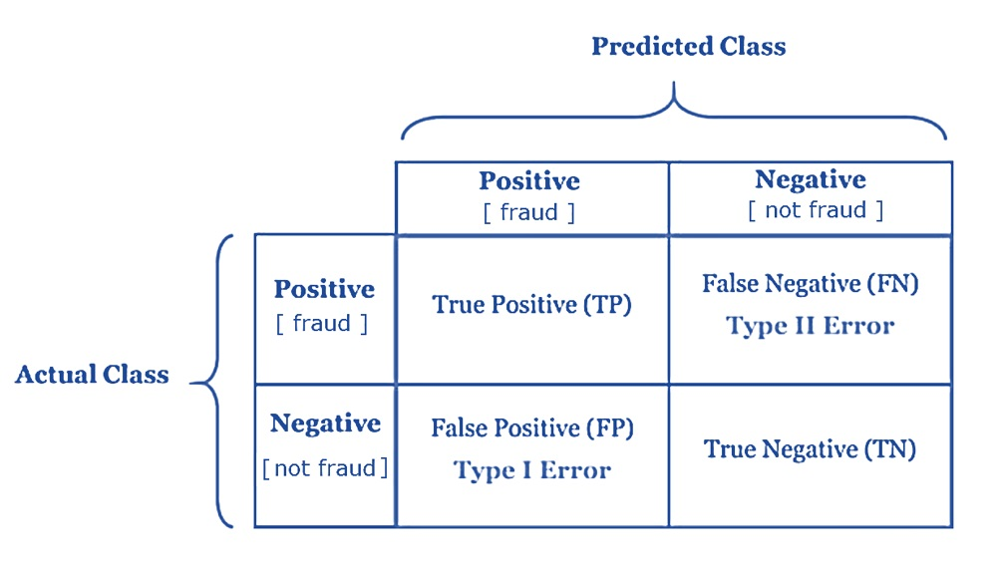
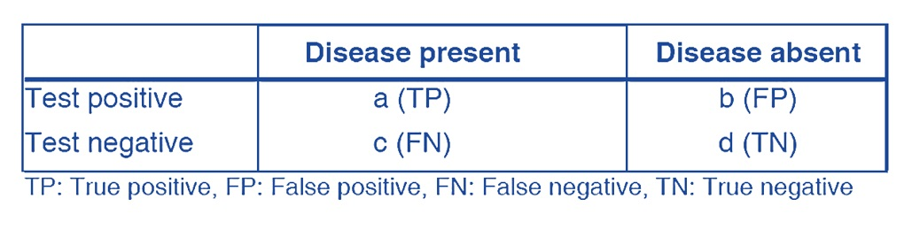
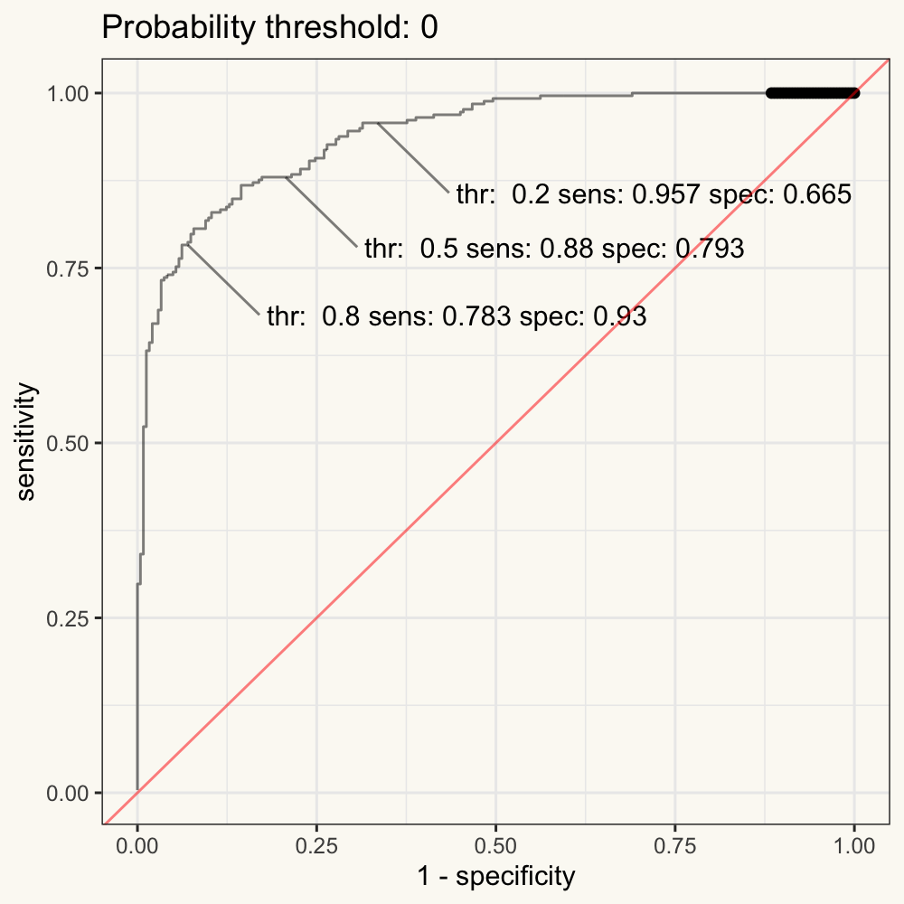
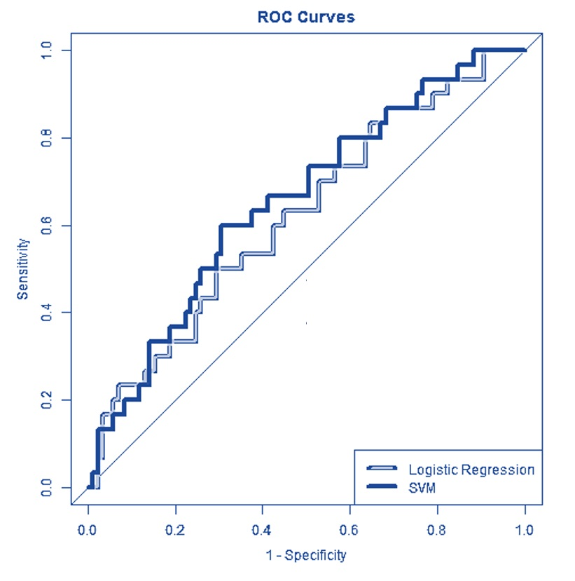

<style type="text/css">

div#TOC li {
    list-style:none;
    background-image:none;
    background-repeat:none;
    background-position:0;
}

h1.title {
  font-size: 20px;
  color: DarkRed;
  text-align: center;
}
h4.author { /* Header 4 - and the author and data headers use this too  */
    font-size: 18px;
  font-family: "Times New Roman", Times, serif;
  color: DarkRed;
  text-align: center;
}
h4.date { /* Header 4 - and the author and data headers use this too  */
  font-size: 18px;
  font-family: "Times New Roman", Times, serif;
  color: DarkBlue;
  text-align: center;
}
h1 { /* Header 3 - and the author and data headers use this too  */
    font-size: 22px;
    font-family: "Times New Roman", Times, serif;
    color: darkred;
    text-align: center;
}
h2 { /* Header 3 - and the author and data headers use this too  */
    font-size: 18px;
    font-family: "Times New Roman", Times, serif;
    color: navy;
    text-align: left;
}

h3 { /* Header 3 - and the author and data headers use this too  */
    font-size: 15px;
    font-family: "Times New Roman", Times, serif;
    color: navy;
    text-align: left;
}

h4 { /* Header 4 - and the author and data headers use this too  */
    font-size: 18px;
    font-family: "Times New Roman", Times, serif;
    color: darkred;
    text-align: left;
}
</style>

```{r setup, include=FALSE}
# code chunk specifies whether the R code, warnings, and output 
# will be included in the output files.
#if (!require("webshot")) {
#   install.packages("webshot")
#   library(webshot)
#}
if (!require("psych")) {
   install.packages("psych")
   library(psych)
}
if (!require("cocron")) {
   install.packages("cocron")
   library(cocron)
}
if (!require("knitr")) {
   install.packages("knitr")
   library(knitr)
}
if (!require("pROC")) {
   install.packages("pROC")
   library(pROC)
}
#if (!require("klippy")) {
#   install.packages("klippy")
#   library(klippy)
#}

# knitr::opts_knit$set(root.dir = "C:/Users/75CPENG/OneDrive - West Chester University of PA/Documents")
# knitr::opts_knit$set(root.dir = "C:\\STA490\\w05")

knitr::opts_chunk$set(echo = TRUE,       
                      warning = FALSE,   
                      result = TRUE,   
                      message = FALSE,
                      fig.align='center', 
                      fig.pos = 'ht')

#klippy::klippy(position = c('top', 'right'),
#               color = 'darkred',
#               tooltip_message = 'Click to copy', 
#               tooltip_success = 'Done')
```

\


# Introduction

In this note, we summarize the performance measures that are used in data science projects (i.e. in both machine learning and classical statistics). The focus is on the measures related to classification and regression models and algorithms.


Note that, in practice, looking at a single metric may not give us the whole picture of the problem we are trying to solve. In other words, we may want to use a set of metrics to have a concrete evaluation of the candidate models and algorithms. 

# Classification Performance Metrics 

Since the performance measures for regression models are relatively simple, we focus on the commonly used performance measures of binary classification models and algorithms.

## Confusion Matrix for Binary Decision

We have used the logistic regression model as an example to illustrate the cross-validation method. Most of the performance measures are defined based on the confusion matrix. 

Consider a binary classification (prediction) model that passed all diagnostics and model selection processes. Any binary decision based on the model will inevitably result in two possible errors that are summarized in the following confusion matrix (as mentioned and used in the previous case study).


```{r echo=FALSE, fig.align='center', fig.width=3, fig.height=3, fig.cap="Figure 1. The layout of the binary decision confusion matrix."}

```

The following are a few probabilities that will be used as the element in the definition of performance measures.

* **True Positive (TP)** is the number of correct predictions that an example is positive which means positive class correctly identified as positive - <font color = "red"><b>P[Predicted Positive | Actual Positive]</b></font>.

* **False Negative (FN)** is the number of incorrect predictions that an example is negative which means positive class incorrectly identified as negative - <font color = "red"><b>P[Predicted Negative | Actual Positive]</b></font>.
   

* **False positive (FP)** is the number of incorrect predictions that an example is positive which means negative class incorrectly identified as positive - <font color = "red"><b>P[Predicted Positive | Actual Negative]</b></font>.
  

* **True Negative (TN)** is the number of correct predictions that an example is negative which means negative class correctly identified as negative - <font color = "red"><b>P[Predicted Negative | Actual Negative]</b></font>.


The above conditional probabilities are defined by conditioning on the **actual status**. These probabilities are used to assess the model performance in the stage of model development.

One of the important steps in the data science process is to monitor the performance of the deployed models in the production environment. We can use a different set of conditional probabilities for this purpose.

* **Positive Predictive Value (PPV)** is the percentage of predictive positives that are confirmed to be positive - <font color = "red"><b>P[ Confirmed Positive | Predicted Positive]</b></font>. In the clinical term, PPV is the percentage of patients with a positive test who actually have the disease.


* **Negative Predictive Value (NPV)** is the percentage of predictive positives that are confirmed to be positive - <font color = "red"><b>P[ Confirmed Negative | Predicted Negative]</b></font>. In the clinical term, NPV is the percentage of patients with a negative test who do not have the disease.


## Local Performance Measures (for Model Development)

For ease of understanding, we use the following hypothetical confusion matrix based on the clinical binary decision.

```{r echo=FALSE, fig.align='center', fig.width=3, fig.height=3, fig.cap="Figure 2. The layout of the clinical binary decision confusion matrix."}

```

The following performance measures are defined based on the above confusion matrix.

* **Classification Accuracy** measures the percentage of labels that are correctly predicted.

$$
\mbox{accuracy} = \frac{a + d}{a + b + c + d}
$$


* **Precision** is a valid performance measure for a class whose distribution is imbalanced (one class is more frequent than others). In this case, even if we predict all samples as the most frequent class, we would get a high accuracy rate. This does not make sense at all because your model is not learning anything, and is just predicting everything as the top class. **Precision** measures the percentage of true positives among all predictive positives.

$$
\mbox{precision} = \frac{a}{a + b}
$$


* **Recall** is another important metric, which is defined as the fraction of samples from a class that is correctly predicted by the model. More formally,

$$
\mbox{Recall} = P[\mbox{predict disaese} | \mbox{Actual disease}] = \frac{a}{a+c}
$$


* **F1 Score**: Depending on the application, we may want to give higher priority to recall or precision. But there are many applications in which both recall and precision are important. Therefore, it is natural to think of a way to combine these two into a single metric. One popular metric which combines precision and recall is called F1-score, which is the harmonic mean of precision and recall defined as

$$
F_1 = \frac{2 \times \mbox{precision}\times \mbox{recall}}{\mbox{precision}+\mbox{recall}}
$$

The generalized version of the F-score is defined below. As we can see F1-score is a special case of $F_{\beta}$ when $\beta= 1$.

$$
F_1 = \frac{(1+\beta^2) \times \mbox{precision}\times \mbox{recall}}{\beta^2(\mbox{precision}+\mbox{recall})}
$$

It is good to mention that there is always a trade-off between the precision and recall of a model. If we want to make the precision too high, we would end up seeing a drop in the recall rate, and vice versa.


## Global Performance Measures
Sensitivity and specificity are two other popular metrics mostly used in medical and biology-related fields. They are used as building blocks for well-known global measures such as ROC and the area under the curve (AUC). They are defined in the forms of conditional probability in the following based on the above clinical confusion matrix.

* **Sensitivity (True Positive Rate, Recall)** - The probability of those who received a positive result on this test out of those who actually have a disease (when judged by the ‘Gold Standard’). It is the same as **recall**.

$$
\mbox{sensitivity} = \frac{a}{a+c}
$$

* **Specificity (True Negative Rate)** - The probability of those who received a negative result on this test out of those who do not actually have the disease (when judged by the ‘Gold Standard’).

$$
\mbox{specificity} = \frac{d}{b + d}
$$

Next, we define a metric to assess the global performance measure for the binary decision models and algorithms. From the previous case study of cross-validation. Each candidate cut-off probability defines a confusion matrix and, consequently, sensitivity and specificity associated with the confusion matrix.


* **An ROC curve (receiver operating characteristic curve)** is a graph showing the performance of a classification model at all classification thresholds. This curve plots two parameters: sensitivity and (1 - specificity).  Note that the (1 - specificity = false positive rate).

In other words, the ROC curve is the plot of the False Positive Rate (FPR) against the True Positive Rate (TPR) calculated from each decision boundary (such as the cut-off probability in logistic models).

```{r echo=FALSE, fig.align='center', fig.width=3, fig.height=3, fig.cap="Figure 3. Animated ROC curve."}
if (knitr:::is_latex_output()) {
  knitr::asis_output('\\url{https://github.com/pengdsci/STA551/blob/main/w06/img/w06-Animated-ROC.gif}')
} else {
  
}
```

The primary use of the ROC is to compare the global performance between candidate models (that are not necessarily to be within the same family). As an illustrative example, the following ROC curves are calculated based on a logistic regression model and a support vector machine (SVM). Both are binary classifiers.


```{r echo=FALSE, fig.align='center', fig.width=3, fig.height=3, fig.cap="Figure 4. Using ROC for model selection."}

```

We can see that the SVM is globally better than the logistic regression. However, at some special decision boundaries, the logistic regression model is locally better than SVM.


* **Area Under The Curve (AUC)** 

If two ROC curves intersect at least one point, we may want to report the area under the curves (AUC) to compare the global performance between the two corresponding models. See the illustrative example below. 

```{r echo=FALSE, fig.align='center', fig.width=3, fig.height=3, fig.cap="Figure 4. Using ROC for model selection."}
include_graphics("img/w06-Equal-AUC-ROC.jpg")
```


# Case Study - Logistic regression model with the fraud data

This case study shows how to calculate the local and global performance metrics for logistic predictive models. We have used the confusion matrix in the case study in the previous note. Here we will use the optimal cut-off probability as the decision threshold to define a confusion matrix and then define the performance measure based on this matrix.

We reload the data and create the training and testing data sets. We pretend the optimal cut-off probability is based on what is obtained through the CV. The testing data set will be used to report the local and global performance measures.


```{r}
fraud.data = read.csv("https://pengdsci.github.io/datasets/FraudIndex/fraudidx.csv")[,-1]
## recode status variable: bad = 1 and good = 0
good.id = which(fraud.data$status == " good") 
bad.id = which(fraud.data$status == "fraud")
##
fraud.data$fraud.status = 0
fraud.data$fraud.status[bad.id] = 1
nn = dim(fraud.data)[1]
train.id = sample(1:nn, round(nn*0.7), replace = FALSE) 
training = fraud.data[train.id,]
testing = fraud.data[-train.id,]
```
## Local Performance Meaures

Since we have identified the optimal cut-off probability to be 0.57. Next, we will use the **testing data** set to report the local measures.

```{r}
test.model = glm(fraud.status ~ index, family = binomial(link = logit), data = training)
newdata = data.frame(index= testing$index)
pred.prob.test = predict.glm(test.model, newdata, type = "response")
testing$test.status = as.numeric(pred.prob.test > 0.57)
### components for defining various measures
TN = sum(testing$test.status ==0 & testing$fraud.status==0)
FN = sum(testing$test.status ==0 & testing$fraud.status ==1)
FP = sum(testing$test.status ==1 & testing$fraud.status==0)
TP = sum(testing$test.status ==1 & testing$fraud.status ==1)
###
sensitivity = TP / (TP + FN)
specificity = TN / (TN + FP)
###
precision = TP / (TP + FP)
recall = sensitivity
F1 = 2*precision*recall/(precision + recall)
metric.list = cbind(sensitivity = sensitivity, 
                    specificity = specificity, 
                    precision = precision,
                    recall = recall,
                    F1 = F1)
kable(as.data.frame(metric.list), align='c', caption = "Local performance metrics")
```


## Global Measure: ROC and AUC

In order to create an ROC curve, we need to select a sequence of decision thresholds and calculate the corresponding sensitivity and specificity. 

**CAUTION**: ROC and AUC are used for model selection, we still use the **training data** to construct the ROC and calculate the AUC.

```{r}
cut.off.seq = seq(0, 1, length = 100)
sensitivity.vec = NULL
specificity.vec = NULL
### 
training.model = glm(fraud.status ~ index, family = binomial(link = logit), data = training)
newdata = data.frame(index= training$index)
pred.prob.train = predict.glm(training.model, newdata, type = "response")
for (i in 1:100){
  training$train.status = as.numeric(pred.prob.train > cut.off.seq[i])
### components for defining various measures
TN = sum(training$train.status == 0 & training$fraud.status == 0)
FN = sum(training$train.status == 0 & training$fraud.status == 1)
FP = sum(training$train.status == 1 & training$fraud.status == 0)
TP = sum(training$train.status == 1 & training$fraud.status == 1)
###
sensitivity.vec[i] = TP / (TP + FN)
specificity.vec[i] = TN / (TN + FP)
}
one.minus.spec = 1 - specificity.vec
sens.vec = sensitivity.vec
## A better approx of ROC, need library {pROC}
  prediction = pred.prob.train
  category = training$fraud.status == 1
  ROCobj <- roc(category, prediction)
  AUC = round(auc(ROCobj),4)
##
par(pty = "s")   # make a square figure
plot(one.minus.spec, sens.vec, type = "l", xlim = c(0,1), ylim = c(0,1),
     xlab ="1 - specificity",
     ylab = "sensitivity",
     main = "ROC curve of Logistic Fraud Model",
     lwd = 2,
     col = "blue", )
segments(0,0,1,1, col = "red", lty = 2, lwd = 2)
#AUC = round(sum(sens.vec*(one.minus.spec[-101]-one.minus.spec[-1])),4)
text(0.8, 0.3, paste("AUC = ", AUC), col = "blue", cex = 0.8)
```


