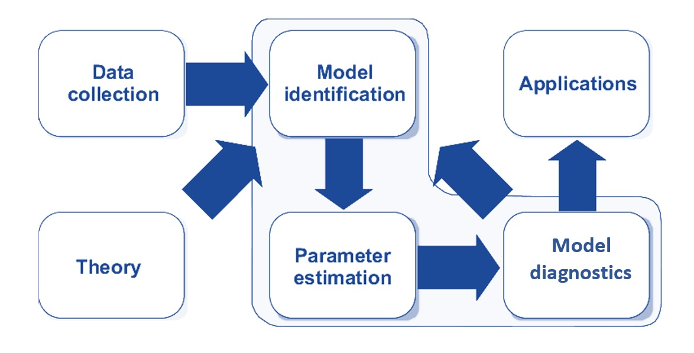
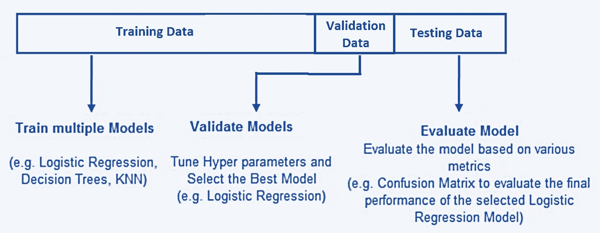
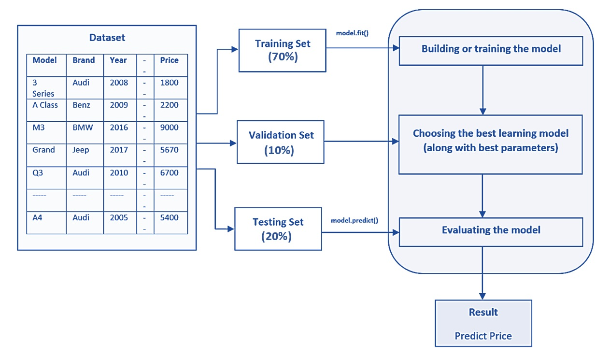
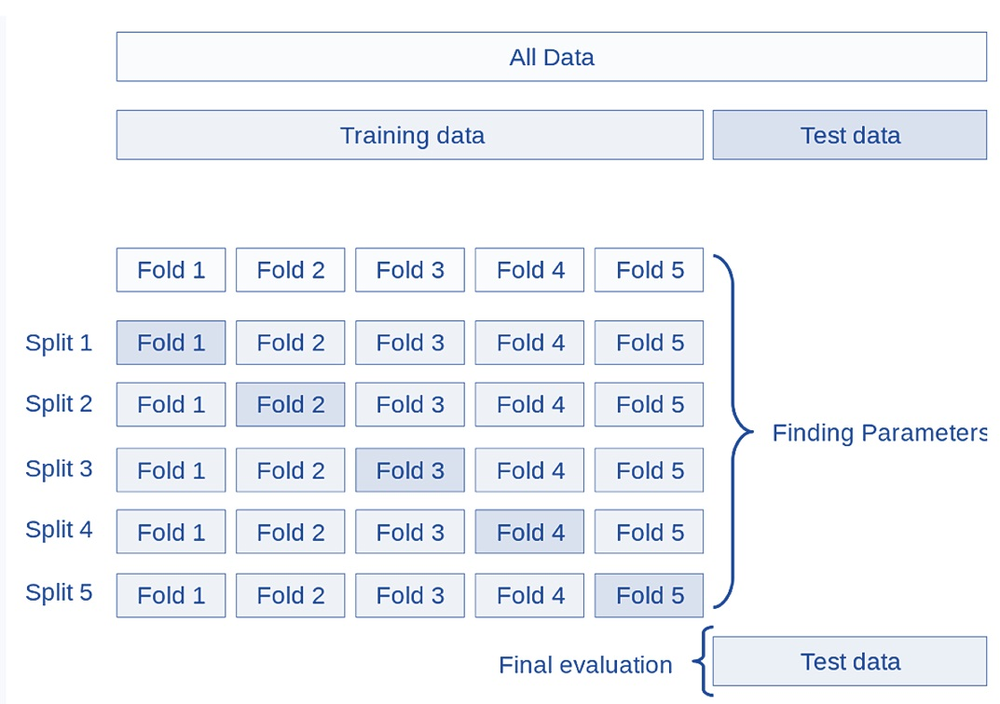
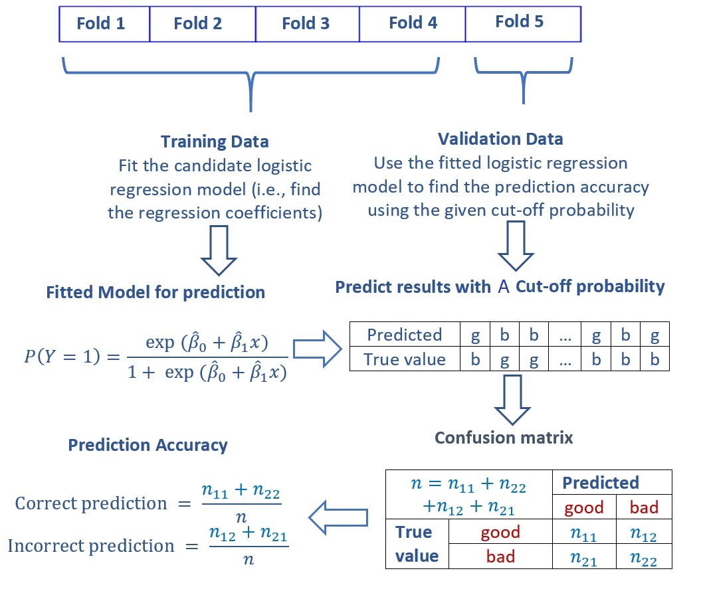
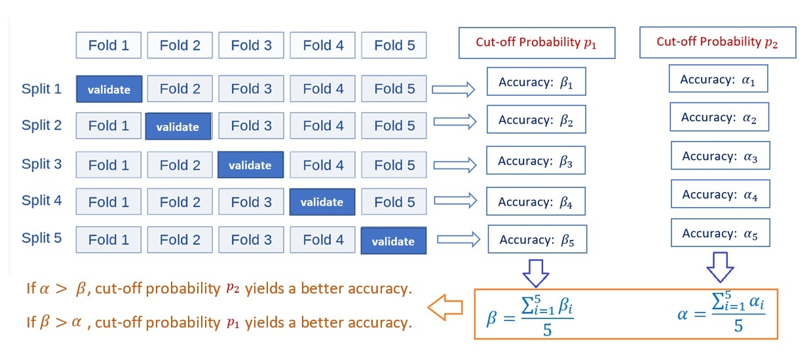

<style type="text/css">

div#TOC li {
    list-style:none;
    background-image:none;
    background-repeat:none;
    background-position:0;
}

h1.title {
  font-size: 20px;
  color: DarkRed;
  text-align: center;
}
h4.author { /* Header 4 - and the author and data headers use this too  */
    font-size: 18px;
  font-family: "Times New Roman", Times, serif;
  color: DarkRed;
  text-align: center;
}
h4.date { /* Header 4 - and the author and data headers use this too  */
  font-size: 18px;
  font-family: "Times New Roman", Times, serif;
  color: DarkBlue;
  text-align: center;
}
h1 { /* Header 3 - and the author and data headers use this too  */
    font-size: 22px;
    font-family: "Times New Roman", Times, serif;
    color: darkred;
    text-align: center;
}
h2 { /* Header 3 - and the author and data headers use this too  */
    font-size: 18px;
    font-family: "Times New Roman", Times, serif;
    color: navy;
    text-align: left;
}

h3 { /* Header 3 - and the author and data headers use this too  */
    font-size: 15px;
    font-family: "Times New Roman", Times, serif;
    color: navy;
    text-align: left;
}

h4 { /* Header 4 - and the author and data headers use this too  */
    font-size: 18px;
    font-family: "Times New Roman", Times, serif;
    color: darkred;
    text-align: left;
}
</style>

```{r setup, include=FALSE}
# code chunk specifies whether the R code, warnings, and output 
# will be included in the output files.

if (!require("psych")) {
   install.packages("psych")
   library(psych)
}
if (!require("cocron")) {
   install.packages("cocron")
   library(cocron)
}
if (!require("knitr")) {
   install.packages("knitr")
   library(knitr)
}


# knitr::opts_knit$set(root.dir = "C:/Users/75CPENG/OneDrive - West Chester University of PA/Documents")
# knitr::opts_knit$set(root.dir = "C:\\STA490\\w05")

knitr::opts_chunk$set(echo = TRUE,       
                      warning = FALSE,   
                      result = TRUE,   
                      message = FALSE,
                      fig.align='center', 
                      fig.pos = 'ht')
```


\

# Introduction

In classical statistical modeling, we select candidate models based on exploratory data analysis and visual analysis. The candidate models are then fit to the analytic data set. Since all models have some sort of assumptions (think about linear regression and logistic and Poisson regression models),  and then carry out model diagnostic analyses to identify potential violations of the model assumption. Of cause, we assume that the data represent the population. This modeling process is depicted in the following diagram.

```{r echo=FALSE, fig.align='center', fig.width=3, fig.height=3, fig.cap="Figure 1. Statistical modeling process."}

```

Recall the process of the following two representative statistical models

## Linear Regression Model

First, we look at the process of how to build a linear regression model for a data set.

* **Explicit and Implicit Assumptions**. The following are some of the assumptions about a normal-based linear regression model:

   - Predictor (feature) variables are (linearly or curve-linearly) correlated to the response variable (also called label in machine learning terms);
   - Predictor variables themselves are NOT highly linearly correlated (i.e., no serious collinearity);
   - The response variable is normally distributed;
   - The variance of the response variable is constant;
   - There are no outlier (influential) observations;
   - information on all relevant predictor variables is available in the data (i.e., no important predictor is missing);


* **Model Fitting (Parameter Estimating)**. The least-square estimator (LSE), which is equivalent to the maximum likelihood estimator (MLE) when the response variable is assumed to be a normal distribution, can be used to estimate the regression coefficients.  

* **Model Selection and Diagnostics**. Since several implicit and explicit assumptions have been assumed underlying the linear regression, different sets of diagnostic measures were developed to detect different potential violations of the model.

  - <b>*global goodness-of-fit*</b>: R<sup>2</sup>, AIC and SBC (requires normality assumption of the response variable), MSE, etc.
  - <b>*local goodness-of-fit/model selection*</b>: R, F-test (need normality and equal variance of the response variable), t-test, likelihood ratio test, Mallow's C<sub>p</sub>, etc.
  - <b>*normality*</b>: QQ-plot and probability plot for a visual check, goodness-of-fit tests such as Anderson-Darling, Cramer-von Miss, Kolmogorov-Smirnov, Shapiro-Wilks, and Pearson's chi-square tests, etc. 
  - <b>*detecting outliers/influential observations*</b>: leverage point-hat matrix, DFITT - defined based on leave-one-out resampling method, cook's distance, (scaled) residual plots, etc.
  - <b>*verifying constant variance*</b>: F-test (requires normality), Brown-Forsythe test (nonparametric), Breusch-Pagan Test (also nonparametric), Bartlett's Test (requires normality), etc.
  - <b>*detecting collinearity*</b>: Variance inflation factor (VIF) for data-based and structural collinearity.
  - <b>*detecting mission of determinant variable*</b>: 

## Logistic Regression Model

For the binary logistic model, we also follow the same steps to identify the final model. For example, the well-known binary logistic regression modeling follows similar steps:

* **Assumptions**: Unlike the linear regression model which has a strong assumption of normality, the logistic regression model assumes the following

  - <b>*binomial distribution*</b>: The dependent variable is binary.
  - <b>*independence*</b>: The logistic regression requires the observations to be independent of each other.
  - <b>*collinearity*</b>: The logistic regression requires there to be little or no multicollinearity among the independent variables.
  - <b>*linearity*</b>: The logistic regression assumes linearity of independent variables and the log odds of the event of interest.
  - <b>*large sample size*</b>: The logistic regression typically requires a large sample size. A general guideline is that you need a minimum of 10 observations with the least frequent outcome for each independent variable in your model. 
  - <b>*mis-specification*</b>: No important variables are omitted. No extraneous variables are included.
  - <b>*measurement error*</b>: The independent variables are measured without error.

* **Model Fitting**: The coefficients of the logistic regression model are estimated using a maximum likelihood estimator. Note LSE cannot be estimated for the logistic regression model.

* **Model Selection and Diagnostics**: Unlike the normal linear regression model, there are a few diagnostic methods one can use in logistic regression models.

  - <b>*misspecification*</b>: link test (large sample test);
  - <b>*goodness-of-fit*</b>: log-likelihood chi-square and pseudo-R-square; Hosmer-Lemeshow's lack of fit test AIC and SBC.
  - <b>*multi-collinearity*</b>: VIF
  - <b>*influential points*</b>: Cook's distance, DBETA, deviance residuals

## Inference about Association and Prediction

In classical statistics, most problems are related to the significance of the regression coefficients. The p-values associated with corresponding regression coefficients are calculated based on certain assumptions. Prediction intervals are also constructed based on certain assumptions.

We can also use resampling methods to relax the assumptions about the distribution of the response variable to make inferences about the regression coefficients and construct prediction intervals.  

In practice, the prediction problems usually involve both classical statistical models and machine learning algorithms. The model selection process and performance evaluation in classical statistical modeling is dependent on model assumptions, while in machine learning algorithms, model selection and evaluation use data-driven methods that are also valid for modern statistical modeling.

In the next few sections, we will introduce the data-driven methods for machine learning algorithms and statistical models.


# Data Splitting Methods

When training and testing machine learning and statistical models without assuming strong assumptions (particularly the distributional information), we break down the data into three separate and distinct data sets: training data, validation data, and testing data. The basic idea is depicted in the following chart.

```{r echo=FALSE, fig.align='center', fig.width=3, fig.height=3, fig.cap="Figure 2.  The-way data splitting method."}

```


## Training Data

The training data set is the sample of data used to fit the model. In other words, the training data teaches the model how it’s supposed to learn and think. To do this, training data is often presented in pairs: predictor variables (feature variables) and a response variable (also called a label).

Training data is the first set of data the model/algorithm is exposed to. During each stage of training, the model will be fit to the training data and estimate the parameters (also called weight in some machine learning algorithms such as neural networks).

Because the training data set is used to estimate the parameters (i.e., teaching the algorithm), it requires a certain amount of information to make the algorithms and models reliable. It makes up between 60% and 80% of the total data.


## Validation Data

The validation data set is a sample of data held back from training the model. This data set provides an unbiased evaluation of a model fit on the training data set while tuning model hyperparameters. In more basic terms, validation data is an unused portion of your training data and helps determine if the initial model is accurate.


A model **hyperparameter** is a configuration that is external to the model and whose value cannot be estimated from data.

* They are often used in processes to help estimate model parameters.
* They are often specified by the practitioner.
* They can often be set using heuristics.
* They are often tuned for a given predictive modeling problem.

We cannot know the best value for a model hyperparameter on a given problem. We may use rules of thumb, copy values used on other problems, or search for the best value by trial and error.

When a machine learning algorithm is tuned for a specific problem, such as the cut-off probability determination in the logistic prediction, then we are tuning the hyperparameters of the model or order to discover the parameters of the model that result in the most skillful predictions. The validation data helps tune a machine-learning model while checking for overfitting.

Overfitting happens when the model/algorithm is too closely fitted to the training data — producing results tied to the specifics of that first data set. After validation, the team will often return to the training data and run it again, making adjustments to values and parameters to improve the model.


## Test data

The test data set is a sample of data used to provide an unbiased evaluation of a final model fit on the training data set or to test the model. Put more simply, test data is a set of **unlabeled inputs** (i.e., the response value is removed from the data) that test whether the model is producing the correct outputs in the real world.

The key difference between a validation data set and a test data set is that the validation data set is used during model configuration, while the test data set is reserved to evaluate the final model.

Test data is about 20% of the total data and should be completely separate from the training data — which our model should know very well by this point.


In summary, the following chart gives an example of three-way splitting data with a sample configuration of the sub-set sizes.

```{r echo=FALSE, fig.align='center', fig.width=3, fig.height=3, fig.cap="Figure 3.  The-way data splitting method with an example of sub-sample sizes."}

```


# Cross-validation

Partitioning the available data into three sets drastically reduces the number of samples that can be used for training the model, and the results can depend on a particular random choice for the pair of (train, validation) sets. To address this reliability and stability, a solution to this problem is a procedure called cross-validation (CV for short). A test set should still be held out for final evaluation, but the validation set is no longer needed when doing a CV. 

## K-fold Cross-validation

Many different cross-validation methods are defined based on the following basic k-fold CV, the **training set** is split into k smaller sets (other approaches are described below, but generally follow the same principles). The following is the procedure that uses 5 “folds”:

```{r echo=FALSE, fig.pos= 'h',   fig.align='center', fig.width=3, fig.height=3, fig.cap="Figure 4.  Demonstration of a five-fold cross-validation."}

```


As an example, we explain the five-fold cross-validation for determining the optional cut-off probability in logistic prediction problems. Without loss of generality, we consider possible cut-off probabilities. For each cut-off probability, we calculate the prediction accuracy of the model based on the confusion matrix using the one-fold of validation data (see the following figure).


```{r echo=FALSE, fig.align='center', fig.width=3, fig.height=3, fig.cap="Figure 5.  Confusion matrix and accuracy metrics."}

```

With the above process of calculation of the confusion matrix and the accuracy metrics based on the first iteration of the 5-fold CV with a given cut-off probability, we next will explain the logic of finding the optimal cut-off probability (also called hyperparameter) based on a set of given cut-off probabilities.

```{r echo=FALSE, fig.align='center', fig.width=3, fig.height=3, fig.cap="Figure 6. The pseudo-program of 5-fold CV for tuning hyperparameter - cut-off probability."}

```

From the above flow chart, we see that the performance measure reported by 5-fold cross-validation is the average of the values of accuracy computed in the loop. This approach can be computationally expensive but does not waste too much data (as is the case when fixing an arbitrary validation set), which is a major advantage in problems such as inverse inference where the number of samples is very small.

## Other Cross-Validation Methods

There are many other cross-validation methods defined using the same logic in k-fold cross-validation. We will not detail these CV methods. Instead, we describe some of them that are occasionally used in practice.

* **Leave-one-out (LOO)** cross-validation is a simple cross-validation. Each training set is created by taking all the records (also called **samples** in machine learning) except one, the validating set being the record (also called **sample** in machine learning) left out. Therefore, this cross-validation procedure does not waste much data as only one sample is removed from the training set.

* **Leave-P-Out** is very similar to Leave-One-Out as it creates all the possible training/test sets by removing samples (i.e., records) from the complete set. Unlike Leave-One-Out and K-Fold, the test sets will overlap for $p > 1$.

* **Stratified K-Fold** is a variation of k-fold that returns stratified folds: each set contains approximately the same percentage of samples of each target class as the complete set.

* **Leave-One-Group-Out** is a cross-validation scheme that holds out the samples according to a third-party-provided array of integer groups. This group information can be used to encode arbitrary domain-specific pre-defined cross-validation folds. Each training set is thus constituted by all the samples except the ones related to a specific group.


# Case Study Using Fraud Data

In this section, we use the fraud data at <https://pengdsci.github.io/datasets/FraudIndex/fraudidx.csv>. The data set has only two variables. The response variable is a binary fraud status variable with character values "good" and "bad". The predictor variable is an index variable. The sample size is 33236. The fraud proportion is about 23.34%. The objective is to build a logistic regression model to predict fraud for future transactions.

## Data Partition

Since the same size is large, we split the sample by 70%:30% with 70% data for training and validating models and 30% for testing purposes. The labels (value of the fraud status) of testing and validation data will be removed when calculating the accuracy measures.


```{r}
fraud.data = read.csv("https://pengdsci.github.io/datasets/FraudIndex/fraudidx.csv")[,-1]
## recode status variable: bad = 1 and good = 0
good.id = which(fraud.data$status == " good") 
bad.id = which(fraud.data$status == "fraud")
##
fraud.data$fraud.status = 0
fraud.data$fraud.status[bad.id] = 1
nn = dim(fraud.data)[1]
train.id = sample(1:nn, round(nn*0.7), replace = FALSE) 
training = fraud.data[train.id,]
testing = fraud.data[-train.id,]
```

## Finding Optimal Cut-off Probability 

We define a sequence of 20 candidate cut-off probabilities and then use 5-fold cross-validation to identify the optimal cut-off probability for the final detection model.

```{r, fig.align= 'center', fig.cap="Figure 7. 5-fold CV performance plot"}
n0 = dim(training)[1]/5
cut.0ff.prob = seq(0,1, length = 22)[-c(1,22)]        # candidate cut off prob
pred.accuracy = matrix(0,ncol=20, nrow=5, byrow = T)  # null vector for storing prediction accuracy
## 5-fold CV
for (i in 1:5){
  valid.id = ((i-1)*n0 + 1):(i*n0)
  valid.data = training[valid.id,]
  train.data = training[-valid.id,]
  train.model = glm(fraud.status ~ index, family = binomial(link = logit), data = train.data)
  newdata = data.frame(index= valid.data$index)
  pred.prob = predict.glm(train.model, newdata, type = "response")
  # define confusion matrix and accuracy
  for(j in 1:20){
    pred.status = rep(0,length(pred.prob))
    valid.data$pred.status = as.numeric(pred.prob >cut.0ff.prob[j])
    a11 = sum(valid.data$pred.status == valid.data$fraud.status)
    pred.accuracy[i,j] = a11/length(pred.prob)
  }
}
###  
avg.accuracy = apply(pred.accuracy, 2, mean)
max.id = which(avg.accuracy ==max(avg.accuracy ))
### visual representation
tick.label = as.character(round(cut.0ff.prob,2))
plot(1:20, avg.accuracy, type = "b",
     xlim=c(1,20), 
     ylim=c(0.5,1), 
     axes = FALSE,
     xlab = "Cut-off Probability",
     ylab = "Accuracy",
     main = "5-fold CV performance"
     )
axis(1, at=1:20, label = tick.label, las = 2)
axis(2)
segments(max.id, 0.5, max.id, avg.accuracy[max.id], col = "red")
text(max.id, avg.accuracy[max.id]+0.03, as.character(round(avg.accuracy[max.id],4)), col = "red", cex = 0.8)

```


The above figure indicates that the optimal cut-off probability that yields the best accuracy is 0.57.

## Reporting Test 

This subsection reports the performance of the model using the test data set. Note that the model needs to be fit to the original training data to find the regression coefficients and then use the holdout testing sample to find the accuracy.

```{r}
test.model = glm(fraud.status ~ index, family = binomial(link = logit), data = training)
newdata = data.frame(index= testing$index)
pred.prob.test = predict.glm(test.model, newdata, type = "response")
testing$test.status = as.numeric(pred.prob.test > 0.57)
a11 = sum(testing$test.status == testing$fraud.status)
test.accuracy = a11/length(pred.prob.test)
kable(as.data.frame(test.accuracy), align='c')
```

The accuracy is 92.18%. This accuracy indicates that there is no under-fitting. In models and algorithms with multiple feature variables, CV can help detect (and, hence, avoid )over and underfitting.


# Concluding Remarks

We have used 5-fold cross-validation to find the hyperparameter (optimal cut-off probability). This is only one application for estimating a hyperparameter. In practice, we can use cross-validation to select the best models in different model families. For example, we have candidate models such as decision tree-based models, support vector machines, neural networks, and logistic regression models. Cross-validation is a powerful tool for selecting the best model.


