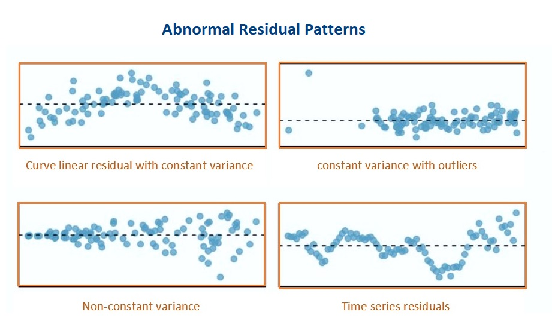

```{=html}

<style type="text/css">

/* Cascading Style Sheets (CSS) is a stylesheet language used to describe the presentation of a document written in HTML or XML. it is a simple mechanism for adding style (e.g., fonts, colors, spacing) to Web documents. */

h1.title {  /* Title - font specifications of the report title */
  font-size: 24px;
  font-weight: bold;
  color: DarkRed;
  text-align: center;
  font-family: "Gill Sans", sans-serif;
}
h4.author { /* Header 4 - font specifications for authors  */
  font-size: 20px;
  font-family: system-ui;
  color: DarkRed;
  text-align: center;
  font-weight: bold;
}
h4.date { /* Header 4 - font specifications for the date  */
  font-size: 18px;
  font-family: system-ui;
  color: DarkBlue;
  text-align: center;
  font-weight: bold;
}
h1 { /* Header 1 - font specifications for level 1 section title  */
    font-size: 22px;
    font-family: "Gill Sans", sans-serif;
    color: navy;
    text-align: center;
    font-weight: bold;
}
h2 { /* Header 2 - font specifications for level 2 section title */
    font-size: 20px;
    font-family: "Gill Sans", sans-serif;
    color: navy;
    text-align: left;
    font-weight: bold;
}

h3 { /* Header 3 - font specifications of level 3 section title  */
    font-size: 18px;
    font-family: "Gill Sans", sans-serif;
    color: navy;
    text-align: left;
}

h4 { /* Header 4 - font specifications of level 4 section title  */
    font-size: 18px;
    font-family: "Gill Sans", sans-serif;
    color: darkred;
    text-align: left;
}

body { background-color: white;
        }

.highlightme { background-color:yellow; }

/*p { background-color:white; } */

</style>
```


```{r setup, include=FALSE}
# code chunk specifies whether the R code, warnings, and output 
# will be included in the output files.
if (!require("knitr")) {
   install.packages("knitr")
   library(knitr)
}
if (!require("MASS")) {
   install.packages("MASS")
   library(MASS)
}
# the following lib creates Python interface for running Python code
if (!require("reticulate")) {
   install.packages("reticulate")
library(reticulate)
}
if (!require("pander")) {
   install.packages("pander")
library(pander)
}
knitr::opts_chunk$set(echo = TRUE,       # include code chunk in the output file
                      warnings = FALSE,  # sometimes, you code may produce warning messages,
                                         # you can choose to include the warning messages in
                                         # the output file. 
                      results = TRUE,    # you can also decide whether to include the output
                                         # in the output file.
                      message = FALSE,
                      fig.align='center', 
                      fig.pos = 'ht'
                     
                      )  
```


\

# Introduction

We discussed the relationship between variables in the previous two modules. The continuous variable with a normal distribution is called the response (dependent) variable and the other variable is called the explanatory (predictor, independent, or risk) variable. If the predictor variable is a factor variable, the model is called the ANOVA model which focuses on comparing the means across all factor levels. If the predictor variable is **continuous**, the model is called simple linear regression (SLR). Note that all predictor variables are assumed to be non-random.


# The Practical Question

Maximum mouth opening (MMO) is also an important diagnostic reference for dental clinicians as a preliminary evaluation. Establishing a normal range for MMO could allow dental clinicians to objectively evaluate the treatment effects and set therapeutic goals for patients performing mandibular functional exercises. 

```{r echo=FALSE, fig.align='center', fig.width=5, fig.height=4, fig.cap="MMO, ML, and RA"}
include_graphics("img/w06-MMO.jpg")
```

To study the relationship between maximum mouth opening and measurements of the lower jaw (mandible). A researcher randomly selected a sample of 35 subjects and measured the dependent variable, maximum mouth opening (MMO, measured in mm), as well as predictor variables, mandibular length (ML, measured in mm), and angle of rotation of the mandible (RA, measured in degrees) of each of the 35 subjects.

```{r echo = FALSE, fig.align='center', fig.width=5, fig.height=5, fig.cap="Dental Data for the multiple linear regression model (MLR)"}

```

The question is whether the maximum mouth opening (MMO) is determined by **two variables simultaneously**.  We want to assess how these two variables (ML and RA) impact MMO **simultaneously**. 

If we pick one predictor variable at a time, ML, to build a simple linear regression model and ignore the other predictor variable (RA), you only get the marginal relationship between MMO and ML since you implicitly assume that the relationship between MMO and ML will not be impacted by RA. This implicit assumption is, in general, incorrect. We need to consider all predictor variables at the same time. This is the motivation for studying multiple linear regression (MLR).


# The Process of Building A Multiple Linear Regression Model

The previous motivation example involves two continuous predictor variables. In real-world applications, it is common to have many predictor variables. Predictor variables are also assumed to be non-random. They could be categorical, continuous, or discrete. In a specific application, you may have a set of categorical, continuous, and discrete predictor variables in one data set.


## Assumptions of MLR

There are several assumptions of multiple linear regression models.

* The response variable is a normal random variable and its mean is influenced by explanatory variables but not the variance.

* The explanatory variables are assumed to be non-random.

* The explanatory variables are assumed to be uncorrelated to each other.

* The functional form of the explanatory variables in the regression model is correctly specified.

* The data is a random sample taken independently from the study population with a specified distribution.

Some of these assumptions will be used directly to define model diagnostic measures. The idea is to assume all conditions are met (at least temporarily) and then fit the model to the data set.


## The Structure of MLR

Assume that there are $p$ predictor variables $\{x_1, x_2, \cdots, x_p \}$, the first-order linear regression is defined in the following form

$$
y = \beta_0 + \beta_1 x_1 + \beta_2 x_2 + \cdots + \beta_p x_p + \epsilon
$$

$\beta_0$ is the intercept, $\beta_1, \beta_2, \cdots, \beta_p$ are called slope parameters. if $\beta_i=0$, the associated predictor variable $x_i$ is uncorrelated with response vararible $y$. If $\beta_i > 0$, then $y$ and $x_i$ are positively correlated. In fact, $\beta_1$ is the increment of $y$ as $x_i$ increases one unit and other predictors remain unchanged.  

The response variable is assumed to be a normal random variable with constant variance. If the first-order linear regression function is correct, then 

$$y \to N(\beta_0 + \beta_1 x_1 + \beta_2 x_2 + \cdots + \beta_p x_p, \sigma^2).$$ 
This also implies that $\epsilon \to N(0,\sigma^2)$. The residual of each data point can be estimated from the data with an assumed linear regression model.

\

```{r w10-RegressionPlane, echo = FALSE, fig.align='center', fig.pos = "!ht", out.extra = "", fig.width=5, fig.height=3.5, fig.cap="Illustrative regression plane: MMO vs ML and RA"}
include_graphics("img/w06-RegressionPlane.jpg")
```

For ease of illustration, let's consider the case of the MLR with two predictor variables in the motivation example. 

$$MMO = \beta_0 + \beta_1 ML + \beta_2 RA + \epsilon$$

is the first-order linear regression model. The following figure gives the graphical annotations of the fundamental concepts in linear regression models. This is a generalization of the regression line (see the analogous figure in the previous module for the simple linear regression model).


Since $MMO$ is a normal random variable with constant variance, $MMO \to N(\beta_0+\beta_1ML +\beta_2 RA, \sigma^2)$, or equivalently, $\epsilon \to N(0, \sigma^2)$. The residuals are defined to be the directional vertical distances between the observed points and the regression plane.  

In some practical applications, we may need **the second-order** linear regression model to reflect the actual relationship between predictor variables and the response variable. For example, $$MMO = \alpha_0 + \alpha_1 ML + \alpha_2 RA + \alpha_3 ML^2 + \alpha_4 RA^2 + \alpha_5 ML\times RA + \epsilon$$ is called (the second-order) linear regression model. With the second-order terms in the regression function, we obtain the regression surface as shown in Figure.

```{r w10-RegressionSurface, echo = FALSE, fig.align='center', fig.pos = "!ht", out.extra = "", fig.cap="Illustrative regression surface: MMO vs ML and RA"}
include_graphics("img/w06-RegressionSurface.jpg")
```

If the second-order linear regression is appropriate, then $\epsilon \to N(0, \sigma^2)$ and $E[MMO] = \alpha_0 + \alpha_1 ML + \alpha_2 RA + \alpha_3 ML^2 + \alpha_4 RA^2 + \alpha_5 ML\times RA$. The residuals of the second-order linear regression model are defined to be the directional distance between the observed points and the regression surface. 


## More on Model Specifications

In the above section, we introduced both first- and second-order polynomial regression models. In general, it is not common to use high-order polynomial regression models in real-world applications.

* **Interaction effect** - it is common to include interaction terms (i.e., the cross product of two or more predictor variables) in the multiple linear regression models when the effect of one variable on the response variable is dependent on the other predictor variable. In other words, the interaction terms capture the **joint effect** of predictor variables. **It is rare to have third-order or higher-order interaction terms in a regression model**.


* **Dummy variables** - All categorical predictor variables are automatically converted into dummy variables (binary indicator variables). If categorical variables in the data are numerically coded, we have to turn these numerically coded variables into factor variables in the regression model.

* **Discretization and Regrouping** - Discretizing numerical predictor variables and regrouping categorical or discrete predictor variables are two basic pre-process procedures that are actually very common in many practical applications.

  + Sometimes these two procedures are required to satisfy certain model assumptions. For example, if a categorical variable has a few categories that have less than 5 observations, the resulting p-values based on certain hypothesis tests will be invalid. In this case, We have to regroup some of the categories in **meaningful ways** to resolve the **sparsity** issues in order to obtain valid results.  

  + In many other applications, we want the model to be easy to interpret. Discretizing numerical variables is common. For example, we can see grouped ages and salary ranges in different applications.


## Estimation of Regression Coefficients

A simple and straightforward method for estimating the coefficients of linear regression models is to minimize the sum of the squared residuals - least square estimation (LSE). To find the LSE of the regression coefficients, we need to

* choose the (first-order, second-order, or even high-order) regression function (see 3D  hyper-plane or hyper-surface in the above two figures as examples).

* find the distances between the observed points and the hyper-plane (or hyper-surface). These distances are the residuals of the regression - which is dependent on the regression coefficients.

* calculate the sum of squared residuals. This sum of the residuals is still dependent on the regression coefficients.

* find the values for the regression coefficients that minimize the sum of the squared residuals. These values are called the least square estimates (LSEs) of the corresponding regression coefficients.

R function **lm()** implements the above LSE algorithm to find the regression coefficients. We have used this function in ANOVA and simple linear regression models. 


## Model Diagnostics

Unlike simple linear regression models, the primary assumptions of the regression model focus on the normal distribution of the response variable and the correct regression function. For multiple linear regression models, we need to impose a couple of assumptions in addition to those in the simple linear regression models.

* **Residual Diagnostics**

One of the fundamental assumptions of linear regression modeling is that the response variable is normally distributed with a constant variance. This implies $\epsilon \to N(0, \sigma^2)$.

After obtaining the LSE of the regression coefficients, we can estimate the residuals and use these estimated residuals to detect the potential violations of the normality assumption of the response variable. To be more specific, we consider the first-order polynomial regression, the estimated residual of $i$-th observation is defined to be $e_i = MMO - \hat{\beta}_0 + \hat{\beta}_1 ML + \hat{\beta}_2 RA$ 

If there is no violation of the normality assumption, we would expect the following residual plot and Q-Q plot.


```{r w10-GoodResidualPlot, echo = FALSE, fig.align='center', fig.pos = "!ht", out.extra = "", fig.cap="Good residual plot and normal Q-Q plot"}
include_graphics("img/w06-GoodResidualPlots.jpg")
```

Some of the commonly seen poor residual plots represent different violations of various assumptions. We can try to use various transformations (such as Box-Cox power transformations) of the response variable to correct the issue.

```{r w10-BadResidualPlots, echo = FALSE, fig.align='center', fig.pos = "!ht", out.extra = "", fig.cap="Poor residual plots representing various violations of the model assumptions"}

```

* **Multicollinearity**

Some of the predictor variables are linearly correlated. The consequence of multi-collinearity causes to unstable LSE of the regression coefficients (i.e., the LSEs of the regression coefficients are sensitive to a small change in the model). It also reduces the precision of the estimate coefficients and, hence, the p-values are not reliable.

Multicollinearity affects the coefficients and p-values, but it does not influence the predictions, precision of the predictions, and the goodness-of-fit statistics. If our primary goal is to make predictions, we don’t need to understand the role of each independent variable and we don’t need to reduce severe multicollinearity.

If the primary goal is to perform association analysis, we need to reduce collinearity since both LSE and p-values are the keys to association analysis.


To detect multicollinearity, we can use the variance inflation factor (VIF) to inspect the multicollinearity of the individual predictor variable. There are some different methods to reduce multicollinearity. Centering predictor variables is one of them and works well sometimes. Some other advanced modeling-based methods are covered in more advanced courses.


## Goodness-of-fit and Variable Selection

There several different goodness-of-fit measures are available for the linear regression model due to the assumption of the normality assumption of the response variable. 

* **Coefficient of Determination**

We only introduce **the coefficient of determination $R^2$** which measures the percentage of variability within the -values that can be explained by the regression model. In simple linear regression models, **the coefficient of determination $R^2$** is simply the square of the sample Pearson correlation coefficient.

* **Statistical Significance and Practical Importance**

A small p-value of the significant test for a predictor variable indicates the variable is statistically significant but may not be practically important. On the other hand, some practically important predictor variables may not achieve statistical significance due to the limited sample size. In the practical applications, **we may want to include some of the practically important predictor variables in the final model regardless of their statistical significance**.

* **Model Selection**

One of the criteria for assessing the goodness-of-fit is the parsimony of the model. A parsimonious model is a model that accomplishes the desired level of explanation or prediction with as few predictor variables as possible. There are generally two ways of evaluating a model: Based on predictions and based on goodness of fit on the current data such as $R^2$ and some likelihood-based measures.

R has an automatic variable selection procedure, **step()**, which uses the goodness-of-fit measure AIC (Akaike Information Criterion) which is not formally introduced in this class due to the level of mathematics needed in the definition, but we can still use it to perform the automatic variable selection. [This tutorial gives detailed examples on how to use **step()** (link)](http://rstudio-pubs-static.s3.amazonaws.com/2899_a9129debf6bd47d2a0501de9c0dc583d.html).


# Applications of Linear Regression Models

The two major types of applications of regression models are association analysis and predictive analysis. For illustration, we only consider the following simple linear regression model.
$$
y = \beta_0 + \beta_1 x + \epsilon.
$$
where $\epsilon \sim N(0, \sigma^2)$.

## Association Analysis

The association analysis in regression modeling focuses on how the change of predictor variables is associated with the change of the response variable. As discussed earlier, the coefficient $\beta_1$ measures the association between the response $y$ and predictor variable $x_1$.  

**Example**: A dietetics student wants to look at the relationship between calcium intake and knowledge about calcium in sports science students. Further, she wants to know if knowledge about calcium can be used to predict the calcium intake of the students. The following table shows the data she collected.

```{r fig.align='center', out.width="90%", fig.cap="Calcium intake vs knowledge about calcium"}

```

The initial analysis is always to look at the relationship between calcium intake and knowledge about calcium. We present the scatter plot to visualize the above relationship in the following.

```{r fig.align='center', fig.width=5, fig.height=5}
CalciumData = read.table("calcium.txt", header = TRUE)
plot(CalciumData$Calcium, CalciumData$knowledge)
```

The above scatter plot shows a significant linear relationship. We choose a linear regression model to characterize the linear relationship between the two variables.

```{r}
m01 = lm(Calcium ~knowledge, data = CalciumData)
pander(summary(m01)$coef)
```
The above table shows that the regression coefficient of `knowledge` is significantly different from zero (p-value < 0.05). The coefficient $\beta_1 = 0.05601$ means that the calcium intake will increase **0.05601** unit if the knowledge of calcium increases **one** unit. <font color = "red">**\color{red}Caution: association does not implies causation!**</font>. This is the typical analysis in classical inferential statistics and is used in most of the regression analysis.

As a special association analysis, **causal analysis** requires the underlying data being collected from special designs. This is not the primary data science problem.


## Predictive Analysis

The prediction analysis in the classical statistical analysis is based on some strict assumptions such as i.i.d. sample and normal distribution of random error term. The performance of prediction is measured with a predictive interval.

In data science, we use primarily data-driven approaches such as cross-validation to assess the performance of prediction. The particular performance metric is the means square error (MSE) based on the test data. The details will be discussed in later modules.  


# Case Studies

This section provides two case studies on the use of regression analyses.

## Case Study 1

We use the dental data in the motivation example for the case study.

```{r}
MMO=c(52.34, 51.90, 52.80, 50.29, 57.79, 49.41, 53.28, 59.71, 53.32, 48.53, 51.59, 
      58.52, 62.93, 57.62, 65.64, 52.85, 64.43, 57.25, 50.82, 40.48, 59.68, 54.35, 
      47.00, 47.23,  41.19, 42.76, 51.88, 42.77, 52.34, 50.45, 43.18, 41.99, 39.45, 
      38.91, 49.10)
##
ML=c(100.85, 93.08, 98.43, 102.95, 108.24, 98.34, 95.57, 98.85,98.32, 92.70, 88.89, 
     104.06,  98.18, 91.01, 96.98, 97.85, 96.89, 98.35, 90.65, 92.99, 108.97, 91.85, 
     104.30, 93.16, 94.18, 89.56, 105.85, 89.29, 92.58, 98.64, 83.70, 88.46, 94.93, 
     96.81, 93.13)
##
RA = c(32.08, 39.21, 33.74, 34.19, 35.13, 30.92, 37.71, 44.71, 33.17, 31.74, 37.07, 
       38.71, 43.89, 41.06, 41.92, 35.25, 45.11, 39.44, 38.33, 25.93, 36.78, 42.02, 
       27.20, 31.37, 27.87, 28.69, 31.04, 32.78, 37.82, 33.36, 31.93, 28.32, 24.82, 
       23.88, 36.17)

DentalData = as.data.frame(cbind(MMO = MMO, ML = ML, RA = RA))
```


* **Pair-wise Scatter Plot**

This pairwise scatter plot tells whether there are significant correlations between **numerical predictor variables**.

```{r echo = FALSE, fig.align='center', fig.width=6, fig.height=5, fig.pos = "!ht", out.extra = "", fig.cap="Pair-wise scatter plot"}
par(mar=c(1,1,1,1))
pairs(DentalData, main = "Pairwise scatter plot: MMO vs ML and RA")
```

We can see the following patterns from the above pair-wise scatter plot.

(1). Both ML and RA are linearly correlated with the response variable MMO. This is what we expected.

(2). ML and RA are not linearly correlated. This indicates that there is no collinearity issue. 

(3). We also don't see any special patterns such as outliers and extremely skewed distribution. There is no need to perform discretization and regrouping procedures on the predictor variables.

(4). In this data set, there are no categorical variables or categorical variables with a numerical coding system. There is no need to create dummy variables.

 

* **Initial model** 


The following initial model includes all predictor variables. The residual plots demonstrate the following patterns.

(1). One of the observations seems to be an outlier (observation 15);

(2). There is a minor violation of the assumption of constant variance.

(3). There is also a minor violation of the assumption of normality of the distribution of the residuals.


```{r fig.align='center', fig.w=5, fig.height=4}
ini.model = lm(MMO ~ ML + RA, data = DentalData)   # fit a linear model with interaction effect
par(mfrow=c(2,2), mar=c(2,3,2,2))
plot(ini.model)
```

Next, we will carry the Box-Cox transformation to identify a potential power transformation of the response variable MMO.

```{r fig.align='center', fig.width=4, fig.height=3.2}
library(MASS)
boxcox(MMO ~ ML + RA, 
       data = DentalData, 
       lambda = seq(-1, 1.5, length = 10), 
       xlab=expression(paste(lambda)))
title(main = "Box-Cox Transformation: 95% CI of lambda",
      col.main = "navy", cex.main = 0.9)


```

Since both 0 and 1 are in the $95\%$ confidence interval of $\lambda$, technically speaking, there is no need to perform the power transformation. By the optimal $\lambda$ is closer to 0, we try to perform the log transformation (corresponding to $\lambda =0$) to see whether there will be some improvement of the initial model


```{r fig.align='center', fig.width=4, fig.height=3.2}
transform.model = lm(log(MMO) ~ ML * RA, data  = DentalData)
par(mfrow=c(2,2), mar = c(2,2,2,2))
plot(transform.model)
```

The above residual plots indicate an improvement in model fit. We will use the transformed response to build the final model.


* **Final Model**  

The model based on the log-transformed response is summarized in the following.

```{r}
kable(summary(transform.model)$coef, caption = "Summarized statistics of the regression 
      coefficients of the model with a log-transformed response")
```

We can see that the interaction effect is insignificant in the model. We drop the highest term in the regression model either manually or automatically. In the next code chunk, we use the automatic variable selection method to find the final model.

```{r}
transform.model = lm(log(MMO)~ML*RA, data = DentalData)
## I will use the automatic variable selection function to search the final model
final.model =  step(transform.model, direction = "backward", trace = 0)
kable(summary(final.model)$coef, caption = "Summary statistics of the regression 
      coefficients of the final model")
```

Now we have three candidate models to select from. We extract the coefficient of determination ($R^2$) of each of the three candidate models.

```{r}
r.ini.model = summary(ini.model)$r.squared
r.transfd.model = summary(transform.model)$r.squared
r.final.model = summary(final.model)$r.squared
##
Rsquare = cbind(ini.model = r.ini.model, transfd.model = r.transfd.model, 
                final.model = r.final.model)
kable(Rsquare, caption="Coefficients of correlation of the three candidate models")
```

The second and the third models have almost the same $R^2$, $92.56\%$ and $92.57\%$. Both models are based on the log-transformed MMO. The interpretations of these two models are not straightforward. The initial model has a slightly lower $92.0\%$. Since the initial model has a simple structure and is easy to interpret, we chose the initial model as the final model to report. The summarized statistic is given in the following table.

```{r}
summary.ini.model = summary(ini.model)$coef
kable(summary.ini.model, caption = "Summary of the final working model")
```

In summary, both ML and RA are statistically significant (p-value $\approx 0$) and both are positively correlated to MMO. Further, for a given angle of rotation of the mandible (RA), when mandibular length (ML) increases by 1mm, the maximum mouth opening (MMO) increases by 0.473 mm. However, for holding ML, a 1-degree increase in RA will result in a 1.071 mm increase in MMO.


## Case Study 2

ANOVA model is a special linear regression model in which all predictor variables are categorical. We now build a linear regression using mussel shell length as the response and the location as the predictor variable in the following.

Since predictor variable location is a categorical factor variable, R function **lm()** will automatically define four dummy variables for each category except for the baseline category is, by default, the smallest character values (alphabetical order). In our example, the value **Magadan** is the smallest. Other categories will be compared with the baseline category through the corresponding dummy variables.

To be more specific, the four dummy variables associated with the four categories will be defined by

1. locationNewport = 1 if the location is Newport, 0 otherwise;

2. locationPetersburg = 1 if the location is Petersburg, 0 otherwise;

3. locationTillamook = 1 if the location is Tillamook, 0 otherwise;

4. locationTvarminne = 1 if the location is Tvarminne, 0 otherwise.


```{r fig.align='center', fig.width=4, fig.height=4}
x1 = c(0.0571,0.0813, 0.0831, 0.0976, 0.0817, 0.0859, 0.0735, 0.0659, 0.0923, 0.0836) 
x2 = c(0.0873,0.0662, 0.0672, 0.0819, 0.0749, 0.0649, 0.0835, 0.0725)
x3 = c(0.0974,0.1352, 0.0817, 0.1016, 0.0968, 0.1064, 0.1050)
x4 = c(0.1033,0.0915, 0.0781, 0.0685, 0.0677, 0.0697, 0.0764, 0.0689)
x5 = c(0.0703,0.1026, 0.0956, 0.0973, 0.1039, 0.1045)
len  = c(x1, x2, x3, x4, x5)      # pool all sub-samples of lengths
location = c(rep("Tillamook", length(x1)), 
             rep("Newport", length(x2)),
             rep("Petersburg", length(x3)),
             rep("Magadan", length(x4)),
             rep("Tvarminne", length(x5)))     # location vector matches the lengths
data.matrix = cbind(len =  len, location = location)   # data a data table
musseldata = as.data.frame(data.matrix)        # data frame
## End of data set creation
##
## Starting building the ANOVA model
anova.model.01 = lm(len ~ location, data = musseldata)  # define a model for generating the ANOVA
##
par(mfrow=c(2,2), mar = c(2,2,2,2))
plot(anova.model.01)
```

The above residual plots indicate no serious violation of the model assumption. The model that generates the above residual plot will be used as the final working model. The inference of the regression coefficients is summarized in the following table.


```{r}
sum.stats = summary(anova.model.01)$coef
kable(sum.stats, caption = "Summary of the ANOVA model")
```

From the above summary tale, we can see that P-values associated with location dummy variables locationNewport, locationTillamook are bigger than 0.05 meaning the means associated with **Newport**, **Tillamook**, and the baseline **Magadan** (not appearing in the summary table). The p-values associated with **Petersburg** and **Tvarminn** are less the 0.05 which implies that the mean length of these two locations is significantly different from that of the baseline location **Magadan**. Further, the coefficient associated with dummy variable **locationPetersburg** indicates that the mean length of the mussel shell in **Petersburg** is 0.0543 units longer than that in the baseline location **Magadan**. We can also interpret the coefficients associated with **locationTvarminne**.
