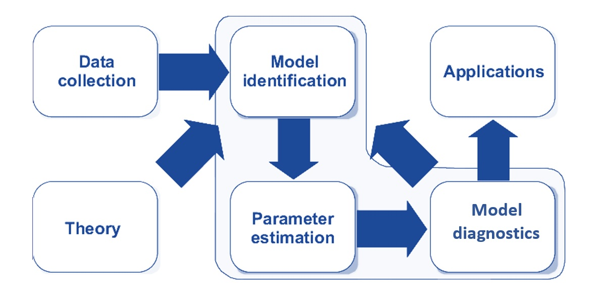
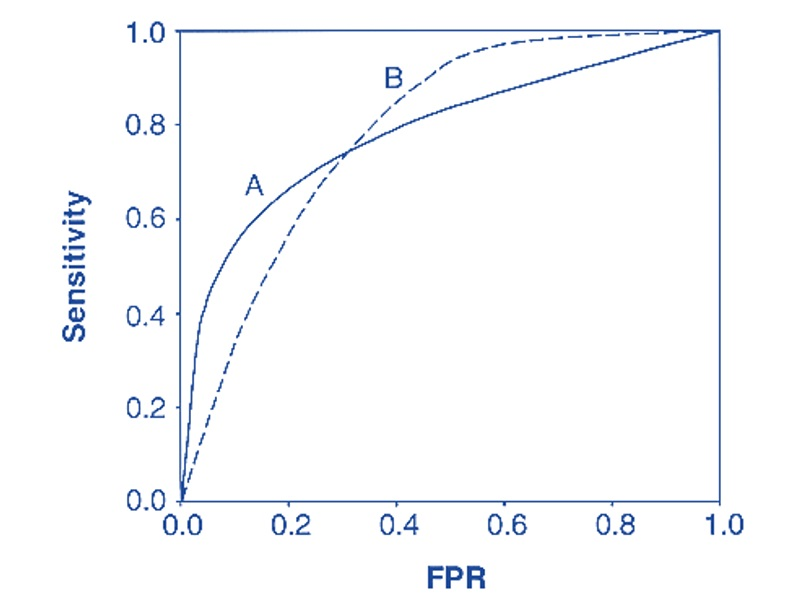

```{=html}

<style type="text/css">

/* Cascading Style Sheets (CSS) is a stylesheet language used to describe the presentation of a document written in HTML or XML. it is a simple mechanism for adding style (e.g., fonts, colors, spacing) to Web documents. */

h1.title {  /* Title - font specifications of the report title */
  font-size: 24px;
  font-weight: bold;
  color: DarkRed;
  text-align: center;
  font-family: "Gill Sans", sans-serif;
}
h4.author { /* Header 4 - font specifications for authors  */
  font-size: 20px;
  font-family: system-ui;
  color: DarkRed;
  text-align: center;
  font-weight: bold;
}
h4.date { /* Header 4 - font specifications for the date  */
  font-size: 18px;
  font-family: system-ui;
  color: DarkBlue;
  text-align: center;
  font-weight: bold;
}
h1 { /* Header 1 - font specifications for level 1 section title  */
    font-size: 22px;
    font-family: "Gill Sans", sans-serif;
    color: navy;
    text-align: center;
    font-weight: bold;
}
h2 { /* Header 2 - font specifications for level 2 section title */
    font-size: 20px;
    font-family: "Gill Sans", sans-serif;
    color: navy;
    text-align: left;
    font-weight: bold;
}

h3 { /* Header 3 - font specifications of level 3 section title  */
    font-size: 18px;
    font-family: "Gill Sans", sans-serif;
    color: navy;
    text-align: left;
}

h4 { /* Header 4 - font specifications of level 4 section title  */
    font-size: 18px;
    font-family: "Times New Roman", Times, serif;
    color: darkred;
    text-align: left;
}

body { background-color:white; }

.highlightme { background-color:yellow; }

p { background-color:white; }

</style>
```

```{r setup, include=FALSE}
# code chunk specifies whether the R code, warnings, and output 
# will be included in the output files.
if (!require("knitr")) {
   install.packages("knitr")
   library(knitr)
}
if (!require("tidyverse")) {
   install.packages("tidyverse")
library(tidyverse)
}
if (!require("GGally")) {
   install.packages("GGally")
library(GGally)
}
if (!require("pROC")) {
   install.packages("pROC")
library(pROC)
}

knitr::opts_chunk$set(echo = TRUE,      # include code chunk in the output file
                      warning = FALSE,  # sometimes, you code may produce warning messages,
                                        # you can choose to include the warning messages in
                                        # the output file. 
                      results = TRUE,   # you can also decide whether to include the output
                                        # in the output file.
                      message = FALSE,
                      comment = NA
                      )  
```


\

# Introduction

In the previous module, we introduced two types of regression models in statistics that are formulated based on several assumptions such as <font color = "red">**\color{red}iid**</font> (<font color = "red">**\color{red}i**</font>dentically <font color = "red">**\color{red}i**</font>ndependent <font color = "red">**\color{red}d**</font>istribution), normal distribution or binomial distribution of the response variable, the large sample size for using the central limit theorem to define different performance metrics, etc. With these assumptions, we can define different methods to assess the performance of models and identify the best models for implementation.

In data science projects, it is quite often that data generation processes do not meet the requirements for many classical models and procedures. We need to use **appropriate performance metrics** to assess the goodness of the model/algorithm without having strict assumptions and make sure the model will be consistently reliable across new, unseen data sets.

The majority of performance metrics in data science are defined directly based on either the estimated error of the response or some type of 'distance'. In predictive modeling, most of the performance measures are defined with predictive error probabilities. We will introduce one of the most commonly used global predictive performance measures - the ROC (receiver operating characteristics) curve and its components.

In this module, we will discuss the basics of **K-Fold Cross-Validation** and compare it to some simpler methods. Some commonly used performance measures for predictive modeling such as sensitivity, specificity, false positive rate, false negative rate, ROC curve, and the area of the ROC curve (AUC) will also be introduced and illustrated with some simple examples.


# Review of Linear and Logistic Models

In classical statistical modeling, we select candidate models based on exploratory data analysis and visual analysis. The candidate models are then fit to the analytic data set. Since all models have some sort of assumptions (think about linear regression and logistic and Poisson regression models),  and then carry out model diagnostic analyses to identify potential violations of the model assumption. Of course, we assume that the data represent the population. This modeling process is depicted in the following diagram.

```{r echo=FALSE, fig.align='center', out.width="70%", fig.cap="Classical statistical modeling process."}

```

Recall the process of the following two representative statistical models.

## Linear Regression Model

First, we look at the process of how to build a linear regression model for a data set.

* **Explicit and Implicit Assumptions**. The following are some of the assumptions about a normal-based linear regression model:

   - Predictor (feature) variables are (linearly or curve-linearly) correlated to the response variable (also called label in machine learning terms);
   - Predictor variables themselves are NOT highly linearly correlated (i.e., no serious collinearity);
   - The response variable is normally distributed;
   - The variance of the response variable is constant;
   - There are no outlier (influential) observations;
   - information on all relevant predictor variables is available in the data (i.e., no important predictor is missing);


* **Model Fitting (Parameter Estimating)**. The least-square estimator (LSE), which is equivalent to the maximum likelihood estimator (MLE) when the response variable is assumed to be a normal distribution, can be used to estimate the regression coefficients.  

* **Model Selection and Diagnostics**. Since several implicit and explicit assumptions have been assumed underlying the linear regression, different sets of diagnostic measures were developed to detect different potential violations of the model.

  - <b>*global goodness-of-fit*</b>: R<sup>2</sup>, AIC and SBC (requires normality assumption of the response variable), MSE, etc.
  - <b>*local goodness-of-fit/model selection*</b>: R, F-test (need normality and equal variance of the response variable), t-test, likelihood ratio test, Mallow's C<sub>p</sub>, etc.
  - <b>*normality*</b>: QQ-plot and probability plot for a visual check, goodness-of-fit tests such as Anderson-Darling, Cramer-von Miss, Kolmogorov-Smirnov, Shapiro-Wilks, and Pearson's chi-square tests, etc. 
  - <b>*detecting outliers/influential observations*</b>: leverage point-hat matrix, DFITT - defined based on leave-one-out resampling method, cook's distance, (scaled) residual plots, etc.
  - <b>*verifying constant variance*</b>: F-test (requires normality), Brown-Forsythe test (nonparametric), Breusch-Pagan Test (also nonparametric), Bartlett's Test (requires normality), etc.
  - <b>*detecting collinearity*</b>: Variance inflation factor (VIF) for data-based and structural collinearity.
  - <b>*detecting mission of determinant variable*</b>: 

## Logistic Regression Model

For the binary logistic model, we also follow the same steps to identify the final model. For example, the well-known binary logistic regression modeling follows similar steps:

* **Assumptions**: Unlike the linear regression model which has a strong assumption of normality, the logistic regression model assumes the following

  - <b>*binomial distribution*</b>: The dependent variable is binary.
  - <b>*independence*</b>: The logistic regression requires the observations to be independent of each other.
  - <b>*collinearity*</b>: The logistic regression requires there to be little or no multicollinearity among the independent variables.
  - <b>*linearity*</b>: The logistic regression assumes linearity of independent variables and the log odds of the event of interest.
  - <b>*large sample size*</b>: The logistic regression typically requires a large sample size. A general guideline is that you need a minimum of 10 observations with the least frequent outcome for each independent variable in your model. 
  - <b>*mis-specification*</b>: No important variables are omitted. No extraneous variables are included.
  - <b>*measurement error*</b>: The independent variables are measured without error.

* **Model Fitting**: The coefficients of the logistic regression model are estimated using a maximum likelihood estimator. Note LSE cannot be estimated for the logistic regression model.

* **Model Selection and Diagnostics**: Unlike the normal linear regression model, there are a few diagnostic methods one can use in logistic regression models.

  - <b>*misspecification*</b>: link test (large sample test);
  - <b>*goodness-of-fit*</b>: log-likelihood chi-square and pseudo-R-square; Hosmer-Lemeshow's lack of fit test AIC and SBC.
  - <b>*multi-collinearity*</b>: VIF
  - <b>*influential points*</b>: Cook's distance, DBETA, deviance residuals

\

## Predictive Performance Measures

Regression models can be used for either predictive or association analysis. Different performance metrics have been defined to assess the predictive power of regression models. We list some of the error-based measures in the following.


### Linear Regression

When evaluating the predictive performance of linear regression models, several key metrics based on predictive error (**residuals**) are commonly used. Let $\{\hat{y}_1, \hat{y}_2, \cdots, \hat{y}_k\}$ be the corresponding predicted values of $\{y_1, y_2, \cdots, y_k \}$.


**Mean Absolute Error (MAE)** is defined by

$$
MAE = \frac{\sum_{i=1}^k |\hat{y}_i-y_i|}{k}
$$


This measures the average magnitude of the errors in predictions, without considering their direction. It is the average of the absolute differences between predicted and actual values. MAE is less sensitive to outliers compared to other metrics.


**Mean Squared Error (MSE)** is defined by

$$
MSE = \frac{\sum_{i=1}^k (\hat{y}_i-y_i)^2}{k}
$$

This measures the average of the squares of the errors. It gives a higher weight to larger errors, making it useful for identifying models that have large prediction errors.


**Root Mean Squared Error (RMSE)** is defined by

$$
RMSE = \sqrt{\frac{\sum_{i=1}^k (\hat{y}_i-y_i)^2}{k}}
$$

This is the square root of the MSE. It provides an error value in the same units as the dependent variable, making it easier to interpret.

\

### Logistic Regression

Recall that the logistic regression model.

$$
P(Y = \text{success}) = \frac{\exp(\beta_0 + \beta_1 x_1 + \cdots + \beta_k x_k)}{1+\exp(\beta_0 + \beta_1 x_1 + \cdots + \beta_k x_k)}.
$$

The model predicts the **probability of success** but not the value of $Y$ ("success" or "failure"). In order to predict "success" or "failure", we need to have a **cut-off probability**. The key predictive performance metrics are defined based on the **predicted values** of $Y$ ("success" or "failure") and the **true values** of $Y$ which is tabulated in the following **confusion matrix**

```{r echo=FALSE, fig.align='center', out.width="50%", fig.cap="Confusion matrix of binary logistic predictive models"}

```


Several key metrics that are commonly used are based on the above confusion matrix.

**True Positive Rate (TPR)**: The proportion of **correctly** predicted positive among **all true POSITIVES**. **True Positive Rate** is also called the sensitivity of the model which is a conditional probability $P(\text{predicted true}| \text{actual true})$. The sample TPR is given by

$$
\text{True Positive Rate} = \frac{TP}{TP + FN}
$$

**False Positive Rate (FPR)**: The proportion of **incorrectly** predicted positive among **all true NEGATIVES**. is a conditional probability $P(\text{predicted true}| \text{actual negative})$. The sample TPR is given by

$$
\text{False Positive Rate} = \frac{FP}{FP + TN}
$$

**True Negative Rate (also called Specificity)** is the probability that an actual negative will test negative. That is, $P(\text{Predicted Negative}|\text{Actual Negative})$. The sample **true negative rate (specificity)** is given by

$$
\text{True Ngative Rate} = \frac{TN}{TN+FP}.
$$

Apparently, $\text{false positove rate} = 1 - \text{specificity}$.


**Accuracy**: The proportion of correctly predicted instances out of the total instances.

$$
\text{accuracy} = \frac{TP + TN}{TP + TN + FP + FN}
$$

**Precision and Recall**: Precision measures the proportion of true positive predictions among all positive predictions, while recall (or sensitivity) measures the proportion of true positives identified out of all actual positives.

$$
\text{precision} = \frac{TP}{TP+ FP}  \ \ \text{and} \ \  \text{recall} = \frac{TP + TN}{TP + FN}
$$


**F1 Score**: The harmonic mean of precision and recall, providing a balance between the two.

$$
\text{F1 Score} = 2\times \frac{\text{precision} \times \text{recall} }{\text{precision} + \text{recall}}
$$

### ROC Curve

The above performance metrics are defined based on the confusion matrix. However, a confusion matrix is defined based on the choice of the cut-off predictive scores. In logistic predictive modeling, the predictive scores are the probabilities of observing the target category label (either **success** or **failure** if the binary response with these two character values) in the training model.  

Since the **success probability** is between 0 and 1, we can try different cut-off probabilities to construct different confusion matrices and calculate the corresponding sensitivity and specificity measures. We can use these pairs of sensitivity and specificity at different cut-off probabilities. The plot of sensitivity against (1-specificity) is called **Receiver Operating Characteristic (ROC)** curve.


For example, if we have a predictive model such as logistic regression to predict whether an animal is a dog or cat based on a data set with some given features related to cats and animals. The following animated graph shows that the coordinates of each point on the ROC curve are determined by a confusion matrix (formed by a cut-off probability).    


```{r echo=FALSE, fig.align ="center",  out.width = '85%', fig.cap="ROC curve demonstration"}
if (knitr:::is_latex_output()) {
  knitr::asis_output('\\url{https://pengdsci.github.io/STA551/w07/img/roc.gif}')
} else {
  knitr::include_graphics("img/roc.gif")
}
```

The next animated graph shows the prediction error-based performance at each given cut-off probability.

```{r echo=FALSE, fig.align='center', out.width="70%", out.height="70%", fig.cap="Animated ROC curve."}
if (knitr:::is_latex_output()) {
  knitr::asis_output('\\url{https://github.com/pengdsci/STA551/blob/main/w06/img/w06-Animated-ROC.gif}')
} else {
  knitr::include_graphics("img/w06-Animated-ROC.gif")
}
```


When comparing two more classification models, ROC curves provide an intuitive visual comparison of the global performance of the underlying models. However, if two ROC curves of two underlying classification models intersect, sometimes it is difficult to compare the global performance of the two underlying models through visual representations. The following figure shows the ROC curves of two hypothetical classification models. It is hard to check the performance of the two models.


```{r echo=FALSE, fig.align='center', out.width="70%", fig.cap="Using ROC for model selection."}

```

In the above case, we can use the areas under the ROC curves to compare the global performance of the two underlying models. The Area Under the Curve (AUC) provides a numerical measure of the overall performance of a classification model. In the next example, we will use an example to demonstrate how to construct an ROC curve of a logistic predictive model and its AUC using an R function.


## Example of Fraud Detection

This data set was extracted from a real-world data set. The data set contains a fraud index (calculated from real fraud data) and fraud status (in the character format). We will use a data set to build a logistic regression and construct an ROC curve.


```{r  fig.align='center', fig.width=4, fig.height=4, fig.cap="ROC Curve of logistic fraud model"}
fraud.data = read.csv("https://pengdsci.github.io/datasets/FraudIndex/fraudidx.csv")[,-1]
## encode status variable: bad = 1 and good = 0
good.id = which(fraud.data$status == "good ") 
bad.id = which(fraud.data$status == "fraud")
##
fraud.data$fraud.status = 0
fraud.data$fraud.status[bad.id] = 1
cut.off.seq = seq(0, 1, length = 100)
sensitivity.vec = NULL
specificity.vec = NULL
### 
logit.model = glm(fraud.status ~ index, family = binomial(link = logit), data = fraud.data)
newdata = data.frame(index= fraud.data$index)
pred.prob.train = predict.glm(logit.model, newdata, type = "response")
for (i in 1:100){
  fraud.data$train.status = as.numeric(pred.prob.train > cut.off.seq[i])
### components for defining various measures
TN = sum(fraud.data$train.status == 0 & fraud.data$fraud.status == 0) # true negative
FN = sum(fraud.data$train.status == 0 & fraud.data$fraud.status == 1) # false negative
FP = sum(fraud.data$train.status == 1 & fraud.data$fraud.status == 0) # false positive
TP = sum(fraud.data$train.status == 1 & fraud.data$fraud.status == 1) # true positive
###
sensitivity.vec[i] = TP / (TP + FN)
specificity.vec[i] = TN / (TN + FP)
}
one.minus.spec = 1 - specificity.vec
sens.vec = sensitivity.vec
## we next use library {pROC}
## to calculate AUC
  prediction = pred.prob.train
  category = fraud.data$fraud.status == 1
  ROCobj <- roc(category, prediction)
  AUC = round(auc(ROCobj),4)
####
par(pty = "s")   # make a square figure
plot(one.minus.spec, sens.vec, type = "l", xlim = c(0,1), ylim = c(0,1),
     xlab ="1 - specificity",
     ylab = "sensitivity",
     main = "ROC curve of Logistic Fraud Model",
     lwd = 2,
     col = "blue", )
segments(0,0,1,1, col = "red", lty = 2, lwd = 2)
#AUC = round(sum(sens.vec*(one.minus.spec[-101]-one.minus.spec[-1])),4)
text(0.8, 0.3, paste("AUC = ", AUC), col = "blue", cex = 0.8)
```

ROC curves and AUCs are used to compare the performance of two predictive models. The bigger the AUC, the better the predictive model. If a single predictive model is used, the AUC measures the predictive power of the model. In general, an AUC of 0.5 suggests no discrimination (i.e., ability to diagnose patients with and without the disease or condition based on the test), 0.7 to 0.8 is considered acceptable, 0.8 to 0.9 is considered excellent, and more than 0.9 is considered outstanding. 

The AUC of the above logistic predictive model is bigger than 0.9 which indicates the model has an outstanding predictive power.


\

# Data Splitting Types

One of the fundamental differences between statistical and machine learning modeling is that both fields use different model-building strategies. In classical statistical modeling, modeling building and evaluation are based on the same data set. However, in data science, the data set is partitioned into disjoint subsets for modeling training (building), validation, and testing, respectively. With data splitting, the model-building process will relax the assumptions used in the classical statistical analysis.

This section outlines **data splitting** types that are commonly used in practice.


## Two-way Splitting

**Train-Test Split**: The data set is divided into two sets: a training set and a testing set. Typically, 70-80% of the data is used for training, and 20-30% is used for testing.


```{r echo=FALSE, fig.align='center', out.width="65%", fig.cap="Training-testing split: two-split"}

```

\

**Training Data**

The training data set is the sample of data used to fit the model. In other words, the training data teaches the model how it’s supposed to learn and think. To do this, training data is often presented in pairs: predictor variables (feature variables) and a response variable (also called a label).

Training data is the first set of data the model/algorithm is exposed to. During each stage of training, the model will be fit to the training data and estimate the parameters (also called weight in some machine learning algorithms such as neural networks).

Because the training data set is used to estimate the parameters (i.e., teaching the algorithm), it requires a certain amount of information to make the algorithms and models reliable. It makes up between 60% and 80% of the total data.

\

**Test Data**

The test data set is a sample of data used to provide an unbiased evaluation of a final model fit on the training data set or to test the model. Put more simply, test data is a set of **unlabeled inputs** (i.e., the response value is removed from the data) that test whether the model is producing the correct outputs in the real world.

The key difference between a validation data set and a test data set is that the validation data set is used during model configuration, while the test data set is reserved to evaluate the final model.

Test data is about 20% of the total data and should be completely separate from the training data — which our model should know very well by this point.


**Example**


In classical statistics, we build and identify the final model using the entire data set and report the performance of the final using the same entire data set because we made strong assumptions about models. For example, in the linear regression, we use the training data set to estimate the coefficients of linear regression model $y = \beta_0+\beta_1 x_1 + \beta_2 x_2 + \cdots + \beta_k x_k$ and obtain the following fitted model

$$
y = \hat{\beta}_0+\hat{\beta}_1 x_1 + \hat{\beta}_2 x_2 + \cdots + \hat{\beta}_k x_k
$$

We use the above-estimated model and the $x$-values in the testing data set to predict the corresponding $y$-value. Then we can estimate the true bias. 


## Three-way Splitting

**Train-Validation-Test Split**: The data set is split into three subsets: training, validation, and testing. The training set is used to train the model, the *validation* set is used to tune **hyper-parameters** and validate performance during training, and the testing set is used for final evaluation.


```{r echo=FALSE, fig.align='center', out.width="65%", fig.cap="Training-validating-testing split: three-way split"}

```


**Validation Data**

The validation data set is a sample of data held back from training the model. This data set provides an unbiased evaluation of a model fit on the training data set while tuning model hyperparameters or calculating a performance measure for model selection. In more basic terms, validation data is an unused portion of your training data and helps determine if the initial model is accurate.


```{r echo=FALSE, fig.align='center', out.width="85%", fig.cap="Illustrative example of three-way data split"}

```


A model **hyperparameter** is a configuration that is external to the model and whose value cannot be estimated from data.

* They are often used in processes to help estimate model parameters.
* They are often specified by the practitioner.
* They can often be set using heuristics.
* They are often tuned for a given predictive modeling problem.

We don't know the best value for a model hyperparameter on a given problem. We may use rules of thumb, copy values used on other problems, or search for the best value by trial and error. For example, in predicting labels in the logistic regression models, we need to use an optimal cut-off probability to achieve the best accuracy. The **cut-off probability** is the hyper-parameter. 


## Overfitting and Underfitting

Overfitting and underfitting are common issues in data science (including statistics) that affect a model’s performance.

```{r fig.align='center', out.height="25%", fig.cap="Illustration of overfitting and underfitting"}

```


**Overfitting** occurs when a model learns the training data too well (high accuracy), including its noise and outliers. This makes the model perform exceptionally well on training data but poorly on new, unseen data (poor accuracy). Different reasons may cause overfitting. For example, model complexity such as too many features and insufficient training data. In practice, we can use the cross-validation method to detect overfitting and fix the issues by simplifying the models and increasing the volume of the training data set.   

**Underfitting** happens when a model is too simple to capture the underlying patterns in the data. It performs poorly on both training and new data. An underfitting model results in low accuracy on both training and validation/test data. Underfitting can also be detected by cross-validation. The remedies for improving the underfitting issue are to increase modeling complexity by adding more features and reducing regularization (restriction).

## Splitting Methods

There are various methods of splitting data sets. The right approach for data splitting and the optimal split ratio both depend on several factors, including the use case, amount of data, quality of data, and the number of **hyper-parameters**. 

The most common approach for dividing a data set is **random sampling**. As the name suggests, the method involves shuffling the data set and randomly assigning samples to training, validation, or test sets according to predetermined ratios. With **class-balanced** data sets, random sampling ensures the split is unbiased. 

However, **random sampling** is not the correct approach with imbalanced data sets (<font color = "red">*\color{blue}the imbalanced class ratio is usually less than 1%* </font>). When the data consists of skewed class proportions, random sampling will almost certainly create a bias in the model. In this case, we need to use **stratified sampling** in which the **random sampling** method is utilized in the major and minor categories respectively according to the predetermined ratios. The final training, validating, and testing data sets are formed using the corresponding stratified samples.  

<font color = "red">**\color{red}Caution:**</font> <font color = "blue">*\color{blue}Prediction/classification problems based on imbalanced data are challenging in practice. Some special methods in either sampling or modeling are needed to handle the imbalanced category issue. In this course, we only focus on balanced data.*</font>


# Cross-Validation

Different cross-validation methods are running in practice. We will discuss the K-fold CV in detail and work on an example to illustrate the steps for implementing the procedure. Other cross-validation methods will also be listed for reference at the end of this section.


## K-Fold Cross-Validation

**K-fold Cross Validation**: The data set is divided into ($k$) **equally sized** folds. The model is trained and evaluated ($k$) times, each time using ($k-1$) folds for training and 1 fold for validation/testing. This helps in obtaining more robust performance estimates. **This note will focus on $K$-fold cross-validation and its applications.**

```{r echo=FALSE, fig.align='center', out.width="65%", fig.cap="K-fold cross validation split"}

```

**K-Fold Cross-Validation** partitions the data set into multiple subsets to iteratively train and test the model, the Train-Test Split method divides the data set into just two parts: one for training and the other for testing. The Train-Test Split method is simple and quick to implement. It provides a more robust and reliable performance estimate because it reduces the impact of data variability. By using multiple training and testing cycles, it minimizes the risk of overfitting to a particular data split. This method also ensures that every data point is used for both training and validation, which results in a more comprehensive evaluation of the model's performance. 
 
The fold number **K** is considered as a hyper-parameter which can be tuned using validation data. In practice, it is rarely tuned to save computational resources. The common practice is to choose a number between 5 and 10. In the next subsection, we use 5-fold cross-validation for model selection in linear regression using performance measure MSE.


## 5-Fold Cross-Validation

The general 5-fold scheme is depicted in the following.

```{r fig.align='center', out.width="70%", fig.cap="Five-fold Cross-validation scheme"}

```

Next, we use an example to illustrate the steps for 5-fold cross-validation.

**Example**: **Palmer Penguins Dataset** contains 344 penguins from 3 different species collected from 3 islands in the Palmer Archipelago, Antarctica. In this example, we only use four numerical variables: Culmen Depth (mm), Culmen (mm), flipper length (mm), and body mass (g), to implement cross-validation for model selection in linear regression. 


```{r fig.align='center', out.height="45%", fig.cap="Illustration of penguin size measures"}

```


We will build two linear regression models and then use a 5-fold cross-validation method to select the one with better performance (smaller MSE). The two models are defined in the following.

$$
\text{ M1: } \ \ \text{BodyMass}= \beta_0 + \beta_1 \text{CulmenLength} + \beta_2 \text{CulmenDepth} + \epsilon 
$$

and

$$
\text{ M2: } \ \ \text{BodyMass}= \alpha_0 + \alpha_1 \text{CulmenLength} + \alpha_2 \text{CulmenDepth} +\alpha_3 \text{FlipperLenth} + \psi,
$$
where $\epsilon \sim N(0, \sigma^2)$ and $\psi \sim N(0, \delta^2)$. 

We use 80%-20% splitting ratio to randomly split into training and test data sets. We 5-fold splitting scheme in the training data. We build the above two models **with 4 combined training folds** and calculate the MSE based on the **validation fold**. Under this 5-fold cross-validation, each of the two models will have 5 performance measures (MSE), we calculate the mean of MSE of the two models respectively and the model with the smaller mean MSE is the one to be the final model to report (implement). The following figure depicts this process.


```{r fig.align='center', out.width="70%", fig.cap="The process 5-fold cross-validation for model selection with MSE"}

```

### Cross-validation with Linear Regression

We implement cross-validation using the *penguin* data to assess the performance of linear regression models.

```{r fig.align='center', fig.width=6, fig.height=5, fig.cap="Pairwise scatter plot showing the correlations among the linear correlation between variables."}
penguin = read.csv("PenguinsSize.csv", header = TRUE)
pairs(penguin[, 3:6])
```

The basic steps are outlined in the following:

* **Two-way data splitting** split the entire sample into training data (80%) and testing data (20%).

* **Creating 5-fold data**: randomly split the training data into 5 folds (with approximately equal size).

* **Performing cross-validation**: fit the two models to the 5 different combinations of combined training folds and evaluate the performance based on the corresponding validation folds.

* **Averaging MSE**: take the average of the MSE of the two models respectively and report them for model selection.

The R code for implementing the above 5-fold cross-validation is given by

```{r fig.align='center', fig.width=5, fig.height=4, fig.cap="Cross-validation for evaluating predictive performance of linear regression models"}
penguin = na.omit(penguin)  # delete all records with missing values
##
n = dim(penguin)[1]     # sample size
obs.ID = 1:n            # randomize obs ID
n.train = round(0.8*n)  # training data size

shuffled.id = sample(obs.ID, 
                          n, 
                          replace = FALSE)  # randomizing the observation IDs 
shuffled.penguin = na.omit(penguin[shuffled.id, ])   # randomizing the data set
# Two-way split for training and testing data sets
train.data = shuffled.penguin[1:n.train,]         # training data
test.data = shuffled.penguin[(n.train + 1):n, ]   # testing data
##
n.fold = round(n.train/5)-1    # size of 5-fold splitting, -1 to guarantee that
                               # 5*foldsize <= train.data size
## 5-fold cross-validation: iterative process with a for-loop
##
MSE.M1 = rep(0,5)
MSE.M2 = rep(0,5)
##
for (i in 1:5){
  valid.id = ((i-1)*n.fold+1):(i*n.fold)    # obs ID for validating fold 
  cross.train = train.data[-valid.id, ]
  cross.valid = train.data[valid.id,]
  ## Building the two models
  M1 = lm(bodyMass ~ culmenLength + culmenDepth, data  = cross.train)
  M2 = lm(bodyMass ~ culmenLength + culmenDepth + flipperLength, data  = cross.train)
  ## Predicting bodyMass with validate fold
  predM1 = predict(M1, newdata = cross.valid)
  predM2 = predict(M2, newdata = cross.valid)
  ##
  MSE.M1[i] = mean((predM1 - cross.valid$bodyMass)^2)
  MSE.M2[i] = mean((predM2 - cross.valid$bodyMass)^2)
 }
 MSE.1 = mean(MSE.M1)
 MSE.2 = mean(MSE.M2)
 ### Visualize the MSE 
 plot(1:5, MSE.M1, type = "l", 
      xlim =c(0,6),
      ylim = c(100000, 50000+max(MSE.M1)),
      ylab = "MSE (g)",
      xlab = "Iterations 1 to 5",
      lwd = 2,
      col = "navy",
      main = "Performance Evaluation via 5-fold Cross Validation",
      cex.main = 0.8)
 points(1:5, MSE.M1, pch = 19, col = "navy")
 lines(1:5, MSE.M2, lwd = 2, col = "darkred")
 points(1:5, MSE.M2, pch = 19, col = "darkred")
 legend("topright", c(paste("M1 Avg. MSE: ", round(MSE.1)), paste("M2 Avg. MSE: ",round(MSE.2))),
        col=c("navy", "darkred"),
        pch = rep(19,2), 
        lwd = rep(2,2),
        cex = 0.6,
        bty = "n")
```

The above figure indicates that model 2 (M2) has a smaller average fold-wise MSE. This means that model M2 has a better predictive performance. Therefore, M2 is recommended for practical prediction. 

In real-world applications, the actual performance of the recommended model should also be reported to the clients based on the test data that has not been used yet. The common practice is to refit the recommended model to the **original entire training data** to update the regression coefficients and then use this refitted model to evaluate the predetermined performance measure (in our case MSE) based on the testing data. The following code shows this step.


```{r}
M2.final = lm(bodyMass ~ culmenLength + culmenDepth + flipperLength, data  = train.data)
predM2.final = predict(M2.final, newdata = test.data)
MSE.M2.final = mean((predM2.final - test.data$bodyMass)^2)
MSE.M2.final
```

The actual performance of the recommended model has mean squared error (MSE) is shown above.

**Remarks**: There are different metrics to measure different types of performances. In this example, we are interested in predictive performance, the mean squared error was used. If we want to evaluate the global goodness-of-fit, we may use the following measures.

* **R-squared ($R^2$)**: This is the most common measure. It represents the proportion of the variance in the dependent variable that is predictable from the independent variables. An R² value closer to 1 indicates a better fit.

* **Adjusted R-squared**: This adjusts the R² value based on the number of predictors in the model. It is useful when comparing models with a different number of predictors, as it penalizes for adding variables that do not improve the model significantly.

* **F-statistic**: This tests the overall significance of the model. It compares the model with no predictors (intercept-only model) to the specified model. A higher F-statistic indicates that the model provides a better fit than a model with no predictors.

* **Akaike Information Criterion (AIC) and Bayesian Information Criterion (BIC)**: These criteria are used for model selection. They balance model fit and complexity, penalizing models with more parameters. Lower values of AIC and BIC indicate a better model.


### Cross-validation in Logistic Regression

We still use the fraud data to build a logistic regression model using cross-validation and testing methods. We first randomly split the data into 70% and 30%. The 30% of the data will be used for testing purposes. The 70% will be used for training and validation. The performance metric to be used is the AUC. The average of the validated AUC will be compared with the AUC calculated from the testing data.

We use 10-fold cross-validation in this example. The summary of the validated AUCs is given below. Instead of calculating specificity and sensitivity from scratch, we extract these two metrics from `roc()` directly in this cross-validation.

```{r fig.align='center', fig.width=5, fig.height=5}
fraud.data = read.csv("https://pengdsci.github.io/datasets/FraudIndex/fraudidx.csv")[,-1]
## encode status variable: bad = 1 and good = 0
good.id = which(fraud.data$status == " good") 
bad.id = which(fraud.data$status == "fraud")
##
fraud.data$fraud.status = 0
fraud.data$fraud.status[bad.id] = 1
nn = dim(fraud.data)[1]
train.id = sample(1:nn, round(nn*0.7), replace = FALSE) 
trainDat = fraud.data[train.id,]
testDat = fraud.data[-train.id,]
## each fold has 2326 observations
##
AUC.vec = rep(0,5)
color=c("#002642","#840032","#432534", "#c44900", "#0b7a75")
##
for(i in 1:5){
  ID = ((i-1)*4652+1):(i*4652)
  valid = as.data.frame(trainDat[ID,])
  train = as.data.frame(trainDat[-ID,])
  ##
  logit.model = glm(fraud.status ~ index, family = binomial(link = logit), data = train)
  newdata = data.frame(index= valid$index)
  pred.prob.train = predict.glm(logit.model, newdata, type = "response")
  ## we next use library {pROC}
  ## to calculate AUC
  prediction = pred.prob.train
  category = valid$fraud.status == 1
  ROCobj <- roc(category, prediction)
  AUC.vec[i] = round(auc(ROCobj),4)
  if(i==1){
    plot((1-ROCobj$specificities),ROCobj$sensitivities,
         type="l",
         main="5-fold Cross-validated ROC",
         col=color[i], 
         xlab="1-specificty",
         ylab="sensitivity",
         lwd=1, 
         lty=1)
        segments(0,0,1,1, lty=2, col="red")
    } else{
    lines((1-ROCobj$specificities),ROCobj$sensitivities, col=color[i], lwd=1)
    }
  }
summary(AUC.vec)
```

We next calculate the AUC based on the hold-out testing data. We will use

```{r}
  ### Caution, the model used to calculate the AUC must be based on the entire
  ### training data
  logit.model = glm(fraud.status ~ index, family = binomial(link = logit), data = trainDat)
  ###
  newdata = data.frame(index= testDat$index)
  pred.prob.train = predict.glm(logit.model, newdata, type = "response")
  ## we next use library {pROC}
  ## to calculate AUC
  prediction = pred.prob.train
  category = testDat$fraud.status == 1
  ROCobj <- roc(category, prediction)
  testAUC= round(auc(ROCobj),4)
  c(testAUC = testAUC)
```


## Additional Comments of K-Fold CV

In K-Fold Cross-Validation, $K$ represents the number of groups into which the data set is divided. This number determines how many rounds of testing the model undergoes, ensuring each segment is used as a testing set once. This is a hyper-parameter that can be tuned to produce the optimal performance. However, some heuristics can be used in practice to save some model training effort.

A smaller K (e.g., 3-5) might be faster but could yield less reliable estimates as each fold represents a larger portion of the dataset, potentially missing out on diverse data scenarios. A larger K (e.g., 10) provides a more detailed evaluation at the cost of increased computation. A common starting point is K=5 or K=10, which are often enough to get a reliable estimate without excessive computation.


* **$K = 2$ or $3$**: These choices can be beneficial when computational resources are limited or when a quicker evaluation is needed. They reduce the number of training cycles, thus saving time and computational power while still providing a reasonable estimate of model performance. 

* **$K = 5$ or $10$**: Choosing $K = 5$ or $K = 10$ are popular choices because they provide a good balance between computational efficiency and model performance estimation. 

* **$K = 20$**: Using a larger value of K can provide a more detailed performance evaluation. However, it increases the computational burden and might result in higher variance if the subsets are too small.


**Importance of shuffling data in K-Fold Cross-Validation**

Shuffling the data in K-Fold Cross-Validation is highly recommended to enhance the validity of model evaluation. Shuffling breaks any inherent order in the data set that could introduce bias during the validation process. This ensures that each fold is representative of the entire data set, which is crucial for assessing how well the model generalizes to new data. However, it’s important to avoid shuffling in cases where the sequence of data points is meaningful, such as with time-series data, to preserve the integrity of the learning process. 

**Ensuring reproducibility in K-Fold Cross-Validation**

Ensuring that the results of K-Fold Cross-Validation are reproducible is crucial for verifying model stability and performance. This can be achieved by setting the random_state parameter, which ensures consistent shuffling of data across different runs, allowing for identical data splits and thus, reproducible results.  


## Other Cross-Validation Methods

In addition to the K-fold cross-validation, the table below provides a comprehensive comparison of the most popular various cross-validation methods, highlighting their unique features and best use cases to guide data science practitioners in selecting the most effective technique for specific modeling needs.

* **Stratified K-Fold Cross-Validation**	maintains the same proportion of class labels in each fold as the original data set.	It is great for classification tasks with imbalanced classes to maintain group proportions.

* **Leave-One-Out Cross-Validation (LOOCV)** is good for both regression and classification. 	Each data point is used once as a test set, with the rest as training.	It is especially useful for small data sets to maximize training data, though computationally intensive.

* **Leave-P-Out Cross-Validation** is good for both regression and classification.	It is similar to **LOOCV**, but leaves out $p$ data points for the test set.	It is ideal for small data sets to test how changes in the data samples affect model stability.

* **Group K-Fold Cross-Validation** is good for both regression and classification with groups. This method ensures no group is in both training and test sets, which is useful when data points are not independent. It is appropriate for data sets with logical groupings to test performance on independent groups.

* **Stratified Group K-Fold Cross-Validation** is primarily for classification with grouped data. It combines stratification and group integrity, ensuring that groups are not split across folds. It is useful for grouped and imbalanced data sets to maintain both class and group integrity.


K-Fold Cross-Validation is a powerful tool for evaluating machine learning models. It's better than the simple Train-Test Split because it tests the model on various parts of the data. It helps data practitioners trust that the selected final model will work well on unseen data too.


# Optimal Cut-off Probability.

The optimal point of the ROC curve is a point on the ROC curve that produces the desired sensitivity (true positive rate - TPR) and specificity (true negative rate - TNR). It is dependent on specific applications. For example, in clinical studies, a `false negative` (opposite of true negative) costs a lot more than a `false positive` (opposite of true positive). In credit card fraud detection, a high `false positive rate` (FPR) could cost a lot more than a high `false negative rate` (FNR) due to financial regulations that require reviewing all reported suspicious fraudulent transactions, hence, causing high operational costs. No matter what optimal point is defined, there is a corresponding cut-off probability that will be used to predict the value of the response.

As an illustrative example (that may not be practically meaningful), we want the cut-off probability such that the specificity is closest to the sensitivity. We will use the same fraud data set in the following code. Note that the **cut-off probability search** must be based on the training data set.

```{r  fig.align='center', fig.width=5, fig.height=5}
fraud.data = read.csv("https://pengdsci.github.io/datasets/FraudIndex/fraudidx.csv")[,-1]
## encode status variable: bad = 1 and good = 0
good.id = which(fraud.data$status == " good") 
bad.id = which(fraud.data$status == "fraud")
##
fraud.data$fraud.status = 0
fraud.data$fraud.status[bad.id] = 1
nn = dim(fraud.data)[1]
train.id = sample(1:nn, round(nn*0.7), replace = FALSE) 
trainDat = fraud.data[train.id,]
testDat = fraud.data[-train.id,]
##
logit.model = glm(fraud.status ~ index, family = binomial(link = logit), data = trainDat)
###
newdata = data.frame(index= testDat$index)
pred.prob.train = predict.glm(logit.model, newdata, type = "response")
## we next use library {pROC}
## to calculate AUC
prediction = pred.prob.train
category = testDat$fraud.status == 1
ROCobj <- roc(category, prediction)
## 
sen = ROCobj$sensitivities
spe = ROCobj$specificities
SenMinusSpe = abs(sen-spe)
minID = which(SenMinusSpe == min(SenMinusSpe))
cut.off.prob = ROCobj$thresholds
###
plot((1-spe), sen, main = "Optimal ROC Point",
     type = "l",
     ylab = "sensitivity",
     xlab = "1 - specificity")
segments(0, 0, 1, 1, lty = 2, col = "red", lwd = 2)
segments((1-spe[minID]), 1-spe[minID], (1-spe[minID]), sen[minID], col="purple")
points((1-spe[minID]), sen[minID], pch=19, col = "darkred", cex = 1.7)
points((1-spe[minID]), sen[minID], pch=19, col = "gold", cex = 1.2)
text(0.4, sen[minID], paste("(",round(spe[minID],5), ", ", round(sen[minID],5), ")"), cex = 0.8, col = "blue")
```

The above figure shows the optimal point on the ROC curve that meets the requirements of sensitivity and specificity. For other optimal points such as the point that maximizes the accuracy of the prediction, we can use the same process to search the cut-off probability.


