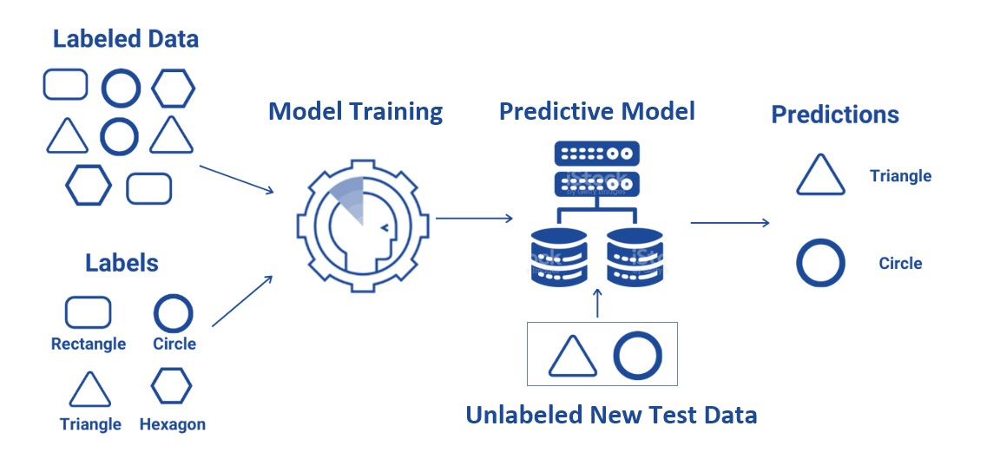
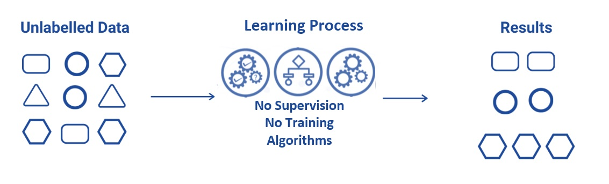
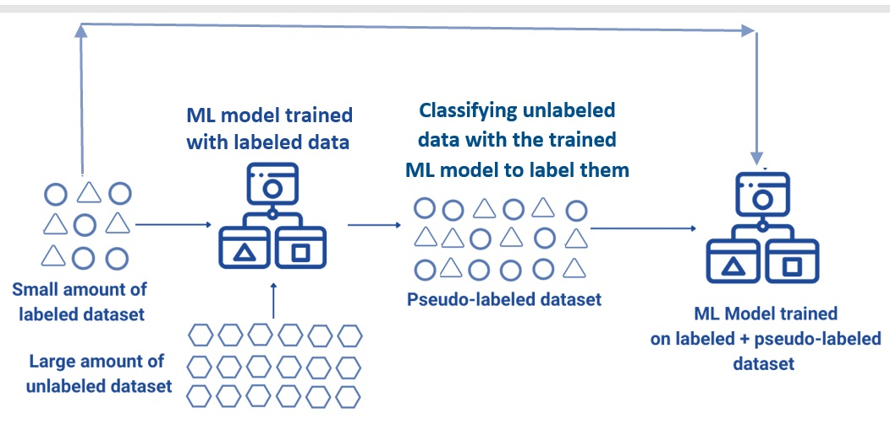
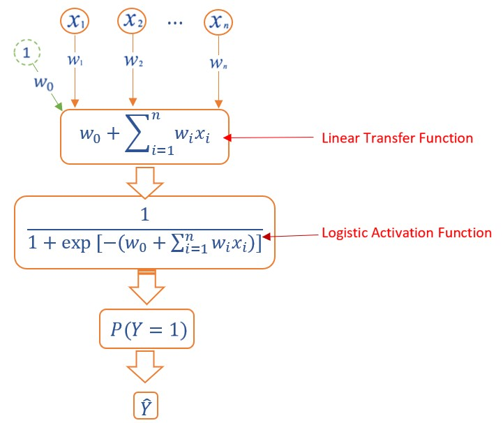
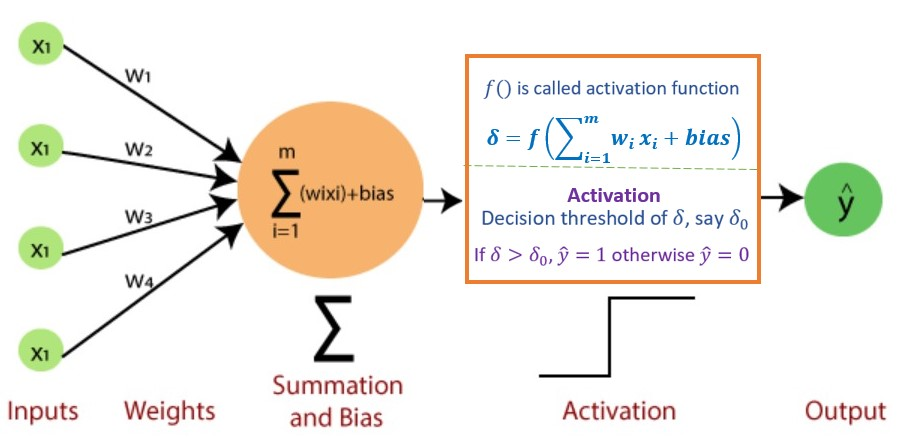
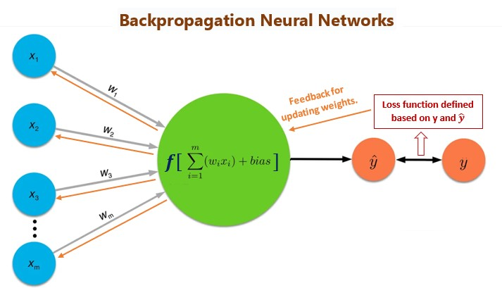
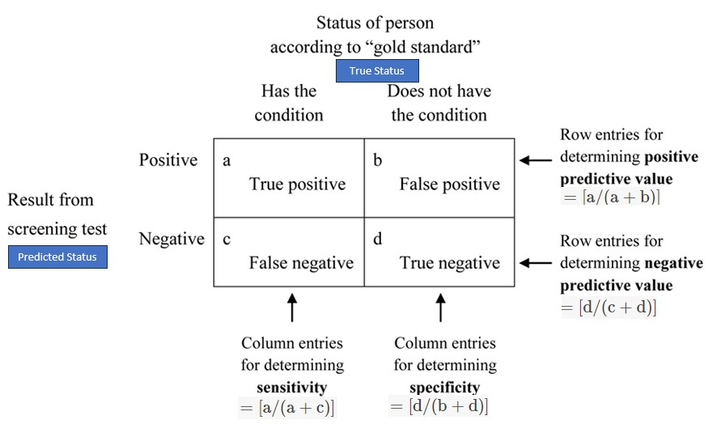

<style type="text/css">

div#TOC li {
    list-style:none;
    background-image:none;
    background-repeat:none;
    background-position:0;
}

h1.title {
  font-size: 20px;
  color: DarkRed;
  text-align: center;
}
h4.author { /* Header 4 - and the author and data headers use this too  */
    font-size: 18px;
  font-family: "Times New Roman", Times, serif;
  color: DarkRed;
  text-align: center;
}
h4.date { /* Header 4 - and the author and data headers use this too  */
  font-size: 18px;
  font-family: "Times New Roman", Times, serif;
  color: DarkBlue;
  text-align: center;
}
h1 { /* Header 3 - and the author and data headers use this too  */
    font-size: 22px;
    font-family: "Times New Roman", Times, serif;
    color: darkred;
    text-align: center;
}
h2 { /* Header 3 - and the author and data headers use this too  */
    font-size: 18px;
    font-family: "Times New Roman", Times, serif;
    color: navy;
    text-align: left;
}

h3 { /* Header 3 - and the author and data headers use this too  */
    font-size: 15px;
    font-family: "Times New Roman", Times, serif;
    color: navy;
    text-align: left;
}

h4 { /* Header 4 - and the author and data headers use this too  */
    font-size: 18px;
    font-family: "Times New Roman", Times, serif;
    color: darkred;
    text-align: left;
}
</style>

```{r setup, include=FALSE}
# code chunk specifies whether the R code, warnings, and output 
# will be included in the output files.

if (!require("ggplot2")) {
   install.packages("ggplot2")
   library(ggplot2)
}
if (!require("ISLR")) {
   install.packages("ISLR")
   library(ISLR)
}
if (!require("knitr")) {
   install.packages("knitr")
   library(knitr)
}
if (!require("ISLR")) {
   install.packages("ISLR")
   library(ISLR)
}
if (!require("neuralnet")) {
   install.packages("neuralnet")
   library(neuralnet)
}
if (!require("neuralnet")) {
   install.packages("neuralnet")
   library(neuralnet)
}
if (!require("caret")) {
   install.packages("caret")
   library(caret)
}
if (!require("nnet")) {
   install.packages("nnet")
   library(nnet)
}
if (!require("devtools")) {
   install.packages("devtools")
   library(devtools)
}
if (!require("pander")) {
   install.packages("pander")
   library(pander)
}
source_url("https://pengdsci.github.io/STA551/plotNeuralnetRfun.txt")

# knitr::opts_knit$set(root.dir = "C:/Users/75CPENG/OneDrive - West Chester University of PA/Documents")
# knitr::opts_knit$set(root.dir = "C:\\STA490\\w05")

knitr::opts_chunk$set(echo = TRUE,       
                      warning = FALSE,   
                      result = TRUE,   
                      message = FALSE)
```

\

# Introduction

There are a lot of debates on the difference between statistics and machine learning in statistics and machine learning communities. It is sure that statistics and machine learning are not the same although there is an overlap. A major difference between machine learning and statistics is indeed their purpose.

* Statistics focuses on the inference and interpretability of the relationships between variables.

* Machine learning focuses on the accuracy of the prediction of future values of (response) variables and detecting hidden patterns.  Machine learning is traditionally considered to be a subfield of artificial intelligence, which is broadly defined as the capability of a machine to imitate intelligent human behavior. 


A lot of statistical models can make predictions, but predictive accuracy is not their strength while machine learning models provide various degrees of interpretability sacrifice interpretability for predictive power. For example, regularized regressions as machine learning algorithms are interpretable but neural networks (particularly multi-layer networks ) are almost uninterpretable.

Statistics and machine learning are two of the key players in data science. As data science practitioners, our primary interest is to develop and select the right tools to build data solutions for real-world applications. 

\

## Machine Learning Problems and Jargon


|  Statistics              | Machine Learning      |     Comments                |
|:--------------------|:--------------------------|:---------------------------------------|
|data point, record, row of data| example, instance | Both domains also use "observation," which can refer to a single measurement or an entire vector of attributes depending on context.|
|response variable, dependent variable| label, output|Both domains also use "target." Since practically all variables depend on other variables, the term "dependent variable" is potentially misleading.|
|regressions | supervised learners, machines| Both estimate output(s) in terms of input(s). |
|regression intercept| bias | the default prediction of a linear model in the special case where all inputs are 0.|
|Maximize the likelihood to estimate model parameters| Minimize the entropy to derive the best parameters in categorical regression or maximize the likelihood for continuous regression.| For discrete distributions, maximizing the likelihood is equivalent to minimizing the entropy.|
|logistic/multinomial regression|maximum entropy, MaxEnt|They are equivalent except in special multinomial settings like ordinal logistic regression. |

\

## Types of Machine Learning Problems

Based on the type of problems that we are trying to solve, we can classify the Machine learning problem into three different categories.

**Classification Problem**: Classification is a problem that requires machine learning algorithms to assign a class label (response value) to examples (vector of predictor values) from the problem domain. A very intuitive example is classifying credit card transactions into two labels “fraud” or “not a fraud.”


**Regression Problem**: Regression is a problem that requires machine learning algorithms to predict continuous (response) variables. An elementary example will be to predict the temperature of the city. (Temperature can take any numeric value between -50 to +150 degrees.)

**Clustering Problem**: Clustering is a type of problem that requires the use of Machine Learning algorithms to group the given data records into a specified number of cohesive units. A simple example will be to group the credit card holders according to their monthly spending.  

There are many machine learning algorithms and statistical models running in the practice. This note primarily overviews the commonly used methods for classification and prediction.


\

# Categories of Machine Learning 

There are different ways to categorize machine learning algorithms using different criteria. But none of them are perfect although each has its own merits.

## Supervised Learning
 
Input data is called training data and has a known label (i.e., the response in statistics) or result such as spam/not-spam (classification) or a stock price at a time (forecasting/prediction).

Supervised learning is a subcategory of machine learning. It is defined by its use of labeled data (i.e., the response is available in the data) sets to train algorithms that classify data or predict outcomes accurately. As input data is fed into the model, it adjusts its weights until the model has been fitted appropriately, which occurs as part of the **cross-validation** process. 

Supervised learning helps organizations solve a variety of real-world problems at scale, such as classifying spam in a separate folder from an email inbox, classifying credit transactions into fraud or non-fraud categories, etc.

```{r echo=FALSE, fig.align='center', out.height="80%", fig.cap="Figure 1.  Illustration of supervised machine learning."}

```

There are a lot of supervised machine learning algorithms. Example algorithms include **Logistic Regression**, Decision Trees, Support Vector Machines, Neural Networks, etc.


## Unsupervised Learning
 
Unsupervised learning uses machine learning algorithms to analyze and cluster unlabeled (i.e., no response variable is used or required in) data sets. These algorithms discover hidden patterns or data groupings without the need for human intervention. Its ability to discover similarities and differences in information makes it the ideal solution for exploratory data analysis, cross-selling strategies, customer segmentation, and image recognition. We have briefly mentioned this clustering algorithm when discussing feature engineering.

```{r echo=FALSE, fig.align='center', fig.width=3, fig.height=3, fig.cap="Figure 2.  Illustration of unsupervised machine learning."}

```


Example problems are clustering, dimensionality reduction, and association rule learning.


Example algorithms include clustering analysis and K-Means.


## Semi-Supervised Learning
 
Input data is a mixture of labeled and unlabeled examples, that is, some records have response values and some don't.

We can use either a predictive ML model trained based on the labeled data to predict the labels of the unlabeled data or a clustering algorithm such as k-means to assign labels to the unlabeled data to make a larger pseudo-labeled data for ML model with a better performance.

```{r echo=FALSE, fig.align='center', fig.width=3, fig.height=3, fig.cap="Figure 3.  Illustration of semi-supervised machine learning."}

```

The following chart gives a non-numerical example of how semi-supervised learning works.

```{r echo=FALSE, fig.align='center', fig.width=3, fig.height=3, fig.cap="Figure 4.  Illustration of how semi-supervised machine learning works."}

```

Semi-supervised learning and reinforcement learning are hot topics in the machine learning community. Example algorithms are extensions to other flexible methods that make assumptions about how to model the unlabeled data.

\


# From Statistics to Machine Learning

As mentioned earlier, most statistical models can be used as a learning algorithm. In this section, we use two examples to demonstrate the equivalent between some of the basic statistical models and their corresponding machine learning models. 


## Logistic Regression Model Revisited

Recall that the binary logistic regression model with n feature variables $x_1, x_2, \cdots, x_n$ is given by

$$
P[Y = 1] = \frac{\exp(w_0 + w_1x_1 + w_2x_2 + \cdots + w_nx_n)}{1+\exp(w_0 + w_1x_1 + w_2x_2 + \cdots + w_nx_n)} = \frac{\exp(w_0+\sum_{i=1}^n w_ix_i)}{1 + \exp(w_0+\sum_{i=1}^n w_ix_i)}
$$

where $w_0, w_1, \cdots, w_n$ are regression coefficients. The model can be rewritten as

$$
P[Y=1] = \frac{1}{1+ \exp[-(w_0+\sum_{i=1}^n w_ix_i)]}
$$

Let 
$$
f(x) = \frac{1}{1+\exp(-x)}.
$$

This function is the well-known **logistic function**. The curve of the logistic function is given by


```{r fig.align='center', fig.cap="Figure 5.  The curve of the logistic function."}
x = seq(-5, 5, length = 100)
y = 1/(1+exp(-x))
plot(x,y, type = "l", lwd = 2, xlab =" ", ylab = " ", 
     main = "Logistic Curve", col = "blue")
```


Using this logistic function, we can re-express the logistic model as 

$$
P[Y = 1] = f\left(w_0+\sum_{i=1}^n w_ix_i\right)
$$


Next, we represent the above logistic regression model in the following diagram.

```{r echo=FALSE, fig.align='center', out.width="70%", fig.cap="Figure 6. Diagram Representation of logistic regression models."}

```

We will see that the above diagram of the logistic regression model is the architecture of the basic single layer **sigmoid** neural network model - perceptron. 


## Single Layer Neural Network - Perceptron

Perceptron is a type of artificial neural network, which is a fundamental concept in machine learning. Its architecture is the same as the diagram of the logistic regression model.

```{r echo=FALSE, fig.align='center', out.width="70%", fig.cap="Figure 7.  Architecture of Single layer neural network models (perceptron)."}

```

Each input $x_i$ has an associated weight $w_i$ (like regression coefficient). The sum of all weighted inputs, $\sum_{i=1}^n w_ix_i$ , is then passed through a nonlinear activation function $f()$, to transform the pre-activation level of the neuron to an output $y_j$. For simplicity, the bias term is set to **b** which is equivalent to the intercept of a regression model. 

To summarize, we explicitly list the major components of perceptron in the following.

* **Input Layer**: The input layer consists of one or more input neurons, which receive input signals from the external world or from other layers of the neural network.

* **Weights**: Each input neuron is associated with a weight, which represents the strength of the connection between the input neuron and the output neuron.

* **Bias**: A bias term is added to the input layer to provide the perceptron with additional flexibility in modeling complex patterns in the input data.

* **Activation Function**: The activation function determines the output of the perceptron based on the weighted sum of the inputs and the bias term. Common activation functions used in perceptrons include the `step function`, `sigmoid function`, and `ReLU function`, etc.

* **Output**: The output of the perceptron is a single binary value, either 0 or 1, which indicates the class or category to which the input data belongs.


Note that when the sigmoid (i.e., logistic) function

$$
f(x) = \frac{\exp(x)}{1 + \exp(x)} = \frac{1}{1+\exp(-x)}.
$$

is used in the perceptron. This means that the single-layer perception with logistic activation is equivalent to the binary logistic regression.


\

**Remarks**: 

1. The output of the above perceptron network is binary, i.e., $\hat{Y} = 0$ or $1$ since an implicit decision boundary based on the sign of the value of the transfer function $\sum_{i=1}^m w_ix_i + b$. In the sigmoid perceptron network, this is equivalent to setting the threshold probability to 0.5. To see this, not that, if $\sum_{i=1}^m w_ix_i + b = 0$, then
$$
P\left[Y=1 \Bigg| \sum_{i=1}^m w_ix_i + b\right]=\frac{1}{1+\exp\left[-(\sum_{i=1}^m w_ix_i + b) \right]} = \frac{1}{1+\exp(0)} = \frac{1}{2}
$$
This means, if the cut-off probability $0.5$ is used in the logistic predictive model, this logistic predictive model is equivalent to the perceptron with sigmoid being the activation function.

2. There are several other commonly used activation functions in perceptron. The sigmoid activation function is only one of them. This implies that the binary logistic regression model is a special perceptron network model.
 


## Multi-layer Perceptron

A Multi-Layer Perceptron (MLP) contains one or more hidden layers (apart from one input and one output layer). While a single-layer perceptron can only learn linear functions, a multi-layer perceptron can also learn non-linear functions. The following is an illustrative MLP.


```{r echo=FALSE, fig.align='center', fig.width=3, fig.height=3, fig.cap="Figure 8.  Multi-layer perceptron."}
include_graphics("img/w07-Multilayer-Perceptron.jpg")
```

The `major components` in the above MLP are described in the following.

**Input Layer**: The Input layer has three nodes. The Bias node has a value of 1. The other two nodes take $X_1$ and $X_2$ as external inputs (which are numerical values depending upon the input data set). No computation is performed in the Input layer, so the outputs from nodes in the Input layer are 1, $X_1$, and $X_2$ respectively, which are fed into the Hidden Layer.

**Hidden Layer**: The Hidden layer also has three nodes with the Bias node having an output of 1. The output of the other two nodes in the Hidden layer depends on the outputs from the Input layer (1, $X_1$, $X_2$) as well as the weights associated with the connections (edges). Figure 16 shows the output calculations for the hidden nodes. Remember that $f()$ refers to the activation function. These outputs are then fed to the nodes in the Output layer.

**Output Layer**: The Output layer has two nodes that take inputs from the Hidden layer and perform similar computations as shown in the above figure. The values calculated ($Y_1$ and $Y_2$) as a result of these computations act as outputs of the Multi-Layer Perceptron.


## Commonly Used Activation Functions

The sigmoid function is only one of the activation functions used in neural networks. The table below lists several other commonly used activation functions in neural network modeling.


```{r echo=FALSE, fig.align='center', out.width="60%", fig.cap="Figure 9.  Popular activation functions in neural networks."}
include_graphics("img/w07-commonlyUsedActivationFuns.jpg")
```


## Algorithms for Estimating Weights

We know that the estimation of the regression coefficient in logistic regression is to maximize the likelihood function defined based on the binomial distribution. Algorithms such as Newton and its variants, scoring methods, etc. are used to obtain the estimated regression coefficients. 

In neural network models, the weights are estimated by minimizing the loss function (also called cost function) when training neural networks. The loss function could be defined as **mean square error (MSE)** for regression tasks and **cross-entropy (cs)** for classification tasks. 

Learning algorithms **forward and backward propagation** that depend on each other are used in minimizing the underlying **loss function**. 

* **Forward propagation** is where input data is fed through a network, in a forward direction, to generate an output. The data is accepted by hidden layers and processed, as per the activation function, and moves to the successive layer. During forward propagation, the activation function is applied, based on the weighted sum, to make the neural network flow non-linearly using bias.  Forward propagation is the way data moves from left (input layer) to right (output layer) in the neural network.

* **Backpropagation** is used to improve the prediction accuracy of a node is expressed as a loss function or error rate. Backpropagation calculates the slope of (gradient) a **loss function** of other weights in the neural network and updates the weights using gradient descent through the learning rate. 

```{r echo=FALSE, fig.align='center', out.width="60%", fig.cap="Figure 10.  Updating weights with backpropagation algorithm."}
include_graphics("img/w07-backpropagationGradient.jpg")
```

The general architecture of the backpropagation network model is depicted in the following diagram.

```{r echo=FALSE, fig.align='center', out.width="60%", fig.cap="Figure 11.  The idea of backpropagation neural networks."}

```


The algorithm of backpropagation is not used in classical statistics. This is why the neural network model outperformed the classical logistic model in terms of predictive power. 


The R library `neuralnet` has the following five algorithms:   

**backprop** - traditional `backpropagation`. 

**rprop+**  - resilient backpropagation with weight backtracking.

**rprop-** - resilient backpropagation without weight backtracking.

**sag** - modified globally convergent algorithm (gr-prop) with the smallest absolute gradient.

**slr** - modified globally convergent algorithm (gr-prop) with the smallest learning rate.


\

# Implementing NN with R 

Several R libraries can run neural network models. `nnet` is the simplest one that only implements single-layer networks. `neuralnet` can run both single-layer and multiple-layer neural networks. `RSNNS` (R Stuttgart Neural Network Simulator) is a wrapper of multiple R libraries that implements different network models.

## Syntax of `neuralnet`

We use `neuralnet` library to run the neural network model in the example (code for installing and loading this library is placed in the setup code chunk). 

The syntax of `neuralnet()` is given below

```{}
 neuralnet(formula, 
           data, 
           hidden = 1,
           threshold = 0.01, 
           stepmax = 1e+05, 
           rep = 1, 
           startweights = NULL,
           learningrate.limit = NULL,
           learningrate.factor =list(minus = 0.5, plus = 1.2),
           learningrate=NULL, 
           lifesign = "none",
           lifesign.step = 1000, 
           algorithm = "rprop+",
           err.fct = "sse", 
           act.fct = "logistic",
           linear.output = TRUE, 
           exclude = NULL,
           constant.weights = NULL, 
           likelihood = FALSE)
```

The detailed `help document` can be found at <https://www.rdocumentation.org/packages/neuralnet/versions/1.44.2/topics/neuralnet>.


## Feature Conversion for `neuralnet`

`neuralnet()` requires all features to be in the numeric form (dummy variable for categorical features, normalization of numerical features). The model formula in `neuralnet()` requires dummy variables to be explicitly defined. It is also highly recommended to scale all numerical features before being included in the network model. The objective is to find all feature names (numeric and all dummy variables) and write them in the model formula like the one in `glm`: `response ~ var_1 + var_2 + ... +var_k`


To explain the modeling process in detail, we will outline major steps in the following subsections.  


## Numeric Feature Scaling

There are different types of scaling and standardization. The one we use in the following has

$$
scaled.var = \frac{orig.var - \min(orig.var)}{\max(orig.var)-\min(orig.var)}
$$
The scaled numeric feature is unitless (similar to the well-known z-score transformation).


```{r}
Pima = read.csv("https://pengdsci.github.io/STA551/w03/AnalyticPimaDiabetes.csv")[,-1]
Pima$pedigree = (Pima$pedigree-min(Pima$pedigree))/(max(Pima$pedigree)-min(Pima$pedigree))
Pima$impute.log.insulin = (Pima$impute.log.insulin-min(Pima$impute.log.insulin))/(max(Pima$impute.log.insulin)-min(Pima$impute.log.insulin))
Pima$impute.triceps = (Pima$impute.triceps-min(Pima$impute.triceps))/(max(Pima$impute.triceps)-min(Pima$impute.triceps))
```

## Extract All Feature Names

In practical applications, there may be many categorical features in the model and each category could have many categories. It is practically infeasible to write all resulting dummy features explicitly. We can use the R function to extract variables from a model formula that will be used in a model. Make sure, all categorical feature variables must be defined in a non-numerical form (i.e., should not be numerically encoded). We can also use the R function `relevel()` to change the baseline of an unordered categorical feature variable. 


Next, we use the R function `model.matrix()` to extract the names of all feature variables (including implicitly defined dummy feature variables from `model.matrix()`).

```{}
PimaMtx0 = model.matrix(~ mass + pedigree + impute.log.insulin + impute.triceps + grp.glucose + grp.diastolic + grp.age + grp.pregnant + diabetes, data = Pima)
colnames(PimaMtx0)
```

```{r}
PimaMtx = model.matrix(~ ., data = Pima)
colnames(PimaMtx)
```
There are some naming issues in the above dummy feature variables for network modeling (although they are good for regular linear and generalized linear regression models). We need to rename them by excluding special characters in order to build neural network models. These issues can be avoided at the stage of feature engineering (if we initially planned to build neural network models). Next, we clean up the variables before defining the network model formula.

```{r}
colnames(PimaMtx)[4] <- "logInsulin"
colnames(PimaMtx)[5] <- "triceps"
colnames(PimaMtx)[6] <- "glucose117To137"
colnames(PimaMtx)[7] <- "glucoseGt137"
colnames(PimaMtx)[8] <- "diastolic80To90"
colnames(PimaMtx)[9] <- "diastolicGt90"
colnames(PimaMtx)[10] <- "age45To64"
colnames(PimaMtx)[11] <- "age65older"
colnames(PimaMtx)[12] <- "pregnant1"
colnames(PimaMtx)[13] <- "pregnant2"
colnames(PimaMtx)[14] <- "pregnant3To4"
colnames(PimaMtx)[15] <- "pregnant5To7"
colnames(PimaMtx)[16] <- "pregnant8Plus"
```
 
## Define Model Formula

For convenience, we encourage you to use **CamelCase** notation (`CamelCase` is a way to separate the words in a phrase by making the first letter of each word capitalized and not using spaces) in naming feature variables.

```{r}
columnNames = colnames(PimaMtx)
columnList = paste(columnNames[-c(1,length(columnNames))], collapse = "+")
columnList = paste(c(columnNames[length(columnNames)],"~",columnList), collapse="")
modelFormula = formula(columnList)
modelFormula
```


\

## Training and Testing NN Model

We follow the routine steps for building a neural network model to predict diabetes.

### Data Splitting

We split the data into 70% for training the neural network and 30% for testing.

```{r}
n = dim(PimaMtx)[1]
testID = sample(1:n, round(n*0.7), replace = FALSE)
testDat = PimaMtx[testID,]
trainDat = PimaMtx[-testID,]
```

### Build NN Model

```{r}
NetworkModel = neuralnet(modelFormula,
                         data = trainDat,
                         hidden = 1,               # single layer NN
                         rep = 1,                  # number of replicates in training NN
                         threshold = 0.01,         # threshold for the partial derivatives as stopping criteria.
                         learningrate = 0.1,       # user selected rate
                         algorithm = "rprop+"
                         )
kable(NetworkModel$result.matrix)
```


```{r fig.align='center', fig.width=8, fig.height=6,  fig.cap="Figure 12. Single-layer backpropagation Neural network model for Pima Indian diabetes"}
plot(NetworkModel, rep="best")
```


```{r}
logiModel = glm(factor(diabetes) ~., family = binomial, data = Pima)
pander(summary(logiModel)$coefficients)
```


### About Cross-validation in Neural Network

The algorithm of Cross-validation is primarily used for tuning hyper-parameters. For example, in the sigmoid perceptron, the optimal cut-off scores for the binary decision can be obtained through cross-validation. One of the important hyperparameters in the neural network model is the learning rate $\alpha$ (in the backpropagation algorithm) that impacts the learning speed in training neural network models.

```{r}
n0 = dim(trainDat)[1]/5
cut.off.score = seq(0,1, length = 22)[-c(1,22)]        # candidate cut off prob
pred.accuracy = matrix(0,ncol=20, nrow=5, byrow = T)  # null vector for storing prediction accuracy
##
for (i in 1:5){
  valid.id = ((i-1)*n0 + 1):(i*n0)
  valid.data = trainDat[valid.id,]
  train.data = trainDat[-valid.id,]
  ####
  train.model = neuralnet(modelFormula,
                         data = train.data,
                         hidden = 1,               # single layer NN
                         rep = 1,                  # number of replicates in training NN
                         threshold = 0.01,         # threshold for the partial derivatives as stopping criteria.
                         learningrate = 0.1,       # user selected rate
                         algorithm = "rprop+"
                         )
    pred.nn.score = predict(NetworkModel, valid.data)
    for(j in 1:20){
    #pred.status = rep(0,length(pred.nn.score))
    pred.status = as.numeric(pred.nn.score > cut.off.score[j])
    a11 = sum(pred.status == valid.data[,17])
    pred.accuracy[i,j] = a11/length(pred.nn.score)
  }
}
###  
avg.accuracy = apply(pred.accuracy, 2, mean)
max.id = which(avg.accuracy ==max(avg.accuracy ))
### visual representation
tick.label = as.character(round(cut.off.score,2))
plot(1:20, avg.accuracy, type = "b",
     xlim=c(1,20), 
     ylim=c(0.5,1), 
     axes = FALSE,
     xlab = "Cut-off Score",
     ylab = "Accuracy",
     main = "5-fold CV performance"
     )
axis(1, at=1:20, label = tick.label, las = 2)
axis(2)
segments(max.id, 0.5, max.id, avg.accuracy[max.id], col = "red")
text(max.id, avg.accuracy[max.id]+0.03, as.character(round(avg.accuracy[max.id],4)), col = "red", cex = 0.8)
```


\

### Testing Model Performance

```{r}
#Test the resulting output
nn.results <- predict(NetworkModel, testDat)
results <- data.frame(actual = testDat[,17], prediction = nn.results > .57)
confMatrix = table(results$prediction, results$actual)               # confusion matrix
accuracy=sum(results$actua == results$prediction)/length(results$prediction)
list(confusion.matrix = confMatrix, accuracy = accuracy)       
```
### ROC Analysis

Recall that the ROC curve is the plot of sensitivity against (1 - specificity) calculated from the confusion matrix based on a sequence of selected cut-off scores. Definitions of sensitivity and specificity are given in the following confusion matrix

```{r echo=FALSE, fig.align='center', out.width="95%", fig.cap="Figure 13. Confusion matrix and sensitivity and specificity."}

```

Next, we construct a ROC for the above NN model based on the training data set.

```{r fig.align='center', fig.width=5, fig.height=5, fig.cap="Figure 14: ROC Curve of the neural network model."}
nn.results = predict(NetworkModel, trainDat)  # Keep in mind that trainDat is a matrix!
cut0 = seq(0,1, length = 20)
SenSpe = matrix(0, ncol = length(cut0), nrow = 2, byrow = FALSE)
for (i in 1:length(cut0)){
    a = sum(trainDat[,"diabetespos"] == 1 & (nn.results > cut0[i]))
    d = sum(trainDat[,"diabetespos"] == 0 & (nn.results < cut0[i]))
    b = sum(trainDat[,"diabetespos"] == 0 & (nn.results > cut0[i]))    
    c = sum(trainDat[,"diabetespos"] == 1 & (nn.results < cut0[i]))   
    sen = a/(a + c)
    spe = d/(b + d)
    SenSpe[,i] = c(sen, spe)
}
# plotting ROC
plot(1-SenSpe[2,], SenSpe[1,], type ="l", xlim=c(0,1), ylim=c(0,1),
     xlab = "1 - specificity", ylab = "Sensitivity", lty = 1,
     main = "ROC Curve", col = "blue")
abline(0,1, lty = 2, col = "red")
## Calculate AUC
xx = 1-SenSpe[2,]
yy = SenSpe[1,]
width = xx[-length(xx)] - xx[-1]
height = yy[-1]
AUC =mean(sum(width*height), sum(width*yy[-length(yy)]))
text(0.8, 0.3, paste("AUC = ", round(AUC,4)), col = "purple", cex = 0.9)
legend("bottomright", c("ROC of the model", "Random guessing"), lty=c(1,2),
       col = c("blue", "red"), bty = "n", cex = 0.8)
```

The above ROC curve indicates that the underlying neural network is better than the random guess since the area under the curve is significantly greater than 0.5. In general, if the area under the ROC curve is greater than 0.65, we say the predictive power of the underlying model is acceptable.


\


## About Deep Learning

*From Wikipedia, the free encyclopedia*

Deep learning is part of a broader family of machine learning methods, which is based on artificial neural networks with representation learning. The adjective "deep" in deep learning refers to the use of multiple layers in the network. Methods used can be either supervised, semi-supervised, or unsupervised.

Deep-learning architectures such as deep neural networks, deep belief networks, deep reinforcement learning, recurrent neural networks, convolutional neural networks, and transformers have been applied to fields including computer vision, speech recognition, natural language processing, machine translation, bioinformatics, drug design, medical image analysis, climate science, material inspection and board game programs, where they have produced results comparable to and in some cases surpassing human expert performance.


\

# Clustering Algorithms

Clustering and principal component analysis are two classical multivariate statistical methods. These two methods and their extensions are now the core methods in machine learning. We will briefly introduce both of them in this class. 

