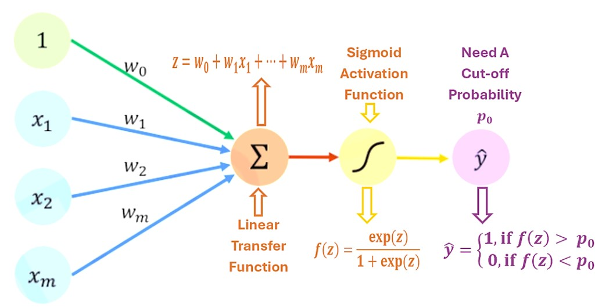

```{=html}
<style type="text/css">

div#TOC li {
    list-style:none;
    background-image:none;
    background-repeat:none;
    background-position:0;
}

h1.title {
  font-size: 20px;
  font-weight: bold;
  color: DarkRed;
  text-align: center;
}
h4.author { /* Header 4 - and the author and data headers use this too  */
    font-size: 18px;
    font-weight: bold;
  font-family: "Times New Roman", Times, serif;
  color: DarkRed;
  text-align: center;
}
h4.date { /* Header 4 - and the author and data headers use this too  */
  font-size: 18px;
  font-weight: bold;
  font-family: "Times New Roman", Times, serif;
  color: DarkBlue;
  text-align: center;
}
h1 { /* Header 3 - and the author and data headers use this too  */
    font-size: 22px;
    font-weight: bold;
    font-family: "Times New Roman", Times, serif;
    color: darkred;
    text-align: center;
}
h2 { /* Header 3 - and the author and data headers use this too  */
    font-size: 18px;
    font-weight: bold;
    font-family: "Times New Roman", Times, serif;
    color: navy;
    text-align: left;
}

h3 { /* Header 3 - and the author and data headers use this too  */
    font-size: 16px;
    font-weight: bold;
    font-family: "Times New Roman", Times, serif;
    color: navy;
    text-align: left;
}

h4 { /* Header 4 - and the author and data headers use this too  */
    font-size: 14px;
    font-weight: bold;
    font-family: "Times New Roman", Times, serif;
    color: darkred;
    text-align: left;
}
</style>
```
```{r setup, include=FALSE}
# code chunk specifies whether the R code, warnings, and output 
# will be included in the output files.
if (!require("ggplot2")) {
   install.packages("ggplot2")
   library(ggplot2)
}
if (!require("knitr")) {
   install.packages("knitr")
   library(knitr)
}
if (!require("ISLR")) {
   install.packages("ISLR")
   library(ISLR)
}
if (!require("neuralnet")) {
   install.packages("neuralnet")
   library(neuralnet)
}
if (!require("caret")) {
   install.packages("caret")
   library(caret)
}
if (!require("nnet")) {
   install.packages("nnet")
   library(nnet)
}
if (!require("haven")) {
   install.packages("haven")
   library(haven)
}
if (!require("pander")) {
   install.packages("pander")
   library(pander)
}
if (!require("pROC")) {
   install.packages("pROC")
   library(pROC)
}
if (!require("gridExtra")) {
   install.packages("gridExtra")
   library(gridExtra)
}
if (!require("ggparallel")) {
   install.packages("ggparallel")
   library(ggparallel)
}
# The following R source code will be use to plot the path plot
# of neural network model with estimated weights from the data.
source("https://pengdsci.github.io/STA551/plotNeuralnetRfun.txt")
# knitr::opts_knit$set(root.dir = "C:\\STA551\\w08")

knitr::opts_chunk$set(echo = TRUE,       
                      warning = FALSE,   
                      results = TRUE,   
                      message = FALSE,
                      comment= NA)
```


\

# Introduction

There are a lot of debates on the difference between statistics and machine learning in statistics and machine learning communities. Certainly, statistics and machine learning are not the same although there is an overlap. A major difference between machine learning and statistics is indeed their purpose.

-   Statistics focuses on the inference and interpretability of the relationships between variables.

-   Machine learning focuses on the accuracy of the prediction of future values of (response) variables and detecting hidden patterns. Machine learning is traditionally considered to be a subfield of artificial intelligence, which is broadly defined as the capability of a machine to imitate intelligent human behavior.

A lot of statistical models can make predictions, but predictive accuracy is not their strength while machine learning models provide various degrees of interpretability sacrifice interpretability for predictive power. For example, regularized regressions as machine learning algorithms are interpretable but neural networks (particularly multi-layer networks ) are almost uninterpretable.

Statistics and machine learning are two of the key players in data science. As data science practitioners, our primary interest is to develop and select the right tools to build data solutions for real-world applications.

\

# Some Machine Learning Jargon

Before demonstrating how some classical models are used as machine learning algorithms, we first introduce a partial list of machine learning jargon. This terms

| Statistics                                           | Machine Learning                                                                                                                   | Comments                                                                                                                                            |
|:-----------------|:---------------------|:-------------------------------|
| data point, record, row of data                      | example, instance                                                                                                                  | Both domains also use "observation," which can refer to a single measurement or an entire vector of attributes depending on context.                |
| response variable, dependent variable                | label, output                                                                                                                      | Both domains also use "target." Since practically all variables depend on other variables, the term "dependent variable" is potentially misleading. |
| regressions                                          | supervised learners, machines                                                                                                      | Both estimate output(s) in terms of input(s).                                                                                                       |
| regression intercept                                 | bias                                                                                                                               | the default prediction of a linear model in the special case where all inputs are 0.                                                                |
| Maximize the likelihood of estimating model parameters | Minimize the entropy to derive the best parameters in categorical regression or maximize the likelihood for continuous regression. | For discrete distributions, maximizing the likelihood is equivalent to minimizing the entropy.                                                      |
| logistic/multinomial regression                      | maximum entropy, MaxEnt                                                                                                            | They are equivalent except in special multinomial settings like ordinal logistic regression.                                                        |

\

# Logistic Regression Model Revisited

Recall that the binary logistic regression model with $k$ feature variables $x_1, x_2, \cdots, x_k$ is given by

$$
P[Y = 1 \big| (x_1, x_2, \cdots, x_k)] = \frac{\exp(w_0 + w_1x_1 + w_2x_2 + \cdots + w_kx_k)}{1+\exp(w_0 + w_1x_1 + w_2x_2 + \cdots + w_kx_k)} 
$$

$$
= \frac{\exp(w_0+\sum_{i=1}^k w_ix_i)}{1 + \exp(w_0+\sum_{i=1}^k w_ix_i)} = \frac{1}{1+ \exp[-(w_0+\sum_{i=1}^k w_ix_i)]}
$$

where $w_0, w_1, \cdots, w_n$ are regression coefficients. Let

$$
\pi(x_1,x_2, \cdots,x_k) = P[Y=1\big| (x_1,x_2,\cdots,x_k)].
$$

be the probability of `success` given the covariate pattern $(x_1, x_2, \cdots, x_k)$. We can re-express the logistic regression model in the following form

$$
\log \left( \frac{\pi(x_1,x_2, \cdots,x_k)}{1 + \pi(x_1,x_2, \cdots,x_k)}\right) = w_0+\sum_{i=1}^k w_ix_i
$$

where

$$
\frac{\pi(x_1,x_2, \cdots,x_k)}{1 + \pi(x_1,x_2, \cdots,x_k)} = \text{odds of success for given } (x_1, x_2, \cdots, x_k).
$$

Therefore, the general logistic regression model is also called **log odds regression**. This also makes logistic regression interpretable since the regression coefficient $w_i$ is the change of log odds of `success` when the covariate $x_i$ increases by a unit and all other covariates remain unchanged (for $i = 1, 2, \cdots, k$).

Let $z = w_0+\sum_{i=1}^k w_ix_i$ be the linear combination of predictors, that impact the `success` probability, then

$$
\pi(z) = \frac{1}{1+ \exp(-z)} \ \ \text{ for } \ \ -\infty < z < \infty.
$$

Note that $\pi(z)$ is the well-known **logistic function**. The curve of the logistic function is given by

```{r fig.align='center', fig.cap="Figure 5.  The curve of the logistic function."}
x = seq(-5, 5, length = 100)
y = 1/(1+exp(-x))
plot(x,y, type = "l", lwd = 2, xlab ="z ", ylab = expression(pi(z)), 
     main = "Logistic Curve", col = "blue")
text(-3, 0.8, expression(pi(z) ==frac(1,1+exp(-z))), col = "blue")
```

The main feature of logistic function $f(z)$ is its S-shape curve with a range $f(z) \in [0,1]$, domain $z \in (-\infty, \infty)$, and $f(z) = 1/2$. Other functions have the same properties as logistic functions. These types of functions are called **sigmoid** functions.

Note that the inverse of the logistic function is called the **logit function** that is given by

$$
f^{-1}(x) = \log \left( \frac{x}{1-x}\right).
$$

The logistic regression is also called **logit** regression. It is also called **log odds regression** because $P(Y=\text{success})/[1-P(Y=\text{success})]$ is the odds of success.

# Working Data Set and EDA

This section introduces the data set and prepares an analytic data set to perform predictive modeling using both classical statistical methods and machine learning algorithms.

## Framingham Study Data

The Framingham Data is collected from an ongoing cardiovascular study on residents of the town of Framingham, Massachusetts. The goal of this application is to predict whether the patient has a 10-year risk of future coronary heart disease (CHD). The data set contains 4000 records and 15 variables that provide the patients' demographic and medical information.

A brief description of the variables is given below.

**male**: male ( = 1) or female ( = 0)

**age**: Age of the patient;

**education**: A categorical variable of the participants' education, with the levels: Some high school (1), high school/GED (2), some college/vocational school (3), college (4)

**currentSmoker**: Current cigarette smoking at the time of examinations

**cigsPerDay**: Number of cigarettes smoked each day

**BPmeds**: Use of Anti-hypertensive medication at exam

**prevalentStroke**: Prevalent Stroke (0 = free of disease)

**prevalentHyp**: Prevalent Hypertensive. The subject was defined as hypertensive if treated

**diabetes**: Diabetic according to criteria of first exam treated

**totChol**: Total cholesterol (mg/dL)

**sysBP**: Systolic Blood Pressure (mmHg)

**diaBP**: Diastolic blood pressure (mmHg)

**BMI**: Body Mass Index, weight (kg)/height (m)\^2

**heartRate**: Heart rate (beats/minute)

**glucose**: Blood glucose level (mg/dL)

**TenYearCHD**: The 10 year risk of coronary heart disease(CHD)

\

## Exploratory Data Analysis

We first inspect the data set by creating tables and making some plots to assess the distribution of each variable in the data set.

```{r}
Framingham0 = read.csv("https://pengdsci.github.io/STA551/w08/framingham.csv")
Framingham = Framingham0
summary(Framingham0)
```

The above descriptive tables indicate a few variables involved in missing values. Two variables that have a significant portion of missing values are levels of `education` and `glucose`.

The variable `glucose` is clinically associated with `diabetes`(which has only 5 missing values in it). We could use this relationship to impute the missing values in `glucose`. After looking at the proportion of missing values in the diabetes group and diabetes-free group, the missing percentage points are about 9% and 4%, respectively.

```{r fig.align='center', fig.width=7, fig.height=5}
diabetes.id = which(Framingham$diabetes == 1)
diab.glucose = Framingham[diabetes.id, "glucose"]
no.diab.glucose = Framingham[-diabetes.id, "glucose"]
#table(Framingham$diabetes)
#summary(diab.glucose)
#summary(no.diab.glucose)
plot(density(na.omit(no.diab.glucose)), col = "darkred",
     main = "Distribution of Glucose Levels",
     xlab = "Glucose")
lines(density(na.omit(diab.glucose)), col = "blue")
legend("topright", c("Diabetes Group", "Diabetes Free"), 
       lty =rep(1,2),
       col=c("darkred", "blue"),
       bty = "n", cex = 0.8)
```

There are about 2.5% of participants in the study had diabetes. This may cause a potential imbalanced category issue. As anticipated, the distribution `glucose` levels of diabetes and diabetes-free groups are significantly different.

```{r fig.align='center', fig.width=7, fig.height=5}
NumVar = Framingham[, c(2,10:15)] 
pairs(NumVar, cex = 0.3, col = "navy", main ="Pair-wise scatter plot of numerical variables")
```

We will discuss imputation methods to handle missing values in related variables for algorithm-based prediction.

```{r fig.align='center', fig.width=7, fig.height=5}
sex = as.data.frame(table(Framingham$male))
colnames(sex) = c("sex", "counts")
sex$sex = ifelse(sex$sex == 1, "male", "female")
###
edu = as.data.frame(table(Framingham$education))
colnames(edu) = c("EduLevel", "counts")
edu$EduLevel = ifelse(edu$EduLevel == 1, "HS-", 
                 ifelse(edu$EduLevel == 2, "HS", 
                      ifelse(edu$EduLevel == 3, "Col-", "Col" )))
###
par(mfrow = c(2,2))
barplot(height=sex$counts, names = sex$sex, col = "steelblue",
        main = "Distribution of Sex")
hist(Framingham$age, xlab="age", ylab="counts", col="steelblue",
     main = "Age Distribution")
barplot(height=edu$counts, names = edu$EduLevel, col = "steelblue",
        main = "Distribution of Education")
hist(Framingham$cigsPerDay, xlab="cigs per day", ylab="counts",
     col="steelblue",
     main = "Number of Cigs Day")
```

```{r fig.align='center', fig.width=7, fig.height=5}
currentSmoker = as.data.frame(table(Framingham$currentSmoker))
colnames(currentSmoker) = c("currentSmoker", "counts")
currentSmoker$currentSmoker = ifelse(currentSmoker$currentSmoker == 1, "Yes", "No ")
###
BPMeds = as.data.frame(table(Framingham$BPMeds))
colnames(BPMeds) = c("BPMeds", "counts")
BPMeds$BPMeds = ifelse(BPMeds$BPMeds == 1, "Yes", "No ")
###
prevalentStroke = as.data.frame(table(Framingham$prevalentStroke))
colnames(prevalentStroke) = c("prevalentStroke", "counts")
prevalentStroke$prevalentStroke = ifelse(prevalentStroke$prevalentStroke == 1, "Yes", "No ")
###   
prevalentHyp = as.data.frame(table(Framingham$prevalentHyp))
colnames(prevalentHyp) = c("prevalentHyp", "counts")
prevalentHyp$prevalentHyp = ifelse(prevalentHyp$prevalentHyp == 1, "Yes", "No ")
###
par(mfrow=c(2,2))
barplot(height=currentSmoker$counts, names = currentSmoker$currentSmoker, col = "steelblue",
        main = "Smoking Status")
barplot(height=BPMeds$counts, names = BPMeds$BPMeds, col = "steelblue",
        main = "Blood Pressure Treatment")
barplot(height=prevalentStroke$counts, names = prevalentStroke$prevalentStroke, col = "steelblue",
        main = "Stroke Status")
barplot(height=prevalentHyp$counts, names = prevalentHyp$prevalentHyp, col = "steelblue",
        main = "Hypertension Status")
```

```{r fig.align='center', fig.width=7, fig.height=5}
diabetes = as.data.frame(table(Framingham$diabetes))
colnames(diabetes) = c("diabetes", "counts")
diabetes$diabetes = ifelse(diabetes$diabetes == 1, "Yes", "No ")
###
par(mfrow=c(2,2))
barplot(height=diabetes$counts, names = diabetes$diabetes, col = "steelblue",
        main = "Diabetes Status")
hist(Framingham$totChol, xlab="Total Cholestrol", ylab="counts",
     col="steelblue",
     main = "Total Cholestrol (mg/dL)")
hist(Framingham$sysBP, xlab="Systolic BP", ylab="counts",
     col="steelblue",
     main = "Systolic Blood Pressure (mmHg)")
hist(Framingham$diaBP, xlab="Systolic BP", ylab="counts",
     col="steelblue",
     main = "Diastolic Blood Pressure (mmHg)")

```

```{r fig.align='center', fig.width=7, fig.height=5}
TenYearCHD = as.data.frame(table(Framingham$TenYearCHD))
colnames(TenYearCHD) = c("TenYearCHD", "counts")
TenYearCHD$TenYearCHD = ifelse(TenYearCHD$TenYearCHD == 1, "Yes", "No ")
###
par(mfrow=c(2,2))
hist(Framingham$BMI, xlab="BMI", ylab="counts",
     col="steelblue",
     main = "Body Mass Index")
hist(Framingham$heartRate, xlab="Heart Rate", ylab="counts",
     col="steelblue",
     main = "Heart Rate (beats/minute)")
hist(Framingham$glucose, xlab="Glucose", ylab="counts",
     col="steelblue",
     main = "Blood Glucose Level (mg/dL)")
barplot(height=TenYearCHD$counts, names = TenYearCHD$TenYearCHD, col = "steelblue",
        main = "Coronary Heart Disease Status")
```

The above distributional graphics indicate that `BPMeds` (receiving blood pressure medication), `diabetes`, and `prevalentStroke` have small categories (less than 1%). Some of these might cause potential issues in the final modeling. According to a recent study (<https://www.bmj.com/content/BMJ/360/BMJ.j5855.Full.pdf>), smoking is a significant contributor to CHD. We will include the variable `cigsPerDay` in the modeling. However, `cigsPerDay` needs to be regrouped to make a categorical variable with categories: `0`, `1-10`, `11-19`, and `20+` representing **current smoking status**: nonsmoker, light smoker, moderate smoker, and heavy smoker.

\

## Missing-data Imputation

Among variables that have missing values, `education` and `glucose` have a significant portion of missing values. Variables `cigsPerDay`, `BPMeds`, `totChol`, `BMI`, and `heartRate` have less than 1% missing values. For those with a small portion of missing values, we use **mean/mode replacement method** to impute the missing values.

Variable `education` has slightly less than 2.5% missing values. There are no **auxiliary** variables in the data that can be used to impute the missing values in `education`. The simple **mode replacement** will change the probability structure. Therefore, `education` will not used in the subsequent modeling. We will `glucose` is clinically associated with several variables such as `diabetes`, `TenYearCHD`, `currentSmoker`, etc. We will use these **auxiliary** variables using regression methods.

### Mean/Mode/Random Replacement Methods

There is no base R function to find the mode of a data set. We first define an R function to find the mode of a given data set.

```{r}
# Create the function.
getmode <- function(v) {
   uniqv <- unique(v)
   uniqv[which.max(tabulate(match(v, uniqv)))]
}
```

The method of **random replacement** uses the <font color = "red">*\color{red}(empirical) distribution*</font> of the complete data values to simulate random values and replace the missing values with these generated random values. This type of imputation is recommended for no other auxiliary variables in the data set.

```{r}
## mode replacement
Framingham$cigsPerDay[is.na(Framingham$cigsPerDay)] = getmode(Framingham$cigsPerDay)
## Random replacement for BPMeds using binomial distribution with p = 0.03
Framingham$BPMeds[is.na(Framingham$BPMeds)] =rbinom(53,1,0.03)  # Bernoulli trial
## Remove NA first then take a random sample to replace the missing values
Framingham$totChol[is.na(Framingham$totChol)] = sample(na.omit(Framingham$totChol), 
                                                       50, 
                                                       replace = FALSE)
Framingham$BMI[is.na(Framingham$BMI)] = sample(na.omit(Framingham$BMI), 
                                                       19, 
                                                       replace = FALSE)
Framingham$heartRate[is.na(Framingham$heartRate)] = sample(na.omit(Framingham$heartRate), 
                                                       1, 
                                                       replace = FALSE)
Framingham$SmokerClass = ifelse(Framingham$cigsPerDay==0, "0none", 
                          ifelse(Framingham$cigsPerDay<= 10, "light",
                            ifelse(Framingham$cigsPerDay< 20, "moderate", "heavy")))
```

### Regression Imputation

We now impute `glucose` using linear regression model. After trying several models including sets of variables that all include the major clinical variables **currentSmoker**, **TenYearCHD**, and **diabetes**. The model with three clinical variables yielded the best $R^2$. We decide to use the following model to predict the missing `glucose`.

$$
\text{glucose} = \alpha_0 + \alpha_1 \text{currentSmoker} + \alpha_2 \text{TenYearCHD} + \alpha_3\text{diabetes}
$$

Regression imputation is essentially a predictive modeling approach. The performance of this imputation method is heavily dependent on the strength of association between the set of auxiliary variables in the predictive model.

```{r}
## linear regression imputation - glucose
## Split the data into two sets: subset with complete records for fitting 
## regression model and a data frame to predict the missing values in glucose
na.ID = which(is.na(Framingham$glucose)==TRUE)
ImputRegDat = Framingham[-na.ID,]
predData = Framingham[na.ID, c("glucose", "currentSmoker", "TenYearCHD", "diabetes")]
imput.Model = lm(glucose ~ currentSmoker + TenYearCHD + diabetes, data = ImputRegDat)
pander(summary(imput.Model)$coef)
```

The resulting prediction model is given by

$$
\text{glucose} = 79.49 -1.335\times \text{currentSmoker} + 4.468 \times\text{TenYearCHD} + 89.69 \times\text{diabetes}
$$

We next impute `glucose` using the above model in the following code.

```{r}
imputNA = predict(imput.Model, newdata = predData)   # predicted glucose
Framingham$glucose[is.na(Framingham$glucose)] = imputNA
## Recheck the imputed data set
ImputedFramingham = Framingham
```

```{r}
# write to the file directory for subsequent analysis 
write.csv(ImputedFramingham, "ImputedFramingham.csv")
# upload the data to the GitHub repository
ImputedFramingham  = read.csv("https://pengdsci.github.io/STA551/w08/ImputedFramingham.csv")
```

We check the performance of the imputation by comparing the distributions of the variables before and after the imputation.

```{r}
plot(density(na.omit(ImputedFramingham$glucose)), 
     xlab="glucose level",
     col="darkred",
     lwd=2,
     main="Glucose Distributions Before and After Imputation")
lines(density(na.omit(Framingham0$glucose)), 
      col = "steelblue",
      lwd =2)
legend("topright", c("Imputed Glucose", "Original Glucose"),
       col=c("darkred", "steelblue"),
       lwd=rep(2,2),
       bty="n")
```

The above density curves indicate that the distributions of glucose levels before and after imputation are close to each other. With the above EDA and imputation and discretization of the

\

# Statistical Prediction

This section uses the classical approach to building logistic regression models and searching for the final predictive model. The candidate models will be built based on the analytic data set `ImputedFramingham`.

The general model-building process involves the following three steps.

**Step 1**: build a small model that contains practically important variables regardless of their statistical significance. This step requires inputs from domain experts to identify these variables. For convenience, we this initial small model **reduced model**. These variables will be kept in the final model.

**Step 2**: add all variables that have potential statistical significance to the **reduced model**. This expanded model is called **full model**. We would expect that the optimal model must be between the **reduced model** and the **full model**.

**Step 3**: use an appropriate model performance measure to search for the best model between the **reduced model** and the **full model**. In R MASS library,

```{r}
# The following reduced model includes practically significant predictor variables
reducedModel = glm(TenYearCHD ~ prevalentStroke + BMI + BPMeds + totChol, 
                   family = binomial(link = logit),
                   data = ImputedFramingham)
# Adding some potential statistically significant variables
fullModel = glm(TenYearCHD ~ prevalentStroke + BMI + BPMeds + totChol + age + 
                  currentSmoker + SmokerClass + prevalentHyp + glucose + diaBP + 
                  diabetes + male + sysBP + diaBP + heartRate, 
                   family = binomial(link = logit),
                   data = ImputedFramingham)
## Automatics variable selection procedure for searching for the best model
## for association analysis
forwards = step(reducedModel,
                scope=list(lower=formula(reducedModel),upper=formula(fullModel)), 
                direction="forward",
                trace = FALSE)
```

We next use ROC curves to choose the best predictive model. The R library `pROC` to extract information about the ROC for each of the candidate models.

```{r fig.align='center', fig.width=5, fig.height=5, fig.cap="ROC curves comparing the model performance of the three candidate models."}
## predict the "success" probabilities of each model based on the entire data set
preReduced = predict(reducedModel, newdata = ImputedFramingham,type="response" )
predfullModel = predict(fullModel, newdata = ImputedFramingham,type="response" ) 
predforwards = predict(forwards, newdata = ImputedFramingham,type="response" ) 
##
prediction.reduced = preReduced
prediction.full = predfullModel
prediction.forwards = predforwards 
  category = ImputedFramingham$TenYearCHD == 1
  ROCobj.reduced <- roc(category, prediction.reduced)
  ROCobj.full <- roc(category, prediction.full)
  ROCobj.forwards <- roc(category, prediction.forwards)
## AUC
  reducedAUC = ROCobj.reduced$auc
  fullAUC = ROCobj.full$auc
  forwardsAUC = ROCobj.forwards$auc
## extract sensitivity and specificity from candidate models
  sen.reduced = ROCobj.reduced$sensitivities
  fnr.reduced = 1 - ROCobj.reduced$specificities
  #
  sen.full = ROCobj.full$sensitivities
  fnr.full = 1 - ROCobj.full$specificities
  #
  sen.forwards = ROCobj.forwards$sensitivities
  fnr.forwards = 1 - ROCobj.forwards$specificities
## Fond contrast color for ROC curves
  colors = c("#8B4500", "#00008B", "#8B008B")
## Plotting ROC curves
#par(type="s")
plot(fnr.reduced, sen.reduced, type = "l", lwd = 2, col = colors[1],
     xlim = c(0,1),
     ylim = c(0,1),
     xlab = "1 - specificity",
     ylab = "sensitivity",
     main = "ROC Curves of Candidate Models")
lines(fnr.full, sen.full, lwd = 2, lty = 2, col = colors[2])
lines(fnr.forwards, sen.forwards, lwd = 1, col = colors[3])
segments(0,0,1,1, lwd =1, col = "red", lty = 2)
legend("topleft", c("reduced", "full", "forwards", "random guess"), 
       col=c(colors, "red"), lwd=c(2,2,1,1),
       lty=c(1,2,1,2), bty = "n", cex = 0.7)
## annotating AUC
text(0.87, 0.25, paste("AUC.reduced = ", round(reducedAUC,4)), col=colors[1], cex = 0.7, adj = 1)
text(0.87, 0.20, paste("AUC.full = ", round(fullAUC,4)), col=colors[2], cex = 0.7, adj = 1)
text(0.87, 0.15, paste("AUC.forwards = ", round(forwardsAUC,4)), col=colors[3], cex = 0.7, adj = 1)
```

The above ROCs show that the `full` and `forwards` models have similar predictive performance. Since the `forwards` model has fewer variables, the `forwards` model should be selected as the final model for implementation.

**Remarks**: The performance metrics used in constructing the ROC curves are based on prediction errors of the model. ROC curves and AUC are performance metrics for predictive models. The model with the biggest AUC may not be the best model for association analysis.

# Rebranding Logistic Regression

Recall that the analytic expression of the logistic regression model has the following explicit expression.

$$
Pr(Y = 1) = \frac{\exp(w_0 + w_1 x_1 + \cdots + w_k x_k)}{1 + \exp(w_0 + w_1 x_1 + \cdots + w_k x_k)}.
$$

The diagrammatic representation of the above model is given by

```{r echo=FALSE, fig.align='center', out.width="90%", fig.cap="Figure 6. Diagram Representation of logistic regression models."}

```

The above diagram of the logistic regression model is the basic single layer **sigmoid** neural network model - perceptron.

## Single Layer Neural Network - Perceptron

The perceptron is a supervised learning binary classification algorithm, originally developed by Frank Rosenblatt in 1957. It is a type of artificial neural network. Its architecture is the same as the diagram of the logistic regression model. The more general

```{r echo=FALSE, fig.align='center', out.width="70%", fig.cap="Figure 7.  Architecture of Single layer neural network models (perceptron)."}

```

Each input $x_i$ has an associated weight $w_i$ (like regression coefficient). The sum of all weighted inputs, $\sum_{i=1}^n w_ix_i$ , is then passed through a nonlinear activation function $f()$, to transform the pre-activation level of the neuron to output $y_j$. For simplicity, the bias term is set to **$w_0$** which is equivalent to the intercept of a regression model.

To summarize, we explicitly list the major components of perceptron in the following.

-   **Input Layer**: The input layer consists of one or more input neurons, which receive input signals from the external world or other layers of the neural network.

-   **Weights**: Each input neuron is associated with a weight, which represents the strength of the connection between the input neuron and the output neuron.

-   **Bias**: A bias term is added to the input layer to provide the perceptron with additional flexibility in modeling complex patterns in the input data.

-   **Activation Function**: The activation function determines the output of the perceptron based on the weighted sum of the inputs and the bias term. Common activation functions used in perceptrons include the `step function`, `sigmoid function`, and `ReLU function`, etc.

-   **Output**: The output of the perceptron is a single binary value, either 0 or 1, which indicates the class or category to which the input data belongs.

Note that when the sigmoid (i.e., logistic) function.

$$
f(x) = \frac{\exp(x)}{1 + \exp(x)} = \frac{1}{1+\exp(-x)}.
$$

is used in the perceptron, the single-layer perception with logistic activation is equivalent to the binary logistic regression.

\

**Remarks**:

1.  The output of the above perceptron network is binary, i.e., $\hat{Y} = 0$ or $1$ since an implicit decision boundary based on the sign of the value of the transfer function $\sum_{i=1}^m w_ix_i + w_0$. In the sigmoid perceptron network, this is equivalent to setting the threshold probability to 0.5. To see this, not that, if $\sum_{i=1}^m w_ix_i + w_0 = 0$, then $$
    P\left[Y=1 \Bigg| \sum_{i=1}^m w_ix_i + w_0\right]=\frac{1}{1+\exp\left[-(\sum_{i=1}^m w_ix_i + w_0) \right]} = \frac{1}{1+\exp(0)} = \frac{1}{2}
    $$

2.  If the cut-off probability $0.5$ is used in the logistic predictive model, this logistic predictive model is equivalent to the perceptron with sigmoid being the activation function.

3.  There are several other commonly used activation functions in perceptron. The sigmoid activation function is only one of them. This implies that the binary logistic regression model is a special perceptron network model.

## Commonly Used Activation Functions

The sigmoid function is only one of the activation functions used in neural networks. The table below lists several other commonly used activation functions in neural network modeling.

```{r echo=FALSE, fig.align='center', out.width="60%", fig.cap="Figure 9.  Popular activation functions in neural networks."}
include_graphics("img/w07-commonlyUsedActivationFuns.jpg")
```

## Algorithms for Estimating Weights

We know that the estimation of the regression coefficient in logistic regression is to maximize the likelihood function defined based on the binomial distribution. Algorithms such as Newton and its variants, scoring methods, etc. are used to obtain the estimated regression coefficients.

In neural network models, the weights are estimated by minimizing the **loss function (also called cost function)** when training neural networks. The loss function could be defined as **mean square error (MSE)** for regression tasks.

$$
\text{Error}(w_0, w_1, \cdots, w_k) = \frac{1}{n}\sum_{i=1}^n [\hat{y}_i - (w_0 + w_1x_{1i} + \cdots + w_k x_{ki})]^2
$$

For the binary classification task, the loss function is defined to be **cross-entropy (ce)** with the following explicit expression

$$
\text{Error}(w_0, w_1, \cdots, w_k) = -\frac{\sum_{i=1}^N[y_i\log(p_i) + (1-y_i)\log(1-p_i)]}{N}.
$$

where

$$
p_i = \frac{\exp(w_0 + w_1x_{1i} + \cdots + w_k x_{ki})}{1 + \exp(w_0 + w_1x_{1i} + \cdots + w_k x_{ki})}.
$$

Learning algorithms **forward and backward propagation** that depend on each other are used in minimizing the underlying **loss function**.

-   **Forward propagation** is where input data is fed through a network, in a forward direction, to generate an output. The data is accepted by hidden layers and processed, as per the activation function, and moves to the successive layer. During forward propagation, the activation function is applied, based on the weighted sum, to make the neural network flow non-linearly using bias. Forward propagation is the way data moves from left (input layer) to right (output layer) in the neural network.

-   **Backpropagation** is used to improve the prediction accuracy of a node is expressed as a loss function or error rate. Backpropagation calculates the slope of (gradient) a **loss function** of other weights in the neural network and updates the weights using gradient descent through the learning rate.

```{r echo=FALSE, fig.align='center', out.width="60%", fig.cap="Figure 10.  Updating weights with backpropagation algorithm."}
include_graphics("img/w07-backpropagationGradient.jpg")
```

The general architecture of the backpropagation network model is depicted in the following diagram.

```{r echo=FALSE, fig.align='center', out.width="60%", fig.cap="Figure 11.  The idea of backpropagation neural networks."}
include_graphics("img/w07-backpropagationNN.jpg")
```

The algorithm of backpropagation is not used in classical statistics. This is why the neural network model outperformed the classical logistic model in terms of predictive power.

The R library `neuralnet` has the following five algorithms:

**backprop** - traditional `backpropagation`.

**rprop+** - resilient backpropagation with weight backtracking.

**rprop-** - resilient backpropagation without weight backtracking.

**sag** - modified globally convergent algorithm (gr-prop) with the smallest absolute gradient.

**slr** - modified globally convergent algorithm (gr-prop) with the smallest learning rate.

Although it is not required, scaling can improve the performance of neural network models. There are different types of scaling and standardization. The following scaling is commonly used in practice.

$$
\text{scaled.var} = \frac{\text{orig.var} - \min(\text{orig.var})}{\max(\text{orig.var})-\min(\text{orig.var})}.
$$

\

## Implementing NN with R

Several R libraries can run neural network models. `nnet` is the simplest one that only implements single-layer networks. `neuralnet` can run both single-layer and multiple-layer neural networks. `RSNNS` (R Stuttgart Neural Network Simulator) is a wrapper of multiple R libraries that implements different network models.

### **Syntax of `neuralnet`**

We use `neuralnet` library to run the neural network model in the example (code for installing and loading this library is placed in the setup code chunk).

The syntax of `neuralnet()` is given below

```         
 neuralnet(formula,       
           data, 
           hidden = 1,    
           threshold = 0.01, 
           stepmax = 1e+05, 
           rep = 1, 
           startweights = NULL,
           learningrate.limit = NULL,
           learningrate.factor =list(minus = 0.5, plus = 1.2),
           learningrate=NULL, 
           lifesign = "none",
           lifesign.step = 1000, 
           algorithm = "rprop+",
           err.fct = "sse", 
           act.fct = "logistic",
           linear.output = TRUE, 
           exclude = NULL,
           constant.weights = NULL, 
           likelihood = FALSE)
```

The detailed `help document` can be found at <https://www.rdocumentation.org/packages/neuralnet/versions/1.44.2/topics/neuralnet>.

The function is fairly flexible and allows different loss functions, methods of estimation, and different types of outputs. The authors also required scaled features and the explicit definition for dummy variables derived from underlying categorical feature variables.


\

### Feature Conversion and Model Formula

When using `neuralnet()`, we should keep the following in mind when preparing data for the algorithm.

-   `neuralnet()` requires all features to be in the **numeric form (dummy variable for categorical features, normalization of numerical features)**.

-   The model formula in `neuralnet()` requires dummy variables to be **explicitly defined**.

-   It is also highly recommended to scale all numerical features before being included in the network model.

-   Extract all feature names (numeric and all dummy variables) and write them in the model formula like the one in `glm`: `response ~ var.1 + var.2 + ... +var.k`,

\

# A Case Study

For illustration, we will use the best model selected from the previous section to build a single-layer neural network model (perceptron) using the Framingham CHD data. Since the original data set has been feature engineered, we will illustrate the steps for preparing the data for the `neuralnet()` function based on the **engineered data set**.

## Subsetting and Scaling Data

We first subset the data with only variables used in the logistic regression model (the full model) and then scale all numerical variables. The above suggested **min-max scaling** method will be used in this case study (which is reflected in the following code).

```{r}
fullModelNames=c("prevalentStroke", "BMI","BPMeds","totChol","age", "currentSmoker","SmokerClass","prevalentHyp","glucose","diaBP","diabetes", "male","sysBP","heartRate", "TenYearCHD")
neuralData = ImputedFramingham[, fullModelNames]
## feature scaling
neuralData$BMIscale = (neuralData$BMI-min(neuralData$BMI))/(max(neuralData$BMI) - min(neuralData$BMI))
neuralData$totCholscale = (neuralData$totChol-min(neuralData$totChol))/(max(neuralData$totChol) - min(neuralData$totChol))
neuralData$agescale = (neuralData$age-min(neuralData$age))/(max(neuralData$age) - min(neuralData$age)) 
neuralData$glucosescale = (neuralData$glucose-min(neuralData$glucose))/(max(neuralData$glucose) - min(neuralData$glucose))                                                                        
neuralData$diaBPcale = (neuralData$diaBP-min(neuralData$diaBP))/(max(neuralData$diaBP) - min(neuralData$diaBP))  
neuralData$sysBPscale = (neuralData$sysBP-min(neuralData$sysBP))/(max(neuralData$sysBP) - min(neuralData$sysBP))  
neuralData$heartRatescale = (neuralData$heartRate-min(neuralData$heartRate))/(max(neuralData$heartRate) - min(neuralData$heartRate))  
## drop original feature - keeping only features to be used in the neural network
ANNModelNames=c("prevalentStroke", "BPMeds", "currentSmoker","SmokerClass", "prevalentHyp", "diabetes","male","BMIscale","totCholscale","agescale","glucosescale", "diaBPcale","sysBPscale", "heartRatescale","TenYearCHD")
## final data for the neuralnet() function
neuralDataFinal = neuralData[,ANNModelNames]
```

## Creating Model Formula

Instead of writing the formula explicitly, we use the R function `model.matrix` to create the model formula for `neuralnet()`. This method allows us to generalize the cases with many variables in which the explicit expression is not practically feasible. For illustration, we will define the formula implicitly and explicitly.

\

### Implicitly Definition

The following code explicitly defines the dummy variables to be used in the final model formula.

```         
neuralModelFormula = model.matrix(~prevalentStroke+ BPMeds+ currentSmoker+SmokerClass+ prevalentHyp+ diabetes+male+ BMIscale+totCholscale+agescale+glucosescale+diaBPcale+sysBPscale + heartRatescale, data = neuralDataFinal)
# The following will list all numerical variables and automatically derived dummy variables
colnames(neuralModelFormula) 
```

```{r}
neuralModelDesignMatrix = model.matrix(~prevalentStroke+ BPMeds+ currentSmoker+SmokerClass+ prevalentHyp+ diabetes+male+ BMIscale+totCholscale+agescale+glucosescale+diaBPcale+sysBPscale + heartRatescale + TenYearCHD, data = neuralDataFinal)
# The following will list all numerical variables and automatically derived dummy variables
colnames(neuralModelDesignMatrix) 
```

Dummy variables `SmokerClasslight`, `SmokerClassmoderate`, and `SmokerClassnone` dummy variables are defined based on the categorical variable `"SmokerClass`. The object in the above code defines the design matrix which will be used in the underlying model.

### Implicit Definition

To use the implicit method, we need to create a data frame that contains the feature variables to be included in the neural network model. Since the `neuralData` data set contains all feature variables and the response variable, we need to drop the response variable and then use the short-cut implicit method.

```         
implicitFormula = model.matrix( ~., data = neuralDataFinal)
colnames(implicitFormula) 
```

```{r}
implicitFormulaDesignMatrix = model.matrix( ~., data = neuralDataFinal)
colnames(implicitFormulaDesignMatrix) 
```

The above code produces the same set of features including automatically defined dummy variables.

### Ensemble Model Formula

After defining the design matrix with explicitly defined dummy variables based on the corresponding categorical variables, we use the string function to define the model formula. Since both implicit and explicit methods are equivalent, we use the list of variables to define the final model formula.

Note that the first column of the model matrix corresponds to the intercept (bias in neural network algorithm) and the last column is the response variable. We eventually want to create a model formula in the form similar to `response ~ var.1 + var.2 + ... + var.m`.

`paste()` is a powerful string function. We will use it to define the model formula using the following code.

```         
columnNames = colnames(implicitFormulaDesignMatrix)
columnList = paste(columnNames[-c(1,length(columnNames))], collapse = "+")
columnList = paste(c(columnNames[length(columnNames)],"~",columnList), collapse="")
modelFormula = formula(columnList)
modelFormula
```

```{r}
columnNames = colnames(implicitFormulaDesignMatrix)
columnList = paste(columnNames[-c(1,length(columnNames))], collapse = "+")
columnList = paste(c(columnNames[length(columnNames)],"~",columnList), collapse="")
modelFormula = formula(columnList)
modelFormula
```

The above formula will used in `neuralnet()`.

\

### Building Perceptron Model

The `neuralnet()` function provides many arguments (also called ***hyperparameters*). In this class, we will not focus on tuning these hyperparameters to find a model with an optimal performance. The objective is to gain a basic knowledge of the architecture of neural network models. We will use the default arguments provided in the function. 

Recall that the perceptron model be used for both regression and classification. The argument `linear.output` needs to be specified correctly to perform the appropriate modeling.

* When performing regression modeling with continuous response, the argument `linear.output` should be set to `TRUE`.

* When performing classification modeling with a categorical response, the argument `linear.output` should be set to `FALSE`.


```{r}
NetworkModel = neuralnet(modelFormula,
                         data = implicitFormulaDesignMatrix,  # must be the design matrix
                         hidden = 1,
                         act.fct = "logistic",     # sigmoid activation function
                         linear.output = FALSE 
                         )
kable(NetworkModel$result.matrix)
```

The above table lists the estimated weights in the perceptron model. Next, we create a visual representation of the perceptron model. Instead of using the default `plot.nn()`, we use a wrapper of a plot function to create the following nice-looking figure (see the link to the source code).

```{r fig.align='center', fig.width=8, fig.height=6,  fig.cap="Figure 12. Single-layer backpropagation Neural network model for Pima Indian diabetes"}
plot(NetworkModel, rep="best")
```


## Prediction and ROC Analysis

The `neuralnet` library has the generic R function `predict()` to make a prediction using the perceptron model object and a set of new data (in an R data frame). Depending on how ROC curves are used, they could be constructed on either training, testing, or the entire data. To keep consistency, we will construct the ROC of the perceptron model using the entire data set so we can fairly compare the ROC curves and the corresponding AUCs among the three logistic prediction models and the perceptron model.


```{r fig.align='center', fig.width=5, fig.height=5, fig.cap="ROC curves comparing the model performance of the three logistic models and a single-layer neural network."}
predNN = predict(NetworkModel, newdata = implicitFormulaDesignMatrix, linear.output = FALSE)
preReduced = predict(reducedModel, newdata = ImputedFramingham,type="response" )
predfullModel = predict(fullModel, newdata = ImputedFramingham,type="response" ) 
predforwards = predict(forwards, newdata = ImputedFramingham,type="response" ) 
##
##
prediction.reduced = preReduced
prediction.full = predfullModel
prediction.forwards = predforwards 
  category = ImputedFramingham$TenYearCHD == 1
  ROCobj.reduced <- roc(category, prediction.reduced)
  ROCobj.full <- roc(category, prediction.full)
  ROCobj.forwards <- roc(category, prediction.forwards)
  ROCobj.NN <-roc(category, predNN)
## AUC
  reducedAUC = ROCobj.reduced$auc
  fullAUC = ROCobj.full$auc
  forwardsAUC = ROCobj.forwards$auc
  NNAUC = ROCobj.NN$auc
## extract sensitivity and specificity from candidate models
  sen.reduced = ROCobj.reduced$sensitivities
  fnr.reduced = 1 - ROCobj.reduced$specificities
  #
  sen.full = ROCobj.full$sensitivities
  fnr.full = 1 - ROCobj.full$specificities
  #
  sen.forwards = ROCobj.forwards$sensitivities
  fnr.forwards = 1 - ROCobj.forwards$specificities
  #
  sen.NN = ROCobj.NN$sensitivities
  fnr.NN = 1 - ROCobj.NN$specificities
  
## Fond contrast color for ROC curves
  colors = c("#8B4500", "#00008B", "#8B008B", "#055d03")
## Plotting ROC curves
#par(type="s")
plot(fnr.reduced, sen.reduced, type = "l", lwd = 2, col = colors[1],
     xlim = c(0,1),
     ylim = c(0,1),
     xlab = "1 - specificity",
     ylab = "sensitivity",
     main = "ROC Curves of Candidate Models")
lines(fnr.full, sen.full, lwd = 2, lty = 2, col = colors[2])
lines(fnr.forwards, sen.forwards, lwd = 1, col = colors[3])
lines(fnr.NN, sen.NN, lwd = 1, col = colors[4])

segments(0,0,1,1, lwd =1, col = "red", lty = 2)
legend("topleft", c("reduced", "full", "forwards", "NN", "random guess"), 
       col=c(colors, "red"), lwd=c(2,2,1,1,1),
       lty=c(1,2,1,1,2), bty = "n", cex = 0.7)
## annotating AUC
text(0.87, 0.25, paste("AUC.reduced = ", round(reducedAUC,4)), col=colors[1], cex = 0.7, adj = 1)
text(0.87, 0.20, paste("AUC.full = ", round(fullAUC,4)), col=colors[2], cex = 0.7, adj = 1)
text(0.87, 0.15, paste("AUC.forwards = ", round(forwardsAUC,4)), col=colors[3], cex = 0.7, adj = 1)
text(0.87, 0.10, paste("AUC.NN = ", round(NNAUC,4)), col=colors[4], cex = 0.7, adj = 1)
```

As anticipated, the overall performance of the perceptron model and the full and reduced models are similar to each other because we used the **sigmoid** activation function in the perceptron model.


## Cross-validation in Neural Network

The algorithm of Cross-validation is primarily used for tuning hyper-parameters. For example, in the sigmoid perceptron, the optimal cut-off scores for the binary decision can be obtained through cross-validation. One of the important hyperparameters in the neural network model is the learning rate $\alpha$ (in the backpropagation algorithm) that impacts the learning speed in training neural network models.
\

# About Deep Learning

*From Wikipedia, the free encyclopedia*

Deep learning is part of a broader family of machine learning methods, which is based on artificial neural networks with representation learning. The adjective "deep" in deep learning refers to the use of multiple layers in the network. Methods used can be either supervised, semi-supervised, or unsupervised.

Deep-learning architectures such as deep neural networks, deep belief networks, deep reinforcement learning, recurrent neural networks, convolutional neural networks, and transformers have been applied to fields including computer vision, speech recognition, natural language processing, machine translation, bioinformatics, drug design, medical image analysis, climate science, material inspection and board game programs, where they have produced results comparable to and in some cases surpassing human expert performance.

## Multi-layer Perceptron

A Multi-Layer Perceptron (MLP) contains one or more hidden layers (apart from one input and one output layer). While a single-layer perceptron can only learn linear functions, a multi-layer perceptron can also learn non-linear functions. The following is an illustrative MLP.

```{r echo=FALSE, fig.align='center', fig.width=3, fig.height=3, fig.cap="Figure 8.  Multi-layer perceptron."}

```

The `major components` in the above MLP are described in the following.

**Input Layer**: The Input layer has three nodes. The Bias node has a value of 1. The other two nodes take $X_1$ and $X_2$ as external inputs (which are numerical values depending upon the input data set). No computation is performed in the Input layer, so the outputs from nodes in the Input layer are 1, $X_1$, and $X_2$ respectively, which are fed into the Hidden Layer.

**Hidden Layer**: The Hidden layer also has three nodes with the Bias node having an output of 1. The output of the other two nodes in the Hidden layer depends on the outputs from the Input layer (1, $X_1$, $X_2$) as well as the weights associated with the connections (edges). Figure 16 shows the output calculations for the hidden nodes. Remember that $f()$ refers to the activation function. These outputs are then fed to the nodes in the Output layer.

**Output Layer**: The Output layer has two nodes that take inputs from the Hidden layer and perform similar computations as shown in the above figure. The values calculated ($Y_1$ and $Y_2$) as a result of these computations act as outputs of the Multi-Layer Perceptron.

\
