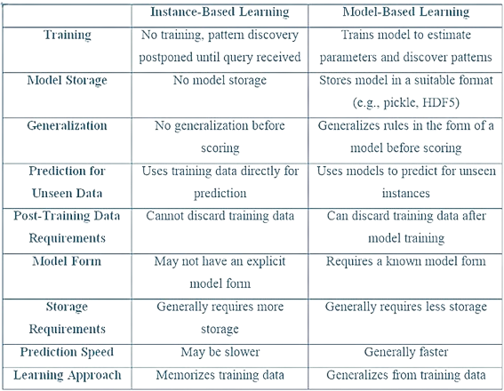
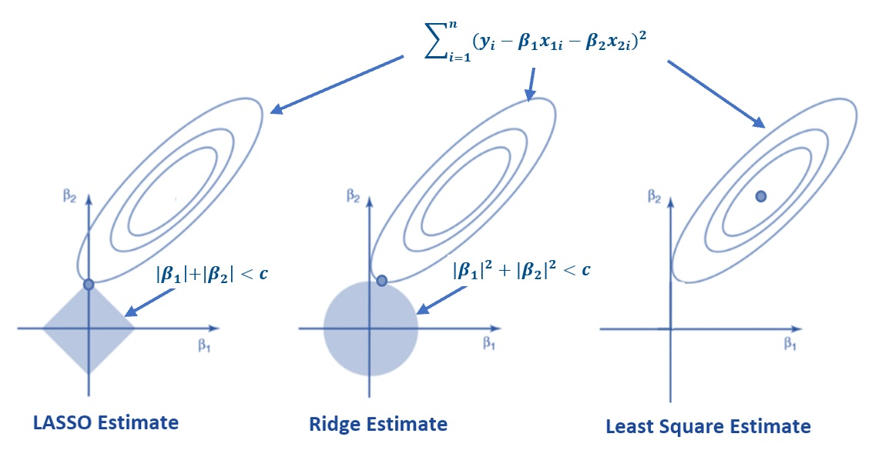
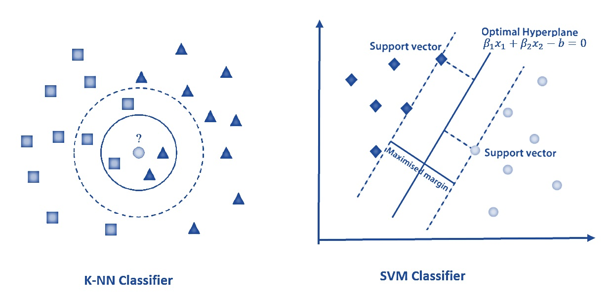
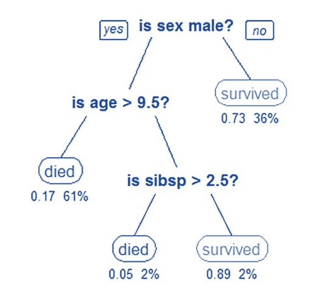
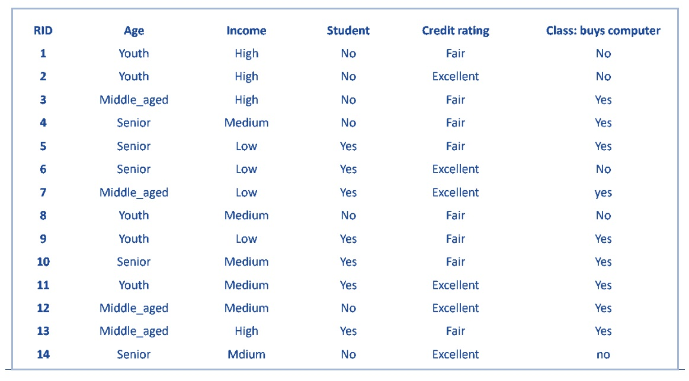
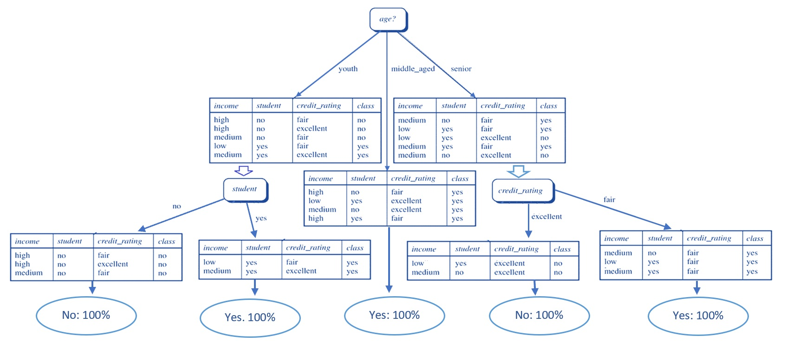
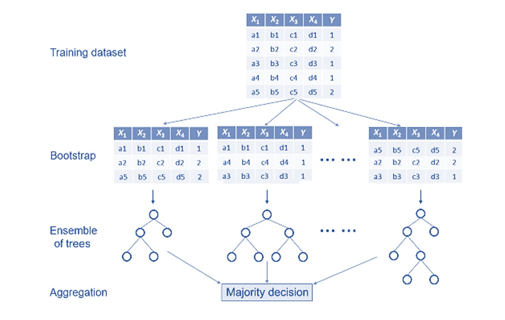

```{css echo = FALSE}
<style type="text/css">

div#TOC li {
    list-style:none;
    background-image:none;
    background-repeat:none;
    background-position:0;
}

h1.title {
  font-size: 20px;
  font-weight: bold;
  color: DarkRed;
  text-align: center;
}
h4.author { /* Header 4 - and the author and data headers use this too  */
    font-size: 18px;
    font-weight: bold;
  font-family: "Times New Roman", Times, serif;
  color: DarkRed;
  text-align: center;
}
h4.date { /* Header 4 - and the author and data headers use this too  */
  font-size: 18px;
  font-weight: bold;
  font-family: "Times New Roman", Times, serif;
  color: DarkBlue;
  text-align: center;
}
h1 { /* Header 3 - and the author and data headers use this too  */
    font-size: 22px;
    font-weight: bold;
    font-family: "Times New Roman", Times, serif;
    color: darkred;
    text-align: center;
}
h2 { /* Header 3 - and the author and data headers use this too  */
    font-size: 18px;
    font-weight: bold;
    font-family: "Times New Roman", Times, serif;
    color: navy;
    text-align: left;
}

h3 { /* Header 3 - and the author and data headers use this too  */
    font-size: 16px;
    font-weight: bold;
    font-family: "Times New Roman", Times, serif;
    color: navy;
    text-align: left;
}

h4 { /* Header 4 - and the author and data headers use this too  */
    font-size: 14px;
    font-weight: bold;
    font-family: "Times New Roman", Times, serif;
    color: darkred;
    text-align: left;
}
</style>
```

  
```{r setup, include=FALSE}
# code chunk specifies whether the R code, warnings, and output 
# will be included in the output files.

if (!require("ggplot2")) {
   install.packages("ggplot2")
   library(ggplot2)
}
if (!require("ISLR")) {
   install.packages("ISLR")
   library(ISLR)
}
if (!require("knitr")) {
   install.packages("knitr")
   library(knitr)
}
if (!require("ISLR")) {
   install.packages("ISLR")
   library(ISLR)
}
if (!require("pander")) {
   install.packages("pander")
   library(pander)
}
if (!require("rpart")) {
   install.packages("rpart")
   library(rpart)
}
if (!require("rattle")) {
   install.packages("rattle")
   library(rattle)
}
if (!require("rpart.plot")) {
   install.packages("rpart.plot")
   library(rpart.plot)
}
if (!require("rpart.plot")) {
   install.packages("rpart.plot")
   library(rpart.plot)
}
if (!require("RColorBrewer")) {
   install.packages("RColorBrewer")
   library(RColorBrewer)
}
if (!require("e1071")) {
   install.packages("e1071")
   library(e1071)
}
if (!require("glmnet")) {
   install.packages("glmnet")
   library(glmnet)
}
if (!require("pROC")) {
   install.packages("pROC")
   library(pROC)
}

# knitr::opts_knit$set(root.dir = "C:/Users/75CPENG/OneDrive - West Chester University of PA/Documents")
# knitr::opts_knit$set(root.dir = "C:\\STA490\\w05")

knitr::opts_chunk$set(echo = TRUE,       
                      warning = FALSE,   
                      result = TRUE,   
                      message = FALSE,
                      comment = NA)
```


\

# Introduction

When crunching data to model business decisions, we are most typically using supervised and unsupervised learning methods.

Algorithms are often grouped by similarity in terms of their function (how they work). Again, there will be no perfect classification of machine learning algorithms and there is also no way to exhaust all machine learning algorithms. We only list those most commonly used algorithms here based on similarity to keep things simple. 

For illustrative purposes, I will use some examples from the well-known **Introduction to Statistical Learning: with Applications in R** <https://www.statlearning.com/>.


This note will outline the supervised learning algorithms including statistical models and those developed by the machine learning community. We will build a decision tree model for the diabetes data set in the case study.


# Model and Instance-based Supervised Algorithms
 
Machine learning can be broadly categorized into two types: instance-based learning and model-based learning. Both approaches have their unique methodologies and use cases. 

**Instance-based Learning** 

Instance-based learning, also known as lazy learning, involves storing the training data and using it to make predictions directly. The algorithm does not build an explicit model but relies on the entire data set to respond to queries.

**Instance-based learning algorithms** compare new problem instances with instances seen in training, which have been stored in memory. Predictions are made based on the similarity between new data points and stored instances.
 
Among **instance-based learning algorithms**, **K-Nearest Neighbors (K-NN)** is the most common instance-based learning algorithm. It classifies a data point based on how its neighbors are classified. The ‘K’ value represents the number of neighbors to consider.
 
The **advantages of instance-based learning algorithms** are their simplicity, adaptability, and versatility. The disadvantages are storage resource, prediction speed, and noisy data sensitivity.
 
 
**Model-based Learning** 

Model-based learning, also known as eager learning, involves building a model from the training data before making predictions. This model captures the underlying patterns in the data, which can then be used to make predictions on new data. We have already learned a few of them 

* **Linear Regression**: This algorithm models the relationship between a dependent variable and one or more independent variables by fitting a linear equation to the observed data.

* **Logistic Regression**: A classification algorithm that models the probability of a binary outcome based on one or more predictor variables.

* **Neural Networks**: Complex models inspired by the human brain, capable of capturing intricate patterns in the data through layers of interconnected nodes.
 
* **Decision Trees**: These models use tree-like structures where nodes represent decisions based on the value of input features, leading to an output prediction. This note will discuss tree-based algorithms. 


The next table compares the two categories of algorithms from different perspectives.

 
```{r fig.align='center', out.width="90%", fig.cap="The comparison of instance-based and model-based supervised learning algorithms"}

```
 
In the next subsections, we will provide some of the instance-based and model-based algorithms with some illustrative examples (based on small data sets) to explain the rough ideas of these algorithms. 
 
 \

## LOESS Regression 
 
Regression is concerned with modeling the relationship between variables that is iteratively refined using a performance measure defined based on errors in the predictions made by the model. Regression methods are a workhorse of statistics and have been the backbone of statistical machine learning. The most popular regression algorithms are:

1.	Ordinary Least Squares Regression (OLSR)

2.	Linear Regression

3.	Logistic Regression

4.	Step-wise Regression

5.	LOcally Estimated Scatter-plot Smoothing (LOESS) - a nonparametric regression.

In this subsection, we will use an example to show one of the robust distribution free single variable regression algorithm - locally weighted scatter-plot smoothing (LOESS) - using a built-in R function (without giving the details of the algorithm). Since it is a single variable regression, the performance of the performance can be easily visualized.


The LOESS regression is based on two variables **Sales** and **Price** in the data set *Carseats* in the book **ISLR**.


```{r}
data("Carseats")
pander(head(Carseats))
```


```{r, fig.align='center', fig.cap="Figure 5. LOESS regression: Sales ~ Prices"}
lw1 = loess(Sales ~ Price, data = Carseats)
plot(Sales ~ Price, data = Carseats, pch=19, cex=0.8)
j = order(Carseats$Price)  # sort the data vector and returns the index 
                           # of the values of the original data vector
lines(Carseats$Price[j],lw1$fitted[j],col="red",lwd=3)
```

The `loess()` is a data-driven nonparametric regression (local polynomial regression including linear regression), in other words, the explicit model parameters in an explicitly expressed model to estimate. `loess` regression is analogous to single variable regression such as simple linear and nonlinear regression models.

To plot the `smooth` fitted regression curve, we need to use function `order()` the indices of the original data vector after it was ordered. For example,

```{r}
x = c(3, 1, 0, 4, -5)
order(x)
## The above index can sort the data below
x[order(x)]
```

We can use the loess nonparametric regression model to predict as usual using the generic function `predict()` with an input data frame. 

```{r}
lw1 = loess(Sales ~ Price, data = Carseats)
predict(lw1, data.frame(Price =c(134,121)),se = TRUE)  # new data must be within 
                                                       # Existing price range
```


## Regularized Regression


We have discussed some degree of detail in linear and logistic regression models from both classical statistics perspective and machine learning perspective in terms of model training and performance evaluation.

The following **regularized regression** algorithms are recently developed learning algorithms modified from classical statistics.

*	**Ridge Regression**

**Ridge regression** does not reduce the number of correlated feature variables. It brings bias to the estimated regression coefficients to reduce the impact of multi-correlated feature variables. In other words, it sacrifices the unbiasedness of the estimated regression to gain the stability of the estimation.


*	**Least Absolute Shrinkage and Selection Operator (LASSO)**

**LASSO** filters the feature variables with a small magnitude of the absolute regression coefficients. All numerical feature variables must be standardized when using LASSO regression for prediction. Since some of the feature variables will be filtered out from the model. It is considered a dimension reduction method that has become a popular tool in the machine learning community.


The following figure explains the relationships between regular least square regression, ridge regression, and LASSO.

```{r echo=FALSE, fig.align='center', fig.width=3, fig.height=3, fig.cap="Figure 6.  Relationship between least square, ridge, and LASSO regressions."}

```

Because both **ridge** and **LASSO** fall into the same theoretical framework (although functioning in very different ways), Stanford statisticians developed an R library, `glmnet` to implement various regularized regression including both of these two regularized regression methods.

\

## Instance-based Algorithms

First of all, observations/samples/instances all mean the same thing in machine learning.

The instance-based learning model is a decision problem with instances or examples of training data that are deemed important or required to the model. Such methods typically build up a database of example data and compare new data to the database using a similarity measure in order to find the best match and make a prediction. For this reason, instance-based methods are also called winner-take-all methods and memory-based learning (sometimes also called lazy learning. Focus is put on the representation of the stored instances and similarity measures used between instances.

The most popular instance-based algorithms are:

* k-Nearest Neighbor (kNN)
* Support Vector Machines (SVM)

```{r echo=FALSE, fig.align='center', fig.width=3, fig.height=3, fig.cap="Figure 7.  Instance-based learning algorithms: KNN and SVM."}

```

Both kNN and SVM are intuitive. The more instances the more the accuracy.  ISLR (2nd edition) has case studies using R for kNN (using **knn()** in library **{class}** in section 4.7.6, starting from page 181) and SVM (using **svm()** in library **{e1071}** in sections 9.6.1 and 9.6.2, starting from page 389).

\

## Na&iuml;ve Bayes - A Bayesian Algorithm

Bayesian methods are those that explicitly apply Bayes’ Theorem for problems such as classification and regression. There several Bayesian algorithms have been developed so far. We only introduce the basic but commonly used in practice - Na&iuml;ve Bayes.

The Na&iuml;ve Bayes classifier is a simple probabilistic classifier that is based on the Bayes theorem but with strong assumptions regarding independence. Historically, this technique became popular with applications in email filtering, spam detection, and document categorization. Although it is often outperformed by other techniques, and despite the na&iuml;ve design and oversimplified assumptions, this classifier can perform well in many complex real-world problems. 

The theory behind Na&iuml;ve Bayes is straightforward as depicted in the following.

```{r echo=FALSE, fig.align='center', fig.width=3, fig.height=3, fig.cap="Figure 14.  Naive Bayes Classifier."}
include_graphics("img/w07-Naive-Bayes.jpg")
```

There are several libraries in R that have the function to implement a&iuml;ve Bayes. ISLR has a lab on the application of a&iuml;ve Bayes (section 4.7.5, starting from page 180) using the **naiveBayes()** function in R library **{e1071}**.


\

# Decision Tree Algorithms


```{r echo=FALSE, fig.align='center', out.width="40%"}
if (knitr:::is_latex_output()) {
  knitr::asis_output('\\url{https://github.com/pengdsci/STA551/blob/main/w07/img/w07.1-GIFtree.gif}')
} else {
  knitr::include_graphics("img/w07.1-GIFtree.gif")
}
```


The Decision Tree (DT) algorithm is based on conditional probabilities. Unlike the other classification algorithms, decision trees generate rules. A rule is a conditional statement that can easily be understood by humans and easily used within a database to identify a set of records. It is easy to interpret and implement in real-world applications. Among several basic tree-based algorithms, Classification and Regression Tree (CART) is most frequently used in practice. 

This subsection focuses on the basic decision tree with some technical description of steps in decision tree induction. The general structure of a decision tree algorithm is in the following example of predicting the survival of Titanic passengers.

```{r echo=FALSE, fig.align='center', fig.width=3, fig.height=3, fig.cap="Figure 8.  Illustration of decision tree algorithm: predicting Titanic survival."}

```

The above decision tree involves three variables: sex, age, and sibsp (sibling and spouse). We can easily convert the tree to a set of rules (conditional statements) to make a prediction of the survival status for a new incoming data point.

## Structure and Technical Terms 

The following diagram illustrates the basic structure of a decision tree.


```{r echo=FALSE, fig.align='center', out.width="70%", fig.cap="Figure 9. Decision tree structure."}
  knitr::include_graphics("img/w07.1-DecisionTreeStructure.jpg")
```


**Root Node**: It represents the entire population or sample and this further gets divided into two or more homogeneous sets.

**Splitting**: It is a process of dividing a node into two or more sub-nodes.

**Decision Node**: When a sub-node splits into further sub-nodes, then it is called the decision node.

**Leaf / Terminal Node**: Nodes that do not split are called Leaf or Terminal Node.

**Pruning**: When we remove sub-nodes of a decision node, this process is called pruning. We can say the opposite process of splitting.

**Branch / Sub-Tree**: A subsection of the entire tree is called a branch or sub-tree.

**Parent and Child Node**: A node, which is divided into sub-nodes is called a parent node of sub-nodes whereas sub-nodes are the child of a parent node.


\

The following example based on toy data illustrates how a decision grows and how to use a decision tree to make predictions.

The toy data set is given below.


```{r echo=FALSE, fig.align='center', fig.width=3, fig.height=3, fig.cap="Figure 10.  Decision tree structure using a toy data."}

```


The fully grown tree is given below (note the variable **class** is the binary response variable).

```{r echo=FALSE, fig.align='center', fig.width=3, fig.height=3, fig.cap="Figure 11.  Fully grown decision tree using a toy data."}

```


```{r}
DataSet = data.frame(
Age = c("Youth", "Youth", "Middle_aged", "Senior", "Senior","Senior","Middle_aged","Youth","Youth","Senior","Youth","Middle_aged",
        "Middle_aged","Senior"),
Income = c("High","High","High","Medium","Low", "Low","Low","Medium","Low","Medium","Medium","Medium","High","Medium"),
Student = c("No", "No","No","No","Yes","Yes","Yes","No","Yes","Yes","Yes",
            "No","Yes","No"),
CreditRating = c("Fair", "Excellent","Fair","Fair","Fair","Excellent",
                 "Excellent","Fair","Fair","Fair","Excellent","Excellent",
                 "Fair","Excellent"),
Class = c("No", "No", "Yes", "Yes","Yes","No","Yes", "No", "Yes","Yes",
          "Yes","Yes","Yes","No")
)
#pander(DataSet)
```


## Decision Tree Growing - Impurity Measures 

Growing a decision tree is an iterative process of splitting the feature space into some sub-spaces according to certain criteria defined based on feature variables. The predictive performance of a decision is dependent on the size of the trained tree. A small size will cause underfitting issues and a large size will result in overfitting issues. 

The questions are (1) how to control the size of a decision to obtain the best performance; (2) how to select the feature variables to define the root and subsequent child nodes; (3) how to split a feature variable. 

**Gini index** and **entropy** are the two popular impurity measures commonly used in decision tree induction.

\

### Gini Index

* **Gini Index** considers a split for each attribute (for a continuous attribute, usually considers binary split). The Gini Index measures the impurity of subgroups (D) split by a feature variable.

$$
\mbox{Gini}(D)= \sum_{i=1}^m p_i(1-p_i)= 1 - \sum_{i=1}^m p_i^2
$$
Where $p_i$  is the probability of an object that is being classified to a particular class.


For example, we calculate the Gini index using the above decision tree. The root node (age) has three child nodes. We show how to calculate the weighted Gini index of feature variable age in the following steps.

* **Weights**: P(youth) = 5/14, P(middle_aged) = 4/14, P(senior) = 5/14.

* **D = Youth**: $p_1 =P(Yes) = 2/5, p_2 = P(No) = 3/5$, therefore, ${Gini}_{youth} = 1 -p_1^2 - p_2^2 = 1 - 4/25 - 9/25 = 12/25$

* **D = Middle_aged**: $p_1 =P(Yes) = 4/4, p_2 = P(No) = 0/45$, therefore, ${Gini}_{middle_aged} = 1 -p_1^2 - p_2^2 = 1 - 16/16 - 0/16 = 0$

* **D = Senior**: $p_1 =P(Yes) = 3/5, p_2 = P(No) = 2/5$, therefore, ${Gini}_{senior} = 1 -p_1^2 - p_2^2 = 1 - 9/25 - 4/25 = 12/25$


The **Gini index** of age is given by 

$$
{Gini}_{age} =\frac{5}{14}\times\frac{12}{25} + \frac{4}{14}\times 0 +\frac{5}{14}\times \frac{12}{25} = \frac{5}{14}\times \frac{24}{25}  = \frac{12}{35} \approx  0.343.
$$

\

**R Function for GINI Index**


```{r}
GINI.calc = function(DatName, VarName, ClsName){
   # 
   freqTB0 = table(DatName[,VarName], DatName[,ClsName])
   freqTB = data.frame(NO = freqTB0[, 1], YES = freqTB0[, 2])
   freqTB$Tot = freqTB$NO + freqTB$YES
   freqTB$P1 = freqTB$NO/freqTB$Tot
   freqTB$P2 = freqTB$YES/freqTB$Tot
   freqTB$CateGINI = 1-(freqTB$P1)^2 - (freqTB$P2)^2
   freqTB$ROWPER = (freqTB$NO + freqTB$YES)/sum(freqTB$Tot)
   freqTB$ComponentGini = (freqTB$CateGINI) * (freqTB$ROWPER)
   GINI.idx = sum(freqTB$ComponentGini)
   GINI.idx
}
```

\

```{r}
giniAge = GINI.calc(DatName=DataSet, VarName="Age", ClsName = "Class") 
giniIncome = GINI.calc(DatName=DataSet, VarName="Income", ClsName = "Class") 
giniStudent = GINI.calc(DatName=DataSet, VarName="Student", ClsName = "Class") 
giniCreditRating = GINI.calc(DatName=DataSet, VarName="CreditRating",
                             ClsName = "Class") 
pander(cbind(giniAge = giniAge, giniIncome = giniIncome, 
             giniStudent = giniStudent, giniCreditRating = giniCreditRating))
```


We can similarly calculate the Gini index for other feature variables in the data set. **When we choose a feature variable to define the root node, we choose the feature with <font color = "red">smallest Gini index</font>**. The Gini index is used in the classic CART algorithm and is very easy to calculate.


### Entropy and Information Gain

**Entropy** is another impurity measure that is defined by

$$
E = \sum_{i = 1}^m (-p_i \log_2p_i).
$$
Where $p_i$ is the same as that defined in the Gini index. We can find the entropy at the root node and each child node based on the above tree based on the toy data. A low Entropy indicates that the data labels are quite uniform.

* **root (parent) node entropy (before splitting)**: $E(\mbox{D}) = -(5/14)\log_2(5/14) - (9/14)\log_2(9/14) = 0.940286$

* **child node: youth**: $E(\mbox{D}) = -(2/5)\log_2(2/5) - (3/5)\log_2(3/5) = 0.9709506$

* **child node: middle_aged**: perfectly pure node had entropy 0.

* **child node: senior**: $E(\mbox{D}) = -(3/5)\log_3(2/5) - (2/5)\log_2(3/5) = 0.9709506$

* **Weighted average of entropy at child nodes**: $E(\mbox{child}) = \frac{5}{14}\times 0.9709506 + \frac{4}{14}\times 0 +\frac{5}{14}\times 0.9709506 = \frac{5}{14}\times 0.9709506 \approx 0.3467681$

\

* <font color = "red">**Information Gain**</font>: $\mbox{InfoGain} = E(\mbox{Parent Node}) - E(\mbox{Child Nodes}) = 0.940286 - 0.3467681 = 0.5935179.$

\

**Information gain** measures whether a further split is worthwhile. 

```{r}
infoGain.calc = function(DatName, VarName, ClsName){
   freqTB0 = table(DatName[,VarName], DatName[,ClsName])
   freqTB = data.frame(NO = freqTB0[, 1], YES = freqTB0[, 2])
   freqTB$Tot = freqTB$NO + freqTB$YES
   freqTB$P1 = freqTB$NO/freqTB$Tot
   freqTB$P2 = freqTB$YES/freqTB$Tot
   ###
   freqTB$ROWPER = (freqTB$NO + freqTB$YES)/sum(freqTB$Tot)
   ### Delete zero cell prob to calculate the entropy
   pNO = sum(freqTB$NO)/sum(freqTB$Tot)
   pYES = sum(freqTB$YES)/sum(freqTB$Tot)
   propYES = freqTB$YES/sum(freqTB$Tot)
   ParentEnt = -pNO*log2(pNO) -pYES *log2(pYES) 
   ### entropy of child nodes
   P1 = freqTB$P1
   P2 = freqTB$P2
   logP1 = log2(freqTB$P1)
   logP2 = log2(freqTB$P2)
   logP1[which(!is.finite(logP1))] = 0
   logP2[which(!is.finite(logP2))] = 0
   ChildEnt = (-P1*logP1 - P2*logP2)
   ###
   infoGain =ParentEnt - sum(ChildEnt*propYES)
   #info.Gain = sum(freqTB$infoGain)
   list(ParentEnt = ParentEnt, ChildEnt = ChildEnt, 
        propYES = propYES, infoGain = infoGain)  
}
```

```{r}
infoGain.calc(DatName=DataSet, VarName="Age", ClsName = "Class") 
```
```{r}
entAge = infoGain.calc(DatName=DataSet, VarName="Age", ClsName = "Class")$infoGain 
entIncome = infoGain.calc(DatName=DataSet, VarName="Income", ClsName = "Class")$infoGain 
entStudent = infoGain.calc(DatName=DataSet, VarName="Student", ClsName = "Class")$infoGain 
entCreditRating = infoGain.calc(DatName=DataSet, VarName="CreditRating", ClsName = "Class")$infoGain 
pander(cbind(infoGainAge = entAge, infoGainIncome = entIncome, infoGainStudent = entStudent, infoGainCreditRating = entCreditRating))
```

\

## Binary v.s. Multi-way Splits

In principle, trees are not restricted to binary splits but can also be grown with multi-way splits - based on the Gini index or other selection criteria. However, the (locally optimal) search for multi-way splits in numeric variables would become much more burdensome. Hence, tree algorithms often rely on the greedy forward selection of binary splits where subsequent binary splits in the same variable can also represent multi-way splits. 

\


## Boosted Trees - Ensemble Algorithms

Ensemble methods are models composed of multiple weaker models that are independently trained and whose predictions are combined in some way to make the overall prediction.
 
Much effort is put into what types of weak learners to combine and the ways in which to combine them. This is a very powerful class of techniques and as such is very popular.

###	Bootstrapped Aggregation (Bagging)

With the understanding of regular decisions, we can 


```{r echo=FALSE, fig.align='center', fig.width=3, fig.height=3, fig.cap="Figure 12.  Demonstration of bootstrap aggregation algorithm."}

```


###	Random Forest

Random forest (RF) algorithms make output predictions by combining outcomes from a sequence of decision trees. Each tree is constructed independently and depends on a random vector sampled from the input data, with all the trees in the forest having the same distribution. The predictions from the forests are averaged using bootstrap aggregation and random feature selection. RF models have been demonstrated to be robust predictors for both small sample sizes and high dimensional data. 
 
The following diagram illustrates how RF was constructed and how the decision is made based on the set of individual trees.

```{r echo=FALSE, fig.align='center', fig.width=3, fig.height=3, fig.cap="Figure 13.  Demonstration of random forest algorithm."}
include_graphics("img/w07-RandomForests.jpg")
```
 
 
# Case Study - Predicting Diabetes
 
This is a new model that is different from logistic and neural network models. We load the analytic data set.


```{r}
Pima = read.csv("https://pengdsci.github.io/STA551/w09/AnalyticPimaDiabetes.csv")[,-1]
# We use a random split approach
n = dim(Pima)[1]  # sample size
# caution: using without replacement
train.id = sample(1:n, round(0.7*n), replace = FALSE)  
train = Pima[train.id, ]    # training data
test = Pima[-train.id, ]    # testing data
```

 
## `rpart` Library 

we will `rpart()` to write a wrapper so we can pass the arguments of purity measures and penalty measures to construct different decision trees. The cross-validation method will be used to select the optimal decision tree as the candidate predictive to compare with the logistic model in the previous section.

> Note that `rpart()` has a control option that allows users to set up various control parameters (so-called hyper-parameters) to allow the function to identify the optimal tree. One of those control parameters is the number of cross-validation when pruning the decision. Once `xval` is specified, `rpart()` prunes the tree automatically based on the given control parameters. This is internal k-fold cross-validation for identifying an optimal tree based on the information provided in the argument `parms` in which the purity measures and penalty matrix. More information can be found in the article <https://cran.r-project.org/web/packages/rpart/vignettes/longintro.pdf>

\

**rpart()** syntax

```{}
 tree = rpart(modelFormula,          # model formula similar to that in the logistic models
             data , 
             na.action  = na.rpart,  # By default, deleted if the outcome is missing, 
                                     # kept if features are missing
             method = "class",       # Classification form factor
             model  = FALSE,         # keep a copy of the model frame in the result? I
                  x = FALSE,         # keep a copy of the x matrix in the result.
                  y = TRUE,          # keep a copy of the dependent variable in the result. 
                                     # If missing and model is supplied this defaults to FALSE
              parms = list( # loss matrix. Penalize false positive or negative more heavily
                         loss = matrix(c(0,b,c,0), ncol = 2),  # b = FP, c = FN
                         split = purity),   # "gini" or "information"
             
             ## rpart algorithm options (These are defaults)
             control = rpart.control(
                       minsplit = 20,       # minimum number of observations required before split
                       minbucket= 10,       # minimum number of observations in any terminal node,                                                      # default = minsplit/3
                       cp  = 0.01,          # complexity parameter used as the stopping rule,  
                                            # 0.02 -> small tree
                       maxcompete  = 4,     # number of competitor splits retained in the output
                       maxsurrogate   = 5,  # number of surrogate splits retained in the output
                       usesurrogate   = 2,  # how to use surrogates in the splitting process
                       xval   = 10,         # number of cross-validations
                       surrogatestyle = 0,  # controls the selection of the best surrogate
                       maxdepth  = 30       # maximum depth of any node of the final tree)
      )
```

\

`rpart()` has a lot of flexibility to construct decision trees as it has user controls. It is particularly useful in applications where the costs of `false positive` and `false negative` are different. 

Next, we write a wrapper so we can build different decision trees conveniently.

```{r}
# arguments to pass into rpart():
# 1. data set (training /testing); 
# 2. Penalty coefficients
# 3. Impurity measure
## 
tree.builder = function(in.data, fp, fn, purity){
   tree = rpart(diabetes ~ .,                # including all features
                data = in.data, 
                na.action  = na.rpart,       # By default, deleted if the outcome is missing, 
                                             # kept if predictors are missing
                method = "class",            # Classification form factor
                model  = FALSE,
                x = FALSE,
                y = TRUE,
            parms = list( # loss matrix. Penalize false positives or negatives more heavily
                         loss = matrix(c(0, fp, fn, 0), ncol = 2, byrow = TRUE),   
                         split = purity),          # "gini" or "information"
             ## rpart algorithm options (These are defaults)
             control = rpart.control(
                        minsplit = 10,  # minimum number of observations required before split
                        minbucket= 10,  # minimum number of observations in 
                                        # any terminal node, default = minsplit/3
                        cp  = 0.01,  # complexity parameter for stopping rule, 
                                     # 0.02 -> small tree 
                       xval = 10     # number of cross-validation )
                        )
             )
  }
```


Using the above function, we define six different decision tree models in the following.

* Model 1: `gini.tree.11` is based on the Gini index without penalizing false positives and false negatives.

* Model 2: `info.tree.11` is based on entropy without penalizing false positives and false negatives.

* Model 3: `gini.tree.110` is based on the Gini index: the cost of false negatives is 10 times the positives.

* Model 4: `info.tree.110` is based on entropy: the cost of false negatives is 10 times the positives.

* Model 5: `gini.tree.101` is based on the Gini index: the cost of a false positive is 10 times the negatives.  

* Model 6: `info.tree.101` is based on entropy: the cost of a false positive is 10 times the negatives. 


The tree diagram of the above two regular decision models is given below.

```{r fig.align='center', fig.width=10, fig.height=5, fig.cap="Figure 14. Non-penalized decision tree models using Gini index (left) and entropy (right)."}
## Call the tree model wrapper.
gini.tree.1.1 = tree.builder(in.data = train, fp = 1, fn = 1, purity = "gini")
info.tree.1.1 = tree.builder(in.data = train, fp = 1, fn = 1, purity = "information")
gini.tree.1.10 = tree.builder(in.data = train, fp = 1, fn = 10, purity = "gini")
info.tree.1.10 = tree.builder(in.data = train, fp = 1, fn = 10, purity = "information")
## tree plots
par(mfrow=c(1,2))
rpart.plot(gini.tree.1.1, main = "Tree with Gini index: non-penalization")
rpart.plot(info.tree.1.1, main = "Tree with entropy: non-penalization")
```

```{r fig.align='center', fig.width=10, fig.height=5, fig.cap="Figure 15. penalized decision tree models using Gini index (left) and entropy (right)."}
par(mfrow=c(1,2))
rpart.plot(gini.tree.1.10, main = "Tree with Gini index: penalization")
rpart.plot(info.tree.1.10, main = "Tree with entropy: penalization")
```


## ROC for Model Selection

We built 4 different decision tree models previously. Next, we use ROC analysis to select the best among the four candidate models. 

```{r}
# function returning a sensitivity and specificity matrix
SenSpe = function(in.data, fp, fn, purity){
  cutoff = seq(0,1, length = 20)   # 20 cut-offs including 0 and 1. 
  model = tree.builder(in.data, fp, fn, purity) 
  ## Caution: decision tree returns both "success" and "failure" probabilities.
  ## We need only "success" probability to define sensitivity and specificity!!! 
  pred = predict(model, newdata = in.data, type = "prob") # two-column matrix.
  senspe.mtx = matrix(0, ncol = length(cutoff), nrow= 2, byrow = FALSE)
  for (i in 1:length(cutoff)){
  # CAUTION: "pos" and "neg" are values of the label in this data set!
  # The following line uses only "pos" probability: pred[, "pos"] !!!!
  pred.out =  ifelse(pred[,"pos"] >= cutoff[i], "pos", "neg")  
  TP = sum(pred.out =="pos" & in.data$diabetes == "pos")
  TN = sum(pred.out =="neg" & in.data$diabetes == "neg")
  FP = sum(pred.out =="pos" & in.data$diabetes == "neg")
  FN = sum(pred.out =="neg" & in.data$diabetes == "pos")
  senspe.mtx[1,i] = TP/(TP + FN)
  senspe.mtx[2,i] = TN/(TN + FP)
  }
  ## A better approx of ROC, need library {pROC}
  prediction = pred[, "pos"]
  category = in.data$diabetes == "pos"
  ROCobj <- roc(category, prediction)
  AUC = auc(ROCobj)
  ##
  list(senspe.mtx= senspe.mtx, AUC = round(AUC,3))
 }
```

The above function has three arguments for users to choose different types of decision trees including the 4 trees discussed in the previous subsection. Next, we use this function to build 6 different trees and plot their corresponding ROC curves so we can see the global performance of these tree algorithms.


```{r}
giniROC11 = SenSpe(in.data = train, fp=1, fn=1, purity="gini")
infoROC11 = SenSpe(in.data = train, fp=1, fn=1, purity="information")
giniROC110 = SenSpe(in.data = train, fp=1, fn=10, purity="gini")
infoROC110 = SenSpe(in.data = train, fp=1, fn=10, purity="information")
giniROC101 = SenSpe(in.data = train, fp=10, fn=1, purity="gini")
infoROC101 = SenSpe(in.data = train, fp=10, fn=1, purity="information")
```

Next, we plot the ROC curves and calculate the areas under the ROC curves for Individual decision tree models.

```{r fig.align='center', fig.width=6, fig.height=6, fig.cap="Figure 16. Comparison of ROC curves"}
par(pty="s")      # set up square plot through graphic parameter
colors = c("#008B8B", "#00008B",  "#8B008B",  "#8B0000",  "#8B8B00", "#8B4500")
plot(1-giniROC11$senspe.mtx[2,], giniROC11$senspe.mtx[1,], 
     type = "l", 
     xlim=c(0,1), 
     ylim=c(0,1), 
     xlab="1 - specificity: FPR", ylab="Sensitivity: TPR", 
     col = colors[1], 
     lwd = 2,
     main="ROC Curves of Decision Trees", 
     cex.main = 0.9, 
     col.main = "navy")
abline(0,1, lty = 2, col = "orchid4", lwd = 2)
lines(1-infoROC11$senspe.mtx[2,], infoROC11$senspe.mtx[1,], 
      col = colors[2], lwd = 2, lty=2)
lines(1-giniROC110$senspe.mtx[2,], giniROC110$senspe.mtx[1,],
      col = colors[3], lwd = 2)
lines(1-infoROC110$senspe.mtx[2,], infoROC110$senspe.mtx[1,], 
      col = colors[4], lwd = 2, lty=2)
lines(1-giniROC101$senspe.mtx[2,], giniROC101$senspe.mtx[1,], 
      col = colors[5], lwd = 2, lty = 4)
lines(1-infoROC101$senspe.mtx[2,], infoROC101$senspe.mtx[1,], 
      col = colors[6], lwd = 2, lty=2)
legend("bottomright", c(paste("gini.1.1,  AUC =", giniROC11$AUC), 
                        paste("info.1.1,  AUC =",infoROC11$AUC), 
                        paste("gini.1.10, AUC =",giniROC110$AUC), 
                        paste("info.1.10, AUC =",infoROC110$AUC),
                        paste("gini.10.1, AUC =",giniROC101$AUC), 
                        paste("info.10.1, AUC =",infoROC101$AUC)),
                        col=colors, 
                        lty=rep(1:2,3), lwd=rep(2,6), cex = 0.8, bty = "n")
```


The above ROC curves represent various decision trees and their corresponding AUC. The model with the largest AUC is considered the best decision tree among the existing ones. 


\

## Optimal Cut-off Score Determination

As usual, once the final model is determined, we need to find the optimal cut-off score for reporting the predictive performance of the final model with the test data. Please keep in mind the optimal cut-off determination through cross-validation must be based on the training data set.

In practical applications, one may end up with two or more **final models** with similar AUCs. In this case, we need to report the performance of all *final models* based on the test data and let clients choose one to deploy (and possibly leave the rest as challengers). For this reason, we write a function to determine the optimal cut-off for a given decision tree (based on this project) since different decision trees have their own optimal cut-off.


```{r}
Optm.cutoff = function(in.data, fp, fn, purity){
  n0 = dim(in.data)[1]/5
  cutoff = seq(0,1, length = 20)               # candidate cut off prob
  ## accuracy for each candidate cut-off
  accuracy.mtx = matrix(0, ncol=20, nrow=5)    # 20 candidate cutoffs and gini.11
  ##
  for (k in 1:5){
     valid.id = ((k-1)*n0 + 1):(k*n0)
     valid.dat = in.data[valid.id,]
     train.dat = in.data[-valid.id,] 
     ## tree model
     tree.model = tree.builder(in.data, fp, fn, purity)
     ## prediction 
     pred = predict(tree.model, newdata = valid.dat, type = "prob")[,2]
     ## for-loop
     for (i in 1:20){
        ## predicted probabilities
        pc.1 = ifelse(pred > cutoff[i], "pos", "neg")
        ## accuracy
        a1 = mean(pc.1 == valid.dat$diabetes)
        accuracy.mtx[k,i] = a1
       }
      }
   avg.acc = apply(accuracy.mtx, 2, mean)
   ## plots
   n = length(avg.acc)
   idx = which(avg.acc == max(avg.acc))
   tick.label = as.character(round(cutoff,2))
   ##
   plot(1:n, avg.acc, xlab="cut-off score", ylab="average accuracy", 
        ylim=c(min(avg.acc), 1), 
        axes = FALSE,
        main=paste("5-fold CV optimal cut-off \n ",purity,"(fp, fn) = (", fp, ",", fn,")" , 
                   collapse = ""),
        cex.main = 0.9,
        col.main = "navy")
        axis(1, at=1:20, label = tick.label, las = 2)
        axis(2)
        points(idx, avg.acc[idx], pch=19, col = "red")
        segments(idx , min(avg.acc), idx , avg.acc[idx ], col = "red")
       text(idx, avg.acc[idx]+0.03, as.character(round(avg.acc[idx],4)), 
            col = "red", cex = 0.8) 
   }
```

For demonstration, we use the above function to calculate the optimal cut-off of 6 decision trees constructed earlier in the following. 


```{r fig.align='center', fig.width=8, fig.height=8, fig.cap="Figure 17: Plot of optimal cut-off determination"}
par(mfrow=c(3,2))
Optm.cutoff(in.data = train, fp=1, fn=1, purity="gini")
Optm.cutoff(in.data = train, fp=1, fn=1, purity="information")
Optm.cutoff(in.data = train, fp=1, fn=10, purity="gini")
Optm.cutoff(in.data = train, fp=1, fn=10, purity="information")
Optm.cutoff(in.data = train, fp=10, fn=1, purity="gini")
Optm.cutoff(in.data = train, fp=10, fn=1, purity="information")
```


As anticipated, different trees have their own optimal cut-off. Please keep in mind that the cut-off is random (based on the randomly split training data), there may be different cut-offs in different runs. It is dependent on the tree size, sometimes, we may end up with multiple optimal cut-offs. Technically speaking, we choose any one of them for implementation. A better recommendation is to choose the average of these multiple cut-offs and the final cut-off to be used on the testing data set.

