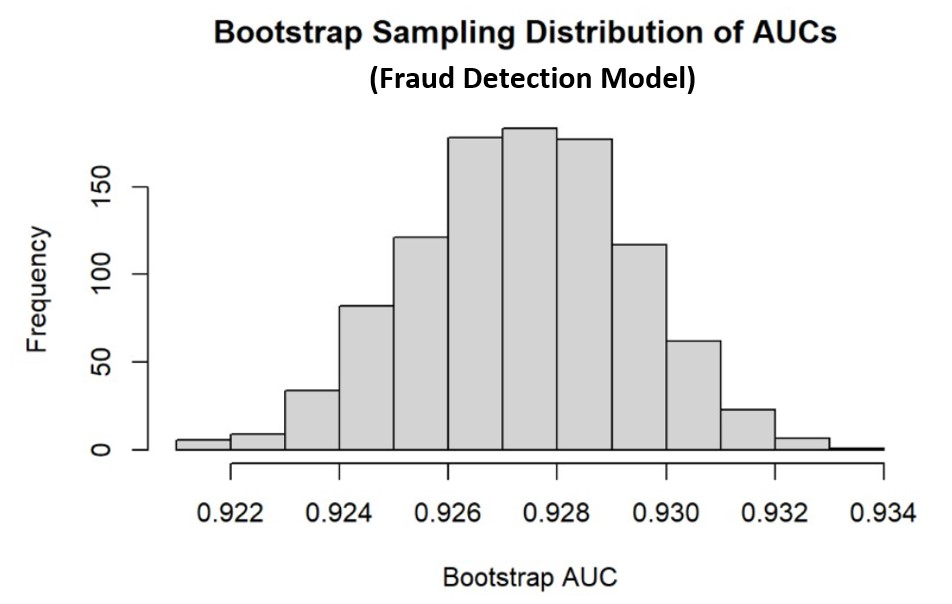
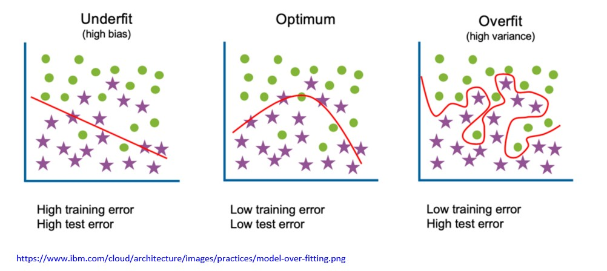
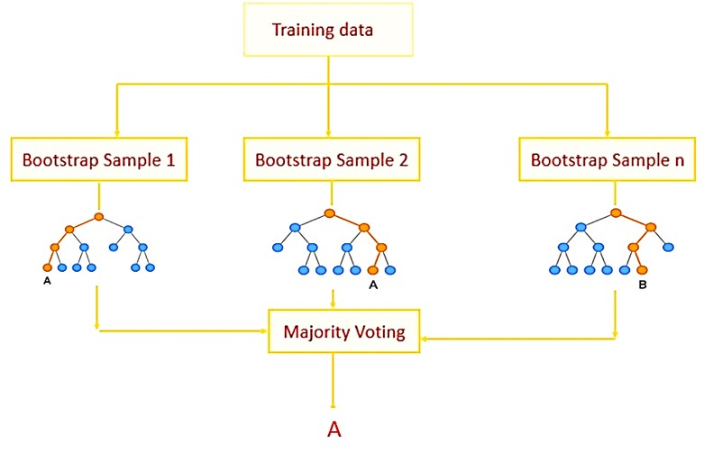
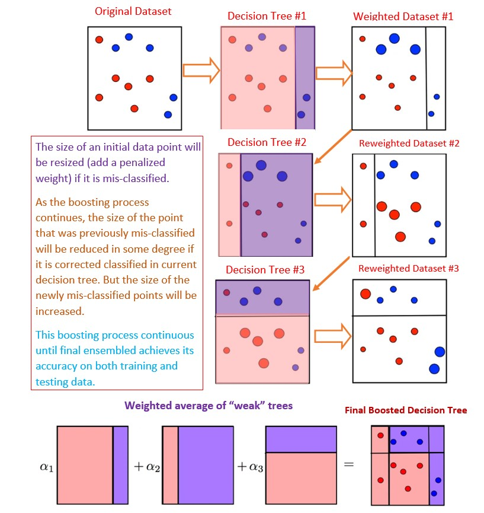
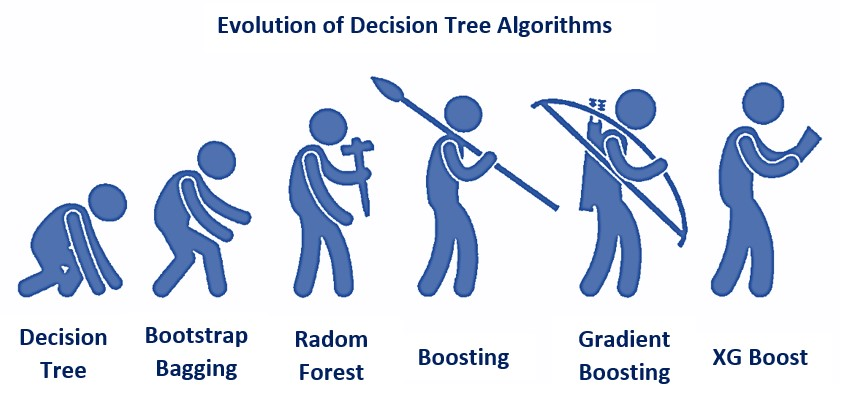

```{=html}
<style type="text/css">

div#TOC li {
    list-style:none;
    background-image:none;
    background-repeat:none;
    background-position:0;
}

h1.title {
  font-size: 24px;
  font-weight: bold;
  color: DarkRed;
  text-align: center;
}
h4.author { /* Header 4 - and the author and data headers use this too  */
    font-size: 18px;
    font-weight: bold;
  font-family: "Times New Roman", Times, serif;
  color: DarkRed;
  text-align: center;
}
h4.date { /* Header 4 - and the author and data headers use this too  */
  font-size: 18px;
  font-weight: bold;
  font-family: "Times New Roman", Times, serif;
  color: DarkBlue;
  text-align: center;
}
h1 { /* Header 3 - and the author and data headers use this too  */
    font-size: 22px;
    font-weight: bold;
    font-family: "Times New Roman", Times, serif;
    color: darkred;
    text-align: center;
}
h2 { /* Header 3 - and the author and data headers use this too  */
    font-size: 18px;
    font-weight: bold;
    font-family: "Times New Roman", Times, serif;
    color: navy;
    text-align: left;
}

h3 { /* Header 3 - and the author and data headers use this too  */
    font-size: 15px;
    font-weight: bold;
    font-family: "Times New Roman", Times, serif;
    color: navy;
    text-align: left;
}

h4 { /* Header 4 - and the author and data headers use this too  */
    font-size: 18px;
    font-weight: bold;
    font-family: "Times New Roman", Times, serif;
    color: darkred;
    text-align: left;
}
</style>
```

```{r setup, include=FALSE}
knitr::opts_chunk$set(cache = FALSE)
# code chunk specifies whether the R code, warnings, and output 
# will be included in the output files.
if (!require("psych")) {
   install.packages("psych")
   library(psych)
}
if (!require("ggplot2")) {
   install.packages("ggplot2")
   library(ggplot2)
}
if (!require("rpart")) {
   install.packages("rpart")
   library(rpart)
}
if (!require("rattle")) {
   install.packages("rattle")
   library(rattle)
}
if (!require("rpart.plot")) {
   install.packages("rpart.plot")
   library(rpart.plot)
}
if (!require("RColorBrewer")) {
   install.packages("RColorBrewer")
   library(RColorBrewer)
}
if (!require("e1071")) {
   install.packages("e1071")
   library(e1071)
}
if (!require("ipred")) {
   install.packages("ipred")
   library(ipred)
}
if (!require("caret")) {
   install.packages("caret")
   library(caret)
}
if (!require("knitr")) {
   install.packages("knitr")
   library(knitr)
}
if (!require("ISLR")) {
   install.packages("ISLR")
   library(ISLR)
}
if (!require("pander")) {
   install.packages("pander")
   library(pander)
}
if (!require("pROC")) {
   install.packages("pROC")
   library(pROC)
}
##
knitr::opts_chunk$set(echo = TRUE,       
                      warning = FALSE,   
                      result = TRUE,   
                      message = FALSE)
```


\

#  Introduction  

The bootstrap method is a data-based simulation method for statistical inference. The method assumes that 

* The sample is a random sample representing the population;

* The sample size is large enough such that the empirical distribution can be close to the true distribution.

#	Basic Idea of Bootstrap Method. 

The objective is to estimate a population parameter such as mean, variance, correlation coefficient, regression coefficients, etc. from a random sample without assuming any probability distribution of the underlying distribution of the population.

For convenience, we assume that the population of interest has a cumulative distribution function $F(x: \theta)$, where $\theta$ is a vector of the population. For example, You can think about the following distributions

* **Normal distribution**: $N(\mu, \sigma^2)$, the distribution function is given by

$$
f(x:\theta) = \frac{1}{\sqrt{2\pi}\sigma}\exp\left[-\frac{(x-\mu)^2}{2\sigma^2}\right]
$$ 
  
where $\theta = (\mu, \sigma)$. Since the normal distribution is so fundamental in statistics, we use the special notation for the cumulative distribution $\phi_{\mu, \sigma^2}(x)$ or simply $\phi(x)$. The corresponding probability function 

* **Binomial distribution**: $Binom(n, p)$, the probability distribution is given by

$$ 
P(x) = \frac{n!}{x!(n-x)!}p^x(1-p)^{n-x}, x = 0, 1, 2, \cdots, n-1, n.
$$

where $\theta = p$. *Caution*: $n$ is NOT a parameter!

We have already learned how to make inferences about population means and variances under various assumptions in elementary statistics. In this note, we introduce a **new approach** to making inferences only based on a given random sample taken from the underlying population.

As an example, we focus on the population mean. For other parameters, we can follow the same idea to make bootstrap inferences. 


## Sampling True Population - Monte Carlo Sampling

We have introduced various study designs and sampling plans to obtain random samples from a given population with the distribution function $F(x:\theta)$. Let $\mu$ be the population mean.

* **Random Sample**.  Let 

$$
\{x_1, x_2, \cdots, x_n\} \to F(x:\theta)
$$

be a random sample from population $F(x:\theta)$.


* **Sample Mean**.  The point estimate is given by

$$\hat{\mu} = \frac{\sum_{i=1}^n x_i}{n}$$
     
* **Sampling Distribution of $\hat{\mu}$**. In order to construct the confidence interval of $\mu$ or make hypothesis testing about $\mu$, we need to know the sampling distribution of $\hat{\mu}$. From elementary statistics, we have the following results.

  + $\hat{\mu}$ is normally distributed if (1). $n$ is large; or (2). the population is normal and population variance is known.

  + the standardized $\hat{\mu}$ follows a t-distribution if the population is normal and population variance is unknown.
  
  + $\hat{\mu}$ is **unknown** of the population is not normal and the sample size is not large enough.
 
 
* In the last case of the previous bullet point, we don't have the theory to derive the sampling distribution based on a **single** sample. However, if the sampling is not too expensive and time-consuming, we take following the sample study design and sampling plan to repeatedly take a large number, 1000, samples of the same size from the population. We calculate the mean of each of the 1000 samples and obtain 1000 sample means $\{\hat{\mu}_1,  \hat{\mu}_2, \cdots, \hat{\mu}_{1000}\}$. Then the empirical distribution of $\hat{\mu}$. 


The following figure depicts the process of how to sample the true population and approximate the sampling distribution of the point estimator of the population parameter.


```{r echo=FALSE, fig.align ="center", fig.cap="Figure 1. Steps for estimating the sampling distribution of a point estimator of the population parameter", out.width="80%", dev="jpeg"}
include_graphics("img/w09-ApproxSamplingDist.jpg")
```


\


## Sampling Random Sample - Bootstrap Sampling

Sampling the true population can be very expensive in practice! That means the method of Monte Carlo sampling is infeasible from a practical perspective. The question is whether there are ways to estimate the sampling distribution of the sample means from **a single given random sample**? The answer is YES under the assumption the sample yields a valid estimation of the original population distribution. 

* **Bootstrap Sampling**  With the assumption that the sample yields a good approximation of the population distribution, we can take bootstrap samples from the **actual** sample. Let
$$\{x_1, x_2, \cdots, x_n\} \to F(x:\theta)$$ be the actual random sample taken from the population. A **bootstrap sample** is obtained by taking a sample **with replacement** from the original data set (not the population!) with the same size as the original sample. Because **with replacement** was used, some values in the bootstrap sample appear once, some twice, and so on, and some do not appear at all. 

* **Notation of Bootstrap Sample**. We use $\{x_1^{(i*)}, x_2^{(i*)}, \cdots, x_n^{(i*)}\}$ to denote the $i^{th}$ bootstrap sample. Then the corresponding mean is called bootstrap sample mean and denoted by $\hat{\mu}_i^*$, for $i = 1, 2, ..., n$.

*	**Bootstrap sampling distribution** of the sample mean can be estimated by taking a large number, say B, of bootstrap samples. The resulting B bootstrap sample means are used to estimate the sampling distribution. Note that, in practice, B is bigger than 1000.

The above Bootstrap sampling process is illustrated in the following figure.

```{r echo=FALSE, fig.align ="center", fig.cap="Figure 2. Steps for the Bootstrap sampling distribution of a point estimator of the population parameter", out.width="80%", dev="jpeg"}
include_graphics("img/w09-BootSamplingDist.jpg")
```

\

## Case Study: Confidence Interval of Correlation Coefficient

There is no exact formula for the correlation coefficient of the two variables. Different approximate confidence intervals are available. One of them is based on Pearson transformation. The explicit form of the interval has the following form.

$$
\left( \frac{e^{2L}-1}{e^{2L}+1},  \frac{e^{2U}-1}{e^{2U}+1}\right)
$$

where
$$
L = z_r - \frac{Z_{0.975}}{\sqrt{n-3}}, \ \ \ U = z_r + \frac{Z_{0.975}}{\sqrt{n-3}}
$$

and 

$$
z_r = \frac{\ln(1+r)-\ln(1-r)}{2} \ \ \ \text{and} \ \ \ z_{0.975} = \text{97.5 th percentile of the standard normal distribution.}
$$

```{r fig.align='center', fig.cap="Figure 3. The scatter plot between sales and price in car seats data set"}
y = Carseats$Sales
x = Carseats$Price
plot(Sales ~ Price, data = Carseats, pch=19, cex=0.8)

```

```{r}
##  The following is the translation of the given formula
n = length(y)
r = cor(x,y)    # sample Pearson correlation coefficient
zr = (log(1+r)-log(1-r))/2
z.975 = qnorm(0.975)
L = zr - z.975/sqrt(n-3)
U = zr + z.975/sqrt(n-3)
LCI = (exp(2*L)-1)/(exp(2*L)+1)
UCI = (exp(2*U)-1)/(exp(2*U)+1)
CI = cbind(LCI = LCI, UCI = UCI)
### Bootstrap CI
B = 1000              # Take 1000 bootstrap sample
bt.r = c()            # empty vector to store bootstrap coefficient
for ( i in 1:B){
  bt.id = sample(1:n, n, replace = TRUE)   # bootstrapping observation IDs
  bt.x = x[bt.id]     # bootstrap x , must use the above bt.id
  bt.y = y[bt.id]     # bootstrap y , must use the above bt.id
  bt.r[i] = cor(bt.x, bt.y)
}
## 2.5% and 97.5% of the 1000 bootstrap correlation coefficients are the
## lower and upper limits of the 95% bootstrap confidence interval
bt.CI = quantile(bt.r, c(0.025, 0.975))
list(CI = CI, bt.CI = as.vector(bt.CI))
```

\

# Bootstrap Confidence Interval of AUC for Logistic Model

In this section, we demonstrate how to find the confidence interval of the area of the ROC curve. This confidence interval is of practical importance.

## Bootstrap Sampling for Logistic Modeling

In logistic regression models, the residuals are not defined as those in the linear regression (i.e., $e_i = \text{observed }y - \text{fitted }y$). Bootstrapping residuals does not work for logistic regression. We can use the following two steps to take bootstrap samples:

1. Take a bootstrap sample from the observation IDs with the same size (and with replacement): $\{1, 2, 3, \cdots, n \}$. Note that some of the IDs will be sampled multiple times.

2. Using the bootstrap IDs to identify the corresponding records in the data set and defined a new data set called  **Bootstrap sample**. Some of the records appear multiple times. These duplicate records with be kept in the sample. In other words, the distinct records in a bootstrap sample are less than the sample size!


Following the above steps, we can take many bootstrap samples. Recall that we can build a logistic regression for a given data set and construct an ROC curve and calculate the area under the curve. This means, if we draw $B = 1000$ bootstrap samples, we can then build 1000 logistic regression models (also called **bootstrap logistic regression models**), hence, will have 1000 **bootstrap AUCs** (one for each bootstrap logistic model).

This further means that the histogram of these **bootstrap AUCs** can be considered as the sampling distribution of the actual sample **AUC**. The **95% Bootstrap confidence interval** of **AUC** is defined as the 2.5% and 97.5% quantiles of the **bootstrap AUCs**.

\

## Case Study - Confidence Interval of AUC

We present two examples showing how to calculate the bootstrap confidence interval of the AUC using a logistic regression model. One can apply the same steps for neural net and decision tree algorithms.

### Predicting Graduate Admission

We use the following admission data set to illustrate the steps.

```{r fig.align='center', fig.width=5, fig.height=5, fig.cap="Figure 4. The bootstrap sampling distribution of the area under the curve of ROC (graduate admission prediction)"}
admitted = read.csv("https://pengdsci.github.io/STA551/w10/w09-admitted.csv")
notadmitted = read.csv("https://pengdsci.github.io/STA551/w10/w09-notAdmitted.csv")
## add an admission status variable to both sub-samples.
admitted$status = "yes"                         # admitted
notadmitted$status = "no "                      # not admitted
admission = rbind(admitted, notadmitted)        # combining the two sub-samples
## Define an empty vector to store bootstrap AUCs.
btAUC.vec = c()
## Select the number of bootstrap samples to be generated
B = 1000
## Size of the original sample
sample.size = dim(admission)[1]
## Vector of cut-off probabilities for construct ROC
cut.off.seq = seq(0,1, length = 100)
# bootstrap procedure starts here
for (k in 1:B){
  boot.id = sample(1:sample.size, sample.size, replace = TRUE)   # Bootstrap IDs
  boot.sample = admission[boot.id,]      # Bootstrap samples         
  ## Bootstrap logistic regression model is given below
  boot.logistic = glm(factor(status)~., family = binomial, data = boot.sample)
  ##
  pred.prob = predict.glm(boot.logistic, newdata = boot.sample, type = "response")
  ## vectors to store sensitivity and specificity
  sensitivity.vec = NULL
  specificity.vec = NULL
    for (i in 1:100){
   pred.status = as.numeric(pred.prob > cut.off.seq[i])
   ### components for defining various measures
   TN = sum(pred.status == 0 & boot.sample$status == "no ")
   FN = sum(pred.status == 0 & boot.sample$status == "yes")
   FP = sum(pred.status == 1 & boot.sample$status == "no ")
   TP = sum(pred.status == 1 & boot.sample$status == "yes")
   ###
   sensitivity.vec[i] = TP / (TP + FN)
   specificity.vec[i] = TN / (TN + FP)
  }
  one.minus.spec = 1 - specificity.vec
  sens.vec = sensitivity.vec
  ## A better approx of ROC, need library {pROC}
  prediction = pred.prob
  category = boot.sample$status == "yes"
  ROCobj <- roc(category, prediction)
  btAUC.vec[k] = round(auc(ROCobj),4)
}
hist(btAUC.vec, xlab = "Bootstrap AUC", main = "Bootstrap Sampling Distribution of AUCs \n (Admission Prediction Model)")
```
  
 The 95% bootstrap confidence interval of the AUC is defined to be 2.5% and 97.5% quantiles of the bootstrap AUCs.
 
```{r}
pander(quantile(btAUC.vec, c(0.025, 0.975)))
```
The confidence interval of AUC can be used for variable selection: if two confidence intervals of AUC overlapped, the predictive performances of the two corresponding predictive models are not significantly different. A simpler model should be recommended for implementation. 


\

### Fraud Detection Data

We use the fraud index data available on the instructor's teaching data repository to construct the $95\%$ confidence interval of the AUC. This is a simple data set with only two variables. We first prepare the data set for the subsequent modeling.

```{r}
fraud.data = read.csv("https://pengdsci.github.io/datasets/FraudIndex/fraudidx.csv")[,-1]
## recode status variable: bad = 1 and good = 0
good.id = which(fraud.data$status == " good") 
bad.id = which(fraud.data$status == "fraud")
##
fraud.data$fraud.status = 0
fraud.data$fraud.status[bad.id] = 1
```


Next, we perform bootstrap logistic regression with 1000 bootstrap samples and build 1000 bootstrap logistic regression models and calculate the AUC of the ROC of the corresponding bootstrap logistic regression models. 

```{}
## Define an empty vector to store bootstrap AUCs.
btAUC.vec = c()
## select the number of bootstrap samples to be generated
B = 1000
## Size of the original sample
sample.size = dim(fraud.data)[1]
## Vector of cut-off probabilities for construct ROC
cut.off.seq = seq(0,1, length = 100)
# bootstrap procedure starts here
for (k in 1:B){
  boot.id = sample(1:sample.size, sample.size, replace = TRUE)   # Bootstrap IDs
  boot.sample = fraud.data[boot.id,]      # Bootstrap samples         
  ## Bootstrap logistic regression model is given below
  boot.logistic = glm(factor(status) ~ index, family = binomial, data = boot.sample)
  ##
  newdata = data.frame(index= boot.sample$index) 
  pred.prob = predict.glm(boot.logistic, newdata, type = "response")
  ## vectors to store sensitivity and specificity
  sensitivity.vec = NULL
  specificity.vec = NULL
  for (i in 1:100){
   pred.status = as.numeric(pred.prob > cut.off.seq[i])
   ### components for defining various measures
   TN = sum(pred.status == 0 & boot.sample$fraud.status == 0)
   FN = sum(pred.status == 0 & boot.sample$fraud.status == 1)
   FP = sum(pred.status == 1 & boot.sample$fraud.status == 0)
   TP = sum(pred.status == 1 & boot.sample$fraud.status == 1)
   ###
   sensitivity.vec[i] = TP / (TP + FN)
   specificity.vec[i] = TN / (TN + FP)
  }
  one.minus.spec = 1 - specificity.vec
  sens.vec = sensitivity.vec
  ## A better approx of ROC, need library {pROC}
  prediction = pred.prob
  category = boot.sample$fraud.status == 1
  ROCobj <- roc(category, prediction)
  btAUC.vec[k] = round(auc(ROCobj),4)
}
hist(btAUC.vec, xlab = "Bootstrap AUC", main = "Bootstrap Sampling Distribution 
of AUCs \n (Fraud Detection Model)")
```


```{r echo=FALSE, fig.align ="center", fig.cap="Figure 5. Bootstrap sampling distribution of AUC (fraud prediction)", out.width="80%", dev="jpeg"}

```

  
The 95% bootstrap confidence interval of the AUC is defined to be 2.5% and 97.5% quantiles of the bootstrap AUCs.

With the bootstrap AUCs, we can similarly construct the 95% bootstrap confidence interval for the AUC of the fraud detection model is $(0.9234, 0.9313 )$.

\

# Concepts of Ensemble Algorithms

We have taken many bootstrap samples and built a logistic regression model on each of these bootstrap samples and calculate the area under the ROC curve of associated logistic regression models. Using these bootstrap AUCs, we approximate the find the bootstrap sampling distribution of the AUC and, hence, find the confidence interval of the AUC.

We can follow the same steps to find the bootstrap confidence intervals of the AUCs of decision trees and neural net algorithms. One important application of Bootstrap in machine learning is its ability to aggregate a set of *weak* models and algorithms to make a *stronger* combined model - This is the so-called **ensemble** learning method in machine learning. One way of improving the performance of a *weak model* through an ensemble approach is to reduce the risk of **overfitting** and **underfitting** by balancing the trade-off between **bias** and **variance**, 

## Overfitting v.s. Underfitting

In predictive modeling, **bias** is a phenomenon that skews the result of an algorithm in favor of or against the ground truth. It describes how well the model matches the training data set:

* A model with a higher bias would not match the data set closely.
* A low-bias model will closely match the training data set.


**Variance** refers to the changes in the model when using different portions of the training data set. The variance comes from highly complex (but valid) models with a large number of features

* Models with high bias will have low variance.
* Models with high variance will have a low bias.

The terms **underfitting** and **overfitting** refer to how the model fails to match the data. 

* **Underfitting** occurs when the model is too simple to be able to match the input data to the target data. 

* **Overfitting** occurs when the model is highly complex but perfectly matches almost all the given data points and performs well in training data sets. However, the model would not be able to generalize the data point in the test data set to predict the outcome accurately due to high error (variation).


```{r echo=FALSE, fig.align ="center", fig.cap="Figure 6. Bias, variance, overfitting and underfitting of predictive models", out.width="80%", dev="jpeg"}

```


## The Logic of Ensemble Learning

**Ensemble learning** attests to the idea of the “wisdom of crowds,” which suggests that the decision-making of a larger group of people is typically better than that of an individual expert. Similarly, ensemble learning refers to a group (or ensemble) of base learners (eg., models and algorithms), which work collectively to achieve a better final prediction. 

A single model or algorithm, also known as a base or weak learner, may not perform well individually due to high variance or high bias. However, when weak learners are aggregated, they can form a strong learner (with stable performance and low variance) yielding better model performance.

Many different types of ensemble learning methods have been developed in the past few decades, Among them, boosting and Bootstrap aggregation (BAGGING) methods are commonly used in practice.

\

## BAGGING Ensemble Methods

**Bagging** is an acronym for *Bootstrap Aggregation* and is used to decrease the variance in the prediction model (the idea we adopted when identifying the optimal cut-off scores and the confidence interval of AUC). 


**Bagging** is a <font color = "blue">**\color{blue}parallel**</font> method that fits <font color = "blue">**\color{blue}different**</font>, considered learners <font color = "blue">**\color{blue}independently**</font> from each other, making it possible to train them <font color = "blue">**\color{red}simultaneously**</font>.

**Bagging** generates additional data for training from the data set. This is achieved by <font color = "red">**\color{red}bootstrap sampling**</font> (random sampling with replacement) from the original data set. As discussed in earlier sections,  **Bootstrap Sampling** may repeat some observations in each new training data set. This guarantees that every element in **Bagging** is equally probable for appearing in a **bootstrap** data set. 

These bootstrap data sets are used to train multiple models in **parallel**. The average of all the predictions from different ensemble models is calculated. The **majority vote** gained from the voting mechanism is considered when classification is made. <font color = "red">*\color{red}Bagging decreases the variance and tunes the prediction to an expected outcome*</font>.

The following figure explains the BAGGING algorithm applied to the decision tree algorithm.

```{r echo=FALSE, fig.align='center', out.width="80%", fig.cap="Figure 7. The idea of Gagging ensemble algorithm."}

```

In summary, the bagging algorithm has three basic steps:

**Bootstrapping**:  Bagging leverages a bootstrapping sampling technique to create diverse samples. 

* **Parallel training**: These bootstrap samples are then trained independently and in parallel with each other using weak or base learners (de).

* **Aggregation**: Finally, aggregating the outputs from individual algorithms/models. In the case of using a tree algorithm (like the above figure)
  + <font color = "red">*\color{red}for regression*</font>, an average of all terminal node weights is taken of all the outputs predicted by the individual classifiers; this is known as **soft voting**. 
  + <font color = "red">*\color{red}for classification*</font>, the class (defined with default 0.5 in each individual tree) with the highest majority of votes is accepted; this is known as **hard voting or majority voting**.


\

**Case Study: BAGGING Classification Trees**


**BAGGING** is implemented in R libraries **ipred{}** and **rpart{}**. They are usually used with several other libraries such as **caret{}** and **e1071{}** to extract relevant information in the bagging algorithm.

```{r}
Pima = read.csv("https://pengdsci.github.io/STA551/w10/AnalyticPimaDiabetes.csv")[,-1]
# We use a random split approach
n = dim(Pima)[1]  # sample size
# caution: using without replacement
train.id = sample(1:n, round(0.7*n), replace = FALSE)  
train = Pima[train.id, ]    # training data
test = Pima[-train.id, ]    # testing data
```

```{r fig.align='center', fig.width=7, fig.height=4, fig.width=7, fig.height=4, fig.cap="Figure 8. The ROC curve and the plot for optimal cut-off determination."}
##
Diabetes.bag.train <- bagging(as.factor(diabetes) ~ ., 
                              data = train, 
                              nbagg = 150,    # number of trees
                              coob = TRUE, 
                              parms = list(loss = matrix(c(0, 10, 1, 0), 
                                                          ncol = 20, 
                                                          byrow = TRUE),   
                                                          split = "gini"),  
                              control = rpart.control(minsplit = 10,cp = 0.02))
### predict() returns either "class" or "prob" in the classification
### When specifying type = "class", the default cut-off of 0.5 is used.
pred = predict(Diabetes.bag.train, train, type = "prob")
### Optimal cut-off probability identification: no cross-validation is needed
cut.prob = seq(0,1, length = 20)
  senspe.mtx = matrix(0, ncol = length(cut.prob), nrow= 3, byrow = FALSE)
  for (i in 1:length(cut.prob)){
  # CAUTION: "pos" and "neg" are values of the label in this data set!
  # The following line uses only "pos" probability: pred[, "pos"] !!!!
  pred.out =  ifelse(pred[,"pos"] >= cut.prob[i], "pos", "neg")  
  TP = sum(pred.out =="pos" & train$diabetes == "pos")
  TN = sum(pred.out =="neg" & train$diabetes == "neg")
  FP = sum(pred.out =="pos" & train$diabetes == "neg")
  FN = sum(pred.out =="neg" & train$diabetes == "pos")
  senspe.mtx[1,i] = TP/(TP + FN)                  # sensitivity
  senspe.mtx[2,i] = TN/(TN + FP)                  # specificity
  senspe.mtx[3,i] = (TP+TN)/(TP + FN + TN + FP)   # accuracy
  }
  ## A better approx of ROC, need library {pROC}
  prediction = pred[, "pos"]
  category = train$diabetes == "pos"
  ROCobj <- roc(category, prediction)
  AUC = auc(ROCobj)
  AUC = round(as.vector(AUC[1]),3)
  ###
  n = length(senspe.mtx[3,])
  idx = which(senspe.mtx[3,] == max(senspe.mtx[3,]))
  tick.label = as.character(round(cut.prob,2))
  ###
  par(mfrow = c(1,2))
  plot(1-senspe.mtx[2,], senspe.mtx[1,], xlim=c(0,1), ylim = c(0,1),
       xlab = "1 - specificity", 
       ylab = "Sensitivity", main = "ROC (Taining Data)", type="l",cex.main = 0.8)
  legend("bottomright",c("fn = 10", "fp = 1", "cp = 0.02", paste("AUC =", AUC)), bty="n", cex = 0.8)       
  
  plot(1:length(cut.prob), senspe.mtx[3,], xlab="cut-off probability",
       ylab = "accuracy", ylim=c(min(senspe.mtx[3,]),1),
               axes = FALSE,
        main="cut-off vs accuracy",
        cex.main = 0.9,
        col.main = "navy")
        axis(1, at=1:20, label = tick.label, las = 2)
        axis(2)
        points(idx, senspe.mtx[3,][idx], pch=19, col = "red")
        segments(idx , min(senspe.mtx[3,]), idx , senspe.mtx[3,][idx ], col = "red")
       text(idx, senspe.mtx[3,][idx]+0.03, as.character(round(senspe.mtx[3,][idx],4)), col = "red", cex = 0.8)
  
```

Similarly, there are several <font color = "red">**\color{red}hyperparameters**</font> one can **tune** to find the best-bootstrapped decision tree. For those who are interested in exploring more in **tunning hyperparameters**, you can write a wrapper of **bagging()** and pass hyperparameters such as **fp, fn, cp, minisplit** in the list of arguments in **rpart()** to find the best bootstrap decision tree.


## Boosting Ensemble Methods  

Boosting is a sequential ensemble method that iteratively **adjusts the weight of data points** as per the last classification. If a data point is incorrectly classified, it increases the weight of that data point. It decreases the bias and variance (hence the predictive error) and builds strong predictive models.

Data points misclassified in each iteration are spotted, and their weights are increased. The Boosting algorithm allocates weights to each resulting model during training. A model (also commonly called learner) with good training data prediction results will be assigned a higher weight. When evaluating a new learner, Boosting keeps track of the learner’s errors. 

The steps of boosting algorithm are summarized in the following:

1. Data points in the initial training data set are equally weighted.

2. A based model is created for the initial training data set. 

3. classification Errors are counted using actual and predicted values. The data point that was incorrectly predicted is provided a higher weight.

4. a model is built on the modified data (re-weighted data points)

5. the process is iterated for multiple models and each of them corrects the previous model’s errors.

6. The final model works as a strong learner and shows the weighted mean of all the models.


The following figure demonstrates the rough idea of boosting decision trees in a conceptual approach.

```{r echo=FALSE, fig.align ="center", fig.cap="Figure 9. Graphical representation of boosting tree method", out.width="80%", dev="jpeg"}

```

## Bagging Versus Boosting

**Bagging** and **Boosting** have a universal similarity of being classified as ensemble methods. In addition, Bagging and Boosting

* are ensemble methods focused on getting $N$ learners from a single learner.

* make random sampling and generate several training data sets. 

* arrive upon the end decision by making an average of $N$ learners or taking the voting rank done by most of them.

* reduce variance and provide higher stability by minimizing errors.

However, the two ensemble algorithms are very different from the technical perspective. The following table shows these structural differences. 

|                 Bagging              |           Boosting                 |
|:-------------------------------------|:-----------------------------------|
|Merging the same type of predictions.  | Merging different types of predictions. |
|Decreases variance, not bias, and solves over-fitting issues.  |Decreases bias, not variance.  |
| Each model receives an equal weight.  | Models are weighed based on their performance. |
|Models are built independently.   |New models are affected by a previously built model’s performance.   |
| Training data subsets are drawn randomly with a bootstrap sample.  | Every new subset comprises the elements that were misclassified by previous models.  |
|Usually applied where the classifier is unstable and has a high variance.  |Usually applied where the classifier is stable and simple and has a high bias.  |

The boosting ensemble algorithms have various new development in recent years. In general, they are more mathematically and pragmatically demanded in implementation. We will not go into details about any of boosting algorithms and implement them.

To conclude, we use the following figure to show the role of mathematical tools and thinking in the evolution of tree-based algorithms: the more mathematical tools you have, the more powerful models you are capable of developing!

```{r echo=FALSE, fig.align ="center", fig.cap="Figure 10. Evolution of tree-based algorithms with various level of technical tools.", out.width="80%", dev="jpeg"}

```


