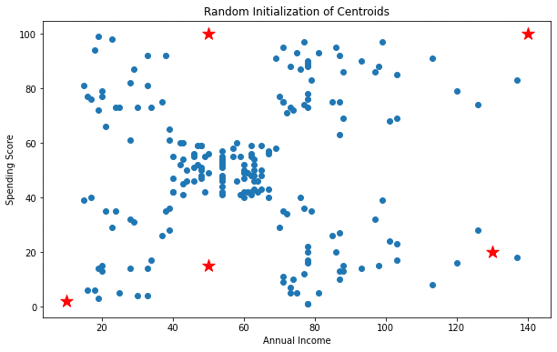
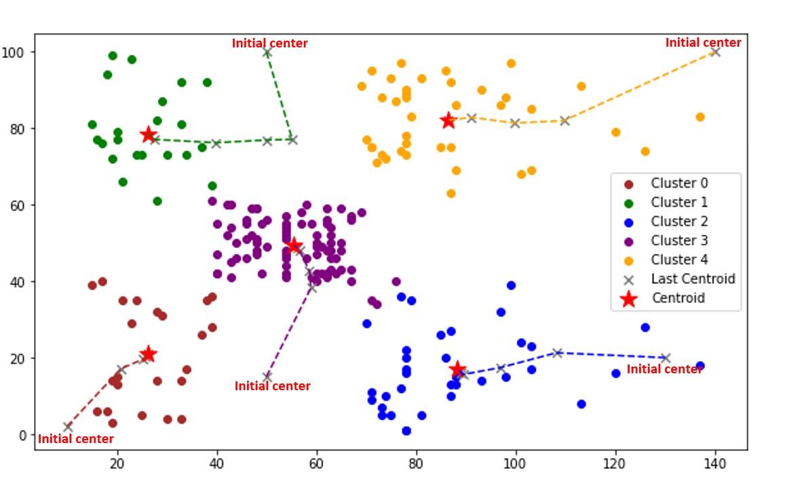
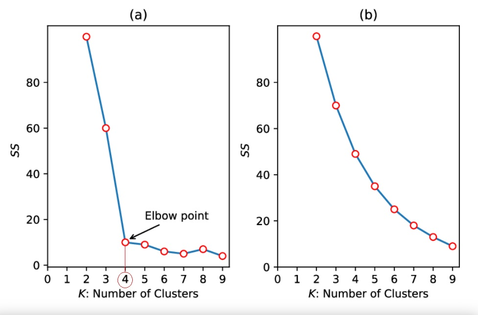
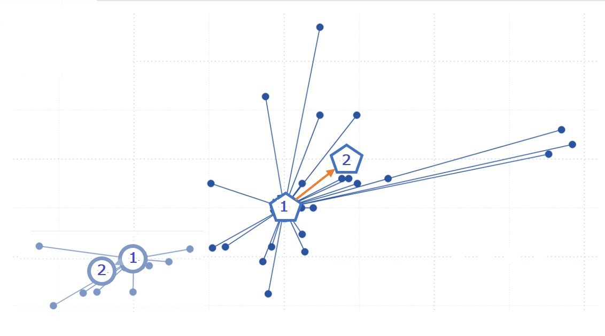
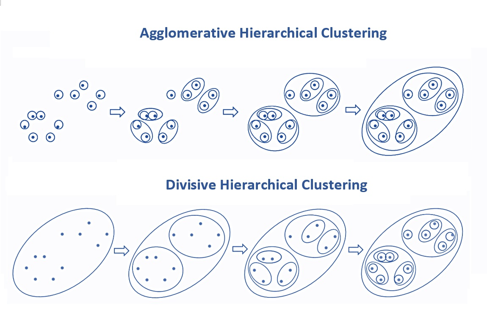
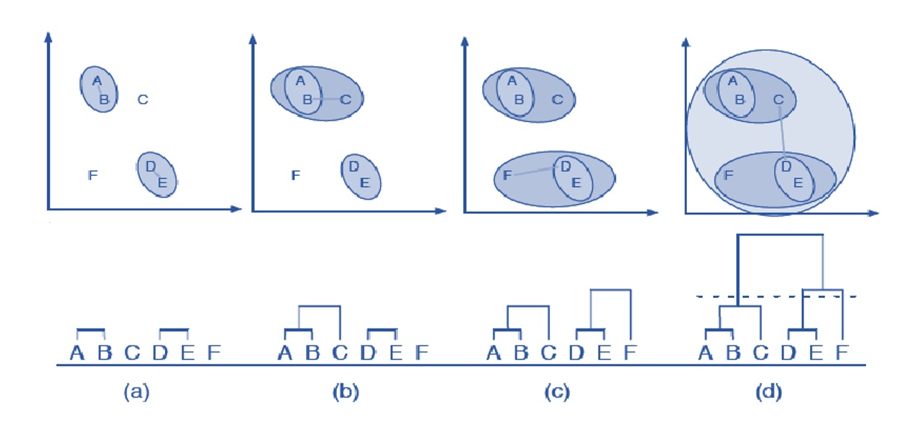
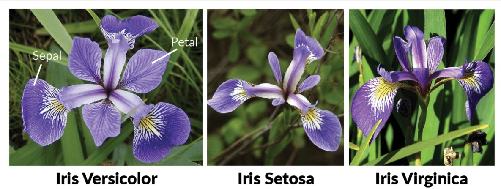
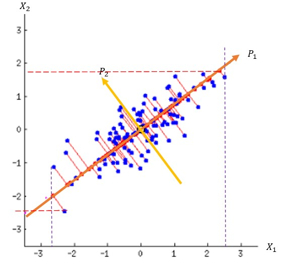
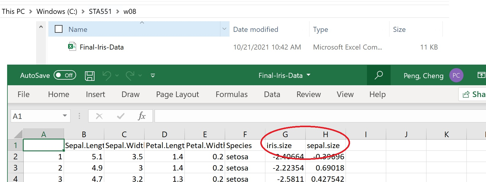

```{=html}
<style type="text/css">

div#TOC li {
    list-style:none;
    background-image:none;
    background-repeat:none;
    background-position:0;
}

h1.title {
  font-size: 24px;
  font-weight: bold;
  color: DarkRed;
  text-align: center;
}
h4.author { /* Header 4 - and the author and data headers use this too  */
    font-size: 18px;
    font-weight: bold;
  font-family: "Times New Roman", Times, serif;
  color: DarkRed;
  text-align: center;
}
h4.date { /* Header 4 - and the author and data headers use this too  */
  font-size: 18px;
  font-weight: bold;
  font-family: "Times New Roman", Times, serif;
  color: DarkBlue;
  text-align: center;
}
h1 { /* Header 3 - and the author and data headers use this too  */
    font-size: 22px;
    font-weight: bold;
    font-family: "Times New Roman", Times, serif;
    color: darkred;
    text-align: center;
}
h2 { /* Header 3 - and the author and data headers use this too  */
    font-size: 18px;
    font-weight: bold;
    font-family: "Times New Roman", Times, serif;
    color: navy;
    text-align: left;
}

h3 { /* Header 3 - and the author and data headers use this too  */
    font-size: 15px;
    font-weight: bold;
    font-family: "Times New Roman", Times, serif;
    color: navy;
    text-align: left;
}

h4 { /* Header 4 - and the author and data headers use this too  */
    font-size: 18px;
    font-weight: bold;
    font-family: "Times New Roman", Times, serif;
    color: darkred;
    text-align: left;
}
</style>
```


```{r setup, include=FALSE}
# code chunk specifies whether the R code, warnings, and output 
# will be included in the output files.

if (!require("ggplot2")) {
   install.packages("ggplot2")
   library(ggplot2)
}
if (!require("factoextra")) {
   install.packages("factoextra")
   library(factoextra)
}
if (!require("cluster")) {
   install.packages("cluster")
   library(cluster)
}
if (!require("dendextend")) {
   install.packages("dendextend")
   library(dendextend)
}
if (!require("ggdendro")) {
   install.packages("ggdendro")
   library(ggdendro)
}
if (!require("broom")) {
   install.packages("broom")
   library(broom)
}
if (!require("knitr")) {
   install.packages("knitr")
   library(knitr)
}
if (!require("pander")) {
   install.packages("pander")
   library(pander)
}
# knitr::opts_knit$set(root.dir = "C:/Users/75CPENG/OneDrive - West Chester University of PA/Documents")
# knitr::opts_knit$set(root.dir = "C:\\STA490\\w05")

knitr::opts_chunk$set(echo = TRUE,       
                      warning = FALSE,   
                      result = TRUE,   
                      message = FALSE,
                      fig.align='center', 
                      fig.pos = 'ht')
```


\


# Introduction

This note overviews the basic unsupervised machine learning algorithms (also known as knowledge discovery) in which models are not supervised using a training data set. Instead, models themselves find the **hidden patterns** and insights from the given data. 

The goal of unsupervised learning is to find the underlying structure of the data set and group that data according to similarities. Common algorithms used in unsupervised learning include clustering, anomaly detection, neural networks, and approaches for learning latent variable models.

The following types of unsupervised machine learning algorithms are commonly used in practice. 

* K-means Clustering
* Hierarchical Clustering
* Anomaly Detection
* Principal Component Analysis

There are many methods to calculate this distance information; the choice of distance measures is a critical step in clustering. It defines how the similarity of two data points (x, y) is calculated and it will influence the shape of the clusters. The choice of distance measures is a critical step in clustering. It defines how the similarity of two data points (x, y) is calculated and it will influence the shape of the clusters. 


```{r echo=FALSE, fig.align='center', out.width="80%", fig.cap="Figure 1.  Demonstration of the clustering process."}
if (knitr:::is_latex_output()) {
  knitr::asis_output('\\url{https://github.com/pengdsci/STA551/blob/main/w08/img/w08-kMeans-gif.gif}')
} else {
  
}
```


 Here are a few sites you check for these "distances".

* <https://elki-project.github.io/algorithms/distances>
* <https://ieeexplore.ieee.org/stamp/stamp.jsp?arnumber=6853338>
* <https://cran.r-project.org/web/packages/SimilarityMeasures/SimilarityMeasures.pdf>


In the next few sections, we will describe each of these algorithms. 

# K-means Clustering

K-means algorithm is an iterative algorithm that partitions the data set into K <font color = "red">*pre-defined*</font>, <font color = "blue"> distinct</font>, and <font color = "deeppink"> non-overlapping</font> subgroups (clusters) where each data point belongs to only one group. Data points within each subgroup are **similar** while data points across the subgroups are "different** according to a selected dissimilarity measure used in the algorithm.

In other words, k-means clustering consists of defining clusters so that the total intra-cluster variation (known as a total within-cluster variation) is minimized. There are several k-means algorithms available. The standard algorithm is to define the total within-cluster variation as the sum of squared (SS) distances (Euclidean distances) between data points and the corresponding centroid. To be more specific, let $x_i$ be the data point in cluster k, denoted by $C_k$ and $\mu_k$ is the center of cluster $C_k$ (i.e. the mean value of the points when Euclidean distance is used). The within-cluster SS is defined by

$$
W(C_k) = \sum_{x_i\in C_k} (x_i - \mu_i)^2
$$

> Each observation ($x_i$) is assigned to a given cluster such that the sum of squares (SS) distance of the observation to their assigned cluster centers $\mu_k$ is a minimum.

We define the total within-cluster variation as follows.

$$
\mbox{TW} = \sum_{k=1}^k W(C_l) = \sum_{i=1}^k\sum_{x_k\in C_k}(x_i - \mu_k)^2
$$

> The total within-cluster sum of square measures the compactness (i.e. goodness) of the clustering and we want it to be as small as possible.

Two fundamental questions to answer are: (1) how many initial clusters should be selected; (2) how to choose the initial "centers". 

```{r echo=FALSE, fig.align='center', out.width="80%", fig.cap="Figure 2. illustration of cluster analysis."}

```


K-means clustering algorithm works in the following three steps. 


## Optimal Number of Clusters Determination

Several algorithms can be used to find the optimal number of clusters. Elbow and Silhouette algorithms are commonly used and are implemented in R.


**Elbow Method**

The Elbow method gives us an idea of what a good k number of clusters would be based on the sum of squared distance (SSE) between data points and their assigned clusters’ centroids. We pick k at the spot where SSE starts to flatten out and form an elbow. We’ll use the geyser dataset and evaluate SSE for different values of k and see where the curve might form an elbow and flatten out.

Elbow is one of the most famous methods for selecting the right value of k. We also perform the hyper-parameter tuning to choose the best value of k. The Elbow method is an empirical method to find out the best value of k. 

```{r echo=FALSE, fig.align='center', out.width="80%", fig.cap="Figure 3. (a) A visual curve with an explicit elbow point. (b) A visual curve being fairly smooth with an ambiguous elbow point."}

```


**Silhouette Method**

The Silhouette Method uses a similarity measure (Silhouette coefficient) that is defined in the following

$$
S_i = \frac{b_i-a_i}{\max{ \{a_i, b_i\}}},
$$

where $S_i$ is the silhouette coefficient of the data point $i$; $a_i$ is the average distance between $i$ and all the other data points in the cluster to which $i$ belongs, and $b_i$ is the average distance from $i$ to all clusters to which $i$ does not belong.


We can plot the Silhouette coefficient against the pre-determined clusters $k$. The plot of the silhouette is between $-1$ to $1$. 

A high average silhouette width indicates good clustering. The average silhouette method computes the average silhouette of observations for different values of k. The optimal number of clusters k is the one that maximizes the average silhouette over a range of possible values for k.

Observe the plot and choose the k value that is closer to 1 as the optimal number of clusters.

## Steps for K-mean Algorithm

There different versions of k-mean algorithms. The most commonly used are three: Lloyd, McQueen and Hartigan-Wong. Lloyd algorithms is easy to understand. We will use it to illustrate the step of K-mean clustering. R implemeted all three algorithms in the R function `kmean()`.

### Initialize Centroids.

Initialize centroids by first shuffling the data set and then randomly selecting K data points for the centroids without replacement.

### Update Centroids

Updating centroids is an iterative process:

1. Compute the sum of the squared distance between data points and all (initial) centroids. Assign each data point to the closest cluster (centroid).

2. Compute the (updating) centroids for the clusters by taking the average of all data points that belong to each cluster.

Keep iterating until there is no change to the centroids. i.e.,  the assignment of data points to clusters isn’t changing.


The following figure illustrates how to find the updated centroids immediately after the initial centroids.

```{r echo=FALSE, fig.align='center', out.width="80%", fig.cap="Figure 4. Updating centroids in the process of finding the final centroids"}

```


## Some Remarks on K-means

1. K-means clustering assumes numerical features since the Euclidean distance is used to define similarity measures.

2. K-Means clustering performs well only for a convex set of clusters and not for non-convex sets.

3. Recent development allows categorical feature variables with non-Euclidean distance.

4. The k-means algorithm does not guarantee finding the optimal solution. k-means is a fairly simple sequence of tasks and its clustering quality depends a lot on two factors: the number of k clusters and initial centroids.


## Case Study

For illustrative purposes, we only use two numerical variables in a simple data set that is publically available in Github <https://raw.githubusercontent.com/satishgunjal/datasets/master/Mall_Customers.csv>.

```{r}
df = read.csv("https://raw.githubusercontent.com/satishgunjal/datasets/master/Mall_Customers.csv")
## rename the two variables and then subset the data
names(df)[names(df)=="Annual.Income..k.."] = "AnnualIncome"
names(df)[names(df)=="Spending.Score..1.100."] = "SpendingScore"
clust.data = df[, c("AnnualIncome", "SpendingScore")]
scaled.data = as.data.frame(scale(clust.data)[,1:2])
```

```{r fig.align='center', fig.width=5, fig.height=5,  fig.cap="Figure 5: Heatmap representation of potential clusters"}
distance = get_dist(scaled.data)
fviz_dist(distance, gradient = list(low = "yellow", mid = "orange", high = "darkred"), show_labels = FALSE)
```

The above heatmap indicates that different clusters exist in this data (based on the two numerical variables).


* The syntax of **kmeans()** is given in the following code chunk.

```{r}
k2 <- kmeans(x = scaled.data, 
             centers = 2, 
             iter.max = 10,
             nstart = 25,
             algorithm = "Lloyd", #"Hartigan-Wong",
             trace = FALSE)
```

* Determination of optimal class.

We use the elbow method to find the optimal number of clusters. 

```{r fig.align='center', fig.width=5, fig.height=5, fig.cap="Figure 6: Elbow plot for optimal number of clusters."}
wss = NULL
K = 15
for (i in 1:K){
  wss[i] = kmeans(scaled.data, i, 1 )$tot.withinss
 }
## elbow plot
plot(1:K, wss, type ="b",
          col= "blue",
          xlab="Number of Clusters",
          ylab = "WSS",
          main = "Elbow Plot for Selecting Optimal Number of Clusters")
```

From the above elbow plot, it seems that the optimal number of clusters is 5. So select k - 5 hereafter.

* Cluster the data with 5 centroids

We will cluster the data into 5 groups and then add the cluster ID to the data. Since only two continuous feature variables were used to cluster the data. After we added the cluster ID to the data, we used color coding to make a scatter plot and view the clusters.

```{r, fig.align='center', fig.width=5, fig.height=5,  fig.cap= "Figure 7. Final cluster results: visual inspection"}
k5 <- kmeans(x = scaled.data, 
             centers = 5, 
             iter.max = 10,
             nstart = 25,
             algorithm = "Lloyd", # "Hartigan-Wong",
             trace = FALSE)
scaled.data$group = k5$cluster
### Plot the clusters
# Scatter plot
plot(scaled.data$AnnualIncome, scaled.data$SpendingScore,
     pch = 19,
     col = factor(scaled.data$group),
     xlab ="Spending Score",
     ylab = "Annual Income",
     main = "Clustering Performance Visual Check")

# Legend
legend("topright",
       legend = levels(factor(scaled.data$group)),
       pch = 19,
       col = factor(levels(factor(scaled.data$group))))
```

# Hierarchical Clustering

In this section, we introduce one of the most popular clustering methods: ** Hierarchical Clustering **.  Hierarchical clustering is an alternative approach to k-means clustering for identifying groups in the dataset. It does not require us to pre-specify the number of clusters to be generated as is required by the k-means approach. Furthermore, hierarchical clustering has an added advantage over K-means clustering in that it results in an attractive tree-based representation of the observations, called a dendrogram.

## Types of Hierarchical Clustering

There are two types of hierarchical clustering: agglomerative and divisive. 

* **Agglomerative***: An agglomerative approach begins with each observation in a distinct (singleton) cluster, and successively merges clusters until a stopping criterion is satisfied.

* **Divisive**: A divisive method begins with all patterns in a single cluster and performs splitting until a stopping criterion is met.

```{r echo=FALSE, fig.align='center', out.width="80%", fig.cap="Figure 8. Illustration of types of hierarchical clustering."}

```

As an example, we look at how agglomerative clustering works using five data points in the following figure.

```{r echo=FALSE, fig.align='center',  out.width="80%", fig.cap="Figure 9. Illustration of steps of agglomerative hierarchical clustering."}

```

\

## Case Study I – Clustering with Two Features

We still use the same data set that we used in the previous case study of K-means clustering but will include **age** variable in the data frame for following hierarchical clustering.

```{r}
df = read.csv("https://pengdsci.github.io/STA551/w11/Mall_Customers.csv")
## Rename the two variables and then subset the data
names(df)[names(df)=="Annual.Income..k.."] = "AnnualIncome"
names(df)[names(df)=="Spending.Score..1.100."] = "SpendingScore"
hierarch.data = df[, c("Age", "AnnualIncome", "SpendingScore")]
```


\

### Pre-processing Operations for Clustering

There are a couple of things you should take care of before starting.

**Scaling** is imperative that we normalize the scale of feature values in order to start with the clustering process. This is because each observation's feature values are represented as coordinates in n-dimensional space (n is the number of features) and then the distances between these coordinates are calculated. If these coordinates are not normalized, then it may lead to false results. R has functions **scale()** and **normalize()**.


**Missing Value imputation** is also important to deal with missing/null/inf values in your data set beforehand. There are many ways to deal with such values, one is to either remove them or impute them with mean, median, mode, or use some advanced regression techniques. R has many packages and functions to deal with missing value imputations like **impute()**.

### Hierarchical Clustering with R

There are different functions available in R for computing hierarchical clustering. The commonly used functions are:

* **hclust()** [in stats package] and **agnes()**  [in cluster package] for agglomerative hierarchical clustering (HC).

* **diana()** [in cluster package] for divisive HC.


```{r, fig.align = 'center', fig.width=5, fig.height=5,   fig.cap= "Figure 10. Dendrogram: hierarchical clustering"}
scales.hierarch = as.data.frame(hierarch.data)
distance <- dist(scales.hierarch, method = "euclidean")
# Hierarchical clustering using Complete Linkage
hc1 <- hclust(distance, method = "complete" )
# Plot the obtained dendrogram
plot(hc1, cex = 0.6, labels = FALSE, hang = -1, xlab = "", main = "Dendrogram: hierarchical clustering")
rect.hclust(hc1, k = 5, border = 2:9)
```

```{r, fig.align="center", fig.width=5, fig.height=5,  fig.cap="Figure 11. Dendrogram: hierarchical clustering: No X-Labels"}
# Figured this out by coloring the labels white to the background
avg_dend_obj <- as.dendrogram(hc1)
labels_colors(avg_dend_obj) <- "white"
plot(avg_dend_obj, cex = 0.6, 
     labels = FALSE, 
     hang = -1, 
     xlab = "", 
     ylab= "Height",
     main = "Dendrogram: hierarchical clustering: No X-Labels")
rect.hclust(hc1, k = 5, border = 2:9)
```

### Determination Optimal Number of Clusters

The determination of the optimal number of clusters is an important and challenging problem. In hierarchical clustering, different similarity measures impact the number of optimal clusters. We will not discuss this topic in detail. To know more about this topic, you are referred to the following article with examples in R <https://www.jstatsoft.org/article/view/2194/798>.

We can use the same elbow and silhouette methods to plot. 

```{r, fig.align='center', fig.width=5, fig.height=5,  fig.cap= "Figure 12. Elbow plot: Optimal number of clusters"}
fviz_nbclust(scales.hierarch, FUN = hcut, method = "wss")
```

```{r,fig.align='center', fig.width=5, fig.height=5, fig.cap= "Figure 13. Silhouette plot: Optimal number of clusters"}
fviz_nbclust(scales.hierarch, FUN = hcut, method = "silhouette")
```

### Extracting Cluster ID

The above elbow plot indicates that choosing 4 clusters is appropriate. Next, we perform a 4-cluster analysis and extract the cluster ID to add them to the data frame. **This cluster ID could be used as a new feature variable in subsequent modeling**.

```{r, fig.align='center',fig.width=5, fig.height=5,  fig.cap= "Figure 14. Visual check the resulting clusters obtained from agglomerative hierarchical clustering."}
hc4 <- hclust(distance, method = "complete" )
group = cutree(hc4, k = 6)
scales.hierarch$group = group
## 
plot(scales.hierarch$AnnualIncome, scales.hierarch$SpendingScore,
     pch = 19,
     col = factor(scales.hierarch$group),
     xlab ="Spending Score",
     ylab = "Annual Income",
     main = "Hierarchical Clustering Performance Visual Check")

## Legend
legend("topright",
       legend = levels(factor(scales.hierarch$group)),
       pch = 19,
       col = factor(levels(factor(scales.hierarch$group))))
```

\

## Case Study II: Multi-class Clustering

The Iris Dataset contains four features (length and width of sepals and petals) of 50 samples of three species of Iris (Iris setosa, Iris virginica, and Iris versicolor). These measures were used to create a linear discriminant model to classify the species. The dataset is often used in data mining, classification, and clustering examples and to test algorithms.

```{r echo=FALSE, fig.cap="Figure 15. Iris data set: variables illustration - pedal and sepal", out.width="60%",  fig.align = "center"}

```

This 100-year-old data set has been included in the R base package. The first few records of the data set are displayed in the following table.

```{r}
pander(head(iris))
```

We use **k-means** method to perform cluster analysis on the **iris data** with the four numerical feature variables.

```{r}
myClusteredIris = iris
# We start with 3 clusters since we know there are 3 species in the data.
# In practice, we need relatively try different numbers of clusters and then
# use the elbow plot to determine the best number of clusters.
km.iris <- kmeans( x = myClusteredIris[, -5] , centers = 3)  
clust.ID <- km.iris$cluster        # extracting cluster IDs

table(clust.ID)                    # frequency of clusters
```

Since this clustering task involves 4 numerical feature variables, we cannot create a 2D plot to show the clustering performance with all four original feature variables. However, we can so-called PCA (to be discussed in the next section) to create two new feature variables and then plot the new features to show the performance of the clustering algorithm. 


```{r}
clusplot(iris[, -5],
 clust.ID,
 lines = 0,
 shade = TRUE,
 color = TRUE,
 labels = 1,
 plotchar = FALSE,
 span = TRUE,
 main = paste("Clusters of Iris Flowers")
)
```

## Memory Usage of Clustering

One of the potential issues in clustering analysis is the use of memory. If the data size is too large, 

\

# Dimensionality Reduction Algorithms

Like clustering methods, dimension reduction seeks and explores the inherent structure in the data, but in this case in an unsupervised manner or to summarize or describe data using less information.
 
This can be useful to visualize high-dimensional data or to simplify data which can then be used in a supervised learning method. Many of these methods can be adapted for use in classification and regression. The following are the frequently used algorithms.

*	Principal Component Analysis (PCA)
*	Linear Discriminant Analysis (LDA)
*	Quadratic Discriminant Analysis (QDA)
* Independent Component Analysis (ICA)

In this section, we introduce the most commonly used PCA.

## The Logic of PCA

We use a two-variable animation as an example to illustrate the idea of principal component analysis (PCA).

```{r echo=FALSE, fig.align='center', out.width="160%", fig.cap="Figure 16. Illustration PCA."}
if (knitr:::is_latex_output()) {
  knitr::asis_output('\\url{https://github.com/pengdsci/STA551/blob/main/w08/img/w08-PCA-Animation-01.gif}')
} else {
  knitr::include_graphics("img/w08-PCA-Animation-01.gif")
}
```

The above animated graph shows that two or more numerical feature variables are highly correlated, the PCA can be used to aggregate the information in the correlated feature variables by transforming them into a set of uncorrelated **new feature variables** such that the majority of the total information is captured by the first few new feature variables.

```{r echo=FALSE, fig.cap="Figure 17. Graphical interpretation of PCA with two correlated variables", out.width="60%",  fig.align = "center"}

```


## Case Study - Iris Data

We have used the well-known Iris Data set in clustering algorithms. The data set has 4 correlated numerical variables(sepal width and length, petal width and length) and a categorical variable. The four variables measure the size of the flowers. We use PCA to see whether reducing the number of feature variables for related modeling.  


### Fitting PCA model to Iris data

We want to PCA method to reduce the dimensions from 4 (numerical variables) to a smaller number. The R function **prcomp()** to the factor loadings associated with the four numerical variables.

```{r}
log.iris = log(iris[,-5])   # drop the categorical variable in the original 
                            # data set and transform all numerical to the
                            # log-scale
ir.pca <- prcomp(log.iris, center = TRUE, scale = TRUE)
# summary(ir.pca)[6]   # use the command to explore the possible information
                       # available in the output of the summary.
```

In the above R function, three arguments are explained in the following.

```{}
log.iris = log of the four variables
cater = TRUE, this means the variables are centered, i.e.,  you move the origin of the original coordinate system to the center of the data cloud.
scale = TRUE, divide the difference between the value of each variable and its mean by the standard deviation of the corresponding variable. 
```

Next, we find the factor loading of the above fitted PCA. We can write an explicit system of linear transformation by using the loadings.

```{r}
kable(round(ir.pca$rotation, 2), caption="Factor loadings of the PCA")
```
The explicit expression of the predictive system of PC is given by

$$
 \begin{aligned}
PC_1 & = 0.50 Sepal.Length -0.30 Sepal.Width + 0.58 Petal.Length + 0.57 Petal.Width  \\
PC_2 & = -0.45 Sepal.Length - 0.89 Sepal.Width -0.03 Petal.Length - 0.04 Petal.Width \\
PC_3 & = 0.71 Sepal.Length -0.33 Sepal.Width - 0.22  Petal.Length - 0.58 Petal.Width \\
PC_4 & = 0.19 Sepal.Length -0.09 Sepal.Width -0.79 Petal.Length + 0.58 Petal.Width   \\
\end{aligned}
$$

The magnitude of factor loadings indicates the amount of information that original variables contribute to the corresponding principal components. For example, the absolute value of loadings associated with petal width and length and sepal length in $PC_1$ is greater than or equal to 0.5. We can simply call $PC_1$ the **size** of iris flowers. Similarly, sepal length and width are major contributors to $PC_2$, we can name $PC_2$ as **sepal size**.


### Optimal number of PCs to be retained

The object of PCA is to reduce the dimension without losing a significant amount of information. In PCA, we look at how much total variation is captured by each principal component. Most of the libraries that are capable of performing PCA automatically rank the PCA based on the variation captured by each principal component.

The following summary table gives the importance of the principal components.

```{r}
kable(summary(ir.pca)$importance, caption="The importance of each principal component")
```

From the above table, we can see that the first PC explains about $73.33\%$ of the variation. But we first two principal components explain about $96\%$ of the total variation. In the data analysis, you only need to use the first two PCs that lose about $4\%$ of the information.

We can also make a scree plot as a visual tool to show the number of principal components to retain for future analysis.

```{r, fig.align= 'center', fig.width=5, fig.height=5, fig.cap="Figure 18. Scree plot of PCA on Iris Data"}
screeplot(ir.pca, 
          type = "lines",
          main = "Scree Plot of PCA Iris Flower Sizes")
```

Note that the vertical axis in the above scree plot uses the variances of PCs. The standard deviation was used in the above summary table.


### Extracting PC Scores

The predictive principle scores are values of the newly transformed variables. We can choose the first few principal components to use as response variables to do relevant modeling.

The command `ir.pcs$x` extracts the PC scores from the PCA procedure. These scores are the values of the new transformed variables. They can be used as response or predictor variables in statistical models. The following table shows the 


```{r}
kable(ir.pca$x[1:15,], caption = "The first 15 PC scores transformed from the original variable. In the analysis, you want to either the first PC or the first two PCs.")
```

As the final step, we rename the two PCs and then add the two new variables to the original data set for future analysis. Since $PC_1$ captures variation of both sepal and pedal, we rename $PC_1$ as **iris.size**. Similarly, we rename $PC_2$ as **sepal.size**.

```{r}
my.final.iris.data = iris
my.final.iris.data$iris.size = ir.pca$x[, 1]
my.final.iris.data$sepal.size = ir.pca$x[, 2]
## write the final data set to a local folder
write.csv(my.final.iris.data, file = "C:\\Users\\75CPENG\\OneDrive - West Chester University of PA\\Desktop\\cpeng\\WCU-Teaching\\2023Summer\\STA551\\w08\\Final-Iris-Data.csv")
```

The following screenshot shows the final data file was saved in a local folder and the two renamed principal components were added to the final data set.

```{r echo=FALSE, fig.cap="Figure 19. Screenshot of the final iris data set with new variables defined based on the principal components", out.width="80%",  fig.align = "center"}

```


