```{css echo = FALSE}
<style type="text/css">

div#TOC li {
    list-style:none;
    background-image:none;
    background-repeat:none;
    background-position:0;
}

h1.title {
  font-size: 24px;
  font-weight: bold;
  color: DarkRed;
  text-align: center;
}
h4.author { /* Header 4 - and the author and data headers use this too  */
    font-size: 18px;
    font-weight: bold;
  font-family: "Times New Roman", Times, serif;
  color: DarkRed;
  text-align: center;
}
h4.date { /* Header 4 - and the author and data headers use this too  */
  font-size: 18px;
  font-weight: bold;
  font-family: "Times New Roman", Times, serif;
  color: DarkBlue;
  text-align: center;
}
h1 { /* Header 3 - and the author and data headers use this too  */
    font-size: 22px;
    font-weight: bold;
    font-family: "Times New Roman", Times, serif;
    color: darkred;
    text-align: center;
}
h2 { /* Header 3 - and the author and data headers use this too  */
    font-size: 18px;
    font-weight: bold;
    font-family: "Times New Roman", Times, serif;
    color: navy;
    text-align: left;
}

h3 { /* Header 3 - and the author and data headers use this too  */
    font-size: 15px;
    font-weight: bold;
    font-family: "Times New Roman", Times, serif;
    color: navy;
    text-align: left;
}

h4 { /* Header 4 - and the author and data headers use this too  */
    font-size: 18px;
    font-weight: bold;
    font-family: "Times New Roman", Times, serif;
    color: darkred;
    text-align: left;
}
</style>
```

```{r setup, include=FALSE}
# code chunk specifies whether the R code, warnings, and output 
# will be included in the output files.
if (!require("ggplot2")) {
   install.packages("ggplot2")
   library(ggplot2)
}
if (!require("factoextra")) {
   install.packages("factoextra")
   library(factoextra)
}
if (!require("cluster")) {
   install.packages("cluster")
   library(cluster)
}
if (!require("dendextend")) {
   install.packages("dendextend")
   library(dendextend)
}
if (!require("e1071")) {
   install.packages("e1071")
   library(e1071)
}
if (!require("dbscan")) {
   install.packages("dbscan")
   library(dbscan)
}
if (!require("knitr")) {
   install.packages("knitr")
   library(knitr)
}
if (!require("dplyr")) {
   install.packages("dplyr")
   library(dplyr)
}
if (!require("pROC")) {
   install.packages("pROC")
   library(pROC)
}
# knitr::opts_knit$set(root.dir = "C:/Users/75CPENG/OneDrive - West Chester University of PA/Documents")
# knitr::opts_knit$set(root.dir = "C:\\STA490\\w05")

knitr::opts_chunk$set(echo = TRUE,       
                      warning = FALSE,   
                      results = TRUE,   
                      message = FALSE,
                      comment = NA)
```

\


# Introduction 

**Anomaly Detection** is the process of identifying **unusual** patterns, events, or observations in data that do not conform to expected behavior. It has applications in various fields, such as fraud detection, cybersecurity, healthcare, and industrial monitoring. The main objective is to detect points or sequences that **differ significantly** from the **normal** data which imply potential issues, threats, or insights.


There are different types of detection methods in classical statistics methods such as density-based methods, statistical clustering, etc., and machine learning-based methods such as distance-based unsupervised learning methods and related supervised learning algorithms including one-class support vector machines. The following is a list of commonly used types of anomaly detection methods.

* **Statistical Methods**: Identify anomalies based on data distribution assumptions. Examples include the Z-score, Grubbs’ test, and Mahalanobis distance.

* **Machine Learning Methods**: Algorithms like Isolation Forest, One-Class SVM, and K-Nearest Neighbors (K-NN) detect anomalies by learning patterns from normal data.

* **Clustering-Based Methods**: Group similar data points, identifying outliers that don't fit into any clusters, such as K-means and DBSCAN. We will detail 

* **Time-Series-Specific Methods**: ARIMA, Exponential Smoothing, and LSTM, designed for detecting anomalies in sequential data.


#  Anomaly Detection Use Cases

In essence, identifying fraud is an anomaly detection process that identifies unusual patterns that do not fit normal behavior in the data generation process. Sometimes, people break anomaly detection algorithms down into two subclasses: outlier detection and novelty detection.

* **Outlier detection**:  the input data set contains examples of both standard events and anomaly events. These algorithms seek to fit regions of the training data where the standard events are most concentrated, disregarding, and therefore isolating the anomaly events. Such algorithms are often trained in an unsupervised fashion (i.e., without labels). We sometimes use these methods to help clean and pre-process data sets before applying additional machine-learning techniques.

* **Novelty detection**: Unlike outlier detection, which includes examples of both standard and anomaly events, novelty detection algorithms have only the standard event data points (i.e., no anomaly events) during training time. During training, these algorithms use only labeled examples of standard events (supervised learning). At the time of testing/prediction, novelty detection algorithms must detect when an input data point is an outlier.

Anomaly detection has become crucial across multiple domains to identify unusual patterns that could signify potential issues or hidden insights. Here’s an overview of its primary use cases in various industries that every applied statistician should know.

##  Finance and Banking

**Fraud Detection**: Identifying suspicious transactions or activities, such as unusual spending patterns, credit card fraud, or account takeovers. Anomaly detection helps spot fraud in real-time by flagging transactions that deviate from an individual’s typical (spending) behavior.


**Anti-Money Laundering (AML)**: Detects unusual transaction sequences or transfers across accounts to prevent money laundering. Algorithms help spot patterns like frequent large cash deposits followed by international transfers.

**Risk Management**: In trading and investment, anomaly detection identifies unusual market movements, helping financial institutions detect market manipulation or systemic risks.

## Cybersecurity

**Intrusion Detection**: Monitors network traffic to detect unusual behavior that may indicate a cybersecurity attack, such as Distributed Denial of Service (DDoS) attacks, phishing, or unauthorized access attempts.

**Behavioral Monitoring**: Observes user behavior on networks and systems to detect insider threats by spotting unusual login times, excessive file access, or other deviations from regular patterns.

## Healthcare

**Patient Monitoring**: In healthcare, anomaly detection can monitor vital signs and health metrics in real-time, identifying potential health risks or emergencies, such as abnormal heart rates or respiratory issues.

**Medical Diagnostics**: Helps detect diseases early by identifying unusual patterns in medical images, lab results, or genetic data, improving diagnostics for conditions like cancer or cardiac abnormalities.

**Operational Efficiency**: Monitors hospital or clinic operations, such as inventory usage or patient flow, to detect inefficiencies or predict shortages.

## Manufacturing and Industrial Maintenance

**Predictive Maintenance**: Detects unusual patterns in sensor data from machinery (vibration, temperature, etc.), predicting potential equipment failures before they occur, reducing downtime and repair costs.

**Quality Control**: Monitors production quality to detect defects or irregularities in the manufacturing process, helping to maintain product standards and reduce waste.

**Supply Chain Management**: Identifies unusual trends in supply and demand, enabling proactive measures for stock management and preventing bottlenecks.

## Human Resources and People Analytics

**Employee Performance Monitoring**: Detects changes in productivity metrics, helping HR to identify employees who may need additional support or training.

**Absenteeism and Turnover Prediction**: Identifies unusual patterns in employee attendance or satisfaction, helping companies proactively address retention and morale.

**Workplace Security**: Monitors access to secure areas or data, detecting potential insider threats or unauthorized access.


## Environmental Monitoring

**Weather and Climate Anomalies**: Detects unusual patterns in temperature, humidity, or precipitation, contributing to climate research and early warning systems.

**Natural Disaster Detection**: Monitors seismic or meteorological data for early signs of natural disasters like earthquakes, floods, or wildfires, allowing for timely response.
Wildlife and Ecosystem Monitoring: Identifies unusual patterns in animal movement, habitat conditions, or ecosystem metrics, which can aid in conservation efforts.

\

In summary, **anomaly detection** helps various industries detect early warning signs, improve operational efficiency, prevent losses, and enhance security. The use cases span a wide array of sectors, including finance, healthcare, cybersecurity, manufacturing, environmental monitoring, etc. With advances in data science and machine learning, anomaly detection methods are becoming more sophisticated and tailored to specific applications, making them an essential tool in today’s data-driven world.


# Supervised and Unsupervised Anomaly Detection


Depending on whether the labels are available, anomaly detection techniques can be categorized into one of the following three modes:

## Supervised Anomaly Detection 

Techniques trained in supervised mode assume the availability of a training data set that has labeled instances for normal as well as anomaly classes. A typical approach in such cases is to build a predictive model for normal vs. anomaly classes. Any unseen data instance is compared against the model to determine which class it belongs to. 

Two major issues arise in supervised anomaly detection. 

* **Imbalance Labels**: The anomalous instances are far fewer compared to the normal instances in the training data. Issues that arise
due to imbalanced class distributions have been addressed in the data mining and
machine-learning literature

* **Inaccuracy of Label**: obtaining accurate and representative labels, especially for the anomaly class is usually challenging. This is particularly true in the world of credit card fraud operations. 

Other than these two issues, the supervised anomaly detection problem is similar to building predictive models such as logistic regression and decision tree algorithms. 


## Semi-Supervised Anomaly Detection. 

These types of methods usually assume that the training data has labeled instances for only the normal class. Since they do not require labels for the anomaly class, they are more widely applicable than supervised techniques. The typical approach used in such techniques is to build a model for the class corresponding to normal behavior and use the model to identify anomalies in the test data.

A limited set of anomaly detection techniques exist that assume the availability of
only the anomaly instances for training. Such techniques are not commonly used,
primarily because it is difficult to obtain a training data set that covers every
possible anomalous behavior that can occur in the data.

Sometimes, we have to use supervised and unsupervised methods to label some unlabeled examples to reach the minimum sample size for using supervised anomaly detection methods.

## Unsupervised Anomaly Detection. 

These types of methods operate in unsupervised mode and do not require training data, and thus are most widely applicable. The techniques in this category make the implicit assumption that normal instances are far more frequent than anomalies in the test data. If this assumption is not true then such techniques suffer from a high false alarm rate.

Many semi-supervised techniques can be adapted and used in an unsupervised model by using a sample of the unlabeled data set as training data. Such adaptation assumes that the test data contains very few anomalies and the model learned during training is robust to these few anomalies.


## Common Anomaly Detection Algorithms

Machine learning algorithms are widely utilized for anomaly detection, with their application varying depending on the data set size and the specific characteristics of the problem. Here are some of the key algorithms for anomaly detection:

**Local Outlier Factor (LOF)**: This algorithm identifies anomalies by comparing the local density of data points. A data point is considered an outlier if its density is significantly lower than that of its neighbors.

**K-Nearest Neighbors (kNN)**: Though typically a supervised learning algorithm used for classification, kNN can be adapted for unsupervised anomaly detection techniques. It involves defining what constitutes normal and abnormal values without traditional training processes. This flexibility makes kNN suitable for both small and large data sets and facilitates straightforward visualization of results.

The following figure shows how to use the mean distance of points in a 5-point neighborhood to 

```{r echo=FALSE, fig.align='center', out.width="80%"}
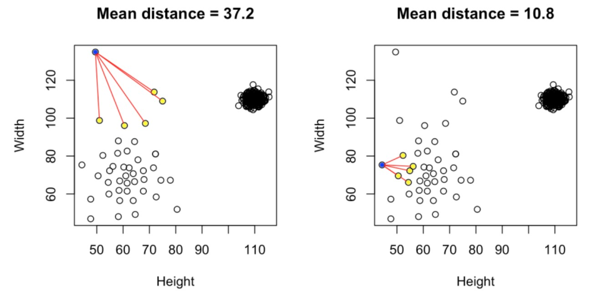
```


**Support Vector Machines (SVM)**: As a supervised anomaly detection learning method, SVM classifies data by separating them into classes with hyper-planes in a multi-dimensional space. For AD, SVM can be tailored to single-class scenarios where the model learns to identify the 'normal' class and flags data not fitting this classification as anomalies.


```{r echo=FALSE, fig.align='center', out.width="80%"}
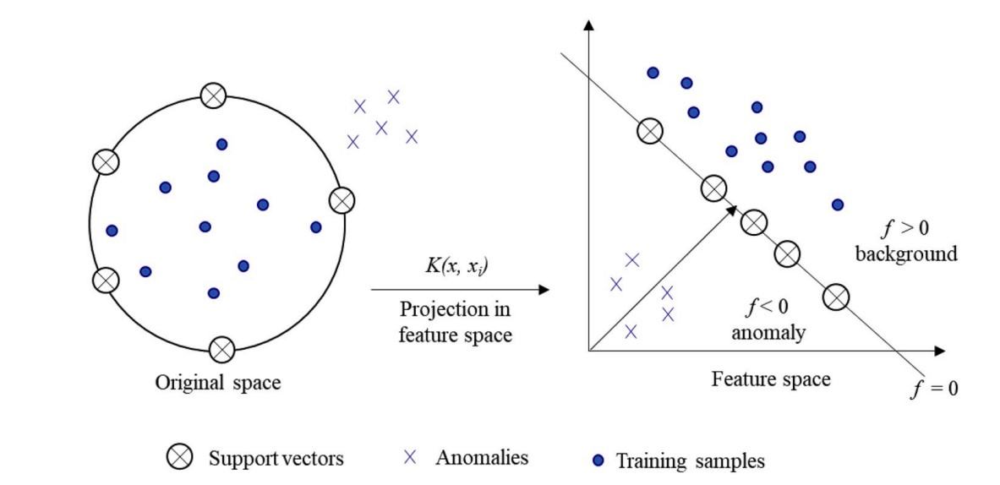
```


**DBSCAN (Density-Based Spatial Clustering of Applications with Noise)**: This unsupervised anomaly detection algorithm relies on density-based clustering. It identifies clusters in large data sets by evaluating the local density of data points, with outliers marked as -1, indicating they do not belong to any cluster.


```{r echo=FALSE, fig.align='center', out.width="60%"}
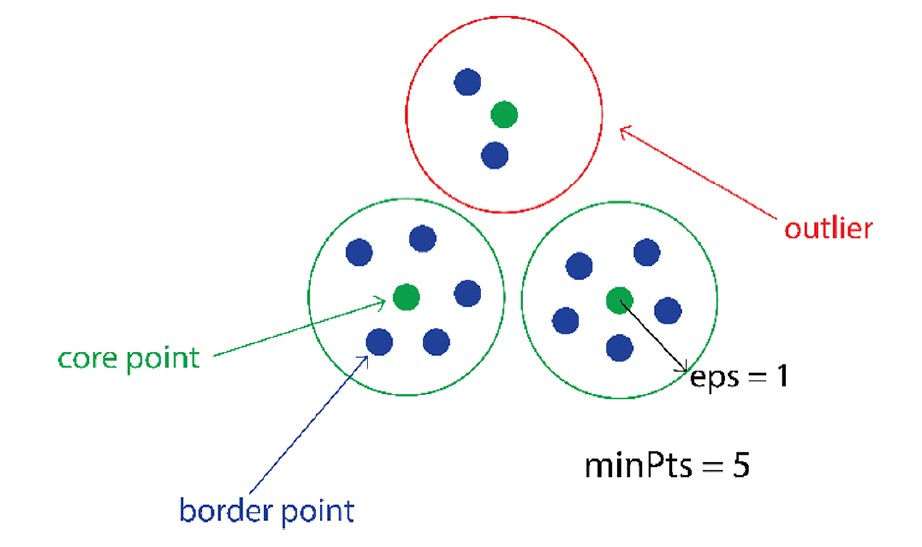
```


In the following section, we introduce one outlier detection - the local outlier factor (LOF) score method to detect outliers (anomaly).


# Local Outlier Factor (LOF) Method: Outlier Detection

The LOF [proposed by  Markus M. Breunig, Hans-Peter Kriegel, Raymond T. Ng, and Jorg Sander in 2000] is the most well-known local anomaly detection algorithm whose idea is carried out in many nearest-neighbor-based algorithms. 

When a point is considered as an outlier based on its local neighborhood, it is a **local outlier**. LOF will identify an outlier considering the density of the neighborhood. **LOF performs well when the density of the data is not the same throughout the dataset**.


## Definitions of Some `Distances`

Before introducing the steps for calculating the LOF score, we define the following technical terms.

### Normal Distance (ND)

Any of the valid "statistical distances" such as Euclid, Minkowski, Manhattan, etc. Normal distance between two points **A** and **B** is usually denoted by **d(A, B)** or **ND(A, B)**.


```{r echo=FALSE, fig.align='center', out.width="80%",  fig.cap="Figure 2.  Commonly used statistical distances."}
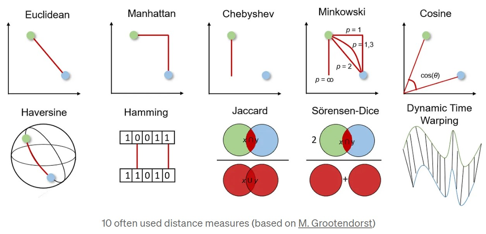
```

**Example 1**: The following figure illustrates how to find the Manhattan distance between two points in the 2-dimensional space.

```{r echo=FALSE, fig.align='center', out.width="80%",  fig.cap="Figure 3.  Illustration of calculating the Manhattan distance between two points."}
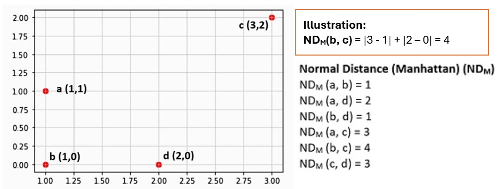
```


### k-distance (kD)

For the pre-selected k, k-distance is defined to be the distance of a (new) point to its kth neighbor (i.e., k-th point). For example, if k was 3, **the k-distance of A**, denoted by `k-distance(A)`, **would be the distance of point A to its** `third closest` point which is D (B is the first closest neighbor, C is the second closest neighbor), see the following Figure.

```{r echo=FALSE, fig.align='center', out.width="50%",  fig.cap="Figure 4.  An illustration of k-distance with k = 3."}
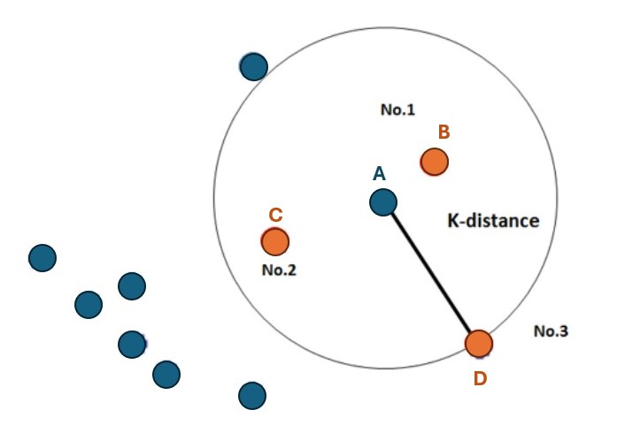
```

**Example 2 (cont'd)**: Using the same toy data, we illustrate how to calculate the **k-distance** in the following

```{r echo=FALSE, fig.align='center', out.width="90%",  fig.cap="Figure 5.  An example of k-distance with k = 3."}
include_graphics("img/K-DistanceExample.jpg")
```


### Reachability Distance (RD) 

**RD** is defined to be the maximum distance of two points and the k-distance of the `second` point. For example, the reachability distance between A and D is given by

$$
\text{Reachability-Distance}_k(A, D) = \max \{\text{k-distance (D)}, \text{ normal-distance (A, D)}\},
$$

where `normal-distance(A, D)` could be any "statistical distance" that is used in `k-distance(D)`.


```{r echo=FALSE, fig.align='center', out.width="65%",  fig.cap="Figure 6.  Illustration of reachability distance."}
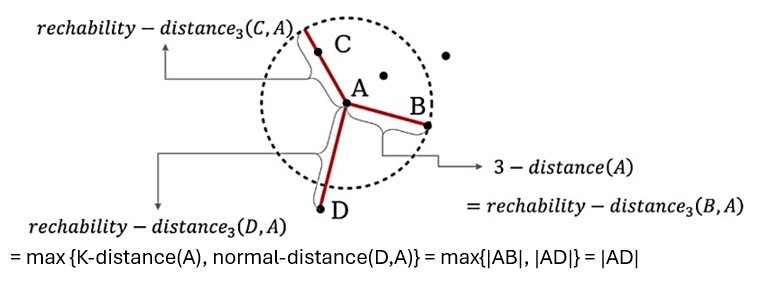
```


**Example 3 (cont'd)**: The following figure shows how to calculate reachability distance.


```{r echo=FALSE, fig.align='center', out.width="90%",  fig.cap="Figure 7.  An example showing how to calculate reachability distance."}
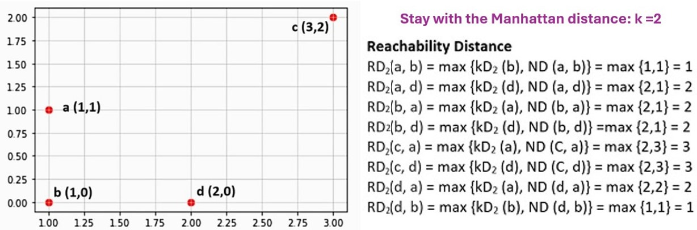
```


### Local Reachability Density (LRD)

**LRD** refers to how far we need to go from the point we are at to reach the next point or set of points. To make the concept clearer, we introduce the following notations. 

* **k** = pre-selected number to represent the k-th **nearest neighbor** (i.e., point).
* **$\mathbf{N_k(P)}$** = the neighborhood of **P** that contains **k nearest** neighbors (i.e., points).
* **$\mathbf{||N_k(P)||}$** = number of neighbors (point) in the neighbor of $\mathbf{N_k(P)}$. Note that $\mathbf{||N_k(P)||} \ge k$. The following figure shows the scenario.


```{r echo=FALSE, fig.align='center', out.width="50%",  fig.cap="Figure 8. Example of a 2-NN (2 nearest neighbors) that has 4 neighbors (points)."}
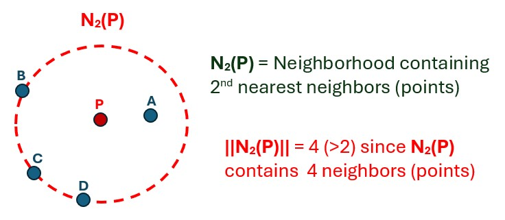
```

* **$\mathbf{RD_k(P, Q)}$** = reachability distance (which is dependent on $k$). For example,  in the above figure, the reachability distance between $P$ and $A$ in the neighborhood of 2-closest neighbors is $RD_2(P, A) = \max \{\text{kD}_2(P, A), ND(P, A) \} = \max\{|PB|, |PA| \} = |PB|$.


With the above notations, we define them in the following algebraic form. Assume the working data set has records $\{A_1, A_2, \cdots, A_n \}$ and using the neighborhood containing k closest neighbors. The local reachability density ($\mathbf{LRD}_k(A_i)$) of every point (i.e., neighbor) in the neighborhood around $A_i$ with k-nearest neighbors is given by


$$
\mathbf{LRD}_k(A_i) = \frac{1}{\frac{\sum_{A\in N_k(A_i)} \mathbf{RD}_k(A)}{||N_k(A_i)||}} 
$$
The above formula looks complex and abstract. In fact, $\sum_{A\in N_2(A_i)} \mathbf{RD}_2(A_i)$ is the sum of RD between $A_i$ and all points in the neighborhood around $A_i$ with k-nearest neighbors $N_k(A_i)$. $||N_k(A_i)||$ is number of actual neighbors in the neighborhood. Therefore, the denominator in the above definition is the average of reachability distances between $A_i$ and all neighbors in the neighborhood of $A_i$.

**Example (cont'd)** Calculate **local reachability density (LRD)** based on the toy data used in previous examples.

```{r echo=FALSE, fig.align='center', out.width="90%",  fig.cap="Figure 8.  An example of calculating the local reachability density."}
include_graphics("img/LocalReachabilityDensityExample.jpg")
```


### Local Outlier Factor (LOF) Score

The local reachability densities (**LRD**) found are compared to the local reachability densities of A’s nearest k neighbors.  LOF of $A_i$ is the ratio of the average LRD in the neighborhood of $A_i$ with K nearest neighbors to the LRD of $A_i$, for $i = 1, 2, \cdots, n$.

$$
LOF(A_i) = \frac{\frac{\sum_{A_j\in N_k(A_i)} \mathbf{LRD}_k(A_j)}{||N_k(A_i)||}}{LRD_k(A_i)}.
$$

To help understand the above formula, we illustrate how to calculate the LOF of $A$ in the following figure that contains a data set with 4 points. We choose k = 2 in the calculation.


```{r echo=FALSE, fig.align='center', out.width="40%",  fig.cap="Figure 9.  Illustration of calculating LOF score."}
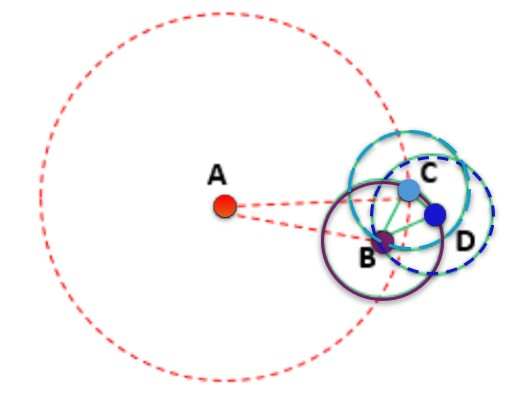
```


$$
LOF(A) =\frac{\frac{LRD_2(\text{B}) + LRD_2(\text{C})}{||N_k(A)||}}{LRD(A)} = \frac{\frac{LRD_2(\text{B}) + LRD_2(\text{C})}{2}}{LRD(A)}
$$

**Example (cont'd)** Calculate **local outlier Factor (LOF)** based on the toy data used in previous examples.

```{r echo=FALSE, fig.align='center', out.width="90%",  fig.cap="Figure 10.  Calculating LOF score based on the toy data."}
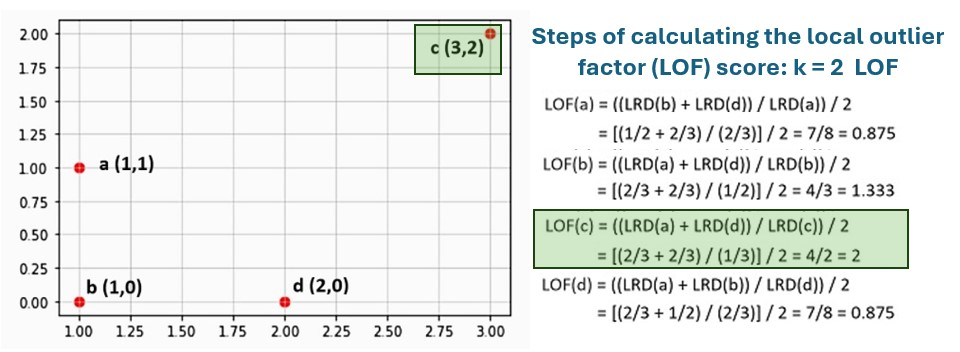
```


\

##  Recap of LOF: Implication and Utilization

In anomaly detection, algorithms like the Local Outlier Factor (LOF) play a crucial role in identifying data points that deviate significantly from the norm. In this subsection section, we’ll summarize the strengths, limitations, and applications of LOF.

As illustrated in the previous subsection, LOF operates on the principle of local density estimation. Unlike global outlier detection methods that consider the entire dataset’s characteristics, LOF focuses on the local neighborhood of each data point. It measures how isolated a data point is with respect to its neighbors, thus capturing anomalies that might be overlooked by traditional methods.

### LOF Applications

**Fraud Detection**: LOF is widely used in financial institutions to detect fraudulent transactions. It can identify unusual spending patterns or activities that deviate from regular customer behavior.

**Network Security**: In cybersecurity, LOF helps in identifying malicious activities or intrusions in network traffic by flagging abnormal patterns or connections.

**Healthcare Analytics**: LOF aids in medical data analysis by spotting anomalous patient records or unusual trends in health data, leading to early detection of diseases or abnormalities.

**Manufacturing Quality Control**: LOF can be applied in manufacturing processes to detect faulty products or anomalies in production data, ensuring quality control and efficiency.

**Predictive Maintenance**: By identifying outliers in equipment sensor data, LOF enables predictive maintenance in industries such as aviation, automotive, and manufacturing, reducing downtime and maintenance costs.

### LOF Strengths and Limitations

The method of LOF for anomaly detection has several strengths and limitations. We list a few of them in the following.

**Strengths**

* *Robustness to Local Density Variations*: LOF is effective in detecting outliers even in data sets with varying local densities, making it suitable for complex and dynamic data.

* *Scalability*: It can handle large data sets efficiently, thanks to its local neighborhood-based approach, which reduces computational complexity compared to global methods.

* *Flexibility*: LOF is adaptable to different types of data, including numerical, categorical, and mixed data, making it versatile across various domains.

* *Interpretability*: The LOF scores provide interpretable insights into the degree of anomaly for each data point, aiding in decision-making and anomaly prioritization.


**Limitations**

* *Parameter Sensitivity*: LOF performance can be sensitive to the choice of parameters, such as the neighborhood size. Optimal parameter tuning is crucial for reliable results.

* *Curse of Dimensionality*: In high-dimensional spaces, LOF may encounter challenges due to the increased sparsity and computational complexity. Pre-processing or dimensionality reduction techniques may be necessary.

* *Data Distribution Assumptions*: LOF assumes that outliers are less dense than their neighbors. If this assumption doesn’t hold, LOF may produce less accurate results.

* *Outlier Definition*: The definition of outliers may vary based on the application context. LOF identifies anomalies based on local densities, which may not always align with domain-specific outlier definitions.
Practical Implementation of LOF


### Steps for Implementing LOF


**Data Preprocessing**: Cleanse and preprocess the data, handling missing values, scaling numerical features, and encoding categorical variables if needed.


**Parameter Selection**: Choose appropriate parameters such as the neighborhood size (k) and distance metric (e.g., Euclidean distance) based on the data set characteristics and domain knowledge.


**LOF Calculation**: Compute the LOF scores for each data point using libraries or implementations available in popular data science tools.


**Threshold Setting**: Determine a threshold for LOF scores to classify data points as outliers. This threshold can be set empirically or using statistical methods like percentile-based approaches.


**Visualization and Interpretation**: Visualize the results using plots like scatter plots or histograms of LOF scores. Interpret the outliers based on domain knowledge and business context.


### Use of LOF Score

If a point has significantly lower density compared to its neighbors, it is likely to be an outlier.
LOF Score Calculation: The LOF score quantifies the degree of outlierness for each data point. Higher LOF scores indicate a higher likelihood of being an outlier. 

A value of approximately 1 indicates that the object is comparable to its neighbors. A value below 1 indicates a denser region (which would be an inlier), while values significantly larger than 1 indicate potential local outliers.

* **LOF(k) ~ 1** means Similar density as neighbors,

* **LOF(k) < 1** means Higher density than neighbors (Inlier),

* **LOF(k) > 1** means Lower density than neighbors (Outlier)

Note that, in practical applications, the actual cut-off LOF to be used to detect potential outliers is dependent on particular applications and operational constraints.

\

### An Example: Iris Data

Several R packages have a function to calculate LOF scores. We use **lof()** in **{dbscan}** to calculate LOF scores of data points in the well-known **iris** data. 


The R function **lof()** can calculate the LOF score in a high dimensional space. The original iris data has 4 numerical variables (sepal and petal widths and lengths). We will calculate the LOF scores based on these variables (in 4-dimensional space). 


To visualize the LOF score, we also perform a PCA and use the first two PCs (which account for about 95% of the total variation) to calculate LOF scores. 


**A Cautionary Note on LOF Scores with PCA** - The purpose of calculating LOF scores based on the first two-component analysis is to visualize the outliers in a 2-dimensional plot. The original variables must not be scaled in the PCA to obtain comparable LOF scores. The translation of the original variable will give the same LOF score.

```{r}
iris00 = iris[,-5]
lof.4d <- lof(iris00, minPts = 30)  # minPts = k value, number of nearest neighbors
summary(lof.4d)
```


```{r fig.align='center', fig.width=5, fig.height=4, fig.cap="Figure 5. LOF scores based on the first 2 principal components."}
log.iris = log(iris[,-5])   # drop the categorical variable in the original 
                            # data set and transform all numerical to the
                            # log-scale
ir.pca <- prcomp(log.iris, center = TRUE, scale = FALSE)
# use the first two PCs to define a data frame for LOF
pca.iris = data.frame(ir.pca$x[, 1:2])
### Calculate the two LOF scores with the original variables and PCs respectively.
lof.pca <- lof(pca.iris, minPts = 30)  # minPts = k value, number of nearest neighbors
lof.orig <- lof(log.iris, minPts = 30)
## 2D plot of LOF score based on PCs
plot(pca.iris, pch = "x",    # point symbol
     main = "LOF Based on PCA", 
     #asp = 1,
     cex = 0.5)                # aspect ratio - ratio of 'y/x'
points(pca.iris, 
       cex = (lof.pca-1)*1.5,      # point size according to the LOF score
       pch = 21, 
       col = "purple")
text(pca.iris[lof.pca > 1.8,], 
     labels = round(lof.pca, 1)[lof.pca > 1.8], 
     pos = 1,   # 1, 2, 3 and 4 => below, left , above, and right 
     cex = 0.7,
     col = "blue")
```


```{r fig.align='center', fig.width=6, fig.height=5,   fig.cap="Figure 6: Scatter plot of LOF scores based on the original variables and the first 2 PCs."}

plot(lof.pca, lof.orig, pch ="x", 
     main = "LOF Scores Comparison: PCA vs Original Variable",
     xlab = "PCA LOF Score",
     ylab = "Original LOF Score",
     cex = 0.6)
points(lof.pca[lof.pca > 1.8], lof.orig[lof.pca > 1.8],
       pch = 21, 
       cex = lof.pca*1.5,
       col = "purple")
text(lof.pca[lof.pca > 1.8], lof.orig[lof.pca > 1.8], 
     labels = round(lof.pca, 1)[lof.pca > 1.8], 
     pos = 1,   # 1, 2, 3 and 4 => below, left , above, and right 
     cex = 0.7,
     col = "blue")
```

The above two figures show that the LOF method identifies the same outliers based on the original four variables (in the 4-dimensional feature space) and the first two PCs (2-dimensional space). No variable scaling was used in the PCA.

\

# Case-Study: Fraud Detection

Financial fraud imposes significant global losses annually. In 2023, losses from financial fraud were estimated at approximately \$485.6 billion worldwide. These losses stemmed from various scams, including payments fraud, credit card fraud, and cyber-enabled schemes, with payments fraud alone accounting for the majority—highlighting critical vulnerabilities in digital and financial systems.

Furthermore, the broader impact of financial crimes, such as money laundering and the funding of illicit activities, was estimated at \$3.1 trillion in 2023. This figure underscores the enormous scale of the issue and its far-reaching economic consequences.

## Working Data Set

The data set for this case study is a small portion (~ 4%) taken from publicly available synthetic data from the [**Kaggle**](https://www.kaggle.com/datasets/ealaxi/paysim1) platform. The data set can be found from this [(link)](https://pengdsci.github.io/STA551/w12/dataset/fraud2.csv). The original data set was split into 24 equal-sized subsets and uploaded to the GitHub repository of this course [(link)](https://github.com/pengdsci/STA551/tree/main/w12/dataset). The description of the data can be found at [here](https://pengdsci.github.io/STA551/w12/dataset/SimulateFraudDataDescription.txt). 


```{r}
fraud = read.csv("https://pengdsci.github.io/STA551/w12/dataset/fraud2.csv")
```

To assess the performance of LOF, we use the feature variable `isFraud` to perform a supervised classification analysis using LOF to detect fraudulent transactions. Note that the actual fraud rate of this data set is $72/(269928+72) \approx0.0002666667 = 0.027\%$. This is a typical imbalanced learning problem. The detection rate based on random guessing is only $0.027\%$. Any models that have a detection rate greater than $0.027\%$ are worthwhile.

\

## Motivation and Goals

A fraudulent transaction is considered an outlier. We can use LOF methods to assign a LOF score based on a given $k$. A transaction with a LOF score greater than 1 can be considered to be an outlier. In this sense, the LOF score of a transaction can be defined as a fraud score. 

We have introduced several supervised algorithms including logistic regression, decision tree and BAGGING, and neural network models. These algorithms are technically valid for fraud detection. The primary goal of this case study is to use LOF scores to detect potential fraudulent transactions. `isFraud` is a variable indicating the fraud status of the corresponding transactions. <font color = "red">**\color{red}If LOF is associated with fraudulent transactions, we would expect that transactions with high LOF scores are more likely to be fraudulent.**</font>

Two major analytic tasks to be performed are

* Investigating the relative detection rate compared with the baseline random guess for a given $k$ (*considered as a hyperparameter*). 

* Identifying the optimal $k$ to define LOF scores that effectively characterize the outliers.


## Methods

We will use numerical variables in the data to calculate the LOF scores for each record in the data set. To assess the overall performance of fraud detection with LOF scores, we pick a sequence of potential LOF cut-off scores that are greater than 1 and plot the LOF score against the relative detection improvement rate compared with the baseline random guess rate which is defined by

$$
\text{fraud catching rate} = \frac{\text{Total Fraudulent Transactions with LOF > cutt-off}}{\text{Total Number of Transactions with LOF > cut-off}}.
$$ 

### Distribution of LOF

The distribution of LOF scores is usually very skewed. To create a better visual representation, we truncate the extremely large LOF scores. Next, we extract the LOF scores of each record in the data set with $k = 70$ and summarize the distribution in the following.

```{r}
lof.fraud.100  <- lof(fraud [, c(4, 6, 7, 9,10)], minPts = 100) 
summary(lof.fraud.100)
hist(lof.fraud.100[lof.fraud.100 < 5], breaks = 50, main = "LOF Distribution")
```

### Predictive Power of LOF Scores

In the following figure, we choose a sequence of TOF cut-offs and plot the **relative improvement rate** against LOF scores to show the "performance of detection".

```{r fig.align='center', fig.width=7, fig.height=4}
## Choose a sequence of cut-offs of LOF scores
cut.lof = seq(1,5, length = 21)
## 
lof.catching.rate = NULL
for (i in 1:length(cut.lof)){
  ID = lof.fraud.100 > cut.lof[i]
  isFraud = fraud$isFraud[ID]
  lof.catching.rate[i] = sum(isFraud )/sum(ID)
}
##
defaultFraudRate = sum(fraud$isFraud)/length(fraud$isFraud)
rel.detect.rate = (lof.catching.rate-defaultFraudRate)/defaultFraudRate
##
par(mfrow=c(1,2))
plot( cut.lof, 100*lof.catching.rate, type = "l", col = "blue", lwd = 2,
      xlab = "LOF Cut-off",
      ylab = "LOF catching rate (%)",
      main = "LOF catching rate of fraud")
plot( cut.lof, rel.detect.rate, type = "l", col = "blue", lwd=2,
      xlab = "LOF Cut-off",
      ylab = "LOF and random catching rate ratio",
      main = "LOF catching rate of fraud")
```

The above figures show that, with $k = 100$, the LOF-based fraud-catching rate is much higher than the random guess. We can also sketch an ROC to assess the global performance in terms of catching rate.

```{r fig.align='center', fig.width=5, fig.height=5}
#cutloff = seq(1,15, length = 20)
#pred.lof.100 = as.numeric(lof.fraud.00 > cut.lof[i])
  category = as.character(fraud$isFraud)
  ROCobj.lof <- roc(category, lof.fraud.100, levels=c("1", "0"),direction = ">")
  ##
  sen.LOF = ROCobj.lof$sensitivities
  fnr.LOF = 1 - ROCobj.lof$specificities
par(type="s")
plot(fnr.LOF, sen.LOF , type = "l", lwd = 2, col = "blue",
     xlim = c(0,1),
     ylim = c(0,1),
     xlab = "1 - specificity",
     ylab = "sensitivity",
     main = "ROC Curves of LOF Detection")
segments(0,0,1,1, lwd =1, col = "red", lty = 2)
AUC = ROCobj.lof$auc
text(0.87, 0.20, paste("AUC = ", round(AUC,4)), col="darkred", cex = 0.7, adj = 1)
```

The area under the ROC curve is about 0.84 indicating the good predicting power of LOF scores.


### Tuning Hyperparameter $k$

The LOF defines local outliers. The LOF scores will be dependent on the value of $k$ (the number of nearest neighbors of every data point). For illustration, we will use three different $k$ values for LOF scores and then use ROC curves to compare the performance of LOF scores in anomaly detection. The previous $k = 100$  was used in the previous subsection, we will choose $k=50$ and $200$ in the following.

```{r}
lof.fraud.50  <- lof(fraud [, c(4, 6, 7, 9,10)], minPts = 50)
lof.fraud.200  <- lof(fraud [, c(4, 6, 7, 9,10)], minPts = 200) 
lof.fraud.400  <- lof(fraud [, c(4, 6, 7, 9,10)], minPts = 400) 
```

```{r fig.align='center', fig.width=5, fig.height=5}
  category = as.character(fraud$isFraud)
  ROCobj.lof.50 <- roc(category, lof.fraud.50, levels=c("1", "0"), direction = ">")
  ROCobj.lof.100 <- roc(category, lof.fraud.100, levels=c("1", "0"), direction = ">")
  ROCobj.lof.200 <- roc(category, lof.fraud.200, levels=c("1", "0"), direction = ">")
  ROCobj.lof.400 <- roc(category, lof.fraud.400, levels=c("1", "0"), direction = ">")
  ##
  sen.LOF.50 = ROCobj.lof.50$sensitivities
  fnr.LOF.50 = 1 - ROCobj.lof.50$specificities
  ##
  sen.LOF.100 = ROCobj.lof.100$sensitivities
  fnr.LOF.100 = 1 - ROCobj.lof.100$specificities
  ##
  sen.LOF.200 = ROCobj.lof.200$sensitivities
  fnr.LOF.200 = 1 - ROCobj.lof.200$specificities
  ##
  sen.LOF.400 = ROCobj.lof.400$sensitivities
  fnr.LOF.400 = 1 - ROCobj.lof.400$specificities
par(type="s")
colors = c("#8B4500", "#00008B", "#8B008B", "#055d03")
plot(fnr.LOF.50, sen.LOF.50, type = "l", lwd = 2, col = colors[1],
     xlim = c(0,1),
     ylim = c(0,1),
     xlab = "1 - specificity",
     ylab = "sensitivity",
     main = "ROC Curves of LOF Detection Comparison")
lines(fnr.LOF.100, sen.LOF.100, lwd = 2, lty = 2, col = colors[2])
lines(fnr.LOF.200, sen.LOF.200, lwd = 1, col = colors[3])
lines(fnr.LOF.400, sen.LOF.400, lwd = 1, col = colors[4])

segments(0,0,1,1, lwd =1, col = "red", lty = 2)
legend("topleft", c("LOF.50", "LOG.100", "LOF.200", "LOF.400"), 
       col=colors, lwd=c(2,2,1,1,1),
       lty=c(1,2,1,1,2), bty = "n", cex = 0.7)

##
AUC.50 = ROCobj.lof.50$auc
AUC.100 = ROCobj.lof.100$auc
AUC.200 = ROCobj.lof.200$auc
AUC.400 = ROCobj.lof.400$auc
text(0.87, 0.25, paste("AUC.50 = ", round(AUC.50,4)), col=colors[1], cex = 0.7, adj = 1)
text(0.87, 0.20, paste("AUC.100 = ", round(AUC.100,4)), col=colors[2], cex = 0.7, adj = 1)
text(0.87, 0.15, paste("AUC.200 = ", round(AUC.200,4)), col=colors[3], cex = 0.7, adj = 1)
text(0.87, 0.10, paste("AUC.400 = ", round(AUC.400,4)), col=colors[4], cex = 0.7, adj = 1)
```


We can see from the above ROC curves that $k = 200$ produced the best AUC. This also implies that $k$ as a hyperparameter needs to be tuned based on given data.


## Implementation LOF 

There are several different ways of using LOF scores in actual applications. We have shown in the above application that LOF can be used as a standalone detection algorithm. In fact, the LOF score also be used as a new feature variable just like the cluster ID in any model and algorithm.

No matter how the LOF is used, the crucial step is to tune the hyperparameter $k$ to obtain powerful LOF scores before implementing it in any application. When LOF is used as a standalone algorithm for anomaly detection, identifying the optimal cut-off LOF score for anomaly detection is crucial. However, the optimal cut-off LOF score obtained through an analytic approach might not be the best because of potential **operational constraints**. For example, model-generated suspicious fraudulent transactions need to be verified by fraud analysts. If the optimal cut-off produces too many alerts (suspicious frauds), it may cost more for the organization to hire more fraud analysts to verify all suspicious fraudulent transactions.


