```{=html}
<style type="text/css">

div#TOC li {
    list-style:none;
    background-image:none;
    background-repeat:none;
    background-position:0;
}

h1.title {
  font-size: 24px;
  font-weight: bold;
  color: DarkRed;
  text-align: center;
}
h4.author { /* Header 4 - and the author and data headers use this too  */
    font-size: 18px;
    font-weight: bold;
  font-family: "Times New Roman", Times, serif;
  color: DarkRed;
  text-align: center;
}
h4.date { /* Header 4 - and the author and data headers use this too  */
  font-size: 18px;
  font-weight: bold;
  font-family: "Times New Roman", Times, serif;
  color: DarkBlue;
  text-align: center;
}
h1 { /* Header 3 - and the author and data headers use this too  */
    font-size: 22px;
    font-weight: bold;
    font-family: "Times New Roman", Times, serif;
    color: darkred;
    text-align: center;
}
h2 { /* Header 3 - and the author and data headers use this too  */
    font-size: 18px;
    font-weight: bold;
    font-family: "Times New Roman", Times, serif;
    color: navy;
    text-align: left;
}

h3 { /* Header 3 - and the author and data headers use this too  */
    font-size: 15px;
    font-weight: bold;
    font-family: "Times New Roman", Times, serif;
    color: navy;
    text-align: left;
}

h4 { /* Header 4 - and the author and data headers use this too  */
    font-size: 18px;
    font-weight: bold;
    font-family: "Times New Roman", Times, serif;
    color: darkred;
    text-align: left;
}
</style>
```

```{r setup, include=FALSE}
# code chunk specifies whether the R code, warnings, and output 
# will be included in the output files.
if (!require("webshot")) {
   install.packages("webshot")
   library(webshot)
}
if (!require("ggplot2")) {
   install.packages("ggplot2")
   library(ggplot2)
}
### load 'MASS' package
if(!require(MASS)){
  install.packages("MASS")
  library(MASS)
}
### load 'klaR' package
if(!require(klaR)){
  install.packages("klaR")
  library(klaR)
}
if (!require("knitr")) {
   install.packages("knitr")
   library(knitr)
}

# knitr::opts_knit$set(root.dir = "C:/Users/75CPENG/OneDrive - West Chester University of PA/Documents")
# knitr::opts_knit$set(root.dir = "C:\\STA490\\w05")

knitr::opts_chunk$set(echo = TRUE,       
                      warning = FALSE,   
                      result = TRUE,   
                      message = FALSE)
```

# Introduction

Feature selection is a critical and widely used technique in data processing, aimed at selecting the most relevant features from noisy data. This approach not only enhances the execution speed of data processing algorithms but also improves prediction accuracy and reduces variability in results. 


# Feature Selection Methods

Feature selection, a dimensionality reduction technique, focuses on identifying a small subset of relevant features from the original dataset by eliminating irrelevant, redundant, or noisy features. This process typically enhances learning performance, improves model accuracy, reduces computational costs, and increases model interpretability.

Several statistical methods relevant to feature selection have been discussed in various statistics courses. This section provides an overview of feature selection types, methodologies, and techniques commonly employed in both statistics and machine learning. Based on their nature, these methods are categorized into four distinct types, which will be outlined in the following subsections.


## Filter Methods

Filter methods are statistical-based feature selection methods that involve evaluating the relationship between each input variable and the target (response) variable using statistics and selecting those input variables that have the strongest relationship with the target variable. These methods can be fast and effective, although the choice of statistical measures depends on the data type of both the input and output variables. Here are some of these methods with brief descriptions.

### Information Gain

Information gain calculates the reduction in entropy from the transformation of a data set. It can be used for feature selection by evaluating the Information gain of each variable in the context of the target variable. We have briefly described this method in decision induction.

### Chi-square Test

Let’s consider a scenario where we need to determine the relationship between the independent category feature (predictor) and dependent category feature(response). In feature selection, we aim to select the features which are highly dependent on the response. We calculate Chi-square between each feature and the response variable. and select the desired number of features with the best Chi-square scores. 

In order to correctly apply the chi-squared test for the relationship between various features in the data set and the target variable, the following conditions have to be met: the variables have to be categorical, sampled independently and values should have an expected frequency greater than 5. 

### Fisher's Score 

Fisher score is one of the most widely used supervised feature selection methods. It seeks features with the best discriminant ability. It is based on maximizing the distances between data points of different classes and minimizing the distances among points of the same class. To rank the features in the order of their relevancy, they are sorted in the decreasing order of their obtained fisher score. Thus, as the value of an assigned score to a feature increases, its importance also increases.

Let $Y$ be the categorical variable with $C$ categories and $X$ be a numerical variable. The Fisher's score of $X$ is defined by

$$
F_X = \frac{\sum_{i=1}^C N_i(\mu_{X}^i-\mu_{X})^2}{\sum_{i=1}^CN_i\times (\sigma_X^i)^2}
$$
where $N_i$ is the number of data points in class $i$, $\mu_X$ is the mean of feature variable $X$, and $\mu_X^i$ and $(\sigma_X^i)^2$ are the mean and the variance of
class $i$ upon the feature $X$ respectively.

The algorithm returns the ranks of the variables based on the fisher’s score in descending order. We can then select the variables based on the scores.


### Correlation Coefficient

Correlation is a measure of the linear relationship of 2 or more variables. Through correlation, we can predict one variable from the other. The logic behind using correlation for feature selection is that the good variables are highly correlated with the response. Furthermore, variables should be correlated with the response but should be uncorrelated among themselves. This method is valid when both response and feature variables are numeric.

### Variance Threshold

The variance threshold is a simple baseline approach to feature selection. It removes all features which variance does not meet some threshold. The logic for this method is that features with a higher variance may contain more useful information. 


## Wrapper Methods

Wrappers require some method to search the space of all possible subsets of features, assessing their quality by learning and evaluating a classifier with that feature subset. The feature selection process is based on a specific machine learning algorithm that we are trying to fit on a given data set. It follows a greedy search approach by evaluating all the possible combinations of features against the evaluation criterion. The wrapper methods usually result in better predictive accuracy than filter methods.

The following are a few such methods.

### Forward Feature Selection

This is an iterative method we start with the best performing variable against the target. Next, we select another variable that gives the best performance in combination with the first selected variable. This process continues until the preset criterion is achieved.

### Backward Feature Elimination

This method works exactly opposite to the Forward Feature Selection method. Here, we start with all the features available and build a model. Next, we the variable from the model which gives the best evaluation measure value. This process is continued until the preset criterion is achieved.

### Subset Feature Selection

This is the most robust feature selection method covered so far. This is a brute-force evaluation of each feature subset. This means that it tries every possible combination of the variables and returns the best-performing subset.


## Embedded Methods

These methods encompass the benefits of both the wrapper and filter methods, by including interactions of features but also maintaining reasonable computational cost. Embedded methods are iterative in the sense that takes care of each iteration of the model training process and carefully extract those features which contribute the most to the training for a particular iteration.

### LASSO Regularization 

Regularization consists of adding a penalty to the different parameters of the machine learning model to reduce the freedom of the model, i.e. to avoid over-fitting. In linear model regularization, the penalty is applied over the coefficients that multiply each of the predictors. From the different types of regularization, Lasso or L1 has the property that can shrink some of the coefficients to zero. Therefore, that feature can be removed from the model.

### Random Forest Importance

Random Forests is a kind of a Bagging Algorithm that aggregates a specified number of decision trees. The tree-based strategies used by random forests naturally rank by how well they improve the purity of the node, or in other words a decrease in the impurity (Gini impurity) over all trees. Nodes with the greatest decrease in impurity happen at the start of the trees, while notes with the least decrease in impurity occur at the end of trees. Thus, by pruning trees below a particular node, we can create a subset of the most important features.


## Hybrid Methods

Hybrid methods try to exploit the qualities of both approaches, filter, and wrapper, trying to have a good compromise between efficiency (computational effort) and effectiveness (quality in the associated objective task when using the selected features).

To take advantage of the filter and wrapper approaches, hybrid methods, in a filter stage, the features are ranked or selected applying a measure based on intrinsic properties of the data. While, in a wrapper stage, certain feature subsets are evaluated for finding the best one, through a specific clustering algorithm. We can distinguish two types of hybrid methods: methods based on ranking and methods non-based on the ranking of features.

# Feature Extraction Methods

By finding a smaller set of new variables, each being a combination of the input variables, containing basically the same information as the input variables. In other words, feature extraction is a procedure that defines new variables by aggregating the information from existing features. For example, the new feature variable could be a function of the existing features. The new set of features will have different values as compared to the original feature values. 

The main aim is that fewer features will be required to capture the same information. 

## Cluster Analysis

cluster analysis, in statistics, set of tools and algorithms that are used to classify different objects into groups in such a way that the similarity between two objects is maximal if they belong to the same group and minimal otherwise. The cluster ID is a new feature that can be used to capture heterogeneous information across clusters.


## Principal Component Analysis (PCA)

We have introduced linear principal component analysis (PCA). The idea is to map the existing feature space to a new space (principal components space).

Technically, a principal component can be defined as a linear combination of optimally-weighted observed variables. The output of PCA is these principal components. The number of PCs to retain is less than or equal to the number of original variables. The PCs possess some useful properties

* The PCs are essentially the linear combinations of the original variables, the weights vector in this combination is actually the eigenvector found which in turn satisfies the principle of least squares.

* The PCs are orthogonal, as already discussed.

* The variation present in the PCs decrease as we move from the 1st PC to the last one, hence the importance.

* The least important PCs are also sometimes useful in regression, outlier detection, etc.

```{r echo=FALSE, fig.align='center', fig.width=3, fig.height=3, fig.cap="Figure 1. Illustration of PCA. The least (2nd) important component can be used for anomaly detection."}
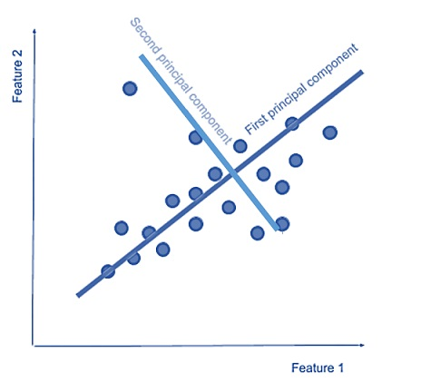
```

## Linear Discriminant Analysis (LDA)

Linear discriminant analysis (LDA) also creates linear combinations of your original features. However, unlike PCA, LDA doesn't maximize explained variance. Instead, it maximizes the separability between classes.

In other words, the goal of an LDA is to project a feature space (a data set n-dimensional samples) onto a smaller subspace k (where $k \le n-1$) while maintaining the class-discriminatory information.

In general, dimensionality reduction does not only help reduce computational costs for a given classification task, but it can also be helpful to avoid overfitting by minimizing the error in parameter estimation (“curse of dimensionality”).


```{r echo=FALSE, fig.align='center', fig.width=3, fig.height=3, fig.cap="Figure 2. Illustration of LDA."}
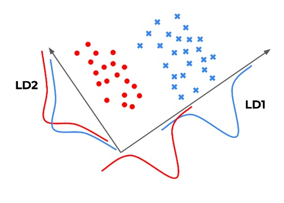
```

Therefore, LDA is a supervised method that can only be used with labeled data. The LDA transformation is also dependent on scale, so we should normalize original features in the data set first.

**Strengths**: LDA is supervised, which can (but doesn't always) improve the predictive performance of the extracted features. Furthermore, LDA offers variations (i.e. quadratic LDA) to tackle specific roadblocks.

**Weaknesses**: As with PCA, the new features are not easily interpretable, and we must still manually set or tune the number of components to keep. LDA also requires labeled data.


**PCA vs LDA**: Which is better? The results will vary from problem to problem. In other words, the **No Free Lunch** Theorem applies to this situation. The following figure depicts the difference between PCA and LDA.

```{r echo=FALSE, fig.align='center', fig.width=3, fig.height=3, fig.cap="Figure 3. Illustration of the difference of PCA and LDA."}
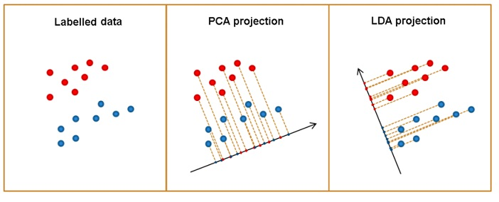
```

## Case-study: LDA with Iris Data 

like PCA whose mathematical formulation involves matrix algebra (eigenvector and eigenvalues) and linear programming (optimization with linear constraints), in LDA we still need to use the same tools but with different objective functions for optimization. We will not introduce these mathematical steps to find the linear discriminant components. 

Next, we use R function **lda()** in library **{MASS}** to find LDA components based on the four numerical features in Iris data.

**lda()** returns several results:

* The most important result here is the coefficients, they are values that describe the new feature space where the data will be projected in. 

* LDA reduces dimensionality from the original number of features to C — 1 features, where C is the number of classes. In this case, we have 3 classes, therefore the new feature space will have only 2 features. 


```{r}
data(iris)
# Data partition
training_sample <- sample(c(TRUE, FALSE), nrow(iris), replace = T, prob = c(0.6,0.4))
train <- iris[training_sample, ]
test <- iris[!training_sample, ]
#
lda.iris <- lda(Species ~ ., data = train)#, prior = rep(1/3, 3))
kable(lda.iris$scaling, caption="The scaling coefficients of LDA")  # show results
```

The two new feature variables based on the two LDA are explicitly given by

$$
LDA_1 = (0.51\times Sepal.Length) + (1.96\times Sepal.Width) + (-2.12\times Petal.Length) + (-2.98\times Petal.Width) 
$$
$$
LDA_2 = (-0.76\times Sepal.Length) + (2.85\times Sepal.Width) + (-1.05\times Petal.Length) + (1.92\times Petal.Width)
$$
Next, we use LDA to make a prediction using the hold-out test data. Note that predict() returns three objects with three different pieces of information:

* **lda.test$class** contains the predicted labels.
* **lda.test$posterior** contains the predictive class probabilities of new data points.
* **lda.test$x** contains the two LDA scores.

In the following code, we extract the predicted labels and then compare them with the actual labels to find the confusion matrix and calculate the accuracy of classification LDA.


```{r}
lda.test <- predict(lda.iris, newdata = test)
test$lda <- lda.test$class  
confusion.matrix = table(test$lda,test$Species)
kable(confusion.matrix, caption = "Confusion matrix based one LDA.")
```

The accuracy of LDA prediction on the test data set is $49/50 = 98\%$.

## Remarks

We have introduced two well-known feature extraction methods: PCA and LDA. Both are linear extraction methods. PCA is an unsupervised extraction method and LDA is a supervised method. Both methods are developed for different purposes but both can be used for dimensional reduction.

Both PCA and LDA can be adapted for nonlinear feature extraction by introducing kernel functions (i.e., kernel PCA and kernel LDA) or changing the linear combination of the original features into the polynomial expression to capture the nonlinear patterns (i.e., polynomial PCA and polynomial LDA).

The various variable transformations including the well-known Box-Cox transformation, discretization, and redefining categorical variables by combing categories in meaningful ways are all called feature extraction methods. 


# Feature Extraction with Serial Data

The feature extraction methods introduced in the previous section are based on cross-sectional data. There are only very limited discussions on feature extraction based on serial data including time series and panel data. In particular, no feature extraction method based on panel data has been discussed so far in the literature.

In this section, we first introduce the way and type of features one can extract from a time series. Then we introduce a new method for extracting features from panel data. This method can also be used to define a feature based on the regular time series. The new method borrows the idea of the formulation of the process capability index in statistical process and quality control.

## Feature Extraction with Time Series

Time series data is data that is collected at different points in time. This is opposed to cross-sectional data which observes individuals, companies, etc. at a single point in time.

Because data points in time series are collected at adjacent time periods there is potential for correlation between observations. This is one of the features that distinguishes time-series data from cross-sectional data.

Time series data can be found in economics, social sciences, finance, epidemiology, and the physical sciences. 

```{r echo=FALSE, fig.align='center', fig.width=3, fig.height=3, fig.cap="Figure 4. Illustration of times patterns."}
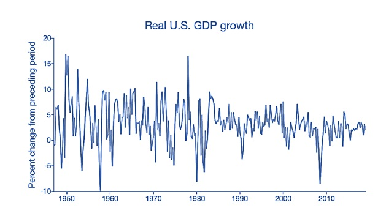
```

There are two main goals of time series analysis: identifying the nature of the phenomenon represented by the sequence of observations, and forecasting (predicting future values of the time series variable).  

### Statistical Models

The most common and effective statistical methods of Forecasting are Simple Moving Average (SMA), Exponential Smoothing (SES), Auto-regressive Integration Moving Average (ARIMA).

We will not discuss these methods in this note but will introduce the exponential smoothing method for the time series next week.

### Machine Learning Algorithms

One of the most important properties an algorithm needs in order to be considered a time-series algorithm is the ability to extrapolate patterns outside of the domain of training data. Many machine learning algorithms do not have this capability, as they tend to be restricted to a domain that is defined by training data. Therefore, they are not suited for time series, as the objective of time series is to project into the future.

Another important property of a time series algorithm is the ability to derive confidence intervals. While this is a default property of time series models, most machine learning models do not have this ability because they are not all based on statistical distributions. 

There are also machine learning models such as neural network models that can be applied to time series which use `lagged predictors` and can handle `extracted features`, such as Neural Networks Autoregression (NNAR). There are even time-series models borrowed from deep learning, specifically in the RNN (Recurrent Neural Network) family.  The following figure shows how to use extracted features in a neural network model for forecasting. 


```{r echo=FALSE, fig.align='center', fig.width=3, fig.height=3, fig.cap="Figure 5. How to ANN to model time series."}
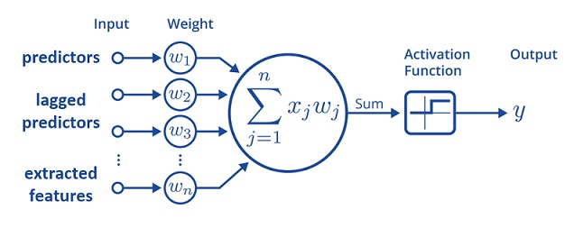
```


### Feature Extraction for Time Series

Since the machine learning method can incorporate both lagged predictors and additional features to improve the forecast accuracy, we can extract some features from the underlying features. The following figure illustrates the process of how to extract features from time-series data.

```{r echo=FALSE, fig.align='center', fig.width=3, fig.height=3, fig.cap="Figure 6. How to extract features from time series."}
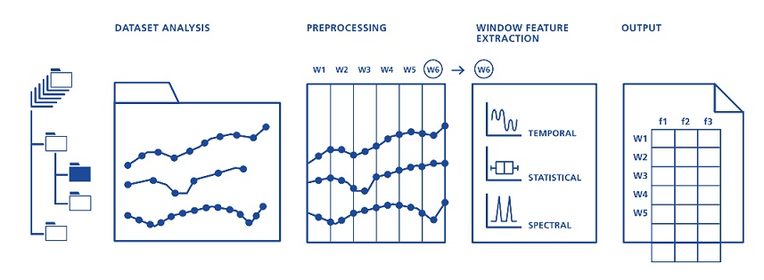
```

As shown in the above figure, three types of features can be extracted from time-series data.

* **Temporal features (time-domain features)** are simple to extract and have an easy physical interpretation. 

* **Statistical features** are mainly descriptive statistics such as windowed mean, median, skewness, etc. 

* **Spectral features (frequency-based features)** are obtained by converting the time-based signal into the frequency domain. 

These features are descriptive and can be easily automated. Some software programs have been made to extract these types of features automatically in practice.


## Model-based Feature Extraction with Panel Data

This subsection focuses on a new feature extraction method that extracts information based on models and algorithms from sequential data. The algorithm borrows the idea of measuring the process information (such as capability and quality) through the sequence data generated by the process. 

Since this is a model-based algorithm, it is more powerful than those features extracted from the time series discussed in the previous subsection.

### Concepts Process Capability and Control Chart

Process control is the ability to monitor and adjust a process to give the desired output. It is used in the industry to maintain quality and improve performance. Key tools in process control include control chart, process capability index, etc.

Both control chart and process capability index use the same key characteristics of the underlying process in their construction:

* **Specification limits** can be defined as targets that are set for a particular process or a product either by the customer or based on the performance of the market. In other words, it can also be defined as a result that is expected from a particular metric. Specification limits are set by customers or the management.

* **Control limits** on the other hand help in indicating the changes which occur in the performance of a particular process. Control limits also provide real-time value. Control limits are dependent on the underlying process.

Control limits can be either upper control limit (UCL) or lower control limit (LCL). Similarly, specification limits can be either upper specification limit (USL) or lower specification limit (LSL).

```{r echo=FALSE, fig.align='center', fig.width=3, fig.height=3, fig.cap="Figure 7. Structure of a control chart."}
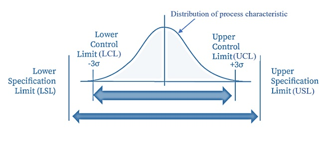
```

**Understanding the control chart** 

Several concepts will be used in the definition of the process capability index.

Control charts are one of the most popular SPC tools used by manufacturers. They are used to determine **whether a process is in- or out-of-control**.

When points on a control chart move outside the upper or lower control limit, the process are said to be **“out-of-control.”** As long as the points are within control limits, the process is **“in-control”**. An **out-of-control process** could produce defective parts. However, if a point is outside the **specification limits**, the process produces defective products. 


```{r echo=FALSE, fig.align='center', fig.width=3, fig.height=3, fig.cap="Figure 8. In-control and out-of-control processes."}
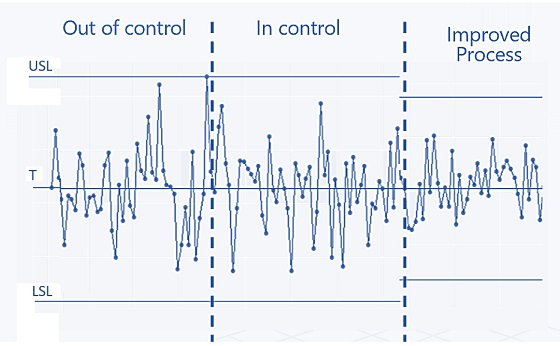
```

Control charts are visual tools for monitoring the process capability. With a control chart, we can see the potential shift of process mean and variation at the same time. A numerical measure that can be defined to capture both aforementioned shifts of a process in a single number is the process capability index (PCI).

### Concept of Process Capability Index (PCI)

Process capability index measures the degree of variation an in-control process experiences relative to its specification limits. It can also be used to compare different processes with respect to the optimal situation or if they come up to our expectations. 

The first process capability index is defined by $C_p$, 

$$
C_p = \frac{USL-LSL}{6\sigma}
$$

which is an estimate of what the process is capable of producing if the process mean were to be centered between the specification limits, assuming that the process output is approximately normally distributed. This first $C_p$ was invented and used in the Japanese semiconductor industry in the 1970s. 

```{r echo=FALSE, fig.align='center', fig.width=3, fig.height=3, fig.cap="Figure 9. First and second generation PCIs."}
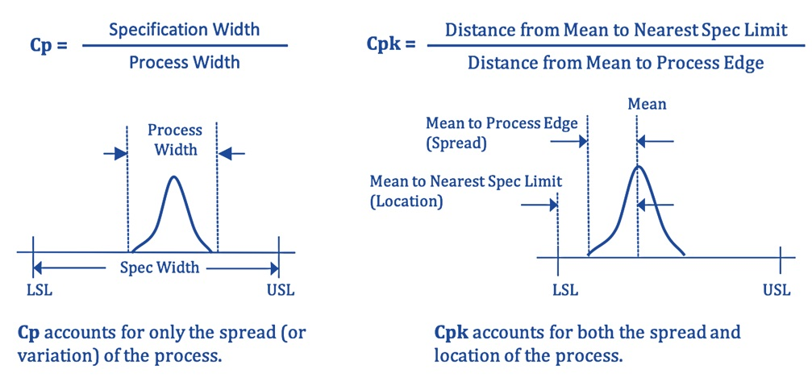
```


Since $C_p$ does not consider process means and process target, several major families of PCIs were defined after $C_p$. The following table lists major PCIs used in the industry for various purposes.

```{r echo=FALSE, fig.align='center', fig.width=3, fig.height=3}
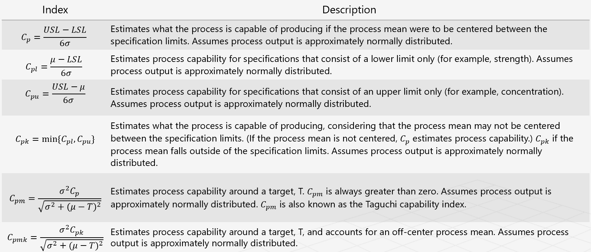
```

In the manufacturing industry, PCIs are used to measure the quality of a process (product), USL, and LSL and T (target) are given by customers or the management. When applying PCI in other fields such as fraud detection, USL, LSL and T are not given, we need to figure out a way to obtain reasonable USL, LSL, and T in order to define the PCI. The next subsection explains the idea of using PCI to define fraud index.

### Framework of Fraud Index Based on PCI

We can consider a credit card as **a process** that produces transactions. This process characterizes the card holder's spending behavior. For an established credit card account, we can segment the spending in different subcategories and define different sub-processes. A PCI can be defined for each sub-process. The question is that there are no specification limits set to these types of "processes". We need to use historical data to obtain optimal specification limits in order to define quality PCIs.

The following chart explains the idea of how to define PCI for a process without being given pre-set process limits.


```{r echo=FALSE, fig.align='center', fig.width=3, fig.height=3, fig.cap="Figure 10. Illustration of defining PCI of a process without given process limits"}
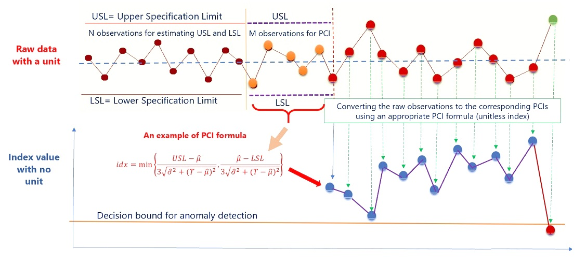
```

Since fraud detection is a real-time process, the fraud index must also be defined in real-time. The above explains how real-time PCI can be defined. The PCI defined in the above illustration is a rolling PCI since its specification limits are changing over time. The specification limits can also be set as hyperparameters. We can then search for optimal hyperparameters to define optimal PCI for fraud detection. 


